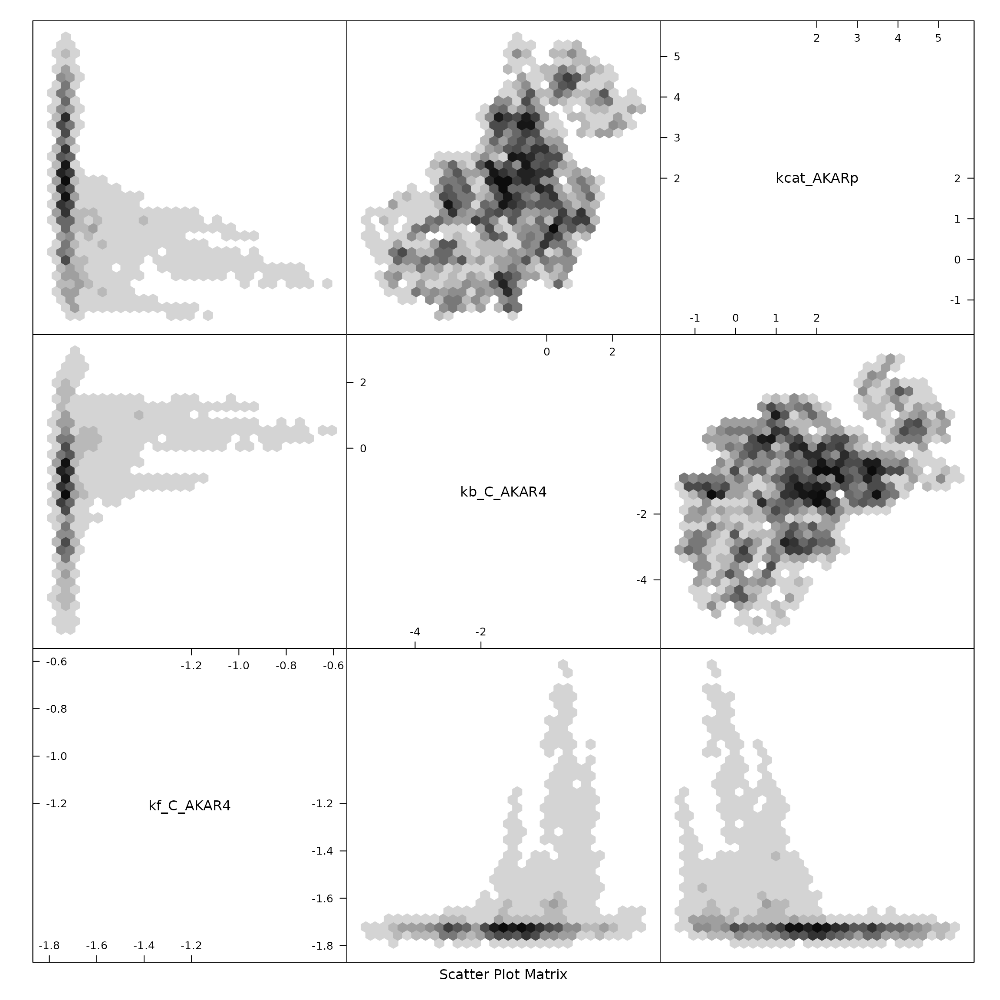

# AKAR4 with MCMC

``` r
library(uqsa)
library(parallel)
library(rgsl)
library(hexbin)
library(SBtabVFGEN)
```

## AKAR4 with Conservation Law Analysis

This is a version of the AKAR4 model that was built with conservation
law analysis turned on when processing the SBtab content to produce the
vector field file (`vf`). This has a downstream effect on the R and C
code.

### Loading Model and Data

We load the SBtab content from the tsv files to extract the data from
it:

``` r
modelFiles <- uqsa_example("AKAR4cl",pattern="[.]tsv$",full.names=TRUE)
SBtab <- SBtabVFGEN::sbtab_from_tsv(modelFiles)
#> [tsv] file[1] «/home/andrei/R/library/uqsa/extdata/AKAR4cl/100nM.tsv» belongs to Document «AKAR4cl»
#>  I'll take this as the Model Name.
```

The next block will load a series of functions: `AKAR4cl_vf`,
`AKAR4cl_jac`, etc.; it also loads the `model` variable: a list of the
same functions with generic names.

``` r
source(uqsa_example("AKAR4cl",pat="^AKAR4cl[.]R$"))
names(model)
#> [1] "vf"       "jac"      "jacp"     "func"     "funcJac"  "funcJacp" "init"    
#> [8] "par"      "name"
# compile
modelName <- checkModel("AKAR4cl",uqsa_example("AKAR4cl",pat="_gvf[.]c$"))
#> building a shared library from c source, and using GSL odeiv2 as backend (pkg-config is used here).
#> cc -shared -fPIC `pkg-config --cflags gsl` -o './AKAR4cl.so' '/home/andrei/R/library/uqsa/extdata/AKAR4cl/AKAR4cl_gvf.c' `pkg-config --libs gsl`
```

#### Data and Experiments

The `experiments` variable contains a description of how to simulate an
experiment but also the data that this simulation should try replicate.
Since the model was build with conservation law analysis, we need to
load the results of this analysis, to adjust the simulation
instructions:

``` r
load(uqsa_example("AKAR4cl",pat="^ConservationLaws[.]RData$"))
print(ConLaw$Text)
#> [1] "AKAR4_C_ConservedConst = AKAR4_C+1*C"     
#> [2] "AKAR4_ConservedConst = AKAR4+1*AKAR4p-1*C"
experiments <- sbtab.data(SBtab,ConLaw)
```

The default values for the ODE model parameters, taking the new inputs
into account:

``` r
n <- length(experiments[[1]]$input)
stopifnot(n>0)
parVal <- head(AKAR4cl_default(),-n)
print(parVal)
#> kf_C_AKAR4 kb_C_AKAR4 kcat_AKARp 
#>      0.018      0.106     10.200
```

### Prior

Scale to determine prior values, a default parameter range:

``` r
defRange <- 2 # log-10 space
dprior <- dNormalPrior(mean=log10(parVal),sd=rep(defRange,length(parVal)))
rprior <- rNormalPrior(mean=log10(parVal),sd=rep(defRange,length(parVal)))
print(dprior(log10(parVal)))
#> [1] 0.007936704
```

### MCMC related Model Functions

Here we construct several closures needed for MCMC

#### Simulations

``` r
sensApprox <- sensitivityEquilibriumApproximation(experiments, model, log10ParMap, log10ParMapJac)
simulate <- simulator.c(experiments,modelName,log10ParMap,noise=FALSE,sensApprox)
y <- simulate(log10(parVal))

plot(experiments[[1]]$outputTimes,as.numeric(y[[1]]$state[1,,1]),xlab='time',ylab='AKAR4p', main='state',type='l')
```


#### Likelihood related Functions

``` r
llf <- logLikelihood(experiments)
gradLL <- gradLogLikelihood(model,experiments, parMap=log10ParMap, parMapJac=log10ParMapJac)
fiIn <- fisherInformation(model, experiments, parMap=log10ParMap)
fiPrior <- solve(diag(defRange, length(parVal)))
print(fiPrior) # constant matrix
#>      [,1] [,2] [,3]
#> [1,]  0.5  0.0  0.0
#> [2,]  0.0  0.5  0.0
#> [3,]  0.0  0.0  0.5
```

#### Maerkov Chain Update Function

``` r
update  <- mcmcUpdate(simulate=simulate,
    experiments=experiments,
    model=model,
    logLikelihood=llf,
    gradLogLikelihood=gradLL,
    fisherInformation=fiIn,
    fisherInformationPrior=fiPrior,
    dprior=dprior)
```

### Find a Good SMMALA step size:

Here, we construct an `mcmc` function derived from the update function,
initialize the Markov chain and start several chains in parallel:

``` r
m <- mcmc(update)   # a Markov chain
h <- 1e-1           # step size guess

nChains <- 4
```

We define an adjustment factor `L(a)` for `h`, based on the acceptance
rate `a` of a test chain of size `N` (a good value for a test chain is
around 100). The factor `L(a)` increases `h` if `a` is above the target
acceptance of 25%.

``` r
accTarget <- 0.25
L <- function(a) { (1.0 / (1.0+exp(-(a-accTarget)/0.1))) + 0.5 }
N <- 100

start_time <- Sys.time()
x <- log10(parVal)
                              # do the adjustment of h a few times
options(mc.cores = parallel::detectCores())
for (j in seq(6)){
 cat("adjusting step size: ",h," \n");
 x <- mcmcInit(1.0,x,simulate,dprior,llf,gradLL,fiIn)
 Sample <- m(x,N,eps=h)
 a <- attr(Sample,"acceptanceRate")
 cat("acceptance: ",a*100," %\n")
 h <- h * L(a)
 x <- as.numeric(tail(Sample,1))
}
#> adjusting step size:  0.1  
#> acceptance:  27  %
#> adjusting step size:  0.1049834  
#> acceptance:  29  %
#> adjusting step size:  0.115344  
#> acceptance:  18  %
#> adjusting step size:  0.09594452  
#> acceptance:  28  %
#> adjusting step size:  0.1030869  
#> acceptance:  19  %
#> adjusting step size:  0.08807162  
#> acceptance:  29  %
plot(attr(Sample,"logLikelihood"),xlab="iteration",ylab="log-likelihood",main="small Sample to find a good step size",type='l')
```


``` r
cat("final step size: ",h,"\n")
#> final step size:  0.0967632
cat("finished adjusting after",difftime(Sys.time(),start_time,units="sec")," seconds\n")
#> finished adjusting after 30.12104  seconds
```

Initialize parallel execution, with 4 processes, but 16 Markov chains.

``` r
n <- 16                                          # cluster size
nChains <- 16
options(mc.cores = parallel::detectCores() %/% n)
cl <- parallel::makeForkCluster(n)
parallel::clusterSetRNGStream(cl, 1337)          # seeding random numbers sequences

betas <- seq(1,0,length.out=nChains)^2
parMCMC <- lapply(betas,mcmcInit,parMCMC=log10(parVal),simulate=simulate,dprior=dprior,logLikelihood=llf,gradLogLikelihood=gradLL,fisherInformation=fiIn)
```

Next, we perform the sampling in parallel, but also swap positions every
once in a while:

``` r

start_time <- Sys.time()                         # measure sampling time
Sample <- NULL
for (i in seq(100)){                            # 16 chains, 4 workers
 s <- parallel::parLapply(cl, parMCMC, m, N=100, eps=h)
 parMCMC <- lapply(s,attr,which="lastPoint")
 parMCMC <- swap_points(parMCMC)
 if (i>2) {
  Sample <- rbind(Sample,s[[1]])
 }
}

colnames(Sample) <- names(parVal)


time_ = difftime(Sys.time(),start_time,units="sec")
parallel::stopCluster(cl)
cat("finished sampling after",time_," seconds\n")
#> finished sampling after 650.7688  seconds
```

## Results

The final sample looks like this:

``` r

print(tail(Sample,10))
#>          kf_C_AKAR4 kb_C_AKAR4 kcat_AKARp
#> [39991,]  -1.748616  -1.226415   2.167335
#> [39992,]  -1.748616  -1.226415   2.167335
#> [39993,]  -1.748616  -1.226415   2.167335
#> [39994,]  -1.748616  -1.226415   2.167335
#> [39995,]  -1.728994  -1.217590   2.261970
#> [39996,]  -1.745386  -1.282003   2.287830
#> [39997,]  -1.745386  -1.282003   2.287830
#> [39998,]  -1.745386  -1.282003   2.287830
#> [39999,]  -1.745386  -1.282003   2.287830
#> [40000,]  -1.745386  -1.282003   2.287830
hexbin::hexplom(Sample)
```


