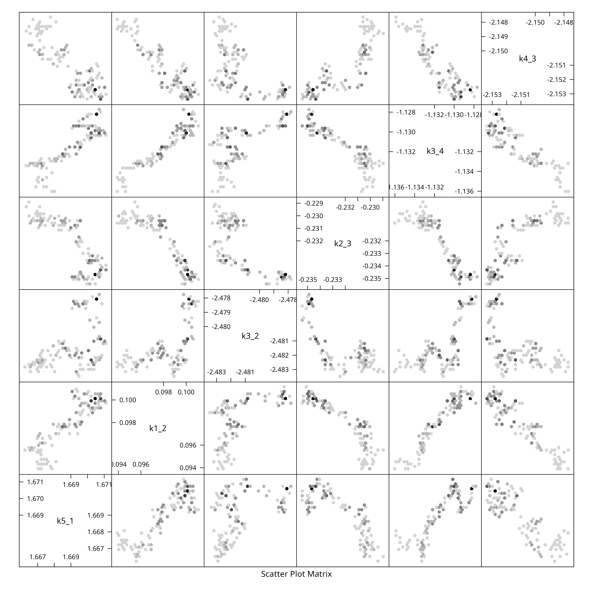
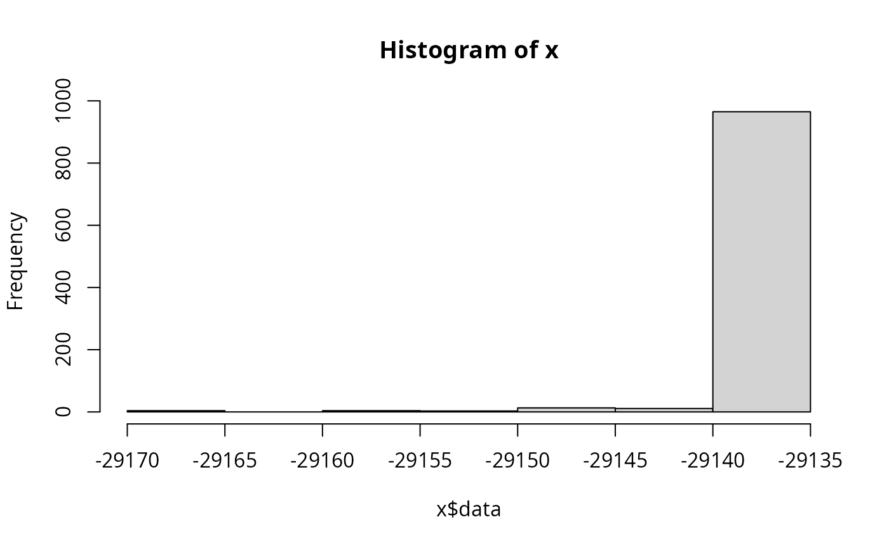
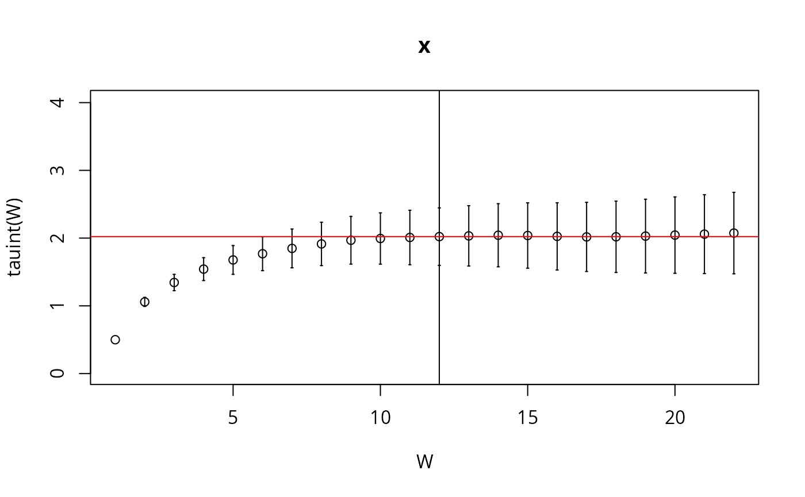
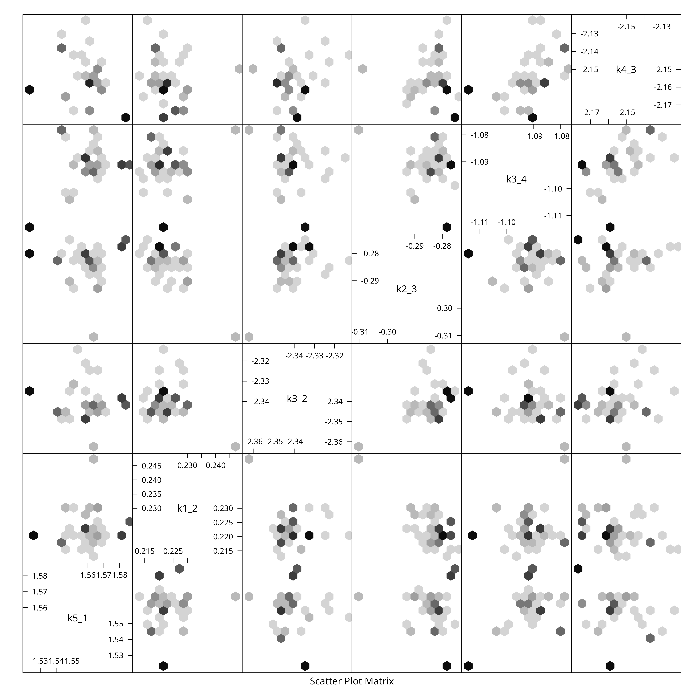

# Uncertainty Quantification of AKAP79 (deterministic model)

``` r
library(uqsa)
library(parallel)
options(mc.cores=detectCores())
```

AKAP79 is a comparativelyh big model (for a demonstartive example). To
even attempt to take a somewhat sufficiently large sample of AKAP79, we
shall use MPI and parallel tempering. There are several ways to launch
MPI processes (e.g. spawn processes). We will use the simplest form:
launch all MPI workers right from the start, using `mpirun -N 8` (or
similar) and have all processes communicate on `MPI_COMM_WORLD`, this
requires very minimal MPI code in R.

This approach doesn’t allow us to adapt the number of temperatures,
which is probably not optimal but makes it easier to write and
understand the code and increases performance significantly compared to
a sequential Markov chain.

The R code we are going to execute is not a code block on this page that
we run in an interactive R session. Instead, it has to be a file that we
pass on to `mpirun` (a system command, in the shell).

In this article we show the results of a parallel tempering SMMALA
(simplified manifold Metropolis adjusted Langevin algorithm) run. The
article titled [Parallel chains with
MPI](https://icpm-kth.github.io/uqsa/articles/articles/mpi.md) explains
how to prepare the R-script for mpirun execution – it includes the
listing of the script we used in this article.

We will store all files related to this in a very predictable location:
`/dev/shm`; not R’s [`tempdir()`](https://rdrr.io/r/base/tempfile.html).
This is because the R blocks in this article are not executed in the
same R session as the MPI workers will run in. Each MPI worker is its
own process; thus they all have different temporary directories. The
directory `/dev/shm` is a virtual directory that lives in the machine’s
RAM. It is standard on GNU/Linux systems, but not on MACOS, so this
example will not work verbatim there (it can be adjusted to work). The
sampling will take a while, even for a very small sample, so it is not
recommended to try out this article for no reason.

## Create C Source Code

First we load the model in its tabular form and create all derived model
files:

``` r
f <- uqsa_example("AKAP79")
m <- model_from_tsv(f)
```

Create the ODE interpretation of `m`:

``` r
o <- as_ode(m)
#> Loading required namespace: pracma
cat(generate_code(o),sep="\n",file="/dev/shm/AKAP79.c")
c_path(o) <- "/dev/shm/AKAP79.c"
so_path(o) <- shlib(o)
saveRDS(o,file="/dev/shm/AKAP79-ode.RDS")
```

Load the simulation instructions for `o`:

``` r
ex <- experiments(m,o)
#> Warning in experiments(m, o): CONFLICT: This model seems to have event based
#> transformations and conservation laws. These two concepts clash with one
#> another if a compound is conserved, but also changed by scheduled events.
saveRDS(ex,file="/dev/shm/AKAP79-ex.RDS")
```

There is a high-level function that does most of what we need to do
automatically:

``` r
p <- values(m$Parameter)
smmala <- high_level_smmala(m,o,ex,p)
#> The parameters are given in log10-scale, so the simulator will do the reverse transformation: 10^p.
```

## Plain Sample

``` r
h <- tune_step_size(smmala)
#> acceptance rate: 0, step-size: 0.0001;
#> acceptance rate: 0.15, step-size: 1e-07;
#> acceptance rate: 0.14, step-size: 5.29412e-08;
#> acceptance rate: 0.11, step-size: 2.52776e-08;
#> acceptance rate: 0.25, step-size: 8.19998e-09;
X <- smmala(smmala %@% "init",1000,h)
plot(
  X %@% "logLikelihood",
  type="s",
  xlab="iteration",
  ylab="logLikelihood"
)
```


We shall only plot the pairs of the first 6 dimensions (this is a big
model):

``` r
if (require(hexbin)){
    hexplom(X[,seq(6)])
} else {
    pairs(X[,seq(6)])
}
#> Loading required package: hexbin
```



## Sample via MPI

Here we run a prepared R script from the command line (any POSIX shell
will do: bash/zsh/fish/dash). We make the same number of iterations as
before, to keep the execution time short.

``` bash
N=4 #  default number of MPI workers
[ -e '/proc/cpuinfo' ] && N=$((`grep -c processor /proc/cpuinfo`)) && nm="`grep -m1 'model name' /proc/cpuinfo`"
echo "We will use $N cores with $nm"

start_time=$(date +%s)
date
mpirun -H localhost:$N ./pt-smmala-akap79.R 1000 > /dev/null 2>&1
date
end_time=$(date +%s)
echo "Time spent sampling: $((end_time - start_time)) seconds ($(( (end_time - start_time)/60 )) minutes)."
#> We will use 8 cores with model name  : Intel(R) Core(TM) i7-4700MQ CPU @ 2.40GHz
#> Fri Jun 26 02:15:02 PM CEST 2026
#> Fri Jun 26 02:15:02 PM CEST 2026
#> Time spent sampling: 0 seconds (0 minutes).
```

On a high performance computing (hpc) cluster, the above would be in a
slurm script or similar workload manager.

### Inspect the Results

Here we check the integrated auto-correlation length (Markov chain time)

``` r
TMPDIR <- ifelse(dir.exists('/dev/shm'),'/dev/shm',Sys.getenv(TMPDIR,unset='/tmp'))
r <- 0 # rank we want to see
j <- 2 # iteration we want to see
f <- file.path(TMPDIR,sprintf("AKAP79-temperature-ordered-pt-smmala-sample-%i-for-rank-%i.rds",j,r))
Sample <- readRDS(file=f)
l <- attr(Sample,"logLikelihood")
plot(l,type="l",xlab="mcmc index",ylab="log-likelihood")
```


``` r

if (require(hadron)){
    res <- hadron::uwerr(data=l,pl=TRUE)
    tau <- ceiling(res$tauint + res$dtauint) # upper bound
} else {
    A <- acf(l)
    tau <- ceiling(sum(A$acf[A$acf>0.2]))
}
#> Loading required package: hadron
#> 
#> Attaching package: 'hadron'
#> The following object is masked from 'package:base':
#> 
#>     kappa
```



We reduce the sample for plotting purposes, by showing only every
\\\tau\_{\text{int.}}\\-th point and create a *pairs* plot for the first
6 parameters:

``` r
X <- Sample[seq(1,NROW(Sample),by=tau),]
colnames(X) <- rownames(m$Parameter)
if (require(hexbin)){
    hexplom(X[,seq(6)],xbins=12)
} else {
    pairs(X[,seq(6)])
}
```



### Bigger Sample

Running the script in the previous section for many more iterations,
results in a much bigger sample:

``` sh
N=4 #  default number of MPI workers
[ -e '/proc/cpuinfo' ] && N=$((`grep -c processor /proc/cpuinfo`)) && nm="`grep -m1 'model name' /proc/cpuinfo`"
echo "We will use $N cores with $nm"

start_time=$((`date +%s`))
date
#
mpirun -H localhost:$N ./pt-smmala-akap79.R 5e5 > /dev/null 2>&1
#                      much bigger sample:  ^^^
date
end_time=$((`date +%s`))
echo "Time spent sampling: $((end_time - start_time)) seconds ($(( (end_time - start_time)/60 )) minutes)."
```

This results in a much less spotty posterior plot:
