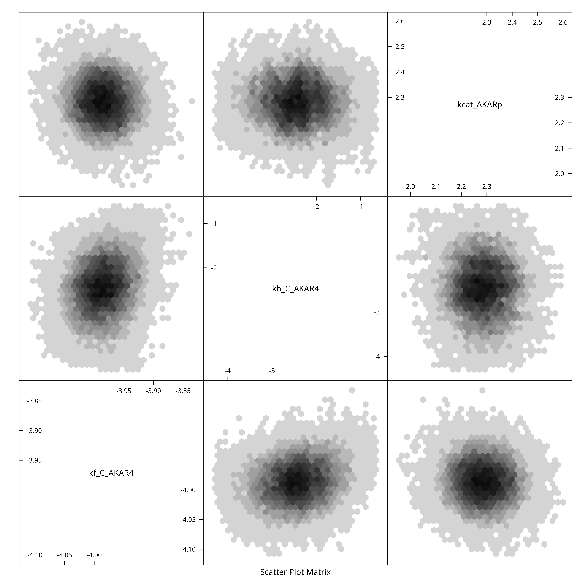

# Uncertainty Quantification on AKAR4 (deterministic model)

``` r
library(uqsa)
library(errors)
```

## Load Model and Data

The first step is to locate and load the SBtab model files. In this
example we use the SBtab files from an already existing example
(“AKAR4”).

In the article [“Build and simulate your own
Model](https://icpm-kth.github.io/uqsa/articles/user_model.md) you can
read about how the set up your own SBtab model. You can list the files
in a directory with the
[`dir()`](https://rdrr.io/r/base/list.files.html) command.

``` r
f <- uqsa_example("AKAR4")
m <- model_from_tsv(f)
o <- write_and_compile(as_ode(m))
#> Loading required namespace: pracma
```

The chain of functions that we use to build the model tracks the name of
the model via comments:

``` r
print(comment(m)) # the name of the model
#> [1] "AKAR4"
```

This comment is ultimately used to determine the automatic file-name of
the shared library.

``` r
ex <- experiments(m,o)
```

### Take a parameter Sample for this Model

We use just one core as this is a tiny model. No MPI, no parallel
tempering. First we construct the prior:

``` r
mu <- values(m$Parameter)
sigma <- m$Parameter$stdv

dprior <- dNormalPrior(
    mean=log(mu^2/sqrt(mu^2+sigma^2)),
    sd=log(1+sigma^2/mu^2)
)
rprior <- rNormalPrior(
    mean=log(mu)/sqrt(mu^2+sigma^2),
    sd=log(1+sigma^2/mu^2)
)
```

Next, the MCMC method via `metropolis_update`, which determines the
sampling algorithm we are going to use. Finally, we construct the
sampler (`MH` below), which actually performs the MCMC run, this
function takes the inital values, number of steps and the stepsize as
arguments.

``` r
options(mc.cores=length(ex))
s <- simulator.c(
    ex,
    o,
    parMap=logParMap,
    omit=2
)

MH <- mcmc(
    metropolis_update(
        s,
        dprior=dprior
    )
)
```

Finally, to obtain a sample of parameters:

``` r
x <- mcmc_init(
    beta=1.0,
    parMCMC=log(values(m$Parameter)),
    simulate=s,
    dprior=dprior
)

h <- tune_step_size(MH,x,h=1e-3)
#> acceptance rate: 0.96, step-size: 0.001;
#> acceptance rate: 1, step-size: 0.00187298;
#> acceptance rate: 0.94, step-size: 0.00352561;
#> acceptance rate: 0.93, step-size: 0.00658541;
#> acceptance rate: 0.86, step-size: 0.0122832;
#> acceptance rate: 0.71, step-size: 0.0226522;
N <- 5e4

# sampling:
X <- MH(x,N,eps=h)

print(attr(X,"acceptanceRate"))
#> [1] 0.59664
```

``` r
if (require(hexbin)){
    hexplom(X)
} else {
    pairs(X)
}
#> Loading required package: hexbin
```



### Better Sample

We can try to obtain a higher quality sample, through simple means:

1.  Combine several samples (replicas) into one big sample
2.  Use several random starting locations
3.  Remove burn-in phase from each chain
4.  Adjust the step size at least once to get close to 25% acceptance
    rate
