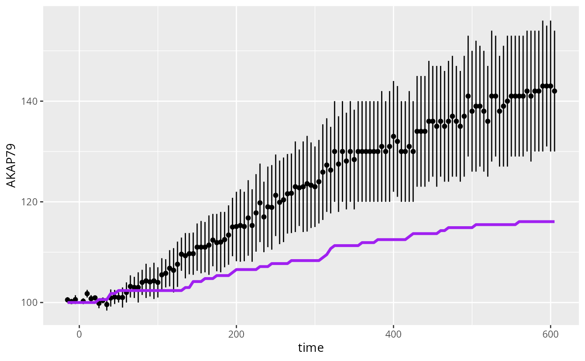
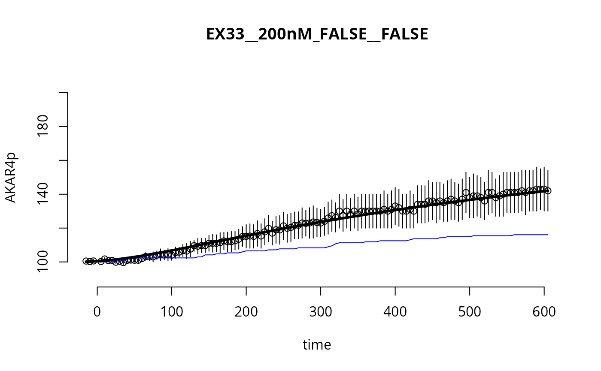

# Simulation of a Stochastic Model for the AKAP79 reaction network

``` r
require(SBtabVFGEN)
#> Loading required package: SBtabVFGEN
library(uqsa)
#> 
#> Attaching package: 'uqsa'
#> The following objects are masked from 'package:SBtabVFGEN':
#> 
#>     unit.from.string, unit.info
library(GillespieSSA2)
```

This article provides code to simulate the AKAP79 stochastic model (one
time, no sampling). We are plotting the model with default parameters
which are not expected to fit the data (this is the starting point).

## The Stochastic Model

When the copy number of molecular species in a reaction network system
(AKAP79 in our case) is low, we cannot model the amount of molecules
deterministically (e.g., with an ODE model), because the stochasticity
in the reactions that take place cannot be ignored. In particular, the
time at which reactions take place is random, as well as the specific
reactions that take place (i.e., what pair of molecules react). To model
such system we can use the *chemical master equation* (CME): we model
the (integer) number of each molecule species in the system (e.g.,
proteins) and how the number of each molecule type (randomly) evolves in
time. The likelihood of this model is hard to compute; however, we can
easily sample trajectories from this stochastic model using the
*Gillespie algorithm*. Given the current amount of each molecular
species in the system at a given time point, we can sample the time at
which the next reaction takes place and we can sample the type of
reaction (i.e., what pair of molecules react).

To obtain the stochastic model for the reaction network, we need to
compute the reaction *propensities*. These can be related to the
reaction rate coefficients, that are the parameters that we usually use
in our models, and on which we perform uncertainty quantification. To
derive the reaction propensities we referred to [this
article](https://doi.org/10.1186/1752-0509-5-187).

## Load the Model

This model is included with the package. To load your own model, see the
article [“Build and simulate your own
Model”](https://icpm-kth.github.io/uqsa/articles/user_model.md).

``` r
m <- model_from_tsv(uqsa_example("AKAP79"))
cme <- as_cme(m)    # chemical master equation, stochastic model
c_path(cme) <- write_c_code(generate_code(cme))
so_path(cme) <- shlib(cme)
```

## Load Experiments (data)

``` r
ex <- experiments(m)
print(ex)
#> number of simulation experiments: 25
#>                   EX11____0nM__TRUE___TRUE 
#> ------------------------------------------ 
#>             measurements: 2 columns (data.frame)
#>                     data: 1, 125 (dim)
#>                    input: 1
#>              initialTime: -30
#>             initialState: 16 (length)
#>              outputTimes: 125 (length)
#>                   events: NULL (class), NULL (type)
#> 
#>                   EX12____0nM__TRUE__FALSE 
#> ------------------------------------------ 
#>             measurements: 2 columns (data.frame)
#>                     data: 1, 125 (dim)
#>                    input: 0
#>              initialTime: -30
#>             initialState: 16 (length)
#>              outputTimes: 125 (length)
#>                   events: NULL (class), NULL (type)
#> 
#>                   EX13____0nM_FALSE__FALSE 
#> ------------------------------------------ 
#>             measurements: 2 columns (data.frame)
#>                     data: 1, 125 (dim)
#>                    input: 0
#>              initialTime: -30
#>             initialState: 16 (length)
#>              outputTimes: 125 (length)
#>                   events: NULL (class), NULL (type)
#> 
#>                   EX21__100nM__TRUE___TRUE 
#> ------------------------------------------ 
#>             measurements: 2 columns (data.frame)
#>                     data: 1, 125 (dim)
#>                    input: 1
#>              initialTime: -30
#>             initialState: 16 (length)
#>              outputTimes: 125 (length)
#>                   events: NULL (class), NULL (type)
#> 
#>                   EX22__100nM__TRUE__FALSE 
#> ------------------------------------------ 
#>             measurements: 2 columns (data.frame)
#>                     data: 1, 125 (dim)
#>                    input: 0
#>              initialTime: -30
#>             initialState: 16 (length)
#>              outputTimes: 125 (length)
#>                   events: NULL (class), NULL (type)
#> 
#>                   EX23__100nM_FALSE__FALSE 
#> ------------------------------------------ 
#>             measurements: 2 columns (data.frame)
#>                     data: 1, 125 (dim)
#>                    input: 0
#>              initialTime: -30
#>             initialState: 16 (length)
#>              outputTimes: 125 (length)
#>                   events: NULL (class), NULL (type)
#> 
#>                   EX31__200nM__TRUE___TRUE 
#> ------------------------------------------ 
#>             measurements: 2 columns (data.frame)
#>                     data: 1, 125 (dim)
#>                    input: 1
#>              initialTime: -30
#>             initialState: 16 (length)
#>              outputTimes: 125 (length)
#>                   events: NULL (class), NULL (type)
#> 
#>                   EX32__200nM__TRUE__FALSE 
#> ------------------------------------------ 
#>             measurements: 2 columns (data.frame)
#>                     data: 1, 125 (dim)
#>                    input: 0
#>              initialTime: -30
#>             initialState: 16 (length)
#>              outputTimes: 125 (length)
#>                   events: NULL (class), NULL (type)
#> 
#>                   EX33__200nM_FALSE__FALSE 
#> ------------------------------------------ 
#>             measurements: 2 columns (data.frame)
#>                     data: 1, 125 (dim)
#>                    input: 0
#>              initialTime: -30
#>             initialState: 16 (length)
#>              outputTimes: 125 (length)
#>                   events: NULL (class), NULL (type)
#> 
#>                   EX41__500nM__TRUE___TRUE 
#> ------------------------------------------ 
#>             measurements: 2 columns (data.frame)
#>                     data: 1, 125 (dim)
#>                    input: 1
#>              initialTime: -30
#>             initialState: 16 (length)
#>              outputTimes: 125 (length)
#>                   events: NULL (class), NULL (type)
#> 
#>                   EX42__500nM__TRUE__FALSE 
#> ------------------------------------------ 
#>             measurements: 2 columns (data.frame)
#>                     data: 1, 125 (dim)
#>                    input: 0
#>              initialTime: -30
#>             initialState: 16 (length)
#>              outputTimes: 125 (length)
#>                   events: NULL (class), NULL (type)
#> 
#>                   EX43__500nM_FALSE__FALSE 
#> ------------------------------------------ 
#>             measurements: 2 columns (data.frame)
#>                     data: 1, 125 (dim)
#>                    input: 0
#>              initialTime: -30
#>             initialState: 16 (length)
#>              outputTimes: 125 (length)
#>                   events: NULL (class), NULL (type)
#> 
#>                   EX51_1000nM__TRUE___TRUE 
#> ------------------------------------------ 
#>             measurements: 2 columns (data.frame)
#>                     data: 1, 125 (dim)
#>                    input: 1
#>              initialTime: -30
#>             initialState: 16 (length)
#>              outputTimes: 125 (length)
#>                   events: NULL (class), NULL (type)
#> 
#>                   EX52_1000nM__TRUE__FALSE 
#> ------------------------------------------ 
#>             measurements: 2 columns (data.frame)
#>                     data: 1, 125 (dim)
#>                    input: 0
#>              initialTime: -30
#>             initialState: 16 (length)
#>              outputTimes: 125 (length)
#>                   events: NULL (class), NULL (type)
#> 
#>                   EX53_1000nM_FALSE__FALSE 
#> ------------------------------------------ 
#>             measurements: 2 columns (data.frame)
#>                     data: 1, 125 (dim)
#>                    input: 0
#>              initialTime: -30
#>             initialState: 16 (length)
#>              outputTimes: 125 (length)
#>                   events: NULL (class), NULL (type)
#> 
#>                   EX61_2000nM__TRUE___TRUE 
#> ------------------------------------------ 
#>             measurements: 2 columns (data.frame)
#>                     data: 1, 125 (dim)
#>                    input: 1
#>              initialTime: -30
#>             initialState: 16 (length)
#>              outputTimes: 125 (length)
#>                   events: NULL (class), NULL (type)
#> 
#>                   EX62_2000nM__TRUE__FALSE 
#> ------------------------------------------ 
#>             measurements: 2 columns (data.frame)
#>                     data: 1, 125 (dim)
#>                    input: 0
#>              initialTime: -30
#>             initialState: 16 (length)
#>              outputTimes: 125 (length)
#>                   events: NULL (class), NULL (type)
#> 
#>                   EX63_2000nM_FALSE__FALSE 
#> ------------------------------------------ 
#>             measurements: 2 columns (data.frame)
#>                     data: 1, 125 (dim)
#>                    input: 0
#>              initialTime: -30
#>             initialState: 16 (length)
#>              outputTimes: 125 (length)
#>                   events: NULL (class), NULL (type)
#> 
#>                   EX72__event__TRUE___TRUE 
#> ------------------------------------------ 
#>             measurements: 2 columns (data.frame)
#>                     data: 1, 6 (dim)
#>                    input: 1
#>              initialTime: -30
#>             initialState: 16 (length)
#>              outputTimes: 6 (length)
#>                   events: list (class), list (type)
#> 
#>            EX71___dose__TRUE___TRUE_dose_1 
#> ------------------------------------------ 
#>              outputTimes: 605
#>             measurements: 3 columns (data.frame)
#>                     data: 1, 1 (dim)
#>                    input: 1
#>             initialState: 16 (length)
#>              initialTime: -30
#>                   events: NULL (class), NULL (type)
#> 
#>            EX71___dose__TRUE___TRUE_dose_2 
#> ------------------------------------------ 
#>              outputTimes: 605
#>             measurements: 3 columns (data.frame)
#>                     data: 1, 1 (dim)
#>                    input: 1
#>             initialState: 16 (length)
#>              initialTime: -30
#>                   events: NULL (class), NULL (type)
#> 
#>            EX71___dose__TRUE___TRUE_dose_3 
#> ------------------------------------------ 
#>              outputTimes: 605
#>             measurements: 3 columns (data.frame)
#>                     data: 1, 1 (dim)
#>                    input: 1
#>             initialState: 16 (length)
#>              initialTime: -30
#>                   events: NULL (class), NULL (type)
#> 
#>            EX71___dose__TRUE___TRUE_dose_4 
#> ------------------------------------------ 
#>              outputTimes: 605
#>             measurements: 3 columns (data.frame)
#>                     data: 1, 1 (dim)
#>                    input: 1
#>             initialState: 16 (length)
#>              initialTime: -30
#>                   events: NULL (class), NULL (type)
#> 
#>            EX71___dose__TRUE___TRUE_dose_5 
#> ------------------------------------------ 
#>              outputTimes: 605
#>             measurements: 3 columns (data.frame)
#>                     data: 1, 1 (dim)
#>                    input: 1
#>             initialState: 16 (length)
#>              initialTime: -30
#>                   events: NULL (class), NULL (type)
#> 
#>            EX71___dose__TRUE___TRUE_dose_6 
#> ------------------------------------------ 
#>              outputTimes: 605
#>             measurements: 3 columns (data.frame)
#>                     data: 1, 1 (dim)
#>                    input: 1
#>             initialState: 16 (length)
#>              initialTime: -30
#>                   events: NULL (class), NULL (type)
#> 
#> experiments:  EX11____0nM__TRUE___TRUE, EX12____0nM__TRUE__FALSE, EX13____0nM_FALSE__FALSE, EX21__100nM__TRUE___TRUE, EX22__100nM__TRUE__FALSE, EX23__100nM_FALSE__FALSE, EX31__200nM__TRUE___TRUE, EX32__200nM__TRUE__FALSE, EX33__200nM_FALSE__FALSE, EX41__500nM__TRUE___TRUE, EX42__500nM__TRUE__FALSE, EX43__500nM_FALSE__FALSE, EX51_1000nM__TRUE___TRUE, EX52_1000nM__TRUE__FALSE, EX53_1000nM_FALSE__FALSE, EX61_2000nM__TRUE___TRUE, EX62_2000nM__TRUE__FALSE, EX63_2000nM_FALSE__FALSE, EX72__event__TRUE___TRUE, EX71___dose__TRUE___TRUE_dose_1, EX71___dose__TRUE___TRUE_dose_2, EX71___dose__TRUE___TRUE_dose_3, EX71___dose__TRUE___TRUE_dose_4, EX71___dose__TRUE___TRUE_dose_5, EX71___dose__TRUE___TRUE_dose_6
```

Here, we set parameters that we obtained as a result of uncertainty
quantification as the default parameters don’t produce a good fit, they
are still not optimal:

``` r
p <- c(3.38,-0.22,-0.39,0.0013,7.89e-2,-1.02,-1.08,-2.86,-0.53,-0.34,-0.51,-2.42,-1.05,-1.37,-1.29,2.08,-2.79,-0.87,0.26,-0.168,-0.331,-1.77,-0.938,1.065,2.08,0.0147,-0.09893)
names(p) <- rownames(m$Parameter)
```

If instead we wanted to use the default parameters, then we could use
this code:

``` r
p <- values(m$Parameter)
```

## Simulate

Function `simstoch` will return a function `s`, which will always
simulate the scenarios described in the list of experiments (i.e., same
initial conditions, same inputs), but for user supplied parameters.

``` r
E <- 9 #index of the experiment to consider

# generate a function (s) that simulates a trajectory given a parameter in input
s <- simstoch(ex, cme, parMap=log10ParMap)

# simulate a trajectory (y) given parameter p
ystc <- s(p)
```

## Simulation Results via `ggplot2`

``` r
require(ggplot2)
#> Loading required package: ggplot2
require(errors)
#> Loading required package: errors

D<-data.frame(
    time=ex[[E]]$outputTime,
    AKAP79=as.numeric(ex[[E]]$data),
    AKAP79ERR=as.numeric(errors(ex[[E]]$data)),
    sim=as.numeric(ystc[[E]]$func[1,,1]))
ggplot(D) +
  geom_linerange(mapping=aes(x=time,y=AKAP79,ymin=AKAP79-AKAP79ERR,ymax=AKAP79+AKAP79ERR),na.rm=TRUE) +
  geom_point(mapping=aes(x=time,y=AKAP79),na.rm=TRUE) +
  geom_line(mapping=aes(x=time,y=sim),color="purple",lwd=1.2)
```



``` r
o <- as_ode(m)
#> Loading required namespace: pracma
c_path(o) <- write_c_code(generate_code(o))
so_path(o) <- shlib(o)
sode <- simfi(ex,o,parMap=log10ParMap)
yode <- sode(p)
```

And also plot the results:

``` r
tm <- ex[[E]]$outputTimes
par(bty="n")
plot(
    as.errors(tm),
    ex[[E]]$data,
    xlab="time",
    ylab="AKAR4p",
    main=names(ex)[E],
    ylim=c(90,210)
)

lines(tm,as.numeric(ystc[[E]]$func["AKAR4pOUT",,1]),lwd=1,col="blue")
lines(tm,as.numeric(yode[[E]]$func["AKAR4pOUT",,1]),lwd=3)
```


