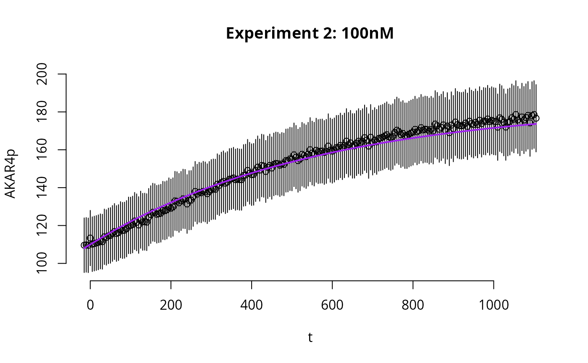
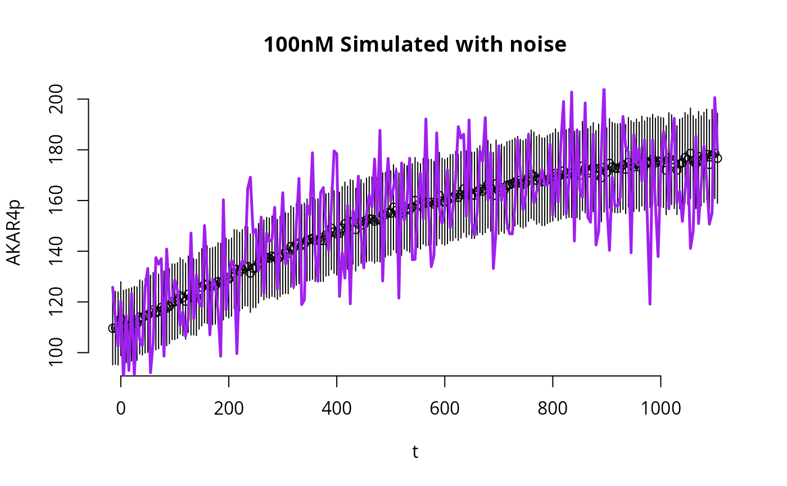
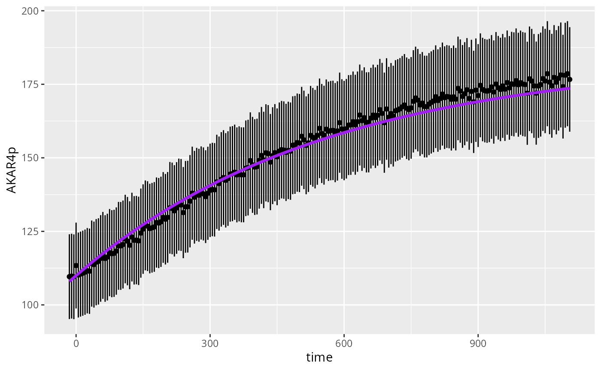
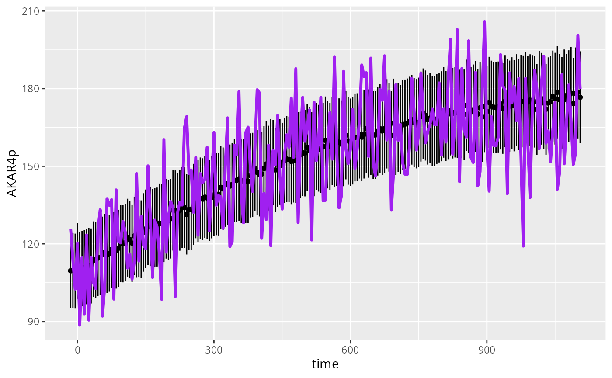

# Simulate the AKAR4 deterministic model

``` r
library(uqsa)
library(errors)
```

This article provides code to simulate the AKAR4 deterministic model
(one time, no sampling). Specifically, given a vector of initial
conditions and a default parameter, we simulate the time evolution of
the concentrations of compounds in the system.

In this article, we are simulating the AKAR4 model with default
parameters which are not expected to fit the data perfectly.

## Load the Model

The following instructions allow you to load all information needed to
simulate the AKAR4 model in R. More details on each of the following
commands can be found in the article [“Build your own
model”](https://icpm-kth.github.io/uqsa/articles/user_model.md).

``` r
f <- uqsa_example("AKAR4") # TSV files
m <- model_from_tsv(f)     # data.frames
o <- as_ode(m)             # list
#> Loading required namespace: pracma
C <- generate_code(o)      # character vector
c_path(o) <- write_c_code(C)
so_path(o) <- shlib(o)     # shared library
```

The AKAR4 deterministic model is an ODE model that describes the
time-evolution of the concentrations of compounds in the system. The
following R commands will print the names of the compounds in the system
and the corresponding default initial conditions.

``` r
# Compounds or "Species"
values(m$Compound)
#>   AKAR4 AKAR4_C  AKAR4p       C 
#>     0.2     0.0     0.0     0.0 
#> attr(,"unit")
#>   AKAR4 AKAR4_C  AKAR4p       C 
#>    "µM"    "µM"    "µM"    "µM"

# Parameters
values(m$Parameter)
#> kf_C_AKAR4 kb_C_AKAR4 kcat_AKARp 
#>      0.018      0.106     10.200 
#> attr(,"unit")
#> kf_C_AKAR4 kb_C_AKAR4 kcat_AKARp 
#>   "1/uM*s"      "1/s"      "1/s"
```

The ODE system that will be used to run simulations from the AKAR4 model
is derived from the reactions in the AKAR4 model:

``` r
# Reactions in the AKAR4 system
m$Reaction
#>                                        kinetic.law reactants arw   products
#> reaction_1 kf_C_AKAR4*C*AKAR4 - kb_C_AKAR4*AKAR4_C C + AKAR4 <=>    AKAR4_C
#> reaction_2                      kcat_AKARp*AKAR4_C   AKAR4_C <=> AKAR4p + C
#>            is.reversible
#> reaction_1             1
#> reaction_2             0
```

## Load Experiments (data)

We create simulation instructions from `m` for `o`:

``` r
ex <- experiments(m,o)
```

This variable includes information about the initial value problem (for
the ODE):

``` r
print(ex[[1]]$initialState)
#> AKAR4p      C 
#>    0.0    0.4
```

But, also the measured data, as a matrix:

``` r
print(dim(ex[[1]]$data))
#> [1]   1 225
cat(
    sprintf("%30s: %i","number of outputs",NROW(m$Output)),
    sprintf("%30s: %i","number of measurement times",length(ex[[1]]$outputTimes)),
    sep="\n"
)
#>              number of outputs: 1
#>    number of measurement times: 225
```

Also available as `data.frame`:

``` r
print(head(ex[[1]]$measurements))
#>            time AKAR4pOUT
#> E400T001 -15(0)   110(10)
#> E400T002 -10(0)   110(10)
#> E400T003  -5(0)   110(10)
#> E400T004   0(0)   110(10)
#> E400T005   5(0)   110(10)
#> E400T006  10(0)   110(20)
```

## Simulate

Here we show how to simulate the AKAR4 ODE model using the same
conditions that were used in each of the experiments. In AKAR4, the 3
experiments differ only in the initial conditions. In larger models,
different experiments may also have different *inputs*, and this will be
also taken into account when running the R commands below.

Function `simulator.c` will output a function (variable `simulate` in
the code below) that will allow us to simulate the AKAR4 ODE model given
the experimental conditions saved in `ex`.

``` r
simulate <- simulator.c(ex,o)
simulate_noise <- simulator.c(ex, o, noise = TRUE)
```

The variable `simulate` is a function that requires a parameter `p` as
input argument. The output of function `simulate` is the simulation of
all experiments in `ex` using the ODE model `o` (written as C code to a
file):

``` r
p <- values(m$Parameter)

y <- simulate(p)

y_noisy <- simulate_noise(p)
```

In the AKAR4 example we have a list of 3 experiments, thus function
`simulate` simulates the entire system 3 times, each time considering
the specific initial condition of the corresponding experiment. The
output of `simulate` (`y`) is a list of `length(ex)` elements,
corresponding to the 3 experimental conditions. Each element of the list
is in turn a list with at least these elements:

- `state` (simulated trajectory of the ODE system)
- `func` (the corresponding output of the system given the computed
  `state`)
- `cpuSeconds` (simulation runtime)
- `status`

## Plot

Here we plot the results of one of the simulations.

``` r
E <- 2 # which experiment to plot

# measurements time points
tm <- ex[[E]]$outputTime

# Plot simulations
par(bty='n',xaxp=c(80,200,4))
plot(
    as.errors(tm),     # time points
    ex[[E]]$data,      # data points (as errorbars)
    ylim=c(95,200),
    ylab="AKAR4p",
    xlab="t",
    main=sprintf("Experiment %i: %s",E,names(ex)[E])
)

lines(
    tm,              # time points
    y[[E]]$func[1,,1], # simulated trajectory
    col="purple",
    lwd=2
)
```



We now run the same code to plot the simulations with noise
`y_with_noise`.

``` r
E <- 2 # which experiment to plot

# Plot simulations
par(bty='n',xaxp=c(80,200,4))
plot(
    as.errors(tm),       # time points
    ex[[E]]$data,        # data
    ylim=c(95,200),
    ylab="AKAR4p",
    xlab="t",
    main=sprintf("%s Simulated with noise",names(ex)[E])
)

lines(
    tm,                  # time points
    y_noisy[[E]]$func,   # simulated trajectory
    lwd=2.5,
    col="purple"
)
```



### Plots with ggplot2

The following code plots simulations and data using an alternative
function, from the package [ggplot2](https://ggplot2.tidyverse.org/).

``` r
require(ggplot2)
#> Loading required package: ggplot2

D <- data.frame(
    time=ex[[E]]$outputTime,
    AKAR4p=as.numeric(ex[[E]]$data),
    AKAR4pERR=as.numeric(errors(ex[[E]]$data)),
    sim=as.numeric(y[[E]]$func)
)
ggplot(D) +
  geom_linerange(mapping=aes(x=time,y=AKAR4p,ymin=AKAR4p-AKAR4pERR,ymax=AKAR4p+AKAR4pERR),na.rm=TRUE) +
  geom_point(mapping=aes(x=time,y=AKAR4p),na.rm=TRUE) +
  geom_line(mapping=aes(x=time,y=sim),color="purple",lwd=1.2)
```



Plots for the simulations with noise `y_noisy`.

``` r
require(ggplot2)
D <- data.frame(
    time=ex[[E]]$outputTime,
    AKAR4p=as.numeric(ex[[E]]$data),
    AKAR4pERR=as.numeric(errors(ex[[E]]$data)),
    sim=as.numeric(y_noisy[[E]]$func)
)

ggplot(D) +
  geom_linerange(mapping=aes(x=time,y=AKAR4p,ymin=AKAR4p-AKAR4pERR,ymax=AKAR4p+AKAR4pERR),na.rm=TRUE) +
  geom_point(mapping=aes(x=time,y=AKAR4p),na.rm=TRUE) +
  geom_line(mapping=aes(x=time,y=sim),color="purple",lwd=1.2)
```


