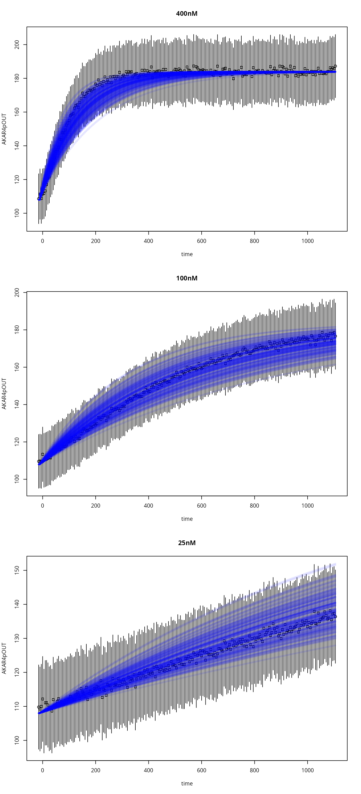

# Simulating a model

Reaction network models can be simulated as deterministic models or
stochastic models. In this article we show the deterministic approach.
An example of how to simualte from the stochastic model is available in
[this
article](https://icpm-kth.github.io/uqsa/articles/simAKAR4stochastic.md).

Given a reaction network model, we can use the law of mass action to
derive an ODE system that describes how the concentrations of the
compounds in the system change in time.

To simulate the reaction network model deterministically with UQSA you
can use the `simulator.c` function:

``` r
simulate <- simulator.c(ex, o, parMap = parMap)
```

This has created a
[closure](https://en.wikipedia.org/wiki/Closure_(computer_programming))
(`simulate`), with a single argument `p`:

``` r
y <- simulate(p)
```

The `simulate` function remembers the experiments that it was created
with and produces results of the same length as `ex` (the list of
simulation experiments), with the same experimental conditions.

It is often convenient to modify the parameters before passing them to
the model. Here are possible reasons:

1.  the uncertainty is log normal
    - you want to pass `exp(log(p) + rnorm(...))` to the model rather
      than `p` itself
2.  the Markov chain is in log-space
    - the sampler uses `p`, but the model needs `10^p`
3.  the model parameters are linearly dependent
    - we have to reliably pass something like:
      `c(p[1]+p[2], p[2]+p[3], p[3]-p[1])` to the model, every time

In such cases, you can write a mapping function, and use the `parMap`
argument-slot of `simulator.c`:

``` r
library(uqsa)
library(errors)
library(parallel)

f <- uqsa_example("AKAR4")
m <- model_from_tsv(f)
o <- write_and_compile(as_ode(m))
#> Loading required namespace: pracma
ex <- experiments(m,o)
print(ex)
#> number of simulation experiments: 3
#>                                      400nM 
#> ------------------------------------------ 
#>             measurements: 2 columns (data.frame)
#>                     data: 1, 225 (dim)
#>                    input: 2 (length)
#>              initialTime: -15
#>             initialState: 2 (length)
#>              outputTimes: 225 (length)
#>                   events: NULL (class), NULL (type)
#> 
#>                                      100nM 
#> ------------------------------------------ 
#>             measurements: 2 columns (data.frame)
#>                     data: 1, 225 (dim)
#>                    input: 2 (length)
#>              initialTime: -15
#>             initialState: 2 (length)
#>              outputTimes: 225 (length)
#>                   events: NULL (class), NULL (type)
#> 
#>                                       25nM 
#> ------------------------------------------ 
#>             measurements: 2 columns (data.frame)
#>                     data: 1, 225 (dim)
#>                    input: 2 (length)
#>              initialTime: -15
#>             initialState: 2 (length)
#>              outputTimes: 225 (length)
#>                   events: NULL (class), NULL (type)
#> 
#> experiments:  400nM, 100nM, 25nM
```

For example, here parameters are in log-space.

``` r
simulate <- simulator.c(ex,o,parMap=logParMap)
p <- log(values(m$Parameter))
print(p)
#> kf_C_AKAR4 kb_C_AKAR4 kcat_AKARp 
#>  -4.017384  -2.244316   2.322388 
#> attr(,"unit")
#> kf_C_AKAR4 kb_C_AKAR4 kcat_AKARp 
#>   "1/uM*s"      "1/s"      "1/s"

rprior <- rNormalPrior(mean=p,sd=0.2)

P <- rprior(150)
print(dim(P))
#> [1] 150   3
```

All simulations happen here (timed):

``` r
options(mc.cores=parallel::detectCores())

ti <- Sys.time()
y <- simulate(t(P))
tf <- Sys.time()

print(difftime(tf,ti))
#> Time difference of 0.08038044 secs
```

The matrix `P` has columns of model parameters that are log-normally
distributed around OK-ish values (taken from the TSV file
`AKAR4/Parameter.tsv`):

``` r
par(mfrow=c(3,1))
for (i in seq(ex)){
    tm <- ex[[i]]$outputTimes
    plot(               # data
        as.errors(tm),
        ex[[i]]$data,
        main=names(ex)[i],
        xlab="time",
        ylab='AKAR4pOUT'
    )
    matplot(            # simulation
        tm,
        y[[i]]$func['AKAR4pOUT',,],
        add=TRUE, type="s",
        lwd=3, lty=1, col=rgb(0,0,1,0.1)
    )
}
```


