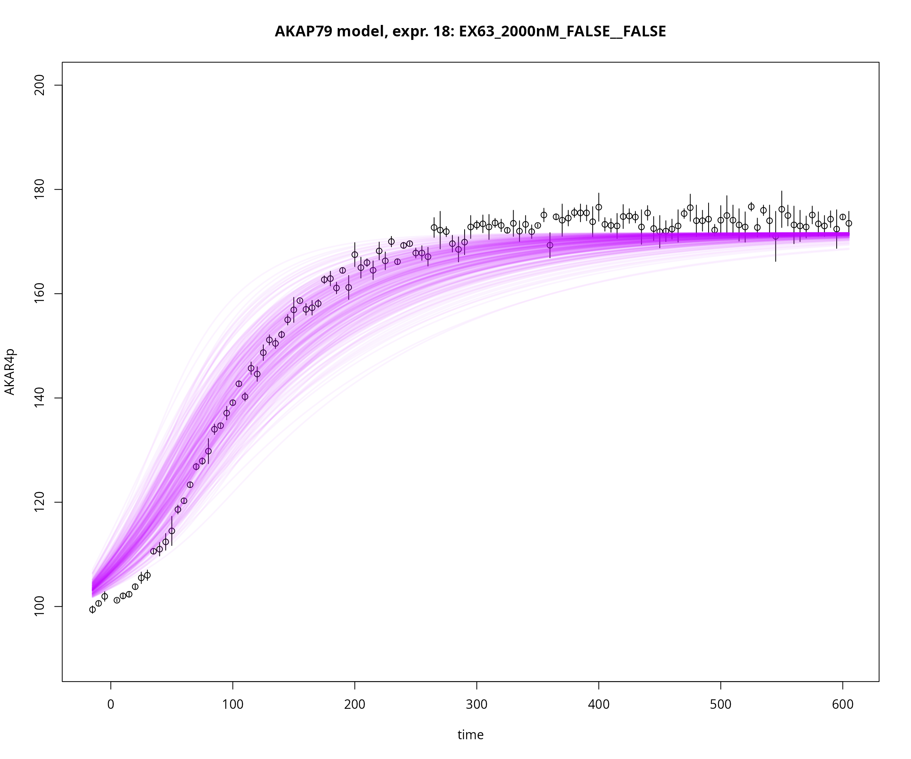
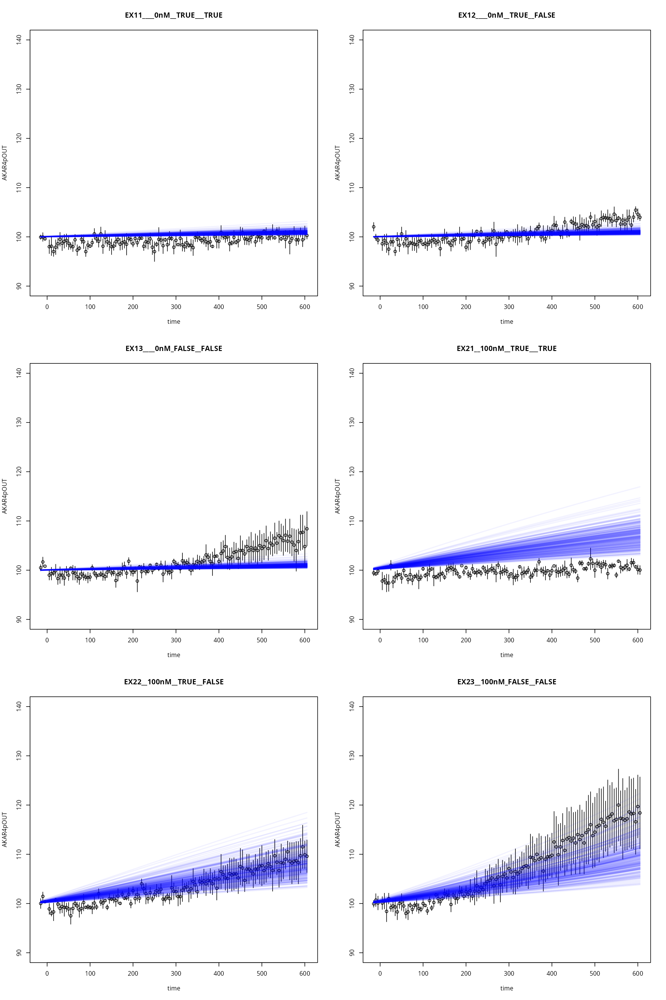

# Simulate Models

``` r
library(uqsa)
library(parallel)
library(errors)
```

In this package, there are two solvers available to you, solvers for
ODEs from the GNU Scientific Library (called via the `.Call` interface),
and a C implementation of the Gillespie algorithm. Here we show how
these are used on one of the included examples.

We make heavy use of closures: functions that were created in an
environment with access to implicit arguments such as simulation
experiments. The created closures have an explicit argument, such as the
Markov chain variable `parMCMC`, which in some way maps to the
parameters that the model can be simulated with `parModel`.

We assume that simulations require lots of arguments, but only one of
them will change every once in a while, the `parMCMC` variable; the
simulation experiments (initial state vector, input parameters, output
times, etc.) remain the same, and so does the model structure.

This closure approach allows you to hijack the procedure at any point by
constructing your own simulation closure that uses your solver of
convenience and/or necessity. You can write a function that accepts a
`parMCMC` vector and calls the solvers from the `deSolve` package. Just
make sure to package the simulation results in teh same way as our
solvers do.

Typically a simulation result `y` has this structure: `y[[i]]` is the
simulation of `ex[[i]]` (where `ex` is th elist of simulation
experiments, with data from the real experiments). Each `y[[i]]` has the
fields: `state`, `func`, `status`, `cpuSeconds`, `numSteps`. Only
`state` and `func` have scientific relevance. The `func` array
(3d-array), contains the measurable quantities for this model (the
observables): `y[[i]]$func[j,k,l]` is experiment `i`, output function
`j`, time-point `k` value for parameter set `l` if you are simulating
several parameter vectors in one call (otherwise `l` is exactly `1`).

## Load the AKAP79 Model

This model is included with the package. To load your own model (also a
collection of TSV files) call
[`model_from_tsv()`](https://icpm-kth.github.io/uqsa/reference/model_from_tsv.md)
with a character-vector of file names or the name of the directory that
contains the TSV files. To use an example model included with the
package, we use
[`uqsa_example()`](https://icpm-kth.github.io/uqsa/reference/uqsa_example.md):

``` r
m <- model_from_tsv(uqsa_example("AKAP79"))
o <- as_ode(m)
#> Loading required namespace: pracma
c_path(o) <- write_c_code(generate_code(o))
so_path(o) <- shlib(o)
print(o)
#>                 Model name : AKAP79
#>                     C file : /tmp/RtmpiY0iWI/RtmpQMQrCy/RtmpcrMJNH/b316367e5f817645/AKAP79.c [2026-06-26 14:39:36.392262]
#>             shared library : /tmp/RtmpiY0iWI/RtmpQMQrCy/RtmpcrMJNH/b316367e5f817645/AKAP79.so [2026-06-26 14:39:36.392262]
#>  Number of state variables : 11
#>       Number of parameters : 33
#>          Number of outputs : 1
#>          Conservation laws : 5
#>            Transformations : yes
if (!file.exists(so_path(o))) stop('creation of shared library failed')
```

By default, `as_ode` performs a conservation law analysis that can be
turned off with `as_ode(o,cla=FALSE)`.

With conservation laws, some species are calculated algebraically. Their
initial values are turned into input parameters (using the found law):

With this hypothetical relationship (\\c\\ is a constant):

\\A+B = c\\,\\

we can determine that

\\c = A_0 + B_0\\.\\

And thus we can replace either of the two species:

\\A(t) = A_0 + B_0 - B(t)\\

And \\A_0+B_0\\ are turned into an input called `A_ConservedConst` (the
\\c\\ above) with the value determined from the stated, experiment
specific, initial condition.

## Load Experiments (data)

This list of data-sets also includes instructions for the simulator on
how to simulate the scenario with the model.

``` r
ex <- experiments(m,o)
#> Warning in experiments(m, o): CONFLICT: This model seems to have event based
#> transformations and conservation laws. These two concepts clash with one
#> another if a compound is conserved, but also changed by scheduled events.
```

We supply both `m` and `o` because `o` contains information about
whether or not conservation law analysis has occured. With conservation
law analysis, we must adjust the input vector for the simulation
experiment and reduce the initial state for each simulation to the
dynamic variables rather (without the ones determined algebraically).
Currently, there is no way to influence which variables are replaced by
algebraic constraints. This can be inconvenient if you are relying very
heavilty on the state component of the result `y[[i]]$state` (where some
variables are now missing, due to conservation laws). This is why you
should rely on the `func` component of the return value. This directly
corresponds to the `m$Output` table: the observable/measureable
quantities for this model. If you need to compare substance `A` to the
data (in some way), then add an outout function for it (e.g. `A_out` or
`A_obs` with a vlaue of `A`). Then it doesn’t matter whether the
conservation law analysis removes `A` from the state space; it remains
part of the `func` component.

## Simulate

This will make a function `s`, which will always simulate the scenarios
described in the `experiments` list, but for user supplied parameters.
The parameters in the tables are supplied in log10-space, this is
because the author of tat file intends to sample in log10-space. This
way the parameters are guaranteed to be positive and we can very quickly
sample several orders of magnitude for each parameter. The simulator
accepts a function in the `parMap` slot, which can do any arbitrary
transformation between the values you supply to the simulator and the
values it supplies the model with: the model will be simulated with
`parModel <- parMap(p)`, where `p` is what we call the simulator with.
If the sampling is done in log10 space, then the model accepts `10^p`.
This package has a set of functions that perform this reverse
transformation from sampling space to model-parameter space, based on
which transformation the user performed in the model files: log10ParMap
belongs to a log10 sampling space and performs `10^p` (to get back to
the model-paramerts):

``` r
stopifnot(all(m$Parameter$scale=="log10")) # just to make sure
options(mc.cores = 2) # required by CRAN, set this to a bigger value for yourself
s <- simulator.c(ex,o,parMap=log10ParMap)

p0 <- values(m$Parameter) # default parameters, in log10-space
rprior <- rNormalPrior(p0,rep(0.1,length(p0))) # a small neighborhood
y <- s(t(rprior(300)))
status <- unlist(lapply(y,\(E) as.logical(E$status))) # non-zero means an error occurred
print(status)
#>          EX11____0nM__TRUE___TRUE1          EX11____0nM__TRUE___TRUE2 
#>                              FALSE                              FALSE 
#>          EX11____0nM__TRUE___TRUE3          EX11____0nM__TRUE___TRUE4 
#>                              FALSE                              FALSE 
#>          EX11____0nM__TRUE___TRUE5          EX11____0nM__TRUE___TRUE6 
#>                              FALSE                              FALSE 
#>          EX11____0nM__TRUE___TRUE7          EX11____0nM__TRUE___TRUE8 
#>                              FALSE                              FALSE 
#>          EX11____0nM__TRUE___TRUE9         EX11____0nM__TRUE___TRUE10 
#>                              FALSE                              FALSE 
#>         EX11____0nM__TRUE___TRUE11         EX11____0nM__TRUE___TRUE12 
#>                              FALSE                              FALSE 
#>         EX11____0nM__TRUE___TRUE13         EX11____0nM__TRUE___TRUE14 
#>                              FALSE                              FALSE 
#>         EX11____0nM__TRUE___TRUE15         EX11____0nM__TRUE___TRUE16 
#>                              FALSE                              FALSE 
#>         EX11____0nM__TRUE___TRUE17         EX11____0nM__TRUE___TRUE18 
#>                              FALSE                              FALSE 
#>         EX11____0nM__TRUE___TRUE19         EX11____0nM__TRUE___TRUE20 
#>                              FALSE                              FALSE 
#>         EX11____0nM__TRUE___TRUE21         EX11____0nM__TRUE___TRUE22 
#>                              FALSE                              FALSE 
#>         EX11____0nM__TRUE___TRUE23         EX11____0nM__TRUE___TRUE24 
#>                              FALSE                              FALSE 
#>         EX11____0nM__TRUE___TRUE25         EX11____0nM__TRUE___TRUE26 
#>                              FALSE                              FALSE 
#>         EX11____0nM__TRUE___TRUE27         EX11____0nM__TRUE___TRUE28 
#>                              FALSE                              FALSE 
#>         EX11____0nM__TRUE___TRUE29         EX11____0nM__TRUE___TRUE30 
#>                              FALSE                              FALSE 
#>         EX11____0nM__TRUE___TRUE31         EX11____0nM__TRUE___TRUE32 
#>                              FALSE                              FALSE 
#>         EX11____0nM__TRUE___TRUE33         EX11____0nM__TRUE___TRUE34 
#>                              FALSE                              FALSE 
#>         EX11____0nM__TRUE___TRUE35         EX11____0nM__TRUE___TRUE36 
#>                              FALSE                              FALSE 
#>         EX11____0nM__TRUE___TRUE37         EX11____0nM__TRUE___TRUE38 
#>                              FALSE                              FALSE 
#>         EX11____0nM__TRUE___TRUE39         EX11____0nM__TRUE___TRUE40 
#>                              FALSE                              FALSE 
#>         EX11____0nM__TRUE___TRUE41         EX11____0nM__TRUE___TRUE42 
#>                              FALSE                              FALSE 
#>         EX11____0nM__TRUE___TRUE43         EX11____0nM__TRUE___TRUE44 
#>                              FALSE                              FALSE 
#>         EX11____0nM__TRUE___TRUE45         EX11____0nM__TRUE___TRUE46 
#>                              FALSE                              FALSE 
#>         EX11____0nM__TRUE___TRUE47         EX11____0nM__TRUE___TRUE48 
#>                              FALSE                              FALSE 
#>         EX11____0nM__TRUE___TRUE49         EX11____0nM__TRUE___TRUE50 
#>                              FALSE                              FALSE 
#>         EX11____0nM__TRUE___TRUE51         EX11____0nM__TRUE___TRUE52 
#>                              FALSE                              FALSE 
#>         EX11____0nM__TRUE___TRUE53         EX11____0nM__TRUE___TRUE54 
#>                              FALSE                              FALSE 
#>         EX11____0nM__TRUE___TRUE55         EX11____0nM__TRUE___TRUE56 
#>                              FALSE                              FALSE 
#>         EX11____0nM__TRUE___TRUE57         EX11____0nM__TRUE___TRUE58 
#>                              FALSE                              FALSE 
#>         EX11____0nM__TRUE___TRUE59         EX11____0nM__TRUE___TRUE60 
#>                              FALSE                              FALSE 
#>         EX11____0nM__TRUE___TRUE61         EX11____0nM__TRUE___TRUE62 
#>                              FALSE                              FALSE 
#>         EX11____0nM__TRUE___TRUE63         EX11____0nM__TRUE___TRUE64 
#>                              FALSE                              FALSE 
#>         EX11____0nM__TRUE___TRUE65         EX11____0nM__TRUE___TRUE66 
#>                              FALSE                              FALSE 
#>         EX11____0nM__TRUE___TRUE67         EX11____0nM__TRUE___TRUE68 
#>                              FALSE                              FALSE 
#>         EX11____0nM__TRUE___TRUE69         EX11____0nM__TRUE___TRUE70 
#>                              FALSE                              FALSE 
#>         EX11____0nM__TRUE___TRUE71         EX11____0nM__TRUE___TRUE72 
#>                              FALSE                              FALSE 
#>         EX11____0nM__TRUE___TRUE73         EX11____0nM__TRUE___TRUE74 
#>                              FALSE                              FALSE 
#>         EX11____0nM__TRUE___TRUE75         EX11____0nM__TRUE___TRUE76 
#>                              FALSE                              FALSE 
#>         EX11____0nM__TRUE___TRUE77         EX11____0nM__TRUE___TRUE78 
#>                              FALSE                              FALSE 
#>         EX11____0nM__TRUE___TRUE79         EX11____0nM__TRUE___TRUE80 
#>                              FALSE                              FALSE 
#>         EX11____0nM__TRUE___TRUE81         EX11____0nM__TRUE___TRUE82 
#>                              FALSE                              FALSE 
#>         EX11____0nM__TRUE___TRUE83         EX11____0nM__TRUE___TRUE84 
#>                              FALSE                              FALSE 
#>         EX11____0nM__TRUE___TRUE85         EX11____0nM__TRUE___TRUE86 
#>                              FALSE                              FALSE 
#>         EX11____0nM__TRUE___TRUE87         EX11____0nM__TRUE___TRUE88 
#>                              FALSE                              FALSE 
#>         EX11____0nM__TRUE___TRUE89         EX11____0nM__TRUE___TRUE90 
#>                              FALSE                              FALSE 
#>         EX11____0nM__TRUE___TRUE91         EX11____0nM__TRUE___TRUE92 
#>                              FALSE                              FALSE 
#>         EX11____0nM__TRUE___TRUE93         EX11____0nM__TRUE___TRUE94 
#>                              FALSE                              FALSE 
#>         EX11____0nM__TRUE___TRUE95         EX11____0nM__TRUE___TRUE96 
#>                              FALSE                              FALSE 
#>         EX11____0nM__TRUE___TRUE97         EX11____0nM__TRUE___TRUE98 
#>                              FALSE                              FALSE 
#>         EX11____0nM__TRUE___TRUE99        EX11____0nM__TRUE___TRUE100 
#>                              FALSE                              FALSE 
#>        EX11____0nM__TRUE___TRUE101        EX11____0nM__TRUE___TRUE102 
#>                              FALSE                              FALSE 
#>        EX11____0nM__TRUE___TRUE103        EX11____0nM__TRUE___TRUE104 
#>                              FALSE                              FALSE 
#>        EX11____0nM__TRUE___TRUE105        EX11____0nM__TRUE___TRUE106 
#>                              FALSE                              FALSE 
#>        EX11____0nM__TRUE___TRUE107        EX11____0nM__TRUE___TRUE108 
#>                              FALSE                              FALSE 
#>        EX11____0nM__TRUE___TRUE109        EX11____0nM__TRUE___TRUE110 
#>                              FALSE                              FALSE 
#>        EX11____0nM__TRUE___TRUE111        EX11____0nM__TRUE___TRUE112 
#>                              FALSE                              FALSE 
#>        EX11____0nM__TRUE___TRUE113        EX11____0nM__TRUE___TRUE114 
#>                              FALSE                              FALSE 
#>        EX11____0nM__TRUE___TRUE115        EX11____0nM__TRUE___TRUE116 
#>                              FALSE                              FALSE 
#>        EX11____0nM__TRUE___TRUE117        EX11____0nM__TRUE___TRUE118 
#>                              FALSE                              FALSE 
#>        EX11____0nM__TRUE___TRUE119        EX11____0nM__TRUE___TRUE120 
#>                              FALSE                              FALSE 
#>        EX11____0nM__TRUE___TRUE121        EX11____0nM__TRUE___TRUE122 
#>                              FALSE                              FALSE 
#>        EX11____0nM__TRUE___TRUE123        EX11____0nM__TRUE___TRUE124 
#>                              FALSE                              FALSE 
#>        EX11____0nM__TRUE___TRUE125        EX11____0nM__TRUE___TRUE126 
#>                              FALSE                              FALSE 
#>        EX11____0nM__TRUE___TRUE127        EX11____0nM__TRUE___TRUE128 
#>                              FALSE                              FALSE 
#>        EX11____0nM__TRUE___TRUE129        EX11____0nM__TRUE___TRUE130 
#>                              FALSE                              FALSE 
#>        EX11____0nM__TRUE___TRUE131        EX11____0nM__TRUE___TRUE132 
#>                              FALSE                              FALSE 
#>        EX11____0nM__TRUE___TRUE133        EX11____0nM__TRUE___TRUE134 
#>                              FALSE                              FALSE 
#>        EX11____0nM__TRUE___TRUE135        EX11____0nM__TRUE___TRUE136 
#>                              FALSE                              FALSE 
#>        EX11____0nM__TRUE___TRUE137        EX11____0nM__TRUE___TRUE138 
#>                              FALSE                              FALSE 
#>        EX11____0nM__TRUE___TRUE139        EX11____0nM__TRUE___TRUE140 
#>                              FALSE                              FALSE 
#>        EX11____0nM__TRUE___TRUE141        EX11____0nM__TRUE___TRUE142 
#>                              FALSE                              FALSE 
#>        EX11____0nM__TRUE___TRUE143        EX11____0nM__TRUE___TRUE144 
#>                              FALSE                              FALSE 
#>        EX11____0nM__TRUE___TRUE145        EX11____0nM__TRUE___TRUE146 
#>                              FALSE                              FALSE 
#>        EX11____0nM__TRUE___TRUE147        EX11____0nM__TRUE___TRUE148 
#>                              FALSE                              FALSE 
#>        EX11____0nM__TRUE___TRUE149        EX11____0nM__TRUE___TRUE150 
#>                              FALSE                              FALSE 
#>        EX11____0nM__TRUE___TRUE151        EX11____0nM__TRUE___TRUE152 
#>                              FALSE                              FALSE 
#>        EX11____0nM__TRUE___TRUE153        EX11____0nM__TRUE___TRUE154 
#>                              FALSE                              FALSE 
#>        EX11____0nM__TRUE___TRUE155        EX11____0nM__TRUE___TRUE156 
#>                              FALSE                              FALSE 
#>        EX11____0nM__TRUE___TRUE157        EX11____0nM__TRUE___TRUE158 
#>                              FALSE                              FALSE 
#>        EX11____0nM__TRUE___TRUE159        EX11____0nM__TRUE___TRUE160 
#>                              FALSE                              FALSE 
#>        EX11____0nM__TRUE___TRUE161        EX11____0nM__TRUE___TRUE162 
#>                              FALSE                              FALSE 
#>        EX11____0nM__TRUE___TRUE163        EX11____0nM__TRUE___TRUE164 
#>                              FALSE                              FALSE 
#>        EX11____0nM__TRUE___TRUE165        EX11____0nM__TRUE___TRUE166 
#>                              FALSE                              FALSE 
#>        EX11____0nM__TRUE___TRUE167        EX11____0nM__TRUE___TRUE168 
#>                              FALSE                              FALSE 
#>        EX11____0nM__TRUE___TRUE169        EX11____0nM__TRUE___TRUE170 
#>                              FALSE                              FALSE 
#>        EX11____0nM__TRUE___TRUE171        EX11____0nM__TRUE___TRUE172 
#>                              FALSE                              FALSE 
#>        EX11____0nM__TRUE___TRUE173        EX11____0nM__TRUE___TRUE174 
#>                              FALSE                              FALSE 
#>        EX11____0nM__TRUE___TRUE175        EX11____0nM__TRUE___TRUE176 
#>                              FALSE                              FALSE 
#>        EX11____0nM__TRUE___TRUE177        EX11____0nM__TRUE___TRUE178 
#>                              FALSE                              FALSE 
#>        EX11____0nM__TRUE___TRUE179        EX11____0nM__TRUE___TRUE180 
#>                              FALSE                              FALSE 
#>        EX11____0nM__TRUE___TRUE181        EX11____0nM__TRUE___TRUE182 
#>                              FALSE                              FALSE 
#>        EX11____0nM__TRUE___TRUE183        EX11____0nM__TRUE___TRUE184 
#>                              FALSE                              FALSE 
#>        EX11____0nM__TRUE___TRUE185        EX11____0nM__TRUE___TRUE186 
#>                              FALSE                              FALSE 
#>        EX11____0nM__TRUE___TRUE187        EX11____0nM__TRUE___TRUE188 
#>                              FALSE                              FALSE 
#>        EX11____0nM__TRUE___TRUE189        EX11____0nM__TRUE___TRUE190 
#>                              FALSE                              FALSE 
#>        EX11____0nM__TRUE___TRUE191        EX11____0nM__TRUE___TRUE192 
#>                              FALSE                              FALSE 
#>        EX11____0nM__TRUE___TRUE193        EX11____0nM__TRUE___TRUE194 
#>                              FALSE                              FALSE 
#>        EX11____0nM__TRUE___TRUE195        EX11____0nM__TRUE___TRUE196 
#>                              FALSE                              FALSE 
#>        EX11____0nM__TRUE___TRUE197        EX11____0nM__TRUE___TRUE198 
#>                              FALSE                              FALSE 
#>        EX11____0nM__TRUE___TRUE199        EX11____0nM__TRUE___TRUE200 
#>                              FALSE                              FALSE 
#>        EX11____0nM__TRUE___TRUE201        EX11____0nM__TRUE___TRUE202 
#>                              FALSE                              FALSE 
#>        EX11____0nM__TRUE___TRUE203        EX11____0nM__TRUE___TRUE204 
#>                              FALSE                              FALSE 
#>        EX11____0nM__TRUE___TRUE205        EX11____0nM__TRUE___TRUE206 
#>                              FALSE                              FALSE 
#>        EX11____0nM__TRUE___TRUE207        EX11____0nM__TRUE___TRUE208 
#>                              FALSE                              FALSE 
#>        EX11____0nM__TRUE___TRUE209        EX11____0nM__TRUE___TRUE210 
#>                              FALSE                              FALSE 
#>        EX11____0nM__TRUE___TRUE211        EX11____0nM__TRUE___TRUE212 
#>                              FALSE                              FALSE 
#>        EX11____0nM__TRUE___TRUE213        EX11____0nM__TRUE___TRUE214 
#>                              FALSE                              FALSE 
#>        EX11____0nM__TRUE___TRUE215        EX11____0nM__TRUE___TRUE216 
#>                              FALSE                              FALSE 
#>        EX11____0nM__TRUE___TRUE217        EX11____0nM__TRUE___TRUE218 
#>                              FALSE                              FALSE 
#>        EX11____0nM__TRUE___TRUE219        EX11____0nM__TRUE___TRUE220 
#>                              FALSE                              FALSE 
#>        EX11____0nM__TRUE___TRUE221        EX11____0nM__TRUE___TRUE222 
#>                              FALSE                              FALSE 
#>        EX11____0nM__TRUE___TRUE223        EX11____0nM__TRUE___TRUE224 
#>                              FALSE                              FALSE 
#>        EX11____0nM__TRUE___TRUE225        EX11____0nM__TRUE___TRUE226 
#>                              FALSE                              FALSE 
#>        EX11____0nM__TRUE___TRUE227        EX11____0nM__TRUE___TRUE228 
#>                              FALSE                              FALSE 
#>        EX11____0nM__TRUE___TRUE229        EX11____0nM__TRUE___TRUE230 
#>                              FALSE                              FALSE 
#>        EX11____0nM__TRUE___TRUE231        EX11____0nM__TRUE___TRUE232 
#>                              FALSE                              FALSE 
#>        EX11____0nM__TRUE___TRUE233        EX11____0nM__TRUE___TRUE234 
#>                              FALSE                              FALSE 
#>        EX11____0nM__TRUE___TRUE235        EX11____0nM__TRUE___TRUE236 
#>                              FALSE                              FALSE 
#>        EX11____0nM__TRUE___TRUE237        EX11____0nM__TRUE___TRUE238 
#>                              FALSE                              FALSE 
#>        EX11____0nM__TRUE___TRUE239        EX11____0nM__TRUE___TRUE240 
#>                              FALSE                              FALSE 
#>        EX11____0nM__TRUE___TRUE241        EX11____0nM__TRUE___TRUE242 
#>                              FALSE                              FALSE 
#>        EX11____0nM__TRUE___TRUE243        EX11____0nM__TRUE___TRUE244 
#>                              FALSE                              FALSE 
#>        EX11____0nM__TRUE___TRUE245        EX11____0nM__TRUE___TRUE246 
#>                              FALSE                              FALSE 
#>        EX11____0nM__TRUE___TRUE247        EX11____0nM__TRUE___TRUE248 
#>                              FALSE                              FALSE 
#>        EX11____0nM__TRUE___TRUE249        EX11____0nM__TRUE___TRUE250 
#>                              FALSE                              FALSE 
#>        EX11____0nM__TRUE___TRUE251        EX11____0nM__TRUE___TRUE252 
#>                              FALSE                              FALSE 
#>        EX11____0nM__TRUE___TRUE253        EX11____0nM__TRUE___TRUE254 
#>                              FALSE                              FALSE 
#>        EX11____0nM__TRUE___TRUE255        EX11____0nM__TRUE___TRUE256 
#>                              FALSE                              FALSE 
#>        EX11____0nM__TRUE___TRUE257        EX11____0nM__TRUE___TRUE258 
#>                              FALSE                              FALSE 
#>        EX11____0nM__TRUE___TRUE259        EX11____0nM__TRUE___TRUE260 
#>                              FALSE                              FALSE 
#>        EX11____0nM__TRUE___TRUE261        EX11____0nM__TRUE___TRUE262 
#>                              FALSE                              FALSE 
#>        EX11____0nM__TRUE___TRUE263        EX11____0nM__TRUE___TRUE264 
#>                              FALSE                              FALSE 
#>        EX11____0nM__TRUE___TRUE265        EX11____0nM__TRUE___TRUE266 
#>                              FALSE                              FALSE 
#>        EX11____0nM__TRUE___TRUE267        EX11____0nM__TRUE___TRUE268 
#>                              FALSE                              FALSE 
#>        EX11____0nM__TRUE___TRUE269        EX11____0nM__TRUE___TRUE270 
#>                              FALSE                              FALSE 
#>        EX11____0nM__TRUE___TRUE271        EX11____0nM__TRUE___TRUE272 
#>                              FALSE                              FALSE 
#>        EX11____0nM__TRUE___TRUE273        EX11____0nM__TRUE___TRUE274 
#>                              FALSE                              FALSE 
#>        EX11____0nM__TRUE___TRUE275        EX11____0nM__TRUE___TRUE276 
#>                              FALSE                              FALSE 
#>        EX11____0nM__TRUE___TRUE277        EX11____0nM__TRUE___TRUE278 
#>                              FALSE                              FALSE 
#>        EX11____0nM__TRUE___TRUE279        EX11____0nM__TRUE___TRUE280 
#>                              FALSE                              FALSE 
#>        EX11____0nM__TRUE___TRUE281        EX11____0nM__TRUE___TRUE282 
#>                              FALSE                              FALSE 
#>        EX11____0nM__TRUE___TRUE283        EX11____0nM__TRUE___TRUE284 
#>                              FALSE                              FALSE 
#>        EX11____0nM__TRUE___TRUE285        EX11____0nM__TRUE___TRUE286 
#>                              FALSE                              FALSE 
#>        EX11____0nM__TRUE___TRUE287        EX11____0nM__TRUE___TRUE288 
#>                              FALSE                              FALSE 
#>        EX11____0nM__TRUE___TRUE289        EX11____0nM__TRUE___TRUE290 
#>                              FALSE                              FALSE 
#>        EX11____0nM__TRUE___TRUE291        EX11____0nM__TRUE___TRUE292 
#>                              FALSE                              FALSE 
#>        EX11____0nM__TRUE___TRUE293        EX11____0nM__TRUE___TRUE294 
#>                              FALSE                              FALSE 
#>        EX11____0nM__TRUE___TRUE295        EX11____0nM__TRUE___TRUE296 
#>                              FALSE                              FALSE 
#>        EX11____0nM__TRUE___TRUE297        EX11____0nM__TRUE___TRUE298 
#>                              FALSE                              FALSE 
#>        EX11____0nM__TRUE___TRUE299        EX11____0nM__TRUE___TRUE300 
#>                              FALSE                              FALSE 
#>          EX12____0nM__TRUE__FALSE1          EX12____0nM__TRUE__FALSE2 
#>                              FALSE                              FALSE 
#>          EX12____0nM__TRUE__FALSE3          EX12____0nM__TRUE__FALSE4 
#>                              FALSE                              FALSE 
#>          EX12____0nM__TRUE__FALSE5          EX12____0nM__TRUE__FALSE6 
#>                              FALSE                              FALSE 
#>          EX12____0nM__TRUE__FALSE7          EX12____0nM__TRUE__FALSE8 
#>                              FALSE                              FALSE 
#>          EX12____0nM__TRUE__FALSE9         EX12____0nM__TRUE__FALSE10 
#>                              FALSE                              FALSE 
#>         EX12____0nM__TRUE__FALSE11         EX12____0nM__TRUE__FALSE12 
#>                              FALSE                              FALSE 
#>         EX12____0nM__TRUE__FALSE13         EX12____0nM__TRUE__FALSE14 
#>                              FALSE                              FALSE 
#>         EX12____0nM__TRUE__FALSE15         EX12____0nM__TRUE__FALSE16 
#>                              FALSE                              FALSE 
#>         EX12____0nM__TRUE__FALSE17         EX12____0nM__TRUE__FALSE18 
#>                              FALSE                              FALSE 
#>         EX12____0nM__TRUE__FALSE19         EX12____0nM__TRUE__FALSE20 
#>                              FALSE                              FALSE 
#>         EX12____0nM__TRUE__FALSE21         EX12____0nM__TRUE__FALSE22 
#>                              FALSE                              FALSE 
#>         EX12____0nM__TRUE__FALSE23         EX12____0nM__TRUE__FALSE24 
#>                              FALSE                              FALSE 
#>         EX12____0nM__TRUE__FALSE25         EX12____0nM__TRUE__FALSE26 
#>                              FALSE                              FALSE 
#>         EX12____0nM__TRUE__FALSE27         EX12____0nM__TRUE__FALSE28 
#>                              FALSE                              FALSE 
#>         EX12____0nM__TRUE__FALSE29         EX12____0nM__TRUE__FALSE30 
#>                              FALSE                              FALSE 
#>         EX12____0nM__TRUE__FALSE31         EX12____0nM__TRUE__FALSE32 
#>                              FALSE                              FALSE 
#>         EX12____0nM__TRUE__FALSE33         EX12____0nM__TRUE__FALSE34 
#>                              FALSE                              FALSE 
#>         EX12____0nM__TRUE__FALSE35         EX12____0nM__TRUE__FALSE36 
#>                              FALSE                              FALSE 
#>         EX12____0nM__TRUE__FALSE37         EX12____0nM__TRUE__FALSE38 
#>                              FALSE                              FALSE 
#>         EX12____0nM__TRUE__FALSE39         EX12____0nM__TRUE__FALSE40 
#>                              FALSE                              FALSE 
#>         EX12____0nM__TRUE__FALSE41         EX12____0nM__TRUE__FALSE42 
#>                              FALSE                              FALSE 
#>         EX12____0nM__TRUE__FALSE43         EX12____0nM__TRUE__FALSE44 
#>                              FALSE                              FALSE 
#>         EX12____0nM__TRUE__FALSE45         EX12____0nM__TRUE__FALSE46 
#>                              FALSE                              FALSE 
#>         EX12____0nM__TRUE__FALSE47         EX12____0nM__TRUE__FALSE48 
#>                              FALSE                              FALSE 
#>         EX12____0nM__TRUE__FALSE49         EX12____0nM__TRUE__FALSE50 
#>                              FALSE                              FALSE 
#>         EX12____0nM__TRUE__FALSE51         EX12____0nM__TRUE__FALSE52 
#>                              FALSE                              FALSE 
#>         EX12____0nM__TRUE__FALSE53         EX12____0nM__TRUE__FALSE54 
#>                              FALSE                              FALSE 
#>         EX12____0nM__TRUE__FALSE55         EX12____0nM__TRUE__FALSE56 
#>                              FALSE                              FALSE 
#>         EX12____0nM__TRUE__FALSE57         EX12____0nM__TRUE__FALSE58 
#>                              FALSE                              FALSE 
#>         EX12____0nM__TRUE__FALSE59         EX12____0nM__TRUE__FALSE60 
#>                              FALSE                              FALSE 
#>         EX12____0nM__TRUE__FALSE61         EX12____0nM__TRUE__FALSE62 
#>                              FALSE                              FALSE 
#>         EX12____0nM__TRUE__FALSE63         EX12____0nM__TRUE__FALSE64 
#>                              FALSE                              FALSE 
#>         EX12____0nM__TRUE__FALSE65         EX12____0nM__TRUE__FALSE66 
#>                              FALSE                              FALSE 
#>         EX12____0nM__TRUE__FALSE67         EX12____0nM__TRUE__FALSE68 
#>                              FALSE                              FALSE 
#>         EX12____0nM__TRUE__FALSE69         EX12____0nM__TRUE__FALSE70 
#>                              FALSE                              FALSE 
#>         EX12____0nM__TRUE__FALSE71         EX12____0nM__TRUE__FALSE72 
#>                              FALSE                              FALSE 
#>         EX12____0nM__TRUE__FALSE73         EX12____0nM__TRUE__FALSE74 
#>                              FALSE                              FALSE 
#>         EX12____0nM__TRUE__FALSE75         EX12____0nM__TRUE__FALSE76 
#>                              FALSE                              FALSE 
#>         EX12____0nM__TRUE__FALSE77         EX12____0nM__TRUE__FALSE78 
#>                              FALSE                              FALSE 
#>         EX12____0nM__TRUE__FALSE79         EX12____0nM__TRUE__FALSE80 
#>                              FALSE                              FALSE 
#>         EX12____0nM__TRUE__FALSE81         EX12____0nM__TRUE__FALSE82 
#>                              FALSE                              FALSE 
#>         EX12____0nM__TRUE__FALSE83         EX12____0nM__TRUE__FALSE84 
#>                              FALSE                              FALSE 
#>         EX12____0nM__TRUE__FALSE85         EX12____0nM__TRUE__FALSE86 
#>                              FALSE                              FALSE 
#>         EX12____0nM__TRUE__FALSE87         EX12____0nM__TRUE__FALSE88 
#>                              FALSE                              FALSE 
#>         EX12____0nM__TRUE__FALSE89         EX12____0nM__TRUE__FALSE90 
#>                              FALSE                              FALSE 
#>         EX12____0nM__TRUE__FALSE91         EX12____0nM__TRUE__FALSE92 
#>                              FALSE                              FALSE 
#>         EX12____0nM__TRUE__FALSE93         EX12____0nM__TRUE__FALSE94 
#>                              FALSE                              FALSE 
#>         EX12____0nM__TRUE__FALSE95         EX12____0nM__TRUE__FALSE96 
#>                              FALSE                              FALSE 
#>         EX12____0nM__TRUE__FALSE97         EX12____0nM__TRUE__FALSE98 
#>                              FALSE                              FALSE 
#>         EX12____0nM__TRUE__FALSE99        EX12____0nM__TRUE__FALSE100 
#>                              FALSE                              FALSE 
#>        EX12____0nM__TRUE__FALSE101        EX12____0nM__TRUE__FALSE102 
#>                              FALSE                              FALSE 
#>        EX12____0nM__TRUE__FALSE103        EX12____0nM__TRUE__FALSE104 
#>                              FALSE                              FALSE 
#>        EX12____0nM__TRUE__FALSE105        EX12____0nM__TRUE__FALSE106 
#>                              FALSE                              FALSE 
#>        EX12____0nM__TRUE__FALSE107        EX12____0nM__TRUE__FALSE108 
#>                              FALSE                              FALSE 
#>        EX12____0nM__TRUE__FALSE109        EX12____0nM__TRUE__FALSE110 
#>                              FALSE                              FALSE 
#>        EX12____0nM__TRUE__FALSE111        EX12____0nM__TRUE__FALSE112 
#>                              FALSE                              FALSE 
#>        EX12____0nM__TRUE__FALSE113        EX12____0nM__TRUE__FALSE114 
#>                              FALSE                              FALSE 
#>        EX12____0nM__TRUE__FALSE115        EX12____0nM__TRUE__FALSE116 
#>                              FALSE                              FALSE 
#>        EX12____0nM__TRUE__FALSE117        EX12____0nM__TRUE__FALSE118 
#>                              FALSE                              FALSE 
#>        EX12____0nM__TRUE__FALSE119        EX12____0nM__TRUE__FALSE120 
#>                              FALSE                              FALSE 
#>        EX12____0nM__TRUE__FALSE121        EX12____0nM__TRUE__FALSE122 
#>                              FALSE                              FALSE 
#>        EX12____0nM__TRUE__FALSE123        EX12____0nM__TRUE__FALSE124 
#>                              FALSE                              FALSE 
#>        EX12____0nM__TRUE__FALSE125        EX12____0nM__TRUE__FALSE126 
#>                              FALSE                              FALSE 
#>        EX12____0nM__TRUE__FALSE127        EX12____0nM__TRUE__FALSE128 
#>                              FALSE                              FALSE 
#>        EX12____0nM__TRUE__FALSE129        EX12____0nM__TRUE__FALSE130 
#>                              FALSE                              FALSE 
#>        EX12____0nM__TRUE__FALSE131        EX12____0nM__TRUE__FALSE132 
#>                              FALSE                              FALSE 
#>        EX12____0nM__TRUE__FALSE133        EX12____0nM__TRUE__FALSE134 
#>                              FALSE                              FALSE 
#>        EX12____0nM__TRUE__FALSE135        EX12____0nM__TRUE__FALSE136 
#>                              FALSE                              FALSE 
#>        EX12____0nM__TRUE__FALSE137        EX12____0nM__TRUE__FALSE138 
#>                              FALSE                              FALSE 
#>        EX12____0nM__TRUE__FALSE139        EX12____0nM__TRUE__FALSE140 
#>                              FALSE                              FALSE 
#>        EX12____0nM__TRUE__FALSE141        EX12____0nM__TRUE__FALSE142 
#>                              FALSE                              FALSE 
#>        EX12____0nM__TRUE__FALSE143        EX12____0nM__TRUE__FALSE144 
#>                              FALSE                              FALSE 
#>        EX12____0nM__TRUE__FALSE145        EX12____0nM__TRUE__FALSE146 
#>                              FALSE                              FALSE 
#>        EX12____0nM__TRUE__FALSE147        EX12____0nM__TRUE__FALSE148 
#>                              FALSE                              FALSE 
#>        EX12____0nM__TRUE__FALSE149        EX12____0nM__TRUE__FALSE150 
#>                              FALSE                              FALSE 
#>        EX12____0nM__TRUE__FALSE151        EX12____0nM__TRUE__FALSE152 
#>                              FALSE                              FALSE 
#>        EX12____0nM__TRUE__FALSE153        EX12____0nM__TRUE__FALSE154 
#>                              FALSE                              FALSE 
#>        EX12____0nM__TRUE__FALSE155        EX12____0nM__TRUE__FALSE156 
#>                              FALSE                              FALSE 
#>        EX12____0nM__TRUE__FALSE157        EX12____0nM__TRUE__FALSE158 
#>                              FALSE                              FALSE 
#>        EX12____0nM__TRUE__FALSE159        EX12____0nM__TRUE__FALSE160 
#>                              FALSE                              FALSE 
#>        EX12____0nM__TRUE__FALSE161        EX12____0nM__TRUE__FALSE162 
#>                              FALSE                              FALSE 
#>        EX12____0nM__TRUE__FALSE163        EX12____0nM__TRUE__FALSE164 
#>                              FALSE                              FALSE 
#>        EX12____0nM__TRUE__FALSE165        EX12____0nM__TRUE__FALSE166 
#>                              FALSE                              FALSE 
#>        EX12____0nM__TRUE__FALSE167        EX12____0nM__TRUE__FALSE168 
#>                              FALSE                              FALSE 
#>        EX12____0nM__TRUE__FALSE169        EX12____0nM__TRUE__FALSE170 
#>                              FALSE                              FALSE 
#>        EX12____0nM__TRUE__FALSE171        EX12____0nM__TRUE__FALSE172 
#>                              FALSE                              FALSE 
#>        EX12____0nM__TRUE__FALSE173        EX12____0nM__TRUE__FALSE174 
#>                              FALSE                              FALSE 
#>        EX12____0nM__TRUE__FALSE175        EX12____0nM__TRUE__FALSE176 
#>                              FALSE                              FALSE 
#>        EX12____0nM__TRUE__FALSE177        EX12____0nM__TRUE__FALSE178 
#>                              FALSE                              FALSE 
#>        EX12____0nM__TRUE__FALSE179        EX12____0nM__TRUE__FALSE180 
#>                              FALSE                              FALSE 
#>        EX12____0nM__TRUE__FALSE181        EX12____0nM__TRUE__FALSE182 
#>                              FALSE                              FALSE 
#>        EX12____0nM__TRUE__FALSE183        EX12____0nM__TRUE__FALSE184 
#>                              FALSE                              FALSE 
#>        EX12____0nM__TRUE__FALSE185        EX12____0nM__TRUE__FALSE186 
#>                              FALSE                              FALSE 
#>        EX12____0nM__TRUE__FALSE187        EX12____0nM__TRUE__FALSE188 
#>                              FALSE                              FALSE 
#>        EX12____0nM__TRUE__FALSE189        EX12____0nM__TRUE__FALSE190 
#>                              FALSE                              FALSE 
#>        EX12____0nM__TRUE__FALSE191        EX12____0nM__TRUE__FALSE192 
#>                              FALSE                              FALSE 
#>        EX12____0nM__TRUE__FALSE193        EX12____0nM__TRUE__FALSE194 
#>                              FALSE                              FALSE 
#>        EX12____0nM__TRUE__FALSE195        EX12____0nM__TRUE__FALSE196 
#>                              FALSE                              FALSE 
#>        EX12____0nM__TRUE__FALSE197        EX12____0nM__TRUE__FALSE198 
#>                              FALSE                              FALSE 
#>        EX12____0nM__TRUE__FALSE199        EX12____0nM__TRUE__FALSE200 
#>                              FALSE                              FALSE 
#>        EX12____0nM__TRUE__FALSE201        EX12____0nM__TRUE__FALSE202 
#>                              FALSE                              FALSE 
#>        EX12____0nM__TRUE__FALSE203        EX12____0nM__TRUE__FALSE204 
#>                              FALSE                              FALSE 
#>        EX12____0nM__TRUE__FALSE205        EX12____0nM__TRUE__FALSE206 
#>                              FALSE                              FALSE 
#>        EX12____0nM__TRUE__FALSE207        EX12____0nM__TRUE__FALSE208 
#>                              FALSE                              FALSE 
#>        EX12____0nM__TRUE__FALSE209        EX12____0nM__TRUE__FALSE210 
#>                              FALSE                              FALSE 
#>        EX12____0nM__TRUE__FALSE211        EX12____0nM__TRUE__FALSE212 
#>                              FALSE                              FALSE 
#>        EX12____0nM__TRUE__FALSE213        EX12____0nM__TRUE__FALSE214 
#>                              FALSE                              FALSE 
#>        EX12____0nM__TRUE__FALSE215        EX12____0nM__TRUE__FALSE216 
#>                              FALSE                              FALSE 
#>        EX12____0nM__TRUE__FALSE217        EX12____0nM__TRUE__FALSE218 
#>                              FALSE                              FALSE 
#>        EX12____0nM__TRUE__FALSE219        EX12____0nM__TRUE__FALSE220 
#>                              FALSE                              FALSE 
#>        EX12____0nM__TRUE__FALSE221        EX12____0nM__TRUE__FALSE222 
#>                              FALSE                              FALSE 
#>        EX12____0nM__TRUE__FALSE223        EX12____0nM__TRUE__FALSE224 
#>                              FALSE                              FALSE 
#>        EX12____0nM__TRUE__FALSE225        EX12____0nM__TRUE__FALSE226 
#>                              FALSE                              FALSE 
#>        EX12____0nM__TRUE__FALSE227        EX12____0nM__TRUE__FALSE228 
#>                              FALSE                              FALSE 
#>        EX12____0nM__TRUE__FALSE229        EX12____0nM__TRUE__FALSE230 
#>                              FALSE                              FALSE 
#>        EX12____0nM__TRUE__FALSE231        EX12____0nM__TRUE__FALSE232 
#>                              FALSE                              FALSE 
#>        EX12____0nM__TRUE__FALSE233        EX12____0nM__TRUE__FALSE234 
#>                              FALSE                              FALSE 
#>        EX12____0nM__TRUE__FALSE235        EX12____0nM__TRUE__FALSE236 
#>                              FALSE                              FALSE 
#>        EX12____0nM__TRUE__FALSE237        EX12____0nM__TRUE__FALSE238 
#>                              FALSE                              FALSE 
#>        EX12____0nM__TRUE__FALSE239        EX12____0nM__TRUE__FALSE240 
#>                              FALSE                              FALSE 
#>        EX12____0nM__TRUE__FALSE241        EX12____0nM__TRUE__FALSE242 
#>                              FALSE                              FALSE 
#>        EX12____0nM__TRUE__FALSE243        EX12____0nM__TRUE__FALSE244 
#>                              FALSE                              FALSE 
#>        EX12____0nM__TRUE__FALSE245        EX12____0nM__TRUE__FALSE246 
#>                              FALSE                              FALSE 
#>        EX12____0nM__TRUE__FALSE247        EX12____0nM__TRUE__FALSE248 
#>                              FALSE                              FALSE 
#>        EX12____0nM__TRUE__FALSE249        EX12____0nM__TRUE__FALSE250 
#>                              FALSE                              FALSE 
#>        EX12____0nM__TRUE__FALSE251        EX12____0nM__TRUE__FALSE252 
#>                              FALSE                              FALSE 
#>        EX12____0nM__TRUE__FALSE253        EX12____0nM__TRUE__FALSE254 
#>                              FALSE                              FALSE 
#>        EX12____0nM__TRUE__FALSE255        EX12____0nM__TRUE__FALSE256 
#>                              FALSE                              FALSE 
#>        EX12____0nM__TRUE__FALSE257        EX12____0nM__TRUE__FALSE258 
#>                              FALSE                              FALSE 
#>        EX12____0nM__TRUE__FALSE259        EX12____0nM__TRUE__FALSE260 
#>                              FALSE                              FALSE 
#>        EX12____0nM__TRUE__FALSE261        EX12____0nM__TRUE__FALSE262 
#>                              FALSE                              FALSE 
#>        EX12____0nM__TRUE__FALSE263        EX12____0nM__TRUE__FALSE264 
#>                              FALSE                              FALSE 
#>        EX12____0nM__TRUE__FALSE265        EX12____0nM__TRUE__FALSE266 
#>                              FALSE                              FALSE 
#>        EX12____0nM__TRUE__FALSE267        EX12____0nM__TRUE__FALSE268 
#>                              FALSE                              FALSE 
#>        EX12____0nM__TRUE__FALSE269        EX12____0nM__TRUE__FALSE270 
#>                              FALSE                              FALSE 
#>        EX12____0nM__TRUE__FALSE271        EX12____0nM__TRUE__FALSE272 
#>                              FALSE                              FALSE 
#>        EX12____0nM__TRUE__FALSE273        EX12____0nM__TRUE__FALSE274 
#>                              FALSE                              FALSE 
#>        EX12____0nM__TRUE__FALSE275        EX12____0nM__TRUE__FALSE276 
#>                              FALSE                              FALSE 
#>        EX12____0nM__TRUE__FALSE277        EX12____0nM__TRUE__FALSE278 
#>                              FALSE                              FALSE 
#>        EX12____0nM__TRUE__FALSE279        EX12____0nM__TRUE__FALSE280 
#>                              FALSE                              FALSE 
#>        EX12____0nM__TRUE__FALSE281        EX12____0nM__TRUE__FALSE282 
#>                              FALSE                              FALSE 
#>        EX12____0nM__TRUE__FALSE283        EX12____0nM__TRUE__FALSE284 
#>                              FALSE                              FALSE 
#>        EX12____0nM__TRUE__FALSE285        EX12____0nM__TRUE__FALSE286 
#>                              FALSE                              FALSE 
#>        EX12____0nM__TRUE__FALSE287        EX12____0nM__TRUE__FALSE288 
#>                              FALSE                              FALSE 
#>        EX12____0nM__TRUE__FALSE289        EX12____0nM__TRUE__FALSE290 
#>                              FALSE                              FALSE 
#>        EX12____0nM__TRUE__FALSE291        EX12____0nM__TRUE__FALSE292 
#>                              FALSE                              FALSE 
#>        EX12____0nM__TRUE__FALSE293        EX12____0nM__TRUE__FALSE294 
#>                              FALSE                              FALSE 
#>        EX12____0nM__TRUE__FALSE295        EX12____0nM__TRUE__FALSE296 
#>                              FALSE                              FALSE 
#>        EX12____0nM__TRUE__FALSE297        EX12____0nM__TRUE__FALSE298 
#>                              FALSE                              FALSE 
#>        EX12____0nM__TRUE__FALSE299        EX12____0nM__TRUE__FALSE300 
#>                              FALSE                              FALSE 
#>          EX13____0nM_FALSE__FALSE1          EX13____0nM_FALSE__FALSE2 
#>                              FALSE                              FALSE 
#>          EX13____0nM_FALSE__FALSE3          EX13____0nM_FALSE__FALSE4 
#>                              FALSE                              FALSE 
#>          EX13____0nM_FALSE__FALSE5          EX13____0nM_FALSE__FALSE6 
#>                              FALSE                              FALSE 
#>          EX13____0nM_FALSE__FALSE7          EX13____0nM_FALSE__FALSE8 
#>                              FALSE                              FALSE 
#>          EX13____0nM_FALSE__FALSE9         EX13____0nM_FALSE__FALSE10 
#>                              FALSE                              FALSE 
#>         EX13____0nM_FALSE__FALSE11         EX13____0nM_FALSE__FALSE12 
#>                              FALSE                              FALSE 
#>         EX13____0nM_FALSE__FALSE13         EX13____0nM_FALSE__FALSE14 
#>                              FALSE                              FALSE 
#>         EX13____0nM_FALSE__FALSE15         EX13____0nM_FALSE__FALSE16 
#>                              FALSE                              FALSE 
#>         EX13____0nM_FALSE__FALSE17         EX13____0nM_FALSE__FALSE18 
#>                              FALSE                              FALSE 
#>         EX13____0nM_FALSE__FALSE19         EX13____0nM_FALSE__FALSE20 
#>                              FALSE                              FALSE 
#>         EX13____0nM_FALSE__FALSE21         EX13____0nM_FALSE__FALSE22 
#>                              FALSE                              FALSE 
#>         EX13____0nM_FALSE__FALSE23         EX13____0nM_FALSE__FALSE24 
#>                              FALSE                              FALSE 
#>         EX13____0nM_FALSE__FALSE25         EX13____0nM_FALSE__FALSE26 
#>                              FALSE                              FALSE 
#>         EX13____0nM_FALSE__FALSE27         EX13____0nM_FALSE__FALSE28 
#>                              FALSE                              FALSE 
#>         EX13____0nM_FALSE__FALSE29         EX13____0nM_FALSE__FALSE30 
#>                              FALSE                              FALSE 
#>         EX13____0nM_FALSE__FALSE31         EX13____0nM_FALSE__FALSE32 
#>                              FALSE                              FALSE 
#>         EX13____0nM_FALSE__FALSE33         EX13____0nM_FALSE__FALSE34 
#>                              FALSE                              FALSE 
#>         EX13____0nM_FALSE__FALSE35         EX13____0nM_FALSE__FALSE36 
#>                              FALSE                              FALSE 
#>         EX13____0nM_FALSE__FALSE37         EX13____0nM_FALSE__FALSE38 
#>                              FALSE                              FALSE 
#>         EX13____0nM_FALSE__FALSE39         EX13____0nM_FALSE__FALSE40 
#>                              FALSE                              FALSE 
#>         EX13____0nM_FALSE__FALSE41         EX13____0nM_FALSE__FALSE42 
#>                              FALSE                              FALSE 
#>         EX13____0nM_FALSE__FALSE43         EX13____0nM_FALSE__FALSE44 
#>                              FALSE                              FALSE 
#>         EX13____0nM_FALSE__FALSE45         EX13____0nM_FALSE__FALSE46 
#>                              FALSE                              FALSE 
#>         EX13____0nM_FALSE__FALSE47         EX13____0nM_FALSE__FALSE48 
#>                              FALSE                              FALSE 
#>         EX13____0nM_FALSE__FALSE49         EX13____0nM_FALSE__FALSE50 
#>                              FALSE                              FALSE 
#>         EX13____0nM_FALSE__FALSE51         EX13____0nM_FALSE__FALSE52 
#>                              FALSE                              FALSE 
#>         EX13____0nM_FALSE__FALSE53         EX13____0nM_FALSE__FALSE54 
#>                              FALSE                              FALSE 
#>         EX13____0nM_FALSE__FALSE55         EX13____0nM_FALSE__FALSE56 
#>                              FALSE                              FALSE 
#>         EX13____0nM_FALSE__FALSE57         EX13____0nM_FALSE__FALSE58 
#>                              FALSE                              FALSE 
#>         EX13____0nM_FALSE__FALSE59         EX13____0nM_FALSE__FALSE60 
#>                              FALSE                              FALSE 
#>         EX13____0nM_FALSE__FALSE61         EX13____0nM_FALSE__FALSE62 
#>                              FALSE                              FALSE 
#>         EX13____0nM_FALSE__FALSE63         EX13____0nM_FALSE__FALSE64 
#>                              FALSE                              FALSE 
#>         EX13____0nM_FALSE__FALSE65         EX13____0nM_FALSE__FALSE66 
#>                              FALSE                              FALSE 
#>         EX13____0nM_FALSE__FALSE67         EX13____0nM_FALSE__FALSE68 
#>                              FALSE                              FALSE 
#>         EX13____0nM_FALSE__FALSE69         EX13____0nM_FALSE__FALSE70 
#>                              FALSE                              FALSE 
#>         EX13____0nM_FALSE__FALSE71         EX13____0nM_FALSE__FALSE72 
#>                              FALSE                              FALSE 
#>         EX13____0nM_FALSE__FALSE73         EX13____0nM_FALSE__FALSE74 
#>                              FALSE                              FALSE 
#>         EX13____0nM_FALSE__FALSE75         EX13____0nM_FALSE__FALSE76 
#>                              FALSE                              FALSE 
#>         EX13____0nM_FALSE__FALSE77         EX13____0nM_FALSE__FALSE78 
#>                              FALSE                              FALSE 
#>         EX13____0nM_FALSE__FALSE79         EX13____0nM_FALSE__FALSE80 
#>                              FALSE                              FALSE 
#>         EX13____0nM_FALSE__FALSE81         EX13____0nM_FALSE__FALSE82 
#>                              FALSE                              FALSE 
#>         EX13____0nM_FALSE__FALSE83         EX13____0nM_FALSE__FALSE84 
#>                              FALSE                              FALSE 
#>         EX13____0nM_FALSE__FALSE85         EX13____0nM_FALSE__FALSE86 
#>                              FALSE                              FALSE 
#>         EX13____0nM_FALSE__FALSE87         EX13____0nM_FALSE__FALSE88 
#>                              FALSE                              FALSE 
#>         EX13____0nM_FALSE__FALSE89         EX13____0nM_FALSE__FALSE90 
#>                              FALSE                              FALSE 
#>         EX13____0nM_FALSE__FALSE91         EX13____0nM_FALSE__FALSE92 
#>                              FALSE                              FALSE 
#>         EX13____0nM_FALSE__FALSE93         EX13____0nM_FALSE__FALSE94 
#>                              FALSE                              FALSE 
#>         EX13____0nM_FALSE__FALSE95         EX13____0nM_FALSE__FALSE96 
#>                              FALSE                              FALSE 
#>         EX13____0nM_FALSE__FALSE97         EX13____0nM_FALSE__FALSE98 
#>                              FALSE                              FALSE 
#>         EX13____0nM_FALSE__FALSE99        EX13____0nM_FALSE__FALSE100 
#>                              FALSE                              FALSE 
#>        EX13____0nM_FALSE__FALSE101        EX13____0nM_FALSE__FALSE102 
#>                              FALSE                              FALSE 
#>        EX13____0nM_FALSE__FALSE103        EX13____0nM_FALSE__FALSE104 
#>                              FALSE                              FALSE 
#>        EX13____0nM_FALSE__FALSE105        EX13____0nM_FALSE__FALSE106 
#>                              FALSE                              FALSE 
#>        EX13____0nM_FALSE__FALSE107        EX13____0nM_FALSE__FALSE108 
#>                              FALSE                              FALSE 
#>        EX13____0nM_FALSE__FALSE109        EX13____0nM_FALSE__FALSE110 
#>                              FALSE                              FALSE 
#>        EX13____0nM_FALSE__FALSE111        EX13____0nM_FALSE__FALSE112 
#>                              FALSE                              FALSE 
#>        EX13____0nM_FALSE__FALSE113        EX13____0nM_FALSE__FALSE114 
#>                              FALSE                              FALSE 
#>        EX13____0nM_FALSE__FALSE115        EX13____0nM_FALSE__FALSE116 
#>                              FALSE                              FALSE 
#>        EX13____0nM_FALSE__FALSE117        EX13____0nM_FALSE__FALSE118 
#>                              FALSE                              FALSE 
#>        EX13____0nM_FALSE__FALSE119        EX13____0nM_FALSE__FALSE120 
#>                              FALSE                              FALSE 
#>        EX13____0nM_FALSE__FALSE121        EX13____0nM_FALSE__FALSE122 
#>                              FALSE                              FALSE 
#>        EX13____0nM_FALSE__FALSE123        EX13____0nM_FALSE__FALSE124 
#>                              FALSE                              FALSE 
#>        EX13____0nM_FALSE__FALSE125        EX13____0nM_FALSE__FALSE126 
#>                              FALSE                              FALSE 
#>        EX13____0nM_FALSE__FALSE127        EX13____0nM_FALSE__FALSE128 
#>                              FALSE                              FALSE 
#>        EX13____0nM_FALSE__FALSE129        EX13____0nM_FALSE__FALSE130 
#>                              FALSE                              FALSE 
#>        EX13____0nM_FALSE__FALSE131        EX13____0nM_FALSE__FALSE132 
#>                              FALSE                              FALSE 
#>        EX13____0nM_FALSE__FALSE133        EX13____0nM_FALSE__FALSE134 
#>                              FALSE                              FALSE 
#>        EX13____0nM_FALSE__FALSE135        EX13____0nM_FALSE__FALSE136 
#>                              FALSE                              FALSE 
#>        EX13____0nM_FALSE__FALSE137        EX13____0nM_FALSE__FALSE138 
#>                              FALSE                              FALSE 
#>        EX13____0nM_FALSE__FALSE139        EX13____0nM_FALSE__FALSE140 
#>                              FALSE                              FALSE 
#>        EX13____0nM_FALSE__FALSE141        EX13____0nM_FALSE__FALSE142 
#>                              FALSE                              FALSE 
#>        EX13____0nM_FALSE__FALSE143        EX13____0nM_FALSE__FALSE144 
#>                              FALSE                              FALSE 
#>        EX13____0nM_FALSE__FALSE145        EX13____0nM_FALSE__FALSE146 
#>                              FALSE                              FALSE 
#>        EX13____0nM_FALSE__FALSE147        EX13____0nM_FALSE__FALSE148 
#>                              FALSE                              FALSE 
#>        EX13____0nM_FALSE__FALSE149        EX13____0nM_FALSE__FALSE150 
#>                              FALSE                              FALSE 
#>        EX13____0nM_FALSE__FALSE151        EX13____0nM_FALSE__FALSE152 
#>                              FALSE                              FALSE 
#>        EX13____0nM_FALSE__FALSE153        EX13____0nM_FALSE__FALSE154 
#>                              FALSE                              FALSE 
#>        EX13____0nM_FALSE__FALSE155        EX13____0nM_FALSE__FALSE156 
#>                              FALSE                              FALSE 
#>        EX13____0nM_FALSE__FALSE157        EX13____0nM_FALSE__FALSE158 
#>                              FALSE                              FALSE 
#>        EX13____0nM_FALSE__FALSE159        EX13____0nM_FALSE__FALSE160 
#>                              FALSE                              FALSE 
#>        EX13____0nM_FALSE__FALSE161        EX13____0nM_FALSE__FALSE162 
#>                              FALSE                              FALSE 
#>        EX13____0nM_FALSE__FALSE163        EX13____0nM_FALSE__FALSE164 
#>                              FALSE                              FALSE 
#>        EX13____0nM_FALSE__FALSE165        EX13____0nM_FALSE__FALSE166 
#>                              FALSE                              FALSE 
#>        EX13____0nM_FALSE__FALSE167        EX13____0nM_FALSE__FALSE168 
#>                              FALSE                              FALSE 
#>        EX13____0nM_FALSE__FALSE169        EX13____0nM_FALSE__FALSE170 
#>                              FALSE                              FALSE 
#>        EX13____0nM_FALSE__FALSE171        EX13____0nM_FALSE__FALSE172 
#>                              FALSE                              FALSE 
#>        EX13____0nM_FALSE__FALSE173        EX13____0nM_FALSE__FALSE174 
#>                              FALSE                              FALSE 
#>        EX13____0nM_FALSE__FALSE175        EX13____0nM_FALSE__FALSE176 
#>                              FALSE                              FALSE 
#>        EX13____0nM_FALSE__FALSE177        EX13____0nM_FALSE__FALSE178 
#>                              FALSE                              FALSE 
#>        EX13____0nM_FALSE__FALSE179        EX13____0nM_FALSE__FALSE180 
#>                              FALSE                              FALSE 
#>        EX13____0nM_FALSE__FALSE181        EX13____0nM_FALSE__FALSE182 
#>                              FALSE                              FALSE 
#>        EX13____0nM_FALSE__FALSE183        EX13____0nM_FALSE__FALSE184 
#>                              FALSE                              FALSE 
#>        EX13____0nM_FALSE__FALSE185        EX13____0nM_FALSE__FALSE186 
#>                              FALSE                              FALSE 
#>        EX13____0nM_FALSE__FALSE187        EX13____0nM_FALSE__FALSE188 
#>                              FALSE                              FALSE 
#>        EX13____0nM_FALSE__FALSE189        EX13____0nM_FALSE__FALSE190 
#>                              FALSE                              FALSE 
#>        EX13____0nM_FALSE__FALSE191        EX13____0nM_FALSE__FALSE192 
#>                              FALSE                              FALSE 
#>        EX13____0nM_FALSE__FALSE193        EX13____0nM_FALSE__FALSE194 
#>                              FALSE                              FALSE 
#>        EX13____0nM_FALSE__FALSE195        EX13____0nM_FALSE__FALSE196 
#>                              FALSE                              FALSE 
#>        EX13____0nM_FALSE__FALSE197        EX13____0nM_FALSE__FALSE198 
#>                              FALSE                              FALSE 
#>        EX13____0nM_FALSE__FALSE199        EX13____0nM_FALSE__FALSE200 
#>                              FALSE                              FALSE 
#>        EX13____0nM_FALSE__FALSE201        EX13____0nM_FALSE__FALSE202 
#>                              FALSE                              FALSE 
#>        EX13____0nM_FALSE__FALSE203        EX13____0nM_FALSE__FALSE204 
#>                              FALSE                              FALSE 
#>        EX13____0nM_FALSE__FALSE205        EX13____0nM_FALSE__FALSE206 
#>                              FALSE                              FALSE 
#>        EX13____0nM_FALSE__FALSE207        EX13____0nM_FALSE__FALSE208 
#>                              FALSE                              FALSE 
#>        EX13____0nM_FALSE__FALSE209        EX13____0nM_FALSE__FALSE210 
#>                              FALSE                              FALSE 
#>        EX13____0nM_FALSE__FALSE211        EX13____0nM_FALSE__FALSE212 
#>                              FALSE                              FALSE 
#>        EX13____0nM_FALSE__FALSE213        EX13____0nM_FALSE__FALSE214 
#>                              FALSE                              FALSE 
#>        EX13____0nM_FALSE__FALSE215        EX13____0nM_FALSE__FALSE216 
#>                              FALSE                              FALSE 
#>        EX13____0nM_FALSE__FALSE217        EX13____0nM_FALSE__FALSE218 
#>                              FALSE                              FALSE 
#>        EX13____0nM_FALSE__FALSE219        EX13____0nM_FALSE__FALSE220 
#>                              FALSE                              FALSE 
#>        EX13____0nM_FALSE__FALSE221        EX13____0nM_FALSE__FALSE222 
#>                              FALSE                              FALSE 
#>        EX13____0nM_FALSE__FALSE223        EX13____0nM_FALSE__FALSE224 
#>                              FALSE                              FALSE 
#>        EX13____0nM_FALSE__FALSE225        EX13____0nM_FALSE__FALSE226 
#>                              FALSE                              FALSE 
#>        EX13____0nM_FALSE__FALSE227        EX13____0nM_FALSE__FALSE228 
#>                              FALSE                              FALSE 
#>        EX13____0nM_FALSE__FALSE229        EX13____0nM_FALSE__FALSE230 
#>                              FALSE                              FALSE 
#>        EX13____0nM_FALSE__FALSE231        EX13____0nM_FALSE__FALSE232 
#>                              FALSE                              FALSE 
#>        EX13____0nM_FALSE__FALSE233        EX13____0nM_FALSE__FALSE234 
#>                              FALSE                              FALSE 
#>        EX13____0nM_FALSE__FALSE235        EX13____0nM_FALSE__FALSE236 
#>                              FALSE                              FALSE 
#>        EX13____0nM_FALSE__FALSE237        EX13____0nM_FALSE__FALSE238 
#>                              FALSE                              FALSE 
#>        EX13____0nM_FALSE__FALSE239        EX13____0nM_FALSE__FALSE240 
#>                              FALSE                              FALSE 
#>        EX13____0nM_FALSE__FALSE241        EX13____0nM_FALSE__FALSE242 
#>                              FALSE                              FALSE 
#>        EX13____0nM_FALSE__FALSE243        EX13____0nM_FALSE__FALSE244 
#>                              FALSE                              FALSE 
#>        EX13____0nM_FALSE__FALSE245        EX13____0nM_FALSE__FALSE246 
#>                              FALSE                              FALSE 
#>        EX13____0nM_FALSE__FALSE247        EX13____0nM_FALSE__FALSE248 
#>                              FALSE                              FALSE 
#>        EX13____0nM_FALSE__FALSE249        EX13____0nM_FALSE__FALSE250 
#>                              FALSE                              FALSE 
#>        EX13____0nM_FALSE__FALSE251        EX13____0nM_FALSE__FALSE252 
#>                              FALSE                              FALSE 
#>        EX13____0nM_FALSE__FALSE253        EX13____0nM_FALSE__FALSE254 
#>                              FALSE                              FALSE 
#>        EX13____0nM_FALSE__FALSE255        EX13____0nM_FALSE__FALSE256 
#>                              FALSE                              FALSE 
#>        EX13____0nM_FALSE__FALSE257        EX13____0nM_FALSE__FALSE258 
#>                              FALSE                              FALSE 
#>        EX13____0nM_FALSE__FALSE259        EX13____0nM_FALSE__FALSE260 
#>                              FALSE                              FALSE 
#>        EX13____0nM_FALSE__FALSE261        EX13____0nM_FALSE__FALSE262 
#>                              FALSE                              FALSE 
#>        EX13____0nM_FALSE__FALSE263        EX13____0nM_FALSE__FALSE264 
#>                              FALSE                              FALSE 
#>        EX13____0nM_FALSE__FALSE265        EX13____0nM_FALSE__FALSE266 
#>                              FALSE                              FALSE 
#>        EX13____0nM_FALSE__FALSE267        EX13____0nM_FALSE__FALSE268 
#>                              FALSE                              FALSE 
#>        EX13____0nM_FALSE__FALSE269        EX13____0nM_FALSE__FALSE270 
#>                              FALSE                              FALSE 
#>        EX13____0nM_FALSE__FALSE271        EX13____0nM_FALSE__FALSE272 
#>                              FALSE                              FALSE 
#>        EX13____0nM_FALSE__FALSE273        EX13____0nM_FALSE__FALSE274 
#>                              FALSE                              FALSE 
#>        EX13____0nM_FALSE__FALSE275        EX13____0nM_FALSE__FALSE276 
#>                              FALSE                              FALSE 
#>        EX13____0nM_FALSE__FALSE277        EX13____0nM_FALSE__FALSE278 
#>                              FALSE                              FALSE 
#>        EX13____0nM_FALSE__FALSE279        EX13____0nM_FALSE__FALSE280 
#>                              FALSE                              FALSE 
#>        EX13____0nM_FALSE__FALSE281        EX13____0nM_FALSE__FALSE282 
#>                              FALSE                              FALSE 
#>        EX13____0nM_FALSE__FALSE283        EX13____0nM_FALSE__FALSE284 
#>                              FALSE                              FALSE 
#>        EX13____0nM_FALSE__FALSE285        EX13____0nM_FALSE__FALSE286 
#>                              FALSE                              FALSE 
#>        EX13____0nM_FALSE__FALSE287        EX13____0nM_FALSE__FALSE288 
#>                              FALSE                              FALSE 
#>        EX13____0nM_FALSE__FALSE289        EX13____0nM_FALSE__FALSE290 
#>                              FALSE                              FALSE 
#>        EX13____0nM_FALSE__FALSE291        EX13____0nM_FALSE__FALSE292 
#>                              FALSE                              FALSE 
#>        EX13____0nM_FALSE__FALSE293        EX13____0nM_FALSE__FALSE294 
#>                              FALSE                              FALSE 
#>        EX13____0nM_FALSE__FALSE295        EX13____0nM_FALSE__FALSE296 
#>                              FALSE                              FALSE 
#>        EX13____0nM_FALSE__FALSE297        EX13____0nM_FALSE__FALSE298 
#>                              FALSE                              FALSE 
#>        EX13____0nM_FALSE__FALSE299        EX13____0nM_FALSE__FALSE300 
#>                              FALSE                              FALSE 
#>          EX21__100nM__TRUE___TRUE1          EX21__100nM__TRUE___TRUE2 
#>                              FALSE                              FALSE 
#>          EX21__100nM__TRUE___TRUE3          EX21__100nM__TRUE___TRUE4 
#>                              FALSE                              FALSE 
#>          EX21__100nM__TRUE___TRUE5          EX21__100nM__TRUE___TRUE6 
#>                              FALSE                              FALSE 
#>          EX21__100nM__TRUE___TRUE7          EX21__100nM__TRUE___TRUE8 
#>                              FALSE                              FALSE 
#>          EX21__100nM__TRUE___TRUE9         EX21__100nM__TRUE___TRUE10 
#>                              FALSE                              FALSE 
#>         EX21__100nM__TRUE___TRUE11         EX21__100nM__TRUE___TRUE12 
#>                              FALSE                              FALSE 
#>         EX21__100nM__TRUE___TRUE13         EX21__100nM__TRUE___TRUE14 
#>                              FALSE                              FALSE 
#>         EX21__100nM__TRUE___TRUE15         EX21__100nM__TRUE___TRUE16 
#>                              FALSE                              FALSE 
#>         EX21__100nM__TRUE___TRUE17         EX21__100nM__TRUE___TRUE18 
#>                              FALSE                              FALSE 
#>         EX21__100nM__TRUE___TRUE19         EX21__100nM__TRUE___TRUE20 
#>                              FALSE                              FALSE 
#>         EX21__100nM__TRUE___TRUE21         EX21__100nM__TRUE___TRUE22 
#>                              FALSE                              FALSE 
#>         EX21__100nM__TRUE___TRUE23         EX21__100nM__TRUE___TRUE24 
#>                              FALSE                              FALSE 
#>         EX21__100nM__TRUE___TRUE25         EX21__100nM__TRUE___TRUE26 
#>                              FALSE                              FALSE 
#>         EX21__100nM__TRUE___TRUE27         EX21__100nM__TRUE___TRUE28 
#>                              FALSE                              FALSE 
#>         EX21__100nM__TRUE___TRUE29         EX21__100nM__TRUE___TRUE30 
#>                              FALSE                              FALSE 
#>         EX21__100nM__TRUE___TRUE31         EX21__100nM__TRUE___TRUE32 
#>                              FALSE                              FALSE 
#>         EX21__100nM__TRUE___TRUE33         EX21__100nM__TRUE___TRUE34 
#>                              FALSE                              FALSE 
#>         EX21__100nM__TRUE___TRUE35         EX21__100nM__TRUE___TRUE36 
#>                              FALSE                              FALSE 
#>         EX21__100nM__TRUE___TRUE37         EX21__100nM__TRUE___TRUE38 
#>                              FALSE                              FALSE 
#>         EX21__100nM__TRUE___TRUE39         EX21__100nM__TRUE___TRUE40 
#>                              FALSE                              FALSE 
#>         EX21__100nM__TRUE___TRUE41         EX21__100nM__TRUE___TRUE42 
#>                              FALSE                              FALSE 
#>         EX21__100nM__TRUE___TRUE43         EX21__100nM__TRUE___TRUE44 
#>                              FALSE                              FALSE 
#>         EX21__100nM__TRUE___TRUE45         EX21__100nM__TRUE___TRUE46 
#>                              FALSE                              FALSE 
#>         EX21__100nM__TRUE___TRUE47         EX21__100nM__TRUE___TRUE48 
#>                              FALSE                              FALSE 
#>         EX21__100nM__TRUE___TRUE49         EX21__100nM__TRUE___TRUE50 
#>                              FALSE                              FALSE 
#>         EX21__100nM__TRUE___TRUE51         EX21__100nM__TRUE___TRUE52 
#>                              FALSE                              FALSE 
#>         EX21__100nM__TRUE___TRUE53         EX21__100nM__TRUE___TRUE54 
#>                              FALSE                              FALSE 
#>         EX21__100nM__TRUE___TRUE55         EX21__100nM__TRUE___TRUE56 
#>                              FALSE                              FALSE 
#>         EX21__100nM__TRUE___TRUE57         EX21__100nM__TRUE___TRUE58 
#>                              FALSE                              FALSE 
#>         EX21__100nM__TRUE___TRUE59         EX21__100nM__TRUE___TRUE60 
#>                              FALSE                              FALSE 
#>         EX21__100nM__TRUE___TRUE61         EX21__100nM__TRUE___TRUE62 
#>                              FALSE                              FALSE 
#>         EX21__100nM__TRUE___TRUE63         EX21__100nM__TRUE___TRUE64 
#>                              FALSE                              FALSE 
#>         EX21__100nM__TRUE___TRUE65         EX21__100nM__TRUE___TRUE66 
#>                              FALSE                              FALSE 
#>         EX21__100nM__TRUE___TRUE67         EX21__100nM__TRUE___TRUE68 
#>                              FALSE                              FALSE 
#>         EX21__100nM__TRUE___TRUE69         EX21__100nM__TRUE___TRUE70 
#>                              FALSE                              FALSE 
#>         EX21__100nM__TRUE___TRUE71         EX21__100nM__TRUE___TRUE72 
#>                              FALSE                              FALSE 
#>         EX21__100nM__TRUE___TRUE73         EX21__100nM__TRUE___TRUE74 
#>                              FALSE                              FALSE 
#>         EX21__100nM__TRUE___TRUE75         EX21__100nM__TRUE___TRUE76 
#>                              FALSE                              FALSE 
#>         EX21__100nM__TRUE___TRUE77         EX21__100nM__TRUE___TRUE78 
#>                              FALSE                              FALSE 
#>         EX21__100nM__TRUE___TRUE79         EX21__100nM__TRUE___TRUE80 
#>                              FALSE                              FALSE 
#>         EX21__100nM__TRUE___TRUE81         EX21__100nM__TRUE___TRUE82 
#>                              FALSE                              FALSE 
#>         EX21__100nM__TRUE___TRUE83         EX21__100nM__TRUE___TRUE84 
#>                              FALSE                              FALSE 
#>         EX21__100nM__TRUE___TRUE85         EX21__100nM__TRUE___TRUE86 
#>                              FALSE                              FALSE 
#>         EX21__100nM__TRUE___TRUE87         EX21__100nM__TRUE___TRUE88 
#>                              FALSE                              FALSE 
#>         EX21__100nM__TRUE___TRUE89         EX21__100nM__TRUE___TRUE90 
#>                              FALSE                              FALSE 
#>         EX21__100nM__TRUE___TRUE91         EX21__100nM__TRUE___TRUE92 
#>                              FALSE                              FALSE 
#>         EX21__100nM__TRUE___TRUE93         EX21__100nM__TRUE___TRUE94 
#>                              FALSE                              FALSE 
#>         EX21__100nM__TRUE___TRUE95         EX21__100nM__TRUE___TRUE96 
#>                              FALSE                              FALSE 
#>         EX21__100nM__TRUE___TRUE97         EX21__100nM__TRUE___TRUE98 
#>                              FALSE                              FALSE 
#>         EX21__100nM__TRUE___TRUE99        EX21__100nM__TRUE___TRUE100 
#>                              FALSE                              FALSE 
#>        EX21__100nM__TRUE___TRUE101        EX21__100nM__TRUE___TRUE102 
#>                              FALSE                              FALSE 
#>        EX21__100nM__TRUE___TRUE103        EX21__100nM__TRUE___TRUE104 
#>                              FALSE                              FALSE 
#>        EX21__100nM__TRUE___TRUE105        EX21__100nM__TRUE___TRUE106 
#>                              FALSE                              FALSE 
#>        EX21__100nM__TRUE___TRUE107        EX21__100nM__TRUE___TRUE108 
#>                              FALSE                              FALSE 
#>        EX21__100nM__TRUE___TRUE109        EX21__100nM__TRUE___TRUE110 
#>                              FALSE                              FALSE 
#>        EX21__100nM__TRUE___TRUE111        EX21__100nM__TRUE___TRUE112 
#>                              FALSE                              FALSE 
#>        EX21__100nM__TRUE___TRUE113        EX21__100nM__TRUE___TRUE114 
#>                              FALSE                              FALSE 
#>        EX21__100nM__TRUE___TRUE115        EX21__100nM__TRUE___TRUE116 
#>                              FALSE                              FALSE 
#>        EX21__100nM__TRUE___TRUE117        EX21__100nM__TRUE___TRUE118 
#>                              FALSE                              FALSE 
#>        EX21__100nM__TRUE___TRUE119        EX21__100nM__TRUE___TRUE120 
#>                              FALSE                              FALSE 
#>        EX21__100nM__TRUE___TRUE121        EX21__100nM__TRUE___TRUE122 
#>                              FALSE                              FALSE 
#>        EX21__100nM__TRUE___TRUE123        EX21__100nM__TRUE___TRUE124 
#>                              FALSE                              FALSE 
#>        EX21__100nM__TRUE___TRUE125        EX21__100nM__TRUE___TRUE126 
#>                              FALSE                              FALSE 
#>        EX21__100nM__TRUE___TRUE127        EX21__100nM__TRUE___TRUE128 
#>                              FALSE                              FALSE 
#>        EX21__100nM__TRUE___TRUE129        EX21__100nM__TRUE___TRUE130 
#>                              FALSE                              FALSE 
#>        EX21__100nM__TRUE___TRUE131        EX21__100nM__TRUE___TRUE132 
#>                              FALSE                              FALSE 
#>        EX21__100nM__TRUE___TRUE133        EX21__100nM__TRUE___TRUE134 
#>                              FALSE                              FALSE 
#>        EX21__100nM__TRUE___TRUE135        EX21__100nM__TRUE___TRUE136 
#>                              FALSE                              FALSE 
#>        EX21__100nM__TRUE___TRUE137        EX21__100nM__TRUE___TRUE138 
#>                              FALSE                              FALSE 
#>        EX21__100nM__TRUE___TRUE139        EX21__100nM__TRUE___TRUE140 
#>                              FALSE                              FALSE 
#>        EX21__100nM__TRUE___TRUE141        EX21__100nM__TRUE___TRUE142 
#>                              FALSE                              FALSE 
#>        EX21__100nM__TRUE___TRUE143        EX21__100nM__TRUE___TRUE144 
#>                              FALSE                              FALSE 
#>        EX21__100nM__TRUE___TRUE145        EX21__100nM__TRUE___TRUE146 
#>                              FALSE                              FALSE 
#>        EX21__100nM__TRUE___TRUE147        EX21__100nM__TRUE___TRUE148 
#>                              FALSE                              FALSE 
#>        EX21__100nM__TRUE___TRUE149        EX21__100nM__TRUE___TRUE150 
#>                              FALSE                              FALSE 
#>        EX21__100nM__TRUE___TRUE151        EX21__100nM__TRUE___TRUE152 
#>                              FALSE                              FALSE 
#>        EX21__100nM__TRUE___TRUE153        EX21__100nM__TRUE___TRUE154 
#>                              FALSE                              FALSE 
#>        EX21__100nM__TRUE___TRUE155        EX21__100nM__TRUE___TRUE156 
#>                              FALSE                              FALSE 
#>        EX21__100nM__TRUE___TRUE157        EX21__100nM__TRUE___TRUE158 
#>                              FALSE                              FALSE 
#>        EX21__100nM__TRUE___TRUE159        EX21__100nM__TRUE___TRUE160 
#>                              FALSE                              FALSE 
#>        EX21__100nM__TRUE___TRUE161        EX21__100nM__TRUE___TRUE162 
#>                              FALSE                              FALSE 
#>        EX21__100nM__TRUE___TRUE163        EX21__100nM__TRUE___TRUE164 
#>                              FALSE                              FALSE 
#>        EX21__100nM__TRUE___TRUE165        EX21__100nM__TRUE___TRUE166 
#>                              FALSE                              FALSE 
#>        EX21__100nM__TRUE___TRUE167        EX21__100nM__TRUE___TRUE168 
#>                              FALSE                              FALSE 
#>        EX21__100nM__TRUE___TRUE169        EX21__100nM__TRUE___TRUE170 
#>                              FALSE                              FALSE 
#>        EX21__100nM__TRUE___TRUE171        EX21__100nM__TRUE___TRUE172 
#>                              FALSE                              FALSE 
#>        EX21__100nM__TRUE___TRUE173        EX21__100nM__TRUE___TRUE174 
#>                              FALSE                              FALSE 
#>        EX21__100nM__TRUE___TRUE175        EX21__100nM__TRUE___TRUE176 
#>                              FALSE                              FALSE 
#>        EX21__100nM__TRUE___TRUE177        EX21__100nM__TRUE___TRUE178 
#>                              FALSE                              FALSE 
#>        EX21__100nM__TRUE___TRUE179        EX21__100nM__TRUE___TRUE180 
#>                              FALSE                              FALSE 
#>        EX21__100nM__TRUE___TRUE181        EX21__100nM__TRUE___TRUE182 
#>                              FALSE                              FALSE 
#>        EX21__100nM__TRUE___TRUE183        EX21__100nM__TRUE___TRUE184 
#>                              FALSE                              FALSE 
#>        EX21__100nM__TRUE___TRUE185        EX21__100nM__TRUE___TRUE186 
#>                              FALSE                              FALSE 
#>        EX21__100nM__TRUE___TRUE187        EX21__100nM__TRUE___TRUE188 
#>                              FALSE                              FALSE 
#>        EX21__100nM__TRUE___TRUE189        EX21__100nM__TRUE___TRUE190 
#>                              FALSE                              FALSE 
#>        EX21__100nM__TRUE___TRUE191        EX21__100nM__TRUE___TRUE192 
#>                              FALSE                              FALSE 
#>        EX21__100nM__TRUE___TRUE193        EX21__100nM__TRUE___TRUE194 
#>                              FALSE                              FALSE 
#>        EX21__100nM__TRUE___TRUE195        EX21__100nM__TRUE___TRUE196 
#>                              FALSE                              FALSE 
#>        EX21__100nM__TRUE___TRUE197        EX21__100nM__TRUE___TRUE198 
#>                              FALSE                              FALSE 
#>        EX21__100nM__TRUE___TRUE199        EX21__100nM__TRUE___TRUE200 
#>                              FALSE                              FALSE 
#>        EX21__100nM__TRUE___TRUE201        EX21__100nM__TRUE___TRUE202 
#>                              FALSE                              FALSE 
#>        EX21__100nM__TRUE___TRUE203        EX21__100nM__TRUE___TRUE204 
#>                              FALSE                              FALSE 
#>        EX21__100nM__TRUE___TRUE205        EX21__100nM__TRUE___TRUE206 
#>                              FALSE                              FALSE 
#>        EX21__100nM__TRUE___TRUE207        EX21__100nM__TRUE___TRUE208 
#>                              FALSE                              FALSE 
#>        EX21__100nM__TRUE___TRUE209        EX21__100nM__TRUE___TRUE210 
#>                              FALSE                              FALSE 
#>        EX21__100nM__TRUE___TRUE211        EX21__100nM__TRUE___TRUE212 
#>                              FALSE                              FALSE 
#>        EX21__100nM__TRUE___TRUE213        EX21__100nM__TRUE___TRUE214 
#>                              FALSE                              FALSE 
#>        EX21__100nM__TRUE___TRUE215        EX21__100nM__TRUE___TRUE216 
#>                              FALSE                              FALSE 
#>        EX21__100nM__TRUE___TRUE217        EX21__100nM__TRUE___TRUE218 
#>                              FALSE                              FALSE 
#>        EX21__100nM__TRUE___TRUE219        EX21__100nM__TRUE___TRUE220 
#>                              FALSE                              FALSE 
#>        EX21__100nM__TRUE___TRUE221        EX21__100nM__TRUE___TRUE222 
#>                              FALSE                              FALSE 
#>        EX21__100nM__TRUE___TRUE223        EX21__100nM__TRUE___TRUE224 
#>                              FALSE                              FALSE 
#>        EX21__100nM__TRUE___TRUE225        EX21__100nM__TRUE___TRUE226 
#>                              FALSE                              FALSE 
#>        EX21__100nM__TRUE___TRUE227        EX21__100nM__TRUE___TRUE228 
#>                              FALSE                              FALSE 
#>        EX21__100nM__TRUE___TRUE229        EX21__100nM__TRUE___TRUE230 
#>                              FALSE                              FALSE 
#>        EX21__100nM__TRUE___TRUE231        EX21__100nM__TRUE___TRUE232 
#>                              FALSE                              FALSE 
#>        EX21__100nM__TRUE___TRUE233        EX21__100nM__TRUE___TRUE234 
#>                              FALSE                              FALSE 
#>        EX21__100nM__TRUE___TRUE235        EX21__100nM__TRUE___TRUE236 
#>                              FALSE                              FALSE 
#>        EX21__100nM__TRUE___TRUE237        EX21__100nM__TRUE___TRUE238 
#>                              FALSE                              FALSE 
#>        EX21__100nM__TRUE___TRUE239        EX21__100nM__TRUE___TRUE240 
#>                              FALSE                              FALSE 
#>        EX21__100nM__TRUE___TRUE241        EX21__100nM__TRUE___TRUE242 
#>                              FALSE                              FALSE 
#>        EX21__100nM__TRUE___TRUE243        EX21__100nM__TRUE___TRUE244 
#>                              FALSE                              FALSE 
#>        EX21__100nM__TRUE___TRUE245        EX21__100nM__TRUE___TRUE246 
#>                              FALSE                              FALSE 
#>        EX21__100nM__TRUE___TRUE247        EX21__100nM__TRUE___TRUE248 
#>                              FALSE                              FALSE 
#>        EX21__100nM__TRUE___TRUE249        EX21__100nM__TRUE___TRUE250 
#>                              FALSE                              FALSE 
#>        EX21__100nM__TRUE___TRUE251        EX21__100nM__TRUE___TRUE252 
#>                              FALSE                              FALSE 
#>        EX21__100nM__TRUE___TRUE253        EX21__100nM__TRUE___TRUE254 
#>                              FALSE                              FALSE 
#>        EX21__100nM__TRUE___TRUE255        EX21__100nM__TRUE___TRUE256 
#>                              FALSE                              FALSE 
#>        EX21__100nM__TRUE___TRUE257        EX21__100nM__TRUE___TRUE258 
#>                              FALSE                              FALSE 
#>        EX21__100nM__TRUE___TRUE259        EX21__100nM__TRUE___TRUE260 
#>                              FALSE                              FALSE 
#>        EX21__100nM__TRUE___TRUE261        EX21__100nM__TRUE___TRUE262 
#>                              FALSE                              FALSE 
#>        EX21__100nM__TRUE___TRUE263        EX21__100nM__TRUE___TRUE264 
#>                              FALSE                              FALSE 
#>        EX21__100nM__TRUE___TRUE265        EX21__100nM__TRUE___TRUE266 
#>                              FALSE                              FALSE 
#>        EX21__100nM__TRUE___TRUE267        EX21__100nM__TRUE___TRUE268 
#>                              FALSE                              FALSE 
#>        EX21__100nM__TRUE___TRUE269        EX21__100nM__TRUE___TRUE270 
#>                              FALSE                              FALSE 
#>        EX21__100nM__TRUE___TRUE271        EX21__100nM__TRUE___TRUE272 
#>                              FALSE                              FALSE 
#>        EX21__100nM__TRUE___TRUE273        EX21__100nM__TRUE___TRUE274 
#>                              FALSE                              FALSE 
#>        EX21__100nM__TRUE___TRUE275        EX21__100nM__TRUE___TRUE276 
#>                              FALSE                              FALSE 
#>        EX21__100nM__TRUE___TRUE277        EX21__100nM__TRUE___TRUE278 
#>                              FALSE                              FALSE 
#>        EX21__100nM__TRUE___TRUE279        EX21__100nM__TRUE___TRUE280 
#>                              FALSE                              FALSE 
#>        EX21__100nM__TRUE___TRUE281        EX21__100nM__TRUE___TRUE282 
#>                              FALSE                              FALSE 
#>        EX21__100nM__TRUE___TRUE283        EX21__100nM__TRUE___TRUE284 
#>                              FALSE                              FALSE 
#>        EX21__100nM__TRUE___TRUE285        EX21__100nM__TRUE___TRUE286 
#>                              FALSE                              FALSE 
#>        EX21__100nM__TRUE___TRUE287        EX21__100nM__TRUE___TRUE288 
#>                              FALSE                              FALSE 
#>        EX21__100nM__TRUE___TRUE289        EX21__100nM__TRUE___TRUE290 
#>                              FALSE                              FALSE 
#>        EX21__100nM__TRUE___TRUE291        EX21__100nM__TRUE___TRUE292 
#>                              FALSE                              FALSE 
#>        EX21__100nM__TRUE___TRUE293        EX21__100nM__TRUE___TRUE294 
#>                              FALSE                              FALSE 
#>        EX21__100nM__TRUE___TRUE295        EX21__100nM__TRUE___TRUE296 
#>                              FALSE                              FALSE 
#>        EX21__100nM__TRUE___TRUE297        EX21__100nM__TRUE___TRUE298 
#>                              FALSE                              FALSE 
#>        EX21__100nM__TRUE___TRUE299        EX21__100nM__TRUE___TRUE300 
#>                              FALSE                              FALSE 
#>          EX22__100nM__TRUE__FALSE1          EX22__100nM__TRUE__FALSE2 
#>                              FALSE                              FALSE 
#>          EX22__100nM__TRUE__FALSE3          EX22__100nM__TRUE__FALSE4 
#>                              FALSE                              FALSE 
#>          EX22__100nM__TRUE__FALSE5          EX22__100nM__TRUE__FALSE6 
#>                              FALSE                              FALSE 
#>          EX22__100nM__TRUE__FALSE7          EX22__100nM__TRUE__FALSE8 
#>                              FALSE                              FALSE 
#>          EX22__100nM__TRUE__FALSE9         EX22__100nM__TRUE__FALSE10 
#>                              FALSE                              FALSE 
#>         EX22__100nM__TRUE__FALSE11         EX22__100nM__TRUE__FALSE12 
#>                              FALSE                              FALSE 
#>         EX22__100nM__TRUE__FALSE13         EX22__100nM__TRUE__FALSE14 
#>                              FALSE                              FALSE 
#>         EX22__100nM__TRUE__FALSE15         EX22__100nM__TRUE__FALSE16 
#>                              FALSE                              FALSE 
#>         EX22__100nM__TRUE__FALSE17         EX22__100nM__TRUE__FALSE18 
#>                              FALSE                              FALSE 
#>         EX22__100nM__TRUE__FALSE19         EX22__100nM__TRUE__FALSE20 
#>                              FALSE                              FALSE 
#>         EX22__100nM__TRUE__FALSE21         EX22__100nM__TRUE__FALSE22 
#>                              FALSE                              FALSE 
#>         EX22__100nM__TRUE__FALSE23         EX22__100nM__TRUE__FALSE24 
#>                              FALSE                              FALSE 
#>         EX22__100nM__TRUE__FALSE25         EX22__100nM__TRUE__FALSE26 
#>                              FALSE                              FALSE 
#>         EX22__100nM__TRUE__FALSE27         EX22__100nM__TRUE__FALSE28 
#>                              FALSE                              FALSE 
#>         EX22__100nM__TRUE__FALSE29         EX22__100nM__TRUE__FALSE30 
#>                              FALSE                              FALSE 
#>         EX22__100nM__TRUE__FALSE31         EX22__100nM__TRUE__FALSE32 
#>                              FALSE                              FALSE 
#>         EX22__100nM__TRUE__FALSE33         EX22__100nM__TRUE__FALSE34 
#>                              FALSE                              FALSE 
#>         EX22__100nM__TRUE__FALSE35         EX22__100nM__TRUE__FALSE36 
#>                              FALSE                              FALSE 
#>         EX22__100nM__TRUE__FALSE37         EX22__100nM__TRUE__FALSE38 
#>                              FALSE                              FALSE 
#>         EX22__100nM__TRUE__FALSE39         EX22__100nM__TRUE__FALSE40 
#>                              FALSE                              FALSE 
#>         EX22__100nM__TRUE__FALSE41         EX22__100nM__TRUE__FALSE42 
#>                              FALSE                              FALSE 
#>         EX22__100nM__TRUE__FALSE43         EX22__100nM__TRUE__FALSE44 
#>                              FALSE                              FALSE 
#>         EX22__100nM__TRUE__FALSE45         EX22__100nM__TRUE__FALSE46 
#>                              FALSE                              FALSE 
#>         EX22__100nM__TRUE__FALSE47         EX22__100nM__TRUE__FALSE48 
#>                              FALSE                              FALSE 
#>         EX22__100nM__TRUE__FALSE49         EX22__100nM__TRUE__FALSE50 
#>                              FALSE                              FALSE 
#>         EX22__100nM__TRUE__FALSE51         EX22__100nM__TRUE__FALSE52 
#>                              FALSE                              FALSE 
#>         EX22__100nM__TRUE__FALSE53         EX22__100nM__TRUE__FALSE54 
#>                              FALSE                              FALSE 
#>         EX22__100nM__TRUE__FALSE55         EX22__100nM__TRUE__FALSE56 
#>                              FALSE                              FALSE 
#>         EX22__100nM__TRUE__FALSE57         EX22__100nM__TRUE__FALSE58 
#>                              FALSE                              FALSE 
#>         EX22__100nM__TRUE__FALSE59         EX22__100nM__TRUE__FALSE60 
#>                              FALSE                              FALSE 
#>         EX22__100nM__TRUE__FALSE61         EX22__100nM__TRUE__FALSE62 
#>                              FALSE                              FALSE 
#>         EX22__100nM__TRUE__FALSE63         EX22__100nM__TRUE__FALSE64 
#>                              FALSE                              FALSE 
#>         EX22__100nM__TRUE__FALSE65         EX22__100nM__TRUE__FALSE66 
#>                              FALSE                              FALSE 
#>         EX22__100nM__TRUE__FALSE67         EX22__100nM__TRUE__FALSE68 
#>                              FALSE                              FALSE 
#>         EX22__100nM__TRUE__FALSE69         EX22__100nM__TRUE__FALSE70 
#>                              FALSE                              FALSE 
#>         EX22__100nM__TRUE__FALSE71         EX22__100nM__TRUE__FALSE72 
#>                              FALSE                              FALSE 
#>         EX22__100nM__TRUE__FALSE73         EX22__100nM__TRUE__FALSE74 
#>                              FALSE                              FALSE 
#>         EX22__100nM__TRUE__FALSE75         EX22__100nM__TRUE__FALSE76 
#>                              FALSE                              FALSE 
#>         EX22__100nM__TRUE__FALSE77         EX22__100nM__TRUE__FALSE78 
#>                              FALSE                              FALSE 
#>         EX22__100nM__TRUE__FALSE79         EX22__100nM__TRUE__FALSE80 
#>                              FALSE                              FALSE 
#>         EX22__100nM__TRUE__FALSE81         EX22__100nM__TRUE__FALSE82 
#>                              FALSE                              FALSE 
#>         EX22__100nM__TRUE__FALSE83         EX22__100nM__TRUE__FALSE84 
#>                              FALSE                              FALSE 
#>         EX22__100nM__TRUE__FALSE85         EX22__100nM__TRUE__FALSE86 
#>                              FALSE                              FALSE 
#>         EX22__100nM__TRUE__FALSE87         EX22__100nM__TRUE__FALSE88 
#>                              FALSE                              FALSE 
#>         EX22__100nM__TRUE__FALSE89         EX22__100nM__TRUE__FALSE90 
#>                              FALSE                              FALSE 
#>         EX22__100nM__TRUE__FALSE91         EX22__100nM__TRUE__FALSE92 
#>                              FALSE                              FALSE 
#>         EX22__100nM__TRUE__FALSE93         EX22__100nM__TRUE__FALSE94 
#>                              FALSE                              FALSE 
#>         EX22__100nM__TRUE__FALSE95         EX22__100nM__TRUE__FALSE96 
#>                              FALSE                              FALSE 
#>         EX22__100nM__TRUE__FALSE97         EX22__100nM__TRUE__FALSE98 
#>                              FALSE                              FALSE 
#>         EX22__100nM__TRUE__FALSE99        EX22__100nM__TRUE__FALSE100 
#>                              FALSE                              FALSE 
#>        EX22__100nM__TRUE__FALSE101        EX22__100nM__TRUE__FALSE102 
#>                              FALSE                              FALSE 
#>        EX22__100nM__TRUE__FALSE103        EX22__100nM__TRUE__FALSE104 
#>                              FALSE                              FALSE 
#>        EX22__100nM__TRUE__FALSE105        EX22__100nM__TRUE__FALSE106 
#>                              FALSE                              FALSE 
#>        EX22__100nM__TRUE__FALSE107        EX22__100nM__TRUE__FALSE108 
#>                              FALSE                              FALSE 
#>        EX22__100nM__TRUE__FALSE109        EX22__100nM__TRUE__FALSE110 
#>                              FALSE                              FALSE 
#>        EX22__100nM__TRUE__FALSE111        EX22__100nM__TRUE__FALSE112 
#>                              FALSE                              FALSE 
#>        EX22__100nM__TRUE__FALSE113        EX22__100nM__TRUE__FALSE114 
#>                              FALSE                              FALSE 
#>        EX22__100nM__TRUE__FALSE115        EX22__100nM__TRUE__FALSE116 
#>                              FALSE                              FALSE 
#>        EX22__100nM__TRUE__FALSE117        EX22__100nM__TRUE__FALSE118 
#>                              FALSE                              FALSE 
#>        EX22__100nM__TRUE__FALSE119        EX22__100nM__TRUE__FALSE120 
#>                              FALSE                              FALSE 
#>        EX22__100nM__TRUE__FALSE121        EX22__100nM__TRUE__FALSE122 
#>                              FALSE                              FALSE 
#>        EX22__100nM__TRUE__FALSE123        EX22__100nM__TRUE__FALSE124 
#>                              FALSE                              FALSE 
#>        EX22__100nM__TRUE__FALSE125        EX22__100nM__TRUE__FALSE126 
#>                              FALSE                              FALSE 
#>        EX22__100nM__TRUE__FALSE127        EX22__100nM__TRUE__FALSE128 
#>                              FALSE                              FALSE 
#>        EX22__100nM__TRUE__FALSE129        EX22__100nM__TRUE__FALSE130 
#>                              FALSE                              FALSE 
#>        EX22__100nM__TRUE__FALSE131        EX22__100nM__TRUE__FALSE132 
#>                              FALSE                              FALSE 
#>        EX22__100nM__TRUE__FALSE133        EX22__100nM__TRUE__FALSE134 
#>                              FALSE                              FALSE 
#>        EX22__100nM__TRUE__FALSE135        EX22__100nM__TRUE__FALSE136 
#>                              FALSE                              FALSE 
#>        EX22__100nM__TRUE__FALSE137        EX22__100nM__TRUE__FALSE138 
#>                              FALSE                              FALSE 
#>        EX22__100nM__TRUE__FALSE139        EX22__100nM__TRUE__FALSE140 
#>                              FALSE                              FALSE 
#>        EX22__100nM__TRUE__FALSE141        EX22__100nM__TRUE__FALSE142 
#>                              FALSE                              FALSE 
#>        EX22__100nM__TRUE__FALSE143        EX22__100nM__TRUE__FALSE144 
#>                              FALSE                              FALSE 
#>        EX22__100nM__TRUE__FALSE145        EX22__100nM__TRUE__FALSE146 
#>                              FALSE                              FALSE 
#>        EX22__100nM__TRUE__FALSE147        EX22__100nM__TRUE__FALSE148 
#>                              FALSE                              FALSE 
#>        EX22__100nM__TRUE__FALSE149        EX22__100nM__TRUE__FALSE150 
#>                              FALSE                              FALSE 
#>        EX22__100nM__TRUE__FALSE151        EX22__100nM__TRUE__FALSE152 
#>                              FALSE                              FALSE 
#>        EX22__100nM__TRUE__FALSE153        EX22__100nM__TRUE__FALSE154 
#>                              FALSE                              FALSE 
#>        EX22__100nM__TRUE__FALSE155        EX22__100nM__TRUE__FALSE156 
#>                              FALSE                              FALSE 
#>        EX22__100nM__TRUE__FALSE157        EX22__100nM__TRUE__FALSE158 
#>                              FALSE                              FALSE 
#>        EX22__100nM__TRUE__FALSE159        EX22__100nM__TRUE__FALSE160 
#>                              FALSE                              FALSE 
#>        EX22__100nM__TRUE__FALSE161        EX22__100nM__TRUE__FALSE162 
#>                              FALSE                              FALSE 
#>        EX22__100nM__TRUE__FALSE163        EX22__100nM__TRUE__FALSE164 
#>                              FALSE                              FALSE 
#>        EX22__100nM__TRUE__FALSE165        EX22__100nM__TRUE__FALSE166 
#>                              FALSE                              FALSE 
#>        EX22__100nM__TRUE__FALSE167        EX22__100nM__TRUE__FALSE168 
#>                              FALSE                              FALSE 
#>        EX22__100nM__TRUE__FALSE169        EX22__100nM__TRUE__FALSE170 
#>                              FALSE                              FALSE 
#>        EX22__100nM__TRUE__FALSE171        EX22__100nM__TRUE__FALSE172 
#>                              FALSE                              FALSE 
#>        EX22__100nM__TRUE__FALSE173        EX22__100nM__TRUE__FALSE174 
#>                              FALSE                              FALSE 
#>        EX22__100nM__TRUE__FALSE175        EX22__100nM__TRUE__FALSE176 
#>                              FALSE                              FALSE 
#>        EX22__100nM__TRUE__FALSE177        EX22__100nM__TRUE__FALSE178 
#>                              FALSE                              FALSE 
#>        EX22__100nM__TRUE__FALSE179        EX22__100nM__TRUE__FALSE180 
#>                              FALSE                              FALSE 
#>        EX22__100nM__TRUE__FALSE181        EX22__100nM__TRUE__FALSE182 
#>                              FALSE                              FALSE 
#>        EX22__100nM__TRUE__FALSE183        EX22__100nM__TRUE__FALSE184 
#>                              FALSE                              FALSE 
#>        EX22__100nM__TRUE__FALSE185        EX22__100nM__TRUE__FALSE186 
#>                              FALSE                              FALSE 
#>        EX22__100nM__TRUE__FALSE187        EX22__100nM__TRUE__FALSE188 
#>                              FALSE                              FALSE 
#>        EX22__100nM__TRUE__FALSE189        EX22__100nM__TRUE__FALSE190 
#>                              FALSE                              FALSE 
#>        EX22__100nM__TRUE__FALSE191        EX22__100nM__TRUE__FALSE192 
#>                              FALSE                              FALSE 
#>        EX22__100nM__TRUE__FALSE193        EX22__100nM__TRUE__FALSE194 
#>                              FALSE                              FALSE 
#>        EX22__100nM__TRUE__FALSE195        EX22__100nM__TRUE__FALSE196 
#>                              FALSE                              FALSE 
#>        EX22__100nM__TRUE__FALSE197        EX22__100nM__TRUE__FALSE198 
#>                              FALSE                              FALSE 
#>        EX22__100nM__TRUE__FALSE199        EX22__100nM__TRUE__FALSE200 
#>                              FALSE                              FALSE 
#>        EX22__100nM__TRUE__FALSE201        EX22__100nM__TRUE__FALSE202 
#>                              FALSE                              FALSE 
#>        EX22__100nM__TRUE__FALSE203        EX22__100nM__TRUE__FALSE204 
#>                              FALSE                              FALSE 
#>        EX22__100nM__TRUE__FALSE205        EX22__100nM__TRUE__FALSE206 
#>                              FALSE                              FALSE 
#>        EX22__100nM__TRUE__FALSE207        EX22__100nM__TRUE__FALSE208 
#>                              FALSE                              FALSE 
#>        EX22__100nM__TRUE__FALSE209        EX22__100nM__TRUE__FALSE210 
#>                              FALSE                              FALSE 
#>        EX22__100nM__TRUE__FALSE211        EX22__100nM__TRUE__FALSE212 
#>                              FALSE                              FALSE 
#>        EX22__100nM__TRUE__FALSE213        EX22__100nM__TRUE__FALSE214 
#>                              FALSE                              FALSE 
#>        EX22__100nM__TRUE__FALSE215        EX22__100nM__TRUE__FALSE216 
#>                              FALSE                              FALSE 
#>        EX22__100nM__TRUE__FALSE217        EX22__100nM__TRUE__FALSE218 
#>                              FALSE                              FALSE 
#>        EX22__100nM__TRUE__FALSE219        EX22__100nM__TRUE__FALSE220 
#>                              FALSE                              FALSE 
#>        EX22__100nM__TRUE__FALSE221        EX22__100nM__TRUE__FALSE222 
#>                              FALSE                              FALSE 
#>        EX22__100nM__TRUE__FALSE223        EX22__100nM__TRUE__FALSE224 
#>                              FALSE                              FALSE 
#>        EX22__100nM__TRUE__FALSE225        EX22__100nM__TRUE__FALSE226 
#>                              FALSE                              FALSE 
#>        EX22__100nM__TRUE__FALSE227        EX22__100nM__TRUE__FALSE228 
#>                              FALSE                              FALSE 
#>        EX22__100nM__TRUE__FALSE229        EX22__100nM__TRUE__FALSE230 
#>                              FALSE                              FALSE 
#>        EX22__100nM__TRUE__FALSE231        EX22__100nM__TRUE__FALSE232 
#>                              FALSE                              FALSE 
#>        EX22__100nM__TRUE__FALSE233        EX22__100nM__TRUE__FALSE234 
#>                              FALSE                              FALSE 
#>        EX22__100nM__TRUE__FALSE235        EX22__100nM__TRUE__FALSE236 
#>                              FALSE                              FALSE 
#>        EX22__100nM__TRUE__FALSE237        EX22__100nM__TRUE__FALSE238 
#>                              FALSE                              FALSE 
#>        EX22__100nM__TRUE__FALSE239        EX22__100nM__TRUE__FALSE240 
#>                              FALSE                              FALSE 
#>        EX22__100nM__TRUE__FALSE241        EX22__100nM__TRUE__FALSE242 
#>                              FALSE                              FALSE 
#>        EX22__100nM__TRUE__FALSE243        EX22__100nM__TRUE__FALSE244 
#>                              FALSE                              FALSE 
#>        EX22__100nM__TRUE__FALSE245        EX22__100nM__TRUE__FALSE246 
#>                              FALSE                              FALSE 
#>        EX22__100nM__TRUE__FALSE247        EX22__100nM__TRUE__FALSE248 
#>                              FALSE                              FALSE 
#>        EX22__100nM__TRUE__FALSE249        EX22__100nM__TRUE__FALSE250 
#>                              FALSE                              FALSE 
#>        EX22__100nM__TRUE__FALSE251        EX22__100nM__TRUE__FALSE252 
#>                              FALSE                              FALSE 
#>        EX22__100nM__TRUE__FALSE253        EX22__100nM__TRUE__FALSE254 
#>                              FALSE                              FALSE 
#>        EX22__100nM__TRUE__FALSE255        EX22__100nM__TRUE__FALSE256 
#>                              FALSE                              FALSE 
#>        EX22__100nM__TRUE__FALSE257        EX22__100nM__TRUE__FALSE258 
#>                              FALSE                              FALSE 
#>        EX22__100nM__TRUE__FALSE259        EX22__100nM__TRUE__FALSE260 
#>                              FALSE                              FALSE 
#>        EX22__100nM__TRUE__FALSE261        EX22__100nM__TRUE__FALSE262 
#>                              FALSE                              FALSE 
#>        EX22__100nM__TRUE__FALSE263        EX22__100nM__TRUE__FALSE264 
#>                              FALSE                              FALSE 
#>        EX22__100nM__TRUE__FALSE265        EX22__100nM__TRUE__FALSE266 
#>                              FALSE                              FALSE 
#>        EX22__100nM__TRUE__FALSE267        EX22__100nM__TRUE__FALSE268 
#>                              FALSE                              FALSE 
#>        EX22__100nM__TRUE__FALSE269        EX22__100nM__TRUE__FALSE270 
#>                              FALSE                              FALSE 
#>        EX22__100nM__TRUE__FALSE271        EX22__100nM__TRUE__FALSE272 
#>                              FALSE                              FALSE 
#>        EX22__100nM__TRUE__FALSE273        EX22__100nM__TRUE__FALSE274 
#>                              FALSE                              FALSE 
#>        EX22__100nM__TRUE__FALSE275        EX22__100nM__TRUE__FALSE276 
#>                              FALSE                              FALSE 
#>        EX22__100nM__TRUE__FALSE277        EX22__100nM__TRUE__FALSE278 
#>                              FALSE                              FALSE 
#>        EX22__100nM__TRUE__FALSE279        EX22__100nM__TRUE__FALSE280 
#>                              FALSE                              FALSE 
#>        EX22__100nM__TRUE__FALSE281        EX22__100nM__TRUE__FALSE282 
#>                              FALSE                              FALSE 
#>        EX22__100nM__TRUE__FALSE283        EX22__100nM__TRUE__FALSE284 
#>                              FALSE                              FALSE 
#>        EX22__100nM__TRUE__FALSE285        EX22__100nM__TRUE__FALSE286 
#>                              FALSE                              FALSE 
#>        EX22__100nM__TRUE__FALSE287        EX22__100nM__TRUE__FALSE288 
#>                              FALSE                              FALSE 
#>        EX22__100nM__TRUE__FALSE289        EX22__100nM__TRUE__FALSE290 
#>                              FALSE                              FALSE 
#>        EX22__100nM__TRUE__FALSE291        EX22__100nM__TRUE__FALSE292 
#>                              FALSE                              FALSE 
#>        EX22__100nM__TRUE__FALSE293        EX22__100nM__TRUE__FALSE294 
#>                              FALSE                              FALSE 
#>        EX22__100nM__TRUE__FALSE295        EX22__100nM__TRUE__FALSE296 
#>                              FALSE                              FALSE 
#>        EX22__100nM__TRUE__FALSE297        EX22__100nM__TRUE__FALSE298 
#>                              FALSE                              FALSE 
#>        EX22__100nM__TRUE__FALSE299        EX22__100nM__TRUE__FALSE300 
#>                              FALSE                              FALSE 
#>          EX23__100nM_FALSE__FALSE1          EX23__100nM_FALSE__FALSE2 
#>                              FALSE                              FALSE 
#>          EX23__100nM_FALSE__FALSE3          EX23__100nM_FALSE__FALSE4 
#>                              FALSE                              FALSE 
#>          EX23__100nM_FALSE__FALSE5          EX23__100nM_FALSE__FALSE6 
#>                              FALSE                              FALSE 
#>          EX23__100nM_FALSE__FALSE7          EX23__100nM_FALSE__FALSE8 
#>                              FALSE                              FALSE 
#>          EX23__100nM_FALSE__FALSE9         EX23__100nM_FALSE__FALSE10 
#>                              FALSE                              FALSE 
#>         EX23__100nM_FALSE__FALSE11         EX23__100nM_FALSE__FALSE12 
#>                              FALSE                              FALSE 
#>         EX23__100nM_FALSE__FALSE13         EX23__100nM_FALSE__FALSE14 
#>                              FALSE                              FALSE 
#>         EX23__100nM_FALSE__FALSE15         EX23__100nM_FALSE__FALSE16 
#>                              FALSE                              FALSE 
#>         EX23__100nM_FALSE__FALSE17         EX23__100nM_FALSE__FALSE18 
#>                              FALSE                              FALSE 
#>         EX23__100nM_FALSE__FALSE19         EX23__100nM_FALSE__FALSE20 
#>                              FALSE                              FALSE 
#>         EX23__100nM_FALSE__FALSE21         EX23__100nM_FALSE__FALSE22 
#>                              FALSE                              FALSE 
#>         EX23__100nM_FALSE__FALSE23         EX23__100nM_FALSE__FALSE24 
#>                              FALSE                              FALSE 
#>         EX23__100nM_FALSE__FALSE25         EX23__100nM_FALSE__FALSE26 
#>                              FALSE                              FALSE 
#>         EX23__100nM_FALSE__FALSE27         EX23__100nM_FALSE__FALSE28 
#>                              FALSE                              FALSE 
#>         EX23__100nM_FALSE__FALSE29         EX23__100nM_FALSE__FALSE30 
#>                              FALSE                              FALSE 
#>         EX23__100nM_FALSE__FALSE31         EX23__100nM_FALSE__FALSE32 
#>                              FALSE                              FALSE 
#>         EX23__100nM_FALSE__FALSE33         EX23__100nM_FALSE__FALSE34 
#>                              FALSE                              FALSE 
#>         EX23__100nM_FALSE__FALSE35         EX23__100nM_FALSE__FALSE36 
#>                              FALSE                              FALSE 
#>         EX23__100nM_FALSE__FALSE37         EX23__100nM_FALSE__FALSE38 
#>                              FALSE                              FALSE 
#>         EX23__100nM_FALSE__FALSE39         EX23__100nM_FALSE__FALSE40 
#>                              FALSE                              FALSE 
#>         EX23__100nM_FALSE__FALSE41         EX23__100nM_FALSE__FALSE42 
#>                              FALSE                              FALSE 
#>         EX23__100nM_FALSE__FALSE43         EX23__100nM_FALSE__FALSE44 
#>                              FALSE                              FALSE 
#>         EX23__100nM_FALSE__FALSE45         EX23__100nM_FALSE__FALSE46 
#>                              FALSE                              FALSE 
#>         EX23__100nM_FALSE__FALSE47         EX23__100nM_FALSE__FALSE48 
#>                              FALSE                              FALSE 
#>         EX23__100nM_FALSE__FALSE49         EX23__100nM_FALSE__FALSE50 
#>                              FALSE                              FALSE 
#>         EX23__100nM_FALSE__FALSE51         EX23__100nM_FALSE__FALSE52 
#>                              FALSE                              FALSE 
#>         EX23__100nM_FALSE__FALSE53         EX23__100nM_FALSE__FALSE54 
#>                              FALSE                              FALSE 
#>         EX23__100nM_FALSE__FALSE55         EX23__100nM_FALSE__FALSE56 
#>                              FALSE                              FALSE 
#>         EX23__100nM_FALSE__FALSE57         EX23__100nM_FALSE__FALSE58 
#>                              FALSE                              FALSE 
#>         EX23__100nM_FALSE__FALSE59         EX23__100nM_FALSE__FALSE60 
#>                              FALSE                              FALSE 
#>         EX23__100nM_FALSE__FALSE61         EX23__100nM_FALSE__FALSE62 
#>                              FALSE                              FALSE 
#>         EX23__100nM_FALSE__FALSE63         EX23__100nM_FALSE__FALSE64 
#>                              FALSE                              FALSE 
#>         EX23__100nM_FALSE__FALSE65         EX23__100nM_FALSE__FALSE66 
#>                              FALSE                              FALSE 
#>         EX23__100nM_FALSE__FALSE67         EX23__100nM_FALSE__FALSE68 
#>                              FALSE                              FALSE 
#>         EX23__100nM_FALSE__FALSE69         EX23__100nM_FALSE__FALSE70 
#>                              FALSE                              FALSE 
#>         EX23__100nM_FALSE__FALSE71         EX23__100nM_FALSE__FALSE72 
#>                              FALSE                              FALSE 
#>         EX23__100nM_FALSE__FALSE73         EX23__100nM_FALSE__FALSE74 
#>                              FALSE                              FALSE 
#>         EX23__100nM_FALSE__FALSE75         EX23__100nM_FALSE__FALSE76 
#>                              FALSE                              FALSE 
#>         EX23__100nM_FALSE__FALSE77         EX23__100nM_FALSE__FALSE78 
#>                              FALSE                              FALSE 
#>         EX23__100nM_FALSE__FALSE79         EX23__100nM_FALSE__FALSE80 
#>                              FALSE                              FALSE 
#>         EX23__100nM_FALSE__FALSE81         EX23__100nM_FALSE__FALSE82 
#>                              FALSE                              FALSE 
#>         EX23__100nM_FALSE__FALSE83         EX23__100nM_FALSE__FALSE84 
#>                              FALSE                              FALSE 
#>         EX23__100nM_FALSE__FALSE85         EX23__100nM_FALSE__FALSE86 
#>                              FALSE                              FALSE 
#>         EX23__100nM_FALSE__FALSE87         EX23__100nM_FALSE__FALSE88 
#>                              FALSE                              FALSE 
#>         EX23__100nM_FALSE__FALSE89         EX23__100nM_FALSE__FALSE90 
#>                              FALSE                              FALSE 
#>         EX23__100nM_FALSE__FALSE91         EX23__100nM_FALSE__FALSE92 
#>                              FALSE                              FALSE 
#>         EX23__100nM_FALSE__FALSE93         EX23__100nM_FALSE__FALSE94 
#>                              FALSE                              FALSE 
#>         EX23__100nM_FALSE__FALSE95         EX23__100nM_FALSE__FALSE96 
#>                              FALSE                              FALSE 
#>         EX23__100nM_FALSE__FALSE97         EX23__100nM_FALSE__FALSE98 
#>                              FALSE                              FALSE 
#>         EX23__100nM_FALSE__FALSE99        EX23__100nM_FALSE__FALSE100 
#>                              FALSE                              FALSE 
#>        EX23__100nM_FALSE__FALSE101        EX23__100nM_FALSE__FALSE102 
#>                              FALSE                              FALSE 
#>        EX23__100nM_FALSE__FALSE103        EX23__100nM_FALSE__FALSE104 
#>                              FALSE                              FALSE 
#>        EX23__100nM_FALSE__FALSE105        EX23__100nM_FALSE__FALSE106 
#>                              FALSE                              FALSE 
#>        EX23__100nM_FALSE__FALSE107        EX23__100nM_FALSE__FALSE108 
#>                              FALSE                              FALSE 
#>        EX23__100nM_FALSE__FALSE109        EX23__100nM_FALSE__FALSE110 
#>                              FALSE                              FALSE 
#>        EX23__100nM_FALSE__FALSE111        EX23__100nM_FALSE__FALSE112 
#>                              FALSE                              FALSE 
#>        EX23__100nM_FALSE__FALSE113        EX23__100nM_FALSE__FALSE114 
#>                              FALSE                              FALSE 
#>        EX23__100nM_FALSE__FALSE115        EX23__100nM_FALSE__FALSE116 
#>                              FALSE                              FALSE 
#>        EX23__100nM_FALSE__FALSE117        EX23__100nM_FALSE__FALSE118 
#>                              FALSE                              FALSE 
#>        EX23__100nM_FALSE__FALSE119        EX23__100nM_FALSE__FALSE120 
#>                              FALSE                              FALSE 
#>        EX23__100nM_FALSE__FALSE121        EX23__100nM_FALSE__FALSE122 
#>                              FALSE                              FALSE 
#>        EX23__100nM_FALSE__FALSE123        EX23__100nM_FALSE__FALSE124 
#>                              FALSE                              FALSE 
#>        EX23__100nM_FALSE__FALSE125        EX23__100nM_FALSE__FALSE126 
#>                              FALSE                              FALSE 
#>        EX23__100nM_FALSE__FALSE127        EX23__100nM_FALSE__FALSE128 
#>                              FALSE                              FALSE 
#>        EX23__100nM_FALSE__FALSE129        EX23__100nM_FALSE__FALSE130 
#>                              FALSE                              FALSE 
#>        EX23__100nM_FALSE__FALSE131        EX23__100nM_FALSE__FALSE132 
#>                              FALSE                              FALSE 
#>        EX23__100nM_FALSE__FALSE133        EX23__100nM_FALSE__FALSE134 
#>                              FALSE                              FALSE 
#>        EX23__100nM_FALSE__FALSE135        EX23__100nM_FALSE__FALSE136 
#>                              FALSE                              FALSE 
#>        EX23__100nM_FALSE__FALSE137        EX23__100nM_FALSE__FALSE138 
#>                              FALSE                              FALSE 
#>        EX23__100nM_FALSE__FALSE139        EX23__100nM_FALSE__FALSE140 
#>                              FALSE                              FALSE 
#>        EX23__100nM_FALSE__FALSE141        EX23__100nM_FALSE__FALSE142 
#>                              FALSE                              FALSE 
#>        EX23__100nM_FALSE__FALSE143        EX23__100nM_FALSE__FALSE144 
#>                              FALSE                              FALSE 
#>        EX23__100nM_FALSE__FALSE145        EX23__100nM_FALSE__FALSE146 
#>                              FALSE                              FALSE 
#>        EX23__100nM_FALSE__FALSE147        EX23__100nM_FALSE__FALSE148 
#>                              FALSE                              FALSE 
#>        EX23__100nM_FALSE__FALSE149        EX23__100nM_FALSE__FALSE150 
#>                              FALSE                              FALSE 
#>        EX23__100nM_FALSE__FALSE151        EX23__100nM_FALSE__FALSE152 
#>                              FALSE                              FALSE 
#>        EX23__100nM_FALSE__FALSE153        EX23__100nM_FALSE__FALSE154 
#>                              FALSE                              FALSE 
#>        EX23__100nM_FALSE__FALSE155        EX23__100nM_FALSE__FALSE156 
#>                              FALSE                              FALSE 
#>        EX23__100nM_FALSE__FALSE157        EX23__100nM_FALSE__FALSE158 
#>                              FALSE                              FALSE 
#>        EX23__100nM_FALSE__FALSE159        EX23__100nM_FALSE__FALSE160 
#>                              FALSE                              FALSE 
#>        EX23__100nM_FALSE__FALSE161        EX23__100nM_FALSE__FALSE162 
#>                              FALSE                              FALSE 
#>        EX23__100nM_FALSE__FALSE163        EX23__100nM_FALSE__FALSE164 
#>                              FALSE                              FALSE 
#>        EX23__100nM_FALSE__FALSE165        EX23__100nM_FALSE__FALSE166 
#>                              FALSE                              FALSE 
#>        EX23__100nM_FALSE__FALSE167        EX23__100nM_FALSE__FALSE168 
#>                              FALSE                              FALSE 
#>        EX23__100nM_FALSE__FALSE169        EX23__100nM_FALSE__FALSE170 
#>                              FALSE                              FALSE 
#>        EX23__100nM_FALSE__FALSE171        EX23__100nM_FALSE__FALSE172 
#>                              FALSE                              FALSE 
#>        EX23__100nM_FALSE__FALSE173        EX23__100nM_FALSE__FALSE174 
#>                              FALSE                              FALSE 
#>        EX23__100nM_FALSE__FALSE175        EX23__100nM_FALSE__FALSE176 
#>                              FALSE                              FALSE 
#>        EX23__100nM_FALSE__FALSE177        EX23__100nM_FALSE__FALSE178 
#>                              FALSE                              FALSE 
#>        EX23__100nM_FALSE__FALSE179        EX23__100nM_FALSE__FALSE180 
#>                              FALSE                              FALSE 
#>        EX23__100nM_FALSE__FALSE181        EX23__100nM_FALSE__FALSE182 
#>                              FALSE                              FALSE 
#>        EX23__100nM_FALSE__FALSE183        EX23__100nM_FALSE__FALSE184 
#>                              FALSE                              FALSE 
#>        EX23__100nM_FALSE__FALSE185        EX23__100nM_FALSE__FALSE186 
#>                              FALSE                              FALSE 
#>        EX23__100nM_FALSE__FALSE187        EX23__100nM_FALSE__FALSE188 
#>                              FALSE                              FALSE 
#>        EX23__100nM_FALSE__FALSE189        EX23__100nM_FALSE__FALSE190 
#>                              FALSE                              FALSE 
#>        EX23__100nM_FALSE__FALSE191        EX23__100nM_FALSE__FALSE192 
#>                              FALSE                              FALSE 
#>        EX23__100nM_FALSE__FALSE193        EX23__100nM_FALSE__FALSE194 
#>                              FALSE                              FALSE 
#>        EX23__100nM_FALSE__FALSE195        EX23__100nM_FALSE__FALSE196 
#>                              FALSE                              FALSE 
#>        EX23__100nM_FALSE__FALSE197        EX23__100nM_FALSE__FALSE198 
#>                              FALSE                              FALSE 
#>        EX23__100nM_FALSE__FALSE199        EX23__100nM_FALSE__FALSE200 
#>                              FALSE                              FALSE 
#>        EX23__100nM_FALSE__FALSE201        EX23__100nM_FALSE__FALSE202 
#>                              FALSE                              FALSE 
#>        EX23__100nM_FALSE__FALSE203        EX23__100nM_FALSE__FALSE204 
#>                              FALSE                              FALSE 
#>        EX23__100nM_FALSE__FALSE205        EX23__100nM_FALSE__FALSE206 
#>                              FALSE                              FALSE 
#>        EX23__100nM_FALSE__FALSE207        EX23__100nM_FALSE__FALSE208 
#>                              FALSE                              FALSE 
#>        EX23__100nM_FALSE__FALSE209        EX23__100nM_FALSE__FALSE210 
#>                              FALSE                              FALSE 
#>        EX23__100nM_FALSE__FALSE211        EX23__100nM_FALSE__FALSE212 
#>                              FALSE                              FALSE 
#>        EX23__100nM_FALSE__FALSE213        EX23__100nM_FALSE__FALSE214 
#>                              FALSE                              FALSE 
#>        EX23__100nM_FALSE__FALSE215        EX23__100nM_FALSE__FALSE216 
#>                              FALSE                              FALSE 
#>        EX23__100nM_FALSE__FALSE217        EX23__100nM_FALSE__FALSE218 
#>                              FALSE                              FALSE 
#>        EX23__100nM_FALSE__FALSE219        EX23__100nM_FALSE__FALSE220 
#>                              FALSE                              FALSE 
#>        EX23__100nM_FALSE__FALSE221        EX23__100nM_FALSE__FALSE222 
#>                              FALSE                              FALSE 
#>        EX23__100nM_FALSE__FALSE223        EX23__100nM_FALSE__FALSE224 
#>                              FALSE                              FALSE 
#>        EX23__100nM_FALSE__FALSE225        EX23__100nM_FALSE__FALSE226 
#>                              FALSE                              FALSE 
#>        EX23__100nM_FALSE__FALSE227        EX23__100nM_FALSE__FALSE228 
#>                              FALSE                              FALSE 
#>        EX23__100nM_FALSE__FALSE229        EX23__100nM_FALSE__FALSE230 
#>                              FALSE                              FALSE 
#>        EX23__100nM_FALSE__FALSE231        EX23__100nM_FALSE__FALSE232 
#>                              FALSE                              FALSE 
#>        EX23__100nM_FALSE__FALSE233        EX23__100nM_FALSE__FALSE234 
#>                              FALSE                              FALSE 
#>        EX23__100nM_FALSE__FALSE235        EX23__100nM_FALSE__FALSE236 
#>                              FALSE                              FALSE 
#>        EX23__100nM_FALSE__FALSE237        EX23__100nM_FALSE__FALSE238 
#>                              FALSE                              FALSE 
#>        EX23__100nM_FALSE__FALSE239        EX23__100nM_FALSE__FALSE240 
#>                              FALSE                              FALSE 
#>        EX23__100nM_FALSE__FALSE241        EX23__100nM_FALSE__FALSE242 
#>                              FALSE                              FALSE 
#>        EX23__100nM_FALSE__FALSE243        EX23__100nM_FALSE__FALSE244 
#>                              FALSE                              FALSE 
#>        EX23__100nM_FALSE__FALSE245        EX23__100nM_FALSE__FALSE246 
#>                              FALSE                              FALSE 
#>        EX23__100nM_FALSE__FALSE247        EX23__100nM_FALSE__FALSE248 
#>                              FALSE                              FALSE 
#>        EX23__100nM_FALSE__FALSE249        EX23__100nM_FALSE__FALSE250 
#>                              FALSE                              FALSE 
#>        EX23__100nM_FALSE__FALSE251        EX23__100nM_FALSE__FALSE252 
#>                              FALSE                              FALSE 
#>        EX23__100nM_FALSE__FALSE253        EX23__100nM_FALSE__FALSE254 
#>                              FALSE                              FALSE 
#>        EX23__100nM_FALSE__FALSE255        EX23__100nM_FALSE__FALSE256 
#>                              FALSE                              FALSE 
#>        EX23__100nM_FALSE__FALSE257        EX23__100nM_FALSE__FALSE258 
#>                              FALSE                              FALSE 
#>        EX23__100nM_FALSE__FALSE259        EX23__100nM_FALSE__FALSE260 
#>                              FALSE                              FALSE 
#>        EX23__100nM_FALSE__FALSE261        EX23__100nM_FALSE__FALSE262 
#>                              FALSE                              FALSE 
#>        EX23__100nM_FALSE__FALSE263        EX23__100nM_FALSE__FALSE264 
#>                              FALSE                              FALSE 
#>        EX23__100nM_FALSE__FALSE265        EX23__100nM_FALSE__FALSE266 
#>                              FALSE                              FALSE 
#>        EX23__100nM_FALSE__FALSE267        EX23__100nM_FALSE__FALSE268 
#>                              FALSE                              FALSE 
#>        EX23__100nM_FALSE__FALSE269        EX23__100nM_FALSE__FALSE270 
#>                              FALSE                              FALSE 
#>        EX23__100nM_FALSE__FALSE271        EX23__100nM_FALSE__FALSE272 
#>                              FALSE                              FALSE 
#>        EX23__100nM_FALSE__FALSE273        EX23__100nM_FALSE__FALSE274 
#>                              FALSE                              FALSE 
#>        EX23__100nM_FALSE__FALSE275        EX23__100nM_FALSE__FALSE276 
#>                              FALSE                              FALSE 
#>        EX23__100nM_FALSE__FALSE277        EX23__100nM_FALSE__FALSE278 
#>                              FALSE                              FALSE 
#>        EX23__100nM_FALSE__FALSE279        EX23__100nM_FALSE__FALSE280 
#>                              FALSE                              FALSE 
#>        EX23__100nM_FALSE__FALSE281        EX23__100nM_FALSE__FALSE282 
#>                              FALSE                              FALSE 
#>        EX23__100nM_FALSE__FALSE283        EX23__100nM_FALSE__FALSE284 
#>                              FALSE                              FALSE 
#>        EX23__100nM_FALSE__FALSE285        EX23__100nM_FALSE__FALSE286 
#>                              FALSE                              FALSE 
#>        EX23__100nM_FALSE__FALSE287        EX23__100nM_FALSE__FALSE288 
#>                              FALSE                              FALSE 
#>        EX23__100nM_FALSE__FALSE289        EX23__100nM_FALSE__FALSE290 
#>                              FALSE                              FALSE 
#>        EX23__100nM_FALSE__FALSE291        EX23__100nM_FALSE__FALSE292 
#>                              FALSE                              FALSE 
#>        EX23__100nM_FALSE__FALSE293        EX23__100nM_FALSE__FALSE294 
#>                              FALSE                              FALSE 
#>        EX23__100nM_FALSE__FALSE295        EX23__100nM_FALSE__FALSE296 
#>                              FALSE                              FALSE 
#>        EX23__100nM_FALSE__FALSE297        EX23__100nM_FALSE__FALSE298 
#>                              FALSE                              FALSE 
#>        EX23__100nM_FALSE__FALSE299        EX23__100nM_FALSE__FALSE300 
#>                              FALSE                              FALSE 
#>          EX31__200nM__TRUE___TRUE1          EX31__200nM__TRUE___TRUE2 
#>                              FALSE                              FALSE 
#>          EX31__200nM__TRUE___TRUE3          EX31__200nM__TRUE___TRUE4 
#>                              FALSE                              FALSE 
#>          EX31__200nM__TRUE___TRUE5          EX31__200nM__TRUE___TRUE6 
#>                              FALSE                              FALSE 
#>          EX31__200nM__TRUE___TRUE7          EX31__200nM__TRUE___TRUE8 
#>                              FALSE                              FALSE 
#>          EX31__200nM__TRUE___TRUE9         EX31__200nM__TRUE___TRUE10 
#>                              FALSE                              FALSE 
#>         EX31__200nM__TRUE___TRUE11         EX31__200nM__TRUE___TRUE12 
#>                              FALSE                              FALSE 
#>         EX31__200nM__TRUE___TRUE13         EX31__200nM__TRUE___TRUE14 
#>                              FALSE                              FALSE 
#>         EX31__200nM__TRUE___TRUE15         EX31__200nM__TRUE___TRUE16 
#>                              FALSE                              FALSE 
#>         EX31__200nM__TRUE___TRUE17         EX31__200nM__TRUE___TRUE18 
#>                              FALSE                              FALSE 
#>         EX31__200nM__TRUE___TRUE19         EX31__200nM__TRUE___TRUE20 
#>                              FALSE                              FALSE 
#>         EX31__200nM__TRUE___TRUE21         EX31__200nM__TRUE___TRUE22 
#>                              FALSE                              FALSE 
#>         EX31__200nM__TRUE___TRUE23         EX31__200nM__TRUE___TRUE24 
#>                              FALSE                              FALSE 
#>         EX31__200nM__TRUE___TRUE25         EX31__200nM__TRUE___TRUE26 
#>                              FALSE                              FALSE 
#>         EX31__200nM__TRUE___TRUE27         EX31__200nM__TRUE___TRUE28 
#>                              FALSE                              FALSE 
#>         EX31__200nM__TRUE___TRUE29         EX31__200nM__TRUE___TRUE30 
#>                              FALSE                              FALSE 
#>         EX31__200nM__TRUE___TRUE31         EX31__200nM__TRUE___TRUE32 
#>                              FALSE                              FALSE 
#>         EX31__200nM__TRUE___TRUE33         EX31__200nM__TRUE___TRUE34 
#>                              FALSE                              FALSE 
#>         EX31__200nM__TRUE___TRUE35         EX31__200nM__TRUE___TRUE36 
#>                              FALSE                              FALSE 
#>         EX31__200nM__TRUE___TRUE37         EX31__200nM__TRUE___TRUE38 
#>                              FALSE                              FALSE 
#>         EX31__200nM__TRUE___TRUE39         EX31__200nM__TRUE___TRUE40 
#>                              FALSE                              FALSE 
#>         EX31__200nM__TRUE___TRUE41         EX31__200nM__TRUE___TRUE42 
#>                              FALSE                              FALSE 
#>         EX31__200nM__TRUE___TRUE43         EX31__200nM__TRUE___TRUE44 
#>                              FALSE                              FALSE 
#>         EX31__200nM__TRUE___TRUE45         EX31__200nM__TRUE___TRUE46 
#>                              FALSE                              FALSE 
#>         EX31__200nM__TRUE___TRUE47         EX31__200nM__TRUE___TRUE48 
#>                              FALSE                              FALSE 
#>         EX31__200nM__TRUE___TRUE49         EX31__200nM__TRUE___TRUE50 
#>                              FALSE                              FALSE 
#>         EX31__200nM__TRUE___TRUE51         EX31__200nM__TRUE___TRUE52 
#>                              FALSE                              FALSE 
#>         EX31__200nM__TRUE___TRUE53         EX31__200nM__TRUE___TRUE54 
#>                              FALSE                              FALSE 
#>         EX31__200nM__TRUE___TRUE55         EX31__200nM__TRUE___TRUE56 
#>                              FALSE                              FALSE 
#>         EX31__200nM__TRUE___TRUE57         EX31__200nM__TRUE___TRUE58 
#>                              FALSE                              FALSE 
#>         EX31__200nM__TRUE___TRUE59         EX31__200nM__TRUE___TRUE60 
#>                              FALSE                              FALSE 
#>         EX31__200nM__TRUE___TRUE61         EX31__200nM__TRUE___TRUE62 
#>                              FALSE                              FALSE 
#>         EX31__200nM__TRUE___TRUE63         EX31__200nM__TRUE___TRUE64 
#>                              FALSE                              FALSE 
#>         EX31__200nM__TRUE___TRUE65         EX31__200nM__TRUE___TRUE66 
#>                              FALSE                              FALSE 
#>         EX31__200nM__TRUE___TRUE67         EX31__200nM__TRUE___TRUE68 
#>                              FALSE                              FALSE 
#>         EX31__200nM__TRUE___TRUE69         EX31__200nM__TRUE___TRUE70 
#>                              FALSE                              FALSE 
#>         EX31__200nM__TRUE___TRUE71         EX31__200nM__TRUE___TRUE72 
#>                              FALSE                              FALSE 
#>         EX31__200nM__TRUE___TRUE73         EX31__200nM__TRUE___TRUE74 
#>                              FALSE                              FALSE 
#>         EX31__200nM__TRUE___TRUE75         EX31__200nM__TRUE___TRUE76 
#>                              FALSE                              FALSE 
#>         EX31__200nM__TRUE___TRUE77         EX31__200nM__TRUE___TRUE78 
#>                              FALSE                              FALSE 
#>         EX31__200nM__TRUE___TRUE79         EX31__200nM__TRUE___TRUE80 
#>                              FALSE                              FALSE 
#>         EX31__200nM__TRUE___TRUE81         EX31__200nM__TRUE___TRUE82 
#>                              FALSE                              FALSE 
#>         EX31__200nM__TRUE___TRUE83         EX31__200nM__TRUE___TRUE84 
#>                              FALSE                              FALSE 
#>         EX31__200nM__TRUE___TRUE85         EX31__200nM__TRUE___TRUE86 
#>                              FALSE                              FALSE 
#>         EX31__200nM__TRUE___TRUE87         EX31__200nM__TRUE___TRUE88 
#>                              FALSE                              FALSE 
#>         EX31__200nM__TRUE___TRUE89         EX31__200nM__TRUE___TRUE90 
#>                              FALSE                              FALSE 
#>         EX31__200nM__TRUE___TRUE91         EX31__200nM__TRUE___TRUE92 
#>                              FALSE                              FALSE 
#>         EX31__200nM__TRUE___TRUE93         EX31__200nM__TRUE___TRUE94 
#>                              FALSE                              FALSE 
#>         EX31__200nM__TRUE___TRUE95         EX31__200nM__TRUE___TRUE96 
#>                              FALSE                              FALSE 
#>         EX31__200nM__TRUE___TRUE97         EX31__200nM__TRUE___TRUE98 
#>                              FALSE                              FALSE 
#>         EX31__200nM__TRUE___TRUE99        EX31__200nM__TRUE___TRUE100 
#>                              FALSE                              FALSE 
#>        EX31__200nM__TRUE___TRUE101        EX31__200nM__TRUE___TRUE102 
#>                              FALSE                              FALSE 
#>        EX31__200nM__TRUE___TRUE103        EX31__200nM__TRUE___TRUE104 
#>                              FALSE                              FALSE 
#>        EX31__200nM__TRUE___TRUE105        EX31__200nM__TRUE___TRUE106 
#>                              FALSE                              FALSE 
#>        EX31__200nM__TRUE___TRUE107        EX31__200nM__TRUE___TRUE108 
#>                              FALSE                              FALSE 
#>        EX31__200nM__TRUE___TRUE109        EX31__200nM__TRUE___TRUE110 
#>                              FALSE                              FALSE 
#>        EX31__200nM__TRUE___TRUE111        EX31__200nM__TRUE___TRUE112 
#>                              FALSE                              FALSE 
#>        EX31__200nM__TRUE___TRUE113        EX31__200nM__TRUE___TRUE114 
#>                              FALSE                              FALSE 
#>        EX31__200nM__TRUE___TRUE115        EX31__200nM__TRUE___TRUE116 
#>                              FALSE                              FALSE 
#>        EX31__200nM__TRUE___TRUE117        EX31__200nM__TRUE___TRUE118 
#>                              FALSE                              FALSE 
#>        EX31__200nM__TRUE___TRUE119        EX31__200nM__TRUE___TRUE120 
#>                              FALSE                              FALSE 
#>        EX31__200nM__TRUE___TRUE121        EX31__200nM__TRUE___TRUE122 
#>                              FALSE                              FALSE 
#>        EX31__200nM__TRUE___TRUE123        EX31__200nM__TRUE___TRUE124 
#>                              FALSE                              FALSE 
#>        EX31__200nM__TRUE___TRUE125        EX31__200nM__TRUE___TRUE126 
#>                              FALSE                              FALSE 
#>        EX31__200nM__TRUE___TRUE127        EX31__200nM__TRUE___TRUE128 
#>                              FALSE                              FALSE 
#>        EX31__200nM__TRUE___TRUE129        EX31__200nM__TRUE___TRUE130 
#>                              FALSE                              FALSE 
#>        EX31__200nM__TRUE___TRUE131        EX31__200nM__TRUE___TRUE132 
#>                              FALSE                              FALSE 
#>        EX31__200nM__TRUE___TRUE133        EX31__200nM__TRUE___TRUE134 
#>                              FALSE                              FALSE 
#>        EX31__200nM__TRUE___TRUE135        EX31__200nM__TRUE___TRUE136 
#>                              FALSE                              FALSE 
#>        EX31__200nM__TRUE___TRUE137        EX31__200nM__TRUE___TRUE138 
#>                              FALSE                              FALSE 
#>        EX31__200nM__TRUE___TRUE139        EX31__200nM__TRUE___TRUE140 
#>                              FALSE                              FALSE 
#>        EX31__200nM__TRUE___TRUE141        EX31__200nM__TRUE___TRUE142 
#>                              FALSE                              FALSE 
#>        EX31__200nM__TRUE___TRUE143        EX31__200nM__TRUE___TRUE144 
#>                              FALSE                              FALSE 
#>        EX31__200nM__TRUE___TRUE145        EX31__200nM__TRUE___TRUE146 
#>                              FALSE                              FALSE 
#>        EX31__200nM__TRUE___TRUE147        EX31__200nM__TRUE___TRUE148 
#>                              FALSE                              FALSE 
#>        EX31__200nM__TRUE___TRUE149        EX31__200nM__TRUE___TRUE150 
#>                              FALSE                              FALSE 
#>        EX31__200nM__TRUE___TRUE151        EX31__200nM__TRUE___TRUE152 
#>                              FALSE                              FALSE 
#>        EX31__200nM__TRUE___TRUE153        EX31__200nM__TRUE___TRUE154 
#>                              FALSE                              FALSE 
#>        EX31__200nM__TRUE___TRUE155        EX31__200nM__TRUE___TRUE156 
#>                              FALSE                              FALSE 
#>        EX31__200nM__TRUE___TRUE157        EX31__200nM__TRUE___TRUE158 
#>                              FALSE                              FALSE 
#>        EX31__200nM__TRUE___TRUE159        EX31__200nM__TRUE___TRUE160 
#>                              FALSE                              FALSE 
#>        EX31__200nM__TRUE___TRUE161        EX31__200nM__TRUE___TRUE162 
#>                              FALSE                              FALSE 
#>        EX31__200nM__TRUE___TRUE163        EX31__200nM__TRUE___TRUE164 
#>                              FALSE                              FALSE 
#>        EX31__200nM__TRUE___TRUE165        EX31__200nM__TRUE___TRUE166 
#>                              FALSE                              FALSE 
#>        EX31__200nM__TRUE___TRUE167        EX31__200nM__TRUE___TRUE168 
#>                              FALSE                              FALSE 
#>        EX31__200nM__TRUE___TRUE169        EX31__200nM__TRUE___TRUE170 
#>                              FALSE                              FALSE 
#>        EX31__200nM__TRUE___TRUE171        EX31__200nM__TRUE___TRUE172 
#>                              FALSE                              FALSE 
#>        EX31__200nM__TRUE___TRUE173        EX31__200nM__TRUE___TRUE174 
#>                              FALSE                              FALSE 
#>        EX31__200nM__TRUE___TRUE175        EX31__200nM__TRUE___TRUE176 
#>                              FALSE                              FALSE 
#>        EX31__200nM__TRUE___TRUE177        EX31__200nM__TRUE___TRUE178 
#>                              FALSE                              FALSE 
#>        EX31__200nM__TRUE___TRUE179        EX31__200nM__TRUE___TRUE180 
#>                              FALSE                              FALSE 
#>        EX31__200nM__TRUE___TRUE181        EX31__200nM__TRUE___TRUE182 
#>                              FALSE                              FALSE 
#>        EX31__200nM__TRUE___TRUE183        EX31__200nM__TRUE___TRUE184 
#>                              FALSE                              FALSE 
#>        EX31__200nM__TRUE___TRUE185        EX31__200nM__TRUE___TRUE186 
#>                              FALSE                              FALSE 
#>        EX31__200nM__TRUE___TRUE187        EX31__200nM__TRUE___TRUE188 
#>                              FALSE                              FALSE 
#>        EX31__200nM__TRUE___TRUE189        EX31__200nM__TRUE___TRUE190 
#>                              FALSE                              FALSE 
#>        EX31__200nM__TRUE___TRUE191        EX31__200nM__TRUE___TRUE192 
#>                              FALSE                              FALSE 
#>        EX31__200nM__TRUE___TRUE193        EX31__200nM__TRUE___TRUE194 
#>                              FALSE                              FALSE 
#>        EX31__200nM__TRUE___TRUE195        EX31__200nM__TRUE___TRUE196 
#>                              FALSE                              FALSE 
#>        EX31__200nM__TRUE___TRUE197        EX31__200nM__TRUE___TRUE198 
#>                              FALSE                              FALSE 
#>        EX31__200nM__TRUE___TRUE199        EX31__200nM__TRUE___TRUE200 
#>                              FALSE                              FALSE 
#>        EX31__200nM__TRUE___TRUE201        EX31__200nM__TRUE___TRUE202 
#>                              FALSE                              FALSE 
#>        EX31__200nM__TRUE___TRUE203        EX31__200nM__TRUE___TRUE204 
#>                              FALSE                              FALSE 
#>        EX31__200nM__TRUE___TRUE205        EX31__200nM__TRUE___TRUE206 
#>                              FALSE                              FALSE 
#>        EX31__200nM__TRUE___TRUE207        EX31__200nM__TRUE___TRUE208 
#>                              FALSE                              FALSE 
#>        EX31__200nM__TRUE___TRUE209        EX31__200nM__TRUE___TRUE210 
#>                              FALSE                              FALSE 
#>        EX31__200nM__TRUE___TRUE211        EX31__200nM__TRUE___TRUE212 
#>                              FALSE                              FALSE 
#>        EX31__200nM__TRUE___TRUE213        EX31__200nM__TRUE___TRUE214 
#>                              FALSE                              FALSE 
#>        EX31__200nM__TRUE___TRUE215        EX31__200nM__TRUE___TRUE216 
#>                              FALSE                              FALSE 
#>        EX31__200nM__TRUE___TRUE217        EX31__200nM__TRUE___TRUE218 
#>                              FALSE                              FALSE 
#>        EX31__200nM__TRUE___TRUE219        EX31__200nM__TRUE___TRUE220 
#>                              FALSE                              FALSE 
#>        EX31__200nM__TRUE___TRUE221        EX31__200nM__TRUE___TRUE222 
#>                              FALSE                              FALSE 
#>        EX31__200nM__TRUE___TRUE223        EX31__200nM__TRUE___TRUE224 
#>                              FALSE                              FALSE 
#>        EX31__200nM__TRUE___TRUE225        EX31__200nM__TRUE___TRUE226 
#>                              FALSE                              FALSE 
#>        EX31__200nM__TRUE___TRUE227        EX31__200nM__TRUE___TRUE228 
#>                              FALSE                              FALSE 
#>        EX31__200nM__TRUE___TRUE229        EX31__200nM__TRUE___TRUE230 
#>                              FALSE                              FALSE 
#>        EX31__200nM__TRUE___TRUE231        EX31__200nM__TRUE___TRUE232 
#>                              FALSE                              FALSE 
#>        EX31__200nM__TRUE___TRUE233        EX31__200nM__TRUE___TRUE234 
#>                              FALSE                              FALSE 
#>        EX31__200nM__TRUE___TRUE235        EX31__200nM__TRUE___TRUE236 
#>                              FALSE                              FALSE 
#>        EX31__200nM__TRUE___TRUE237        EX31__200nM__TRUE___TRUE238 
#>                              FALSE                              FALSE 
#>        EX31__200nM__TRUE___TRUE239        EX31__200nM__TRUE___TRUE240 
#>                              FALSE                              FALSE 
#>        EX31__200nM__TRUE___TRUE241        EX31__200nM__TRUE___TRUE242 
#>                              FALSE                              FALSE 
#>        EX31__200nM__TRUE___TRUE243        EX31__200nM__TRUE___TRUE244 
#>                              FALSE                              FALSE 
#>        EX31__200nM__TRUE___TRUE245        EX31__200nM__TRUE___TRUE246 
#>                              FALSE                              FALSE 
#>        EX31__200nM__TRUE___TRUE247        EX31__200nM__TRUE___TRUE248 
#>                              FALSE                              FALSE 
#>        EX31__200nM__TRUE___TRUE249        EX31__200nM__TRUE___TRUE250 
#>                              FALSE                              FALSE 
#>        EX31__200nM__TRUE___TRUE251        EX31__200nM__TRUE___TRUE252 
#>                              FALSE                              FALSE 
#>        EX31__200nM__TRUE___TRUE253        EX31__200nM__TRUE___TRUE254 
#>                              FALSE                              FALSE 
#>        EX31__200nM__TRUE___TRUE255        EX31__200nM__TRUE___TRUE256 
#>                              FALSE                              FALSE 
#>        EX31__200nM__TRUE___TRUE257        EX31__200nM__TRUE___TRUE258 
#>                              FALSE                              FALSE 
#>        EX31__200nM__TRUE___TRUE259        EX31__200nM__TRUE___TRUE260 
#>                              FALSE                              FALSE 
#>        EX31__200nM__TRUE___TRUE261        EX31__200nM__TRUE___TRUE262 
#>                              FALSE                              FALSE 
#>        EX31__200nM__TRUE___TRUE263        EX31__200nM__TRUE___TRUE264 
#>                              FALSE                              FALSE 
#>        EX31__200nM__TRUE___TRUE265        EX31__200nM__TRUE___TRUE266 
#>                              FALSE                              FALSE 
#>        EX31__200nM__TRUE___TRUE267        EX31__200nM__TRUE___TRUE268 
#>                              FALSE                              FALSE 
#>        EX31__200nM__TRUE___TRUE269        EX31__200nM__TRUE___TRUE270 
#>                              FALSE                              FALSE 
#>        EX31__200nM__TRUE___TRUE271        EX31__200nM__TRUE___TRUE272 
#>                              FALSE                              FALSE 
#>        EX31__200nM__TRUE___TRUE273        EX31__200nM__TRUE___TRUE274 
#>                              FALSE                              FALSE 
#>        EX31__200nM__TRUE___TRUE275        EX31__200nM__TRUE___TRUE276 
#>                              FALSE                              FALSE 
#>        EX31__200nM__TRUE___TRUE277        EX31__200nM__TRUE___TRUE278 
#>                              FALSE                              FALSE 
#>        EX31__200nM__TRUE___TRUE279        EX31__200nM__TRUE___TRUE280 
#>                              FALSE                              FALSE 
#>        EX31__200nM__TRUE___TRUE281        EX31__200nM__TRUE___TRUE282 
#>                              FALSE                              FALSE 
#>        EX31__200nM__TRUE___TRUE283        EX31__200nM__TRUE___TRUE284 
#>                              FALSE                              FALSE 
#>        EX31__200nM__TRUE___TRUE285        EX31__200nM__TRUE___TRUE286 
#>                              FALSE                              FALSE 
#>        EX31__200nM__TRUE___TRUE287        EX31__200nM__TRUE___TRUE288 
#>                              FALSE                              FALSE 
#>        EX31__200nM__TRUE___TRUE289        EX31__200nM__TRUE___TRUE290 
#>                              FALSE                              FALSE 
#>        EX31__200nM__TRUE___TRUE291        EX31__200nM__TRUE___TRUE292 
#>                              FALSE                              FALSE 
#>        EX31__200nM__TRUE___TRUE293        EX31__200nM__TRUE___TRUE294 
#>                              FALSE                              FALSE 
#>        EX31__200nM__TRUE___TRUE295        EX31__200nM__TRUE___TRUE296 
#>                              FALSE                              FALSE 
#>        EX31__200nM__TRUE___TRUE297        EX31__200nM__TRUE___TRUE298 
#>                              FALSE                              FALSE 
#>        EX31__200nM__TRUE___TRUE299        EX31__200nM__TRUE___TRUE300 
#>                              FALSE                              FALSE 
#>          EX32__200nM__TRUE__FALSE1          EX32__200nM__TRUE__FALSE2 
#>                              FALSE                              FALSE 
#>          EX32__200nM__TRUE__FALSE3          EX32__200nM__TRUE__FALSE4 
#>                              FALSE                              FALSE 
#>          EX32__200nM__TRUE__FALSE5          EX32__200nM__TRUE__FALSE6 
#>                              FALSE                              FALSE 
#>          EX32__200nM__TRUE__FALSE7          EX32__200nM__TRUE__FALSE8 
#>                              FALSE                              FALSE 
#>          EX32__200nM__TRUE__FALSE9         EX32__200nM__TRUE__FALSE10 
#>                              FALSE                              FALSE 
#>         EX32__200nM__TRUE__FALSE11         EX32__200nM__TRUE__FALSE12 
#>                              FALSE                              FALSE 
#>         EX32__200nM__TRUE__FALSE13         EX32__200nM__TRUE__FALSE14 
#>                              FALSE                              FALSE 
#>         EX32__200nM__TRUE__FALSE15         EX32__200nM__TRUE__FALSE16 
#>                              FALSE                              FALSE 
#>         EX32__200nM__TRUE__FALSE17         EX32__200nM__TRUE__FALSE18 
#>                              FALSE                              FALSE 
#>         EX32__200nM__TRUE__FALSE19         EX32__200nM__TRUE__FALSE20 
#>                              FALSE                              FALSE 
#>         EX32__200nM__TRUE__FALSE21         EX32__200nM__TRUE__FALSE22 
#>                              FALSE                              FALSE 
#>         EX32__200nM__TRUE__FALSE23         EX32__200nM__TRUE__FALSE24 
#>                              FALSE                              FALSE 
#>         EX32__200nM__TRUE__FALSE25         EX32__200nM__TRUE__FALSE26 
#>                              FALSE                              FALSE 
#>         EX32__200nM__TRUE__FALSE27         EX32__200nM__TRUE__FALSE28 
#>                              FALSE                              FALSE 
#>         EX32__200nM__TRUE__FALSE29         EX32__200nM__TRUE__FALSE30 
#>                              FALSE                              FALSE 
#>         EX32__200nM__TRUE__FALSE31         EX32__200nM__TRUE__FALSE32 
#>                              FALSE                              FALSE 
#>         EX32__200nM__TRUE__FALSE33         EX32__200nM__TRUE__FALSE34 
#>                              FALSE                              FALSE 
#>         EX32__200nM__TRUE__FALSE35         EX32__200nM__TRUE__FALSE36 
#>                              FALSE                              FALSE 
#>         EX32__200nM__TRUE__FALSE37         EX32__200nM__TRUE__FALSE38 
#>                              FALSE                              FALSE 
#>         EX32__200nM__TRUE__FALSE39         EX32__200nM__TRUE__FALSE40 
#>                              FALSE                              FALSE 
#>         EX32__200nM__TRUE__FALSE41         EX32__200nM__TRUE__FALSE42 
#>                              FALSE                              FALSE 
#>         EX32__200nM__TRUE__FALSE43         EX32__200nM__TRUE__FALSE44 
#>                              FALSE                              FALSE 
#>         EX32__200nM__TRUE__FALSE45         EX32__200nM__TRUE__FALSE46 
#>                              FALSE                              FALSE 
#>         EX32__200nM__TRUE__FALSE47         EX32__200nM__TRUE__FALSE48 
#>                              FALSE                              FALSE 
#>         EX32__200nM__TRUE__FALSE49         EX32__200nM__TRUE__FALSE50 
#>                              FALSE                              FALSE 
#>         EX32__200nM__TRUE__FALSE51         EX32__200nM__TRUE__FALSE52 
#>                              FALSE                              FALSE 
#>         EX32__200nM__TRUE__FALSE53         EX32__200nM__TRUE__FALSE54 
#>                              FALSE                              FALSE 
#>         EX32__200nM__TRUE__FALSE55         EX32__200nM__TRUE__FALSE56 
#>                              FALSE                              FALSE 
#>         EX32__200nM__TRUE__FALSE57         EX32__200nM__TRUE__FALSE58 
#>                              FALSE                              FALSE 
#>         EX32__200nM__TRUE__FALSE59         EX32__200nM__TRUE__FALSE60 
#>                              FALSE                              FALSE 
#>         EX32__200nM__TRUE__FALSE61         EX32__200nM__TRUE__FALSE62 
#>                              FALSE                              FALSE 
#>         EX32__200nM__TRUE__FALSE63         EX32__200nM__TRUE__FALSE64 
#>                              FALSE                              FALSE 
#>         EX32__200nM__TRUE__FALSE65         EX32__200nM__TRUE__FALSE66 
#>                              FALSE                              FALSE 
#>         EX32__200nM__TRUE__FALSE67         EX32__200nM__TRUE__FALSE68 
#>                              FALSE                              FALSE 
#>         EX32__200nM__TRUE__FALSE69         EX32__200nM__TRUE__FALSE70 
#>                              FALSE                              FALSE 
#>         EX32__200nM__TRUE__FALSE71         EX32__200nM__TRUE__FALSE72 
#>                              FALSE                              FALSE 
#>         EX32__200nM__TRUE__FALSE73         EX32__200nM__TRUE__FALSE74 
#>                              FALSE                              FALSE 
#>         EX32__200nM__TRUE__FALSE75         EX32__200nM__TRUE__FALSE76 
#>                              FALSE                              FALSE 
#>         EX32__200nM__TRUE__FALSE77         EX32__200nM__TRUE__FALSE78 
#>                              FALSE                              FALSE 
#>         EX32__200nM__TRUE__FALSE79         EX32__200nM__TRUE__FALSE80 
#>                              FALSE                              FALSE 
#>         EX32__200nM__TRUE__FALSE81         EX32__200nM__TRUE__FALSE82 
#>                              FALSE                              FALSE 
#>         EX32__200nM__TRUE__FALSE83         EX32__200nM__TRUE__FALSE84 
#>                              FALSE                              FALSE 
#>         EX32__200nM__TRUE__FALSE85         EX32__200nM__TRUE__FALSE86 
#>                              FALSE                              FALSE 
#>         EX32__200nM__TRUE__FALSE87         EX32__200nM__TRUE__FALSE88 
#>                              FALSE                              FALSE 
#>         EX32__200nM__TRUE__FALSE89         EX32__200nM__TRUE__FALSE90 
#>                              FALSE                              FALSE 
#>         EX32__200nM__TRUE__FALSE91         EX32__200nM__TRUE__FALSE92 
#>                              FALSE                              FALSE 
#>         EX32__200nM__TRUE__FALSE93         EX32__200nM__TRUE__FALSE94 
#>                              FALSE                              FALSE 
#>         EX32__200nM__TRUE__FALSE95         EX32__200nM__TRUE__FALSE96 
#>                              FALSE                              FALSE 
#>         EX32__200nM__TRUE__FALSE97         EX32__200nM__TRUE__FALSE98 
#>                              FALSE                              FALSE 
#>         EX32__200nM__TRUE__FALSE99        EX32__200nM__TRUE__FALSE100 
#>                              FALSE                              FALSE 
#>        EX32__200nM__TRUE__FALSE101        EX32__200nM__TRUE__FALSE102 
#>                              FALSE                              FALSE 
#>        EX32__200nM__TRUE__FALSE103        EX32__200nM__TRUE__FALSE104 
#>                              FALSE                              FALSE 
#>        EX32__200nM__TRUE__FALSE105        EX32__200nM__TRUE__FALSE106 
#>                              FALSE                              FALSE 
#>        EX32__200nM__TRUE__FALSE107        EX32__200nM__TRUE__FALSE108 
#>                              FALSE                              FALSE 
#>        EX32__200nM__TRUE__FALSE109        EX32__200nM__TRUE__FALSE110 
#>                              FALSE                              FALSE 
#>        EX32__200nM__TRUE__FALSE111        EX32__200nM__TRUE__FALSE112 
#>                              FALSE                              FALSE 
#>        EX32__200nM__TRUE__FALSE113        EX32__200nM__TRUE__FALSE114 
#>                              FALSE                              FALSE 
#>        EX32__200nM__TRUE__FALSE115        EX32__200nM__TRUE__FALSE116 
#>                              FALSE                              FALSE 
#>        EX32__200nM__TRUE__FALSE117        EX32__200nM__TRUE__FALSE118 
#>                              FALSE                              FALSE 
#>        EX32__200nM__TRUE__FALSE119        EX32__200nM__TRUE__FALSE120 
#>                              FALSE                              FALSE 
#>        EX32__200nM__TRUE__FALSE121        EX32__200nM__TRUE__FALSE122 
#>                              FALSE                              FALSE 
#>        EX32__200nM__TRUE__FALSE123        EX32__200nM__TRUE__FALSE124 
#>                              FALSE                              FALSE 
#>        EX32__200nM__TRUE__FALSE125        EX32__200nM__TRUE__FALSE126 
#>                              FALSE                              FALSE 
#>        EX32__200nM__TRUE__FALSE127        EX32__200nM__TRUE__FALSE128 
#>                              FALSE                              FALSE 
#>        EX32__200nM__TRUE__FALSE129        EX32__200nM__TRUE__FALSE130 
#>                              FALSE                              FALSE 
#>        EX32__200nM__TRUE__FALSE131        EX32__200nM__TRUE__FALSE132 
#>                              FALSE                              FALSE 
#>        EX32__200nM__TRUE__FALSE133        EX32__200nM__TRUE__FALSE134 
#>                              FALSE                              FALSE 
#>        EX32__200nM__TRUE__FALSE135        EX32__200nM__TRUE__FALSE136 
#>                              FALSE                              FALSE 
#>        EX32__200nM__TRUE__FALSE137        EX32__200nM__TRUE__FALSE138 
#>                              FALSE                              FALSE 
#>        EX32__200nM__TRUE__FALSE139        EX32__200nM__TRUE__FALSE140 
#>                              FALSE                              FALSE 
#>        EX32__200nM__TRUE__FALSE141        EX32__200nM__TRUE__FALSE142 
#>                              FALSE                              FALSE 
#>        EX32__200nM__TRUE__FALSE143        EX32__200nM__TRUE__FALSE144 
#>                              FALSE                              FALSE 
#>        EX32__200nM__TRUE__FALSE145        EX32__200nM__TRUE__FALSE146 
#>                              FALSE                              FALSE 
#>        EX32__200nM__TRUE__FALSE147        EX32__200nM__TRUE__FALSE148 
#>                              FALSE                              FALSE 
#>        EX32__200nM__TRUE__FALSE149        EX32__200nM__TRUE__FALSE150 
#>                              FALSE                              FALSE 
#>        EX32__200nM__TRUE__FALSE151        EX32__200nM__TRUE__FALSE152 
#>                              FALSE                              FALSE 
#>        EX32__200nM__TRUE__FALSE153        EX32__200nM__TRUE__FALSE154 
#>                              FALSE                              FALSE 
#>        EX32__200nM__TRUE__FALSE155        EX32__200nM__TRUE__FALSE156 
#>                              FALSE                              FALSE 
#>        EX32__200nM__TRUE__FALSE157        EX32__200nM__TRUE__FALSE158 
#>                              FALSE                              FALSE 
#>        EX32__200nM__TRUE__FALSE159        EX32__200nM__TRUE__FALSE160 
#>                              FALSE                              FALSE 
#>        EX32__200nM__TRUE__FALSE161        EX32__200nM__TRUE__FALSE162 
#>                              FALSE                              FALSE 
#>        EX32__200nM__TRUE__FALSE163        EX32__200nM__TRUE__FALSE164 
#>                              FALSE                              FALSE 
#>        EX32__200nM__TRUE__FALSE165        EX32__200nM__TRUE__FALSE166 
#>                              FALSE                              FALSE 
#>        EX32__200nM__TRUE__FALSE167        EX32__200nM__TRUE__FALSE168 
#>                              FALSE                              FALSE 
#>        EX32__200nM__TRUE__FALSE169        EX32__200nM__TRUE__FALSE170 
#>                              FALSE                              FALSE 
#>        EX32__200nM__TRUE__FALSE171        EX32__200nM__TRUE__FALSE172 
#>                              FALSE                              FALSE 
#>        EX32__200nM__TRUE__FALSE173        EX32__200nM__TRUE__FALSE174 
#>                              FALSE                              FALSE 
#>        EX32__200nM__TRUE__FALSE175        EX32__200nM__TRUE__FALSE176 
#>                              FALSE                              FALSE 
#>        EX32__200nM__TRUE__FALSE177        EX32__200nM__TRUE__FALSE178 
#>                              FALSE                              FALSE 
#>        EX32__200nM__TRUE__FALSE179        EX32__200nM__TRUE__FALSE180 
#>                              FALSE                              FALSE 
#>        EX32__200nM__TRUE__FALSE181        EX32__200nM__TRUE__FALSE182 
#>                              FALSE                              FALSE 
#>        EX32__200nM__TRUE__FALSE183        EX32__200nM__TRUE__FALSE184 
#>                              FALSE                              FALSE 
#>        EX32__200nM__TRUE__FALSE185        EX32__200nM__TRUE__FALSE186 
#>                              FALSE                              FALSE 
#>        EX32__200nM__TRUE__FALSE187        EX32__200nM__TRUE__FALSE188 
#>                              FALSE                              FALSE 
#>        EX32__200nM__TRUE__FALSE189        EX32__200nM__TRUE__FALSE190 
#>                              FALSE                              FALSE 
#>        EX32__200nM__TRUE__FALSE191        EX32__200nM__TRUE__FALSE192 
#>                              FALSE                              FALSE 
#>        EX32__200nM__TRUE__FALSE193        EX32__200nM__TRUE__FALSE194 
#>                              FALSE                              FALSE 
#>        EX32__200nM__TRUE__FALSE195        EX32__200nM__TRUE__FALSE196 
#>                              FALSE                              FALSE 
#>        EX32__200nM__TRUE__FALSE197        EX32__200nM__TRUE__FALSE198 
#>                              FALSE                              FALSE 
#>        EX32__200nM__TRUE__FALSE199        EX32__200nM__TRUE__FALSE200 
#>                              FALSE                              FALSE 
#>        EX32__200nM__TRUE__FALSE201        EX32__200nM__TRUE__FALSE202 
#>                              FALSE                              FALSE 
#>        EX32__200nM__TRUE__FALSE203        EX32__200nM__TRUE__FALSE204 
#>                              FALSE                              FALSE 
#>        EX32__200nM__TRUE__FALSE205        EX32__200nM__TRUE__FALSE206 
#>                              FALSE                              FALSE 
#>        EX32__200nM__TRUE__FALSE207        EX32__200nM__TRUE__FALSE208 
#>                              FALSE                              FALSE 
#>        EX32__200nM__TRUE__FALSE209        EX32__200nM__TRUE__FALSE210 
#>                              FALSE                              FALSE 
#>        EX32__200nM__TRUE__FALSE211        EX32__200nM__TRUE__FALSE212 
#>                              FALSE                              FALSE 
#>        EX32__200nM__TRUE__FALSE213        EX32__200nM__TRUE__FALSE214 
#>                              FALSE                              FALSE 
#>        EX32__200nM__TRUE__FALSE215        EX32__200nM__TRUE__FALSE216 
#>                              FALSE                              FALSE 
#>        EX32__200nM__TRUE__FALSE217        EX32__200nM__TRUE__FALSE218 
#>                              FALSE                              FALSE 
#>        EX32__200nM__TRUE__FALSE219        EX32__200nM__TRUE__FALSE220 
#>                              FALSE                              FALSE 
#>        EX32__200nM__TRUE__FALSE221        EX32__200nM__TRUE__FALSE222 
#>                              FALSE                              FALSE 
#>        EX32__200nM__TRUE__FALSE223        EX32__200nM__TRUE__FALSE224 
#>                              FALSE                              FALSE 
#>        EX32__200nM__TRUE__FALSE225        EX32__200nM__TRUE__FALSE226 
#>                              FALSE                              FALSE 
#>        EX32__200nM__TRUE__FALSE227        EX32__200nM__TRUE__FALSE228 
#>                              FALSE                              FALSE 
#>        EX32__200nM__TRUE__FALSE229        EX32__200nM__TRUE__FALSE230 
#>                              FALSE                              FALSE 
#>        EX32__200nM__TRUE__FALSE231        EX32__200nM__TRUE__FALSE232 
#>                              FALSE                              FALSE 
#>        EX32__200nM__TRUE__FALSE233        EX32__200nM__TRUE__FALSE234 
#>                              FALSE                              FALSE 
#>        EX32__200nM__TRUE__FALSE235        EX32__200nM__TRUE__FALSE236 
#>                              FALSE                              FALSE 
#>        EX32__200nM__TRUE__FALSE237        EX32__200nM__TRUE__FALSE238 
#>                              FALSE                              FALSE 
#>        EX32__200nM__TRUE__FALSE239        EX32__200nM__TRUE__FALSE240 
#>                              FALSE                              FALSE 
#>        EX32__200nM__TRUE__FALSE241        EX32__200nM__TRUE__FALSE242 
#>                              FALSE                              FALSE 
#>        EX32__200nM__TRUE__FALSE243        EX32__200nM__TRUE__FALSE244 
#>                              FALSE                              FALSE 
#>        EX32__200nM__TRUE__FALSE245        EX32__200nM__TRUE__FALSE246 
#>                              FALSE                              FALSE 
#>        EX32__200nM__TRUE__FALSE247        EX32__200nM__TRUE__FALSE248 
#>                              FALSE                              FALSE 
#>        EX32__200nM__TRUE__FALSE249        EX32__200nM__TRUE__FALSE250 
#>                              FALSE                              FALSE 
#>        EX32__200nM__TRUE__FALSE251        EX32__200nM__TRUE__FALSE252 
#>                              FALSE                              FALSE 
#>        EX32__200nM__TRUE__FALSE253        EX32__200nM__TRUE__FALSE254 
#>                              FALSE                              FALSE 
#>        EX32__200nM__TRUE__FALSE255        EX32__200nM__TRUE__FALSE256 
#>                              FALSE                              FALSE 
#>        EX32__200nM__TRUE__FALSE257        EX32__200nM__TRUE__FALSE258 
#>                              FALSE                              FALSE 
#>        EX32__200nM__TRUE__FALSE259        EX32__200nM__TRUE__FALSE260 
#>                              FALSE                              FALSE 
#>        EX32__200nM__TRUE__FALSE261        EX32__200nM__TRUE__FALSE262 
#>                              FALSE                              FALSE 
#>        EX32__200nM__TRUE__FALSE263        EX32__200nM__TRUE__FALSE264 
#>                              FALSE                              FALSE 
#>        EX32__200nM__TRUE__FALSE265        EX32__200nM__TRUE__FALSE266 
#>                              FALSE                              FALSE 
#>        EX32__200nM__TRUE__FALSE267        EX32__200nM__TRUE__FALSE268 
#>                              FALSE                              FALSE 
#>        EX32__200nM__TRUE__FALSE269        EX32__200nM__TRUE__FALSE270 
#>                              FALSE                              FALSE 
#>        EX32__200nM__TRUE__FALSE271        EX32__200nM__TRUE__FALSE272 
#>                              FALSE                              FALSE 
#>        EX32__200nM__TRUE__FALSE273        EX32__200nM__TRUE__FALSE274 
#>                              FALSE                              FALSE 
#>        EX32__200nM__TRUE__FALSE275        EX32__200nM__TRUE__FALSE276 
#>                              FALSE                              FALSE 
#>        EX32__200nM__TRUE__FALSE277        EX32__200nM__TRUE__FALSE278 
#>                              FALSE                              FALSE 
#>        EX32__200nM__TRUE__FALSE279        EX32__200nM__TRUE__FALSE280 
#>                              FALSE                              FALSE 
#>        EX32__200nM__TRUE__FALSE281        EX32__200nM__TRUE__FALSE282 
#>                              FALSE                              FALSE 
#>        EX32__200nM__TRUE__FALSE283        EX32__200nM__TRUE__FALSE284 
#>                              FALSE                              FALSE 
#>        EX32__200nM__TRUE__FALSE285        EX32__200nM__TRUE__FALSE286 
#>                              FALSE                              FALSE 
#>        EX32__200nM__TRUE__FALSE287        EX32__200nM__TRUE__FALSE288 
#>                              FALSE                              FALSE 
#>        EX32__200nM__TRUE__FALSE289        EX32__200nM__TRUE__FALSE290 
#>                              FALSE                              FALSE 
#>        EX32__200nM__TRUE__FALSE291        EX32__200nM__TRUE__FALSE292 
#>                              FALSE                              FALSE 
#>        EX32__200nM__TRUE__FALSE293        EX32__200nM__TRUE__FALSE294 
#>                              FALSE                              FALSE 
#>        EX32__200nM__TRUE__FALSE295        EX32__200nM__TRUE__FALSE296 
#>                              FALSE                              FALSE 
#>        EX32__200nM__TRUE__FALSE297        EX32__200nM__TRUE__FALSE298 
#>                              FALSE                              FALSE 
#>        EX32__200nM__TRUE__FALSE299        EX32__200nM__TRUE__FALSE300 
#>                              FALSE                              FALSE 
#>          EX33__200nM_FALSE__FALSE1          EX33__200nM_FALSE__FALSE2 
#>                              FALSE                              FALSE 
#>          EX33__200nM_FALSE__FALSE3          EX33__200nM_FALSE__FALSE4 
#>                              FALSE                              FALSE 
#>          EX33__200nM_FALSE__FALSE5          EX33__200nM_FALSE__FALSE6 
#>                              FALSE                              FALSE 
#>          EX33__200nM_FALSE__FALSE7          EX33__200nM_FALSE__FALSE8 
#>                              FALSE                              FALSE 
#>          EX33__200nM_FALSE__FALSE9         EX33__200nM_FALSE__FALSE10 
#>                              FALSE                              FALSE 
#>         EX33__200nM_FALSE__FALSE11         EX33__200nM_FALSE__FALSE12 
#>                              FALSE                              FALSE 
#>         EX33__200nM_FALSE__FALSE13         EX33__200nM_FALSE__FALSE14 
#>                              FALSE                              FALSE 
#>         EX33__200nM_FALSE__FALSE15         EX33__200nM_FALSE__FALSE16 
#>                              FALSE                              FALSE 
#>         EX33__200nM_FALSE__FALSE17         EX33__200nM_FALSE__FALSE18 
#>                              FALSE                              FALSE 
#>         EX33__200nM_FALSE__FALSE19         EX33__200nM_FALSE__FALSE20 
#>                              FALSE                              FALSE 
#>         EX33__200nM_FALSE__FALSE21         EX33__200nM_FALSE__FALSE22 
#>                              FALSE                              FALSE 
#>         EX33__200nM_FALSE__FALSE23         EX33__200nM_FALSE__FALSE24 
#>                              FALSE                              FALSE 
#>         EX33__200nM_FALSE__FALSE25         EX33__200nM_FALSE__FALSE26 
#>                              FALSE                              FALSE 
#>         EX33__200nM_FALSE__FALSE27         EX33__200nM_FALSE__FALSE28 
#>                              FALSE                              FALSE 
#>         EX33__200nM_FALSE__FALSE29         EX33__200nM_FALSE__FALSE30 
#>                              FALSE                              FALSE 
#>         EX33__200nM_FALSE__FALSE31         EX33__200nM_FALSE__FALSE32 
#>                              FALSE                              FALSE 
#>         EX33__200nM_FALSE__FALSE33         EX33__200nM_FALSE__FALSE34 
#>                              FALSE                              FALSE 
#>         EX33__200nM_FALSE__FALSE35         EX33__200nM_FALSE__FALSE36 
#>                              FALSE                              FALSE 
#>         EX33__200nM_FALSE__FALSE37         EX33__200nM_FALSE__FALSE38 
#>                              FALSE                              FALSE 
#>         EX33__200nM_FALSE__FALSE39         EX33__200nM_FALSE__FALSE40 
#>                              FALSE                              FALSE 
#>         EX33__200nM_FALSE__FALSE41         EX33__200nM_FALSE__FALSE42 
#>                              FALSE                              FALSE 
#>         EX33__200nM_FALSE__FALSE43         EX33__200nM_FALSE__FALSE44 
#>                              FALSE                              FALSE 
#>         EX33__200nM_FALSE__FALSE45         EX33__200nM_FALSE__FALSE46 
#>                              FALSE                              FALSE 
#>         EX33__200nM_FALSE__FALSE47         EX33__200nM_FALSE__FALSE48 
#>                              FALSE                              FALSE 
#>         EX33__200nM_FALSE__FALSE49         EX33__200nM_FALSE__FALSE50 
#>                              FALSE                              FALSE 
#>         EX33__200nM_FALSE__FALSE51         EX33__200nM_FALSE__FALSE52 
#>                              FALSE                              FALSE 
#>         EX33__200nM_FALSE__FALSE53         EX33__200nM_FALSE__FALSE54 
#>                              FALSE                              FALSE 
#>         EX33__200nM_FALSE__FALSE55         EX33__200nM_FALSE__FALSE56 
#>                              FALSE                              FALSE 
#>         EX33__200nM_FALSE__FALSE57         EX33__200nM_FALSE__FALSE58 
#>                              FALSE                              FALSE 
#>         EX33__200nM_FALSE__FALSE59         EX33__200nM_FALSE__FALSE60 
#>                              FALSE                              FALSE 
#>         EX33__200nM_FALSE__FALSE61         EX33__200nM_FALSE__FALSE62 
#>                              FALSE                              FALSE 
#>         EX33__200nM_FALSE__FALSE63         EX33__200nM_FALSE__FALSE64 
#>                              FALSE                              FALSE 
#>         EX33__200nM_FALSE__FALSE65         EX33__200nM_FALSE__FALSE66 
#>                              FALSE                              FALSE 
#>         EX33__200nM_FALSE__FALSE67         EX33__200nM_FALSE__FALSE68 
#>                              FALSE                              FALSE 
#>         EX33__200nM_FALSE__FALSE69         EX33__200nM_FALSE__FALSE70 
#>                              FALSE                              FALSE 
#>         EX33__200nM_FALSE__FALSE71         EX33__200nM_FALSE__FALSE72 
#>                              FALSE                              FALSE 
#>         EX33__200nM_FALSE__FALSE73         EX33__200nM_FALSE__FALSE74 
#>                              FALSE                              FALSE 
#>         EX33__200nM_FALSE__FALSE75         EX33__200nM_FALSE__FALSE76 
#>                              FALSE                              FALSE 
#>         EX33__200nM_FALSE__FALSE77         EX33__200nM_FALSE__FALSE78 
#>                              FALSE                              FALSE 
#>         EX33__200nM_FALSE__FALSE79         EX33__200nM_FALSE__FALSE80 
#>                              FALSE                              FALSE 
#>         EX33__200nM_FALSE__FALSE81         EX33__200nM_FALSE__FALSE82 
#>                              FALSE                              FALSE 
#>         EX33__200nM_FALSE__FALSE83         EX33__200nM_FALSE__FALSE84 
#>                              FALSE                              FALSE 
#>         EX33__200nM_FALSE__FALSE85         EX33__200nM_FALSE__FALSE86 
#>                              FALSE                              FALSE 
#>         EX33__200nM_FALSE__FALSE87         EX33__200nM_FALSE__FALSE88 
#>                              FALSE                              FALSE 
#>         EX33__200nM_FALSE__FALSE89         EX33__200nM_FALSE__FALSE90 
#>                              FALSE                              FALSE 
#>         EX33__200nM_FALSE__FALSE91         EX33__200nM_FALSE__FALSE92 
#>                              FALSE                              FALSE 
#>         EX33__200nM_FALSE__FALSE93         EX33__200nM_FALSE__FALSE94 
#>                              FALSE                              FALSE 
#>         EX33__200nM_FALSE__FALSE95         EX33__200nM_FALSE__FALSE96 
#>                              FALSE                              FALSE 
#>         EX33__200nM_FALSE__FALSE97         EX33__200nM_FALSE__FALSE98 
#>                              FALSE                              FALSE 
#>         EX33__200nM_FALSE__FALSE99        EX33__200nM_FALSE__FALSE100 
#>                              FALSE                              FALSE 
#>        EX33__200nM_FALSE__FALSE101        EX33__200nM_FALSE__FALSE102 
#>                              FALSE                              FALSE 
#>        EX33__200nM_FALSE__FALSE103        EX33__200nM_FALSE__FALSE104 
#>                              FALSE                              FALSE 
#>        EX33__200nM_FALSE__FALSE105        EX33__200nM_FALSE__FALSE106 
#>                              FALSE                              FALSE 
#>        EX33__200nM_FALSE__FALSE107        EX33__200nM_FALSE__FALSE108 
#>                              FALSE                              FALSE 
#>        EX33__200nM_FALSE__FALSE109        EX33__200nM_FALSE__FALSE110 
#>                              FALSE                              FALSE 
#>        EX33__200nM_FALSE__FALSE111        EX33__200nM_FALSE__FALSE112 
#>                              FALSE                              FALSE 
#>        EX33__200nM_FALSE__FALSE113        EX33__200nM_FALSE__FALSE114 
#>                              FALSE                              FALSE 
#>        EX33__200nM_FALSE__FALSE115        EX33__200nM_FALSE__FALSE116 
#>                              FALSE                              FALSE 
#>        EX33__200nM_FALSE__FALSE117        EX33__200nM_FALSE__FALSE118 
#>                              FALSE                              FALSE 
#>        EX33__200nM_FALSE__FALSE119        EX33__200nM_FALSE__FALSE120 
#>                              FALSE                              FALSE 
#>        EX33__200nM_FALSE__FALSE121        EX33__200nM_FALSE__FALSE122 
#>                              FALSE                              FALSE 
#>        EX33__200nM_FALSE__FALSE123        EX33__200nM_FALSE__FALSE124 
#>                              FALSE                              FALSE 
#>        EX33__200nM_FALSE__FALSE125        EX33__200nM_FALSE__FALSE126 
#>                              FALSE                              FALSE 
#>        EX33__200nM_FALSE__FALSE127        EX33__200nM_FALSE__FALSE128 
#>                              FALSE                              FALSE 
#>        EX33__200nM_FALSE__FALSE129        EX33__200nM_FALSE__FALSE130 
#>                              FALSE                              FALSE 
#>        EX33__200nM_FALSE__FALSE131        EX33__200nM_FALSE__FALSE132 
#>                              FALSE                              FALSE 
#>        EX33__200nM_FALSE__FALSE133        EX33__200nM_FALSE__FALSE134 
#>                              FALSE                              FALSE 
#>        EX33__200nM_FALSE__FALSE135        EX33__200nM_FALSE__FALSE136 
#>                              FALSE                              FALSE 
#>        EX33__200nM_FALSE__FALSE137        EX33__200nM_FALSE__FALSE138 
#>                              FALSE                              FALSE 
#>        EX33__200nM_FALSE__FALSE139        EX33__200nM_FALSE__FALSE140 
#>                              FALSE                              FALSE 
#>        EX33__200nM_FALSE__FALSE141        EX33__200nM_FALSE__FALSE142 
#>                              FALSE                              FALSE 
#>        EX33__200nM_FALSE__FALSE143        EX33__200nM_FALSE__FALSE144 
#>                              FALSE                              FALSE 
#>        EX33__200nM_FALSE__FALSE145        EX33__200nM_FALSE__FALSE146 
#>                              FALSE                              FALSE 
#>        EX33__200nM_FALSE__FALSE147        EX33__200nM_FALSE__FALSE148 
#>                              FALSE                              FALSE 
#>        EX33__200nM_FALSE__FALSE149        EX33__200nM_FALSE__FALSE150 
#>                              FALSE                              FALSE 
#>        EX33__200nM_FALSE__FALSE151        EX33__200nM_FALSE__FALSE152 
#>                              FALSE                              FALSE 
#>        EX33__200nM_FALSE__FALSE153        EX33__200nM_FALSE__FALSE154 
#>                              FALSE                              FALSE 
#>        EX33__200nM_FALSE__FALSE155        EX33__200nM_FALSE__FALSE156 
#>                              FALSE                              FALSE 
#>        EX33__200nM_FALSE__FALSE157        EX33__200nM_FALSE__FALSE158 
#>                              FALSE                              FALSE 
#>        EX33__200nM_FALSE__FALSE159        EX33__200nM_FALSE__FALSE160 
#>                              FALSE                              FALSE 
#>        EX33__200nM_FALSE__FALSE161        EX33__200nM_FALSE__FALSE162 
#>                              FALSE                              FALSE 
#>        EX33__200nM_FALSE__FALSE163        EX33__200nM_FALSE__FALSE164 
#>                              FALSE                              FALSE 
#>        EX33__200nM_FALSE__FALSE165        EX33__200nM_FALSE__FALSE166 
#>                              FALSE                              FALSE 
#>        EX33__200nM_FALSE__FALSE167        EX33__200nM_FALSE__FALSE168 
#>                              FALSE                              FALSE 
#>        EX33__200nM_FALSE__FALSE169        EX33__200nM_FALSE__FALSE170 
#>                              FALSE                              FALSE 
#>        EX33__200nM_FALSE__FALSE171        EX33__200nM_FALSE__FALSE172 
#>                              FALSE                              FALSE 
#>        EX33__200nM_FALSE__FALSE173        EX33__200nM_FALSE__FALSE174 
#>                              FALSE                              FALSE 
#>        EX33__200nM_FALSE__FALSE175        EX33__200nM_FALSE__FALSE176 
#>                              FALSE                              FALSE 
#>        EX33__200nM_FALSE__FALSE177        EX33__200nM_FALSE__FALSE178 
#>                              FALSE                              FALSE 
#>        EX33__200nM_FALSE__FALSE179        EX33__200nM_FALSE__FALSE180 
#>                              FALSE                              FALSE 
#>        EX33__200nM_FALSE__FALSE181        EX33__200nM_FALSE__FALSE182 
#>                              FALSE                              FALSE 
#>        EX33__200nM_FALSE__FALSE183        EX33__200nM_FALSE__FALSE184 
#>                              FALSE                              FALSE 
#>        EX33__200nM_FALSE__FALSE185        EX33__200nM_FALSE__FALSE186 
#>                              FALSE                              FALSE 
#>        EX33__200nM_FALSE__FALSE187        EX33__200nM_FALSE__FALSE188 
#>                              FALSE                              FALSE 
#>        EX33__200nM_FALSE__FALSE189        EX33__200nM_FALSE__FALSE190 
#>                              FALSE                              FALSE 
#>        EX33__200nM_FALSE__FALSE191        EX33__200nM_FALSE__FALSE192 
#>                              FALSE                              FALSE 
#>        EX33__200nM_FALSE__FALSE193        EX33__200nM_FALSE__FALSE194 
#>                              FALSE                              FALSE 
#>        EX33__200nM_FALSE__FALSE195        EX33__200nM_FALSE__FALSE196 
#>                              FALSE                              FALSE 
#>        EX33__200nM_FALSE__FALSE197        EX33__200nM_FALSE__FALSE198 
#>                              FALSE                              FALSE 
#>        EX33__200nM_FALSE__FALSE199        EX33__200nM_FALSE__FALSE200 
#>                              FALSE                              FALSE 
#>        EX33__200nM_FALSE__FALSE201        EX33__200nM_FALSE__FALSE202 
#>                              FALSE                              FALSE 
#>        EX33__200nM_FALSE__FALSE203        EX33__200nM_FALSE__FALSE204 
#>                              FALSE                              FALSE 
#>        EX33__200nM_FALSE__FALSE205        EX33__200nM_FALSE__FALSE206 
#>                              FALSE                              FALSE 
#>        EX33__200nM_FALSE__FALSE207        EX33__200nM_FALSE__FALSE208 
#>                              FALSE                              FALSE 
#>        EX33__200nM_FALSE__FALSE209        EX33__200nM_FALSE__FALSE210 
#>                              FALSE                              FALSE 
#>        EX33__200nM_FALSE__FALSE211        EX33__200nM_FALSE__FALSE212 
#>                              FALSE                              FALSE 
#>        EX33__200nM_FALSE__FALSE213        EX33__200nM_FALSE__FALSE214 
#>                              FALSE                              FALSE 
#>        EX33__200nM_FALSE__FALSE215        EX33__200nM_FALSE__FALSE216 
#>                              FALSE                              FALSE 
#>        EX33__200nM_FALSE__FALSE217        EX33__200nM_FALSE__FALSE218 
#>                              FALSE                              FALSE 
#>        EX33__200nM_FALSE__FALSE219        EX33__200nM_FALSE__FALSE220 
#>                              FALSE                              FALSE 
#>        EX33__200nM_FALSE__FALSE221        EX33__200nM_FALSE__FALSE222 
#>                              FALSE                              FALSE 
#>        EX33__200nM_FALSE__FALSE223        EX33__200nM_FALSE__FALSE224 
#>                              FALSE                              FALSE 
#>        EX33__200nM_FALSE__FALSE225        EX33__200nM_FALSE__FALSE226 
#>                              FALSE                              FALSE 
#>        EX33__200nM_FALSE__FALSE227        EX33__200nM_FALSE__FALSE228 
#>                              FALSE                              FALSE 
#>        EX33__200nM_FALSE__FALSE229        EX33__200nM_FALSE__FALSE230 
#>                              FALSE                              FALSE 
#>        EX33__200nM_FALSE__FALSE231        EX33__200nM_FALSE__FALSE232 
#>                              FALSE                              FALSE 
#>        EX33__200nM_FALSE__FALSE233        EX33__200nM_FALSE__FALSE234 
#>                              FALSE                              FALSE 
#>        EX33__200nM_FALSE__FALSE235        EX33__200nM_FALSE__FALSE236 
#>                              FALSE                              FALSE 
#>        EX33__200nM_FALSE__FALSE237        EX33__200nM_FALSE__FALSE238 
#>                              FALSE                              FALSE 
#>        EX33__200nM_FALSE__FALSE239        EX33__200nM_FALSE__FALSE240 
#>                              FALSE                              FALSE 
#>        EX33__200nM_FALSE__FALSE241        EX33__200nM_FALSE__FALSE242 
#>                              FALSE                              FALSE 
#>        EX33__200nM_FALSE__FALSE243        EX33__200nM_FALSE__FALSE244 
#>                              FALSE                              FALSE 
#>        EX33__200nM_FALSE__FALSE245        EX33__200nM_FALSE__FALSE246 
#>                              FALSE                              FALSE 
#>        EX33__200nM_FALSE__FALSE247        EX33__200nM_FALSE__FALSE248 
#>                              FALSE                              FALSE 
#>        EX33__200nM_FALSE__FALSE249        EX33__200nM_FALSE__FALSE250 
#>                              FALSE                              FALSE 
#>        EX33__200nM_FALSE__FALSE251        EX33__200nM_FALSE__FALSE252 
#>                              FALSE                              FALSE 
#>        EX33__200nM_FALSE__FALSE253        EX33__200nM_FALSE__FALSE254 
#>                              FALSE                              FALSE 
#>        EX33__200nM_FALSE__FALSE255        EX33__200nM_FALSE__FALSE256 
#>                              FALSE                              FALSE 
#>        EX33__200nM_FALSE__FALSE257        EX33__200nM_FALSE__FALSE258 
#>                              FALSE                              FALSE 
#>        EX33__200nM_FALSE__FALSE259        EX33__200nM_FALSE__FALSE260 
#>                              FALSE                              FALSE 
#>        EX33__200nM_FALSE__FALSE261        EX33__200nM_FALSE__FALSE262 
#>                              FALSE                              FALSE 
#>        EX33__200nM_FALSE__FALSE263        EX33__200nM_FALSE__FALSE264 
#>                              FALSE                              FALSE 
#>        EX33__200nM_FALSE__FALSE265        EX33__200nM_FALSE__FALSE266 
#>                              FALSE                              FALSE 
#>        EX33__200nM_FALSE__FALSE267        EX33__200nM_FALSE__FALSE268 
#>                              FALSE                              FALSE 
#>        EX33__200nM_FALSE__FALSE269        EX33__200nM_FALSE__FALSE270 
#>                              FALSE                              FALSE 
#>        EX33__200nM_FALSE__FALSE271        EX33__200nM_FALSE__FALSE272 
#>                              FALSE                              FALSE 
#>        EX33__200nM_FALSE__FALSE273        EX33__200nM_FALSE__FALSE274 
#>                              FALSE                              FALSE 
#>        EX33__200nM_FALSE__FALSE275        EX33__200nM_FALSE__FALSE276 
#>                              FALSE                              FALSE 
#>        EX33__200nM_FALSE__FALSE277        EX33__200nM_FALSE__FALSE278 
#>                              FALSE                              FALSE 
#>        EX33__200nM_FALSE__FALSE279        EX33__200nM_FALSE__FALSE280 
#>                              FALSE                              FALSE 
#>        EX33__200nM_FALSE__FALSE281        EX33__200nM_FALSE__FALSE282 
#>                              FALSE                              FALSE 
#>        EX33__200nM_FALSE__FALSE283        EX33__200nM_FALSE__FALSE284 
#>                              FALSE                              FALSE 
#>        EX33__200nM_FALSE__FALSE285        EX33__200nM_FALSE__FALSE286 
#>                              FALSE                              FALSE 
#>        EX33__200nM_FALSE__FALSE287        EX33__200nM_FALSE__FALSE288 
#>                              FALSE                              FALSE 
#>        EX33__200nM_FALSE__FALSE289        EX33__200nM_FALSE__FALSE290 
#>                              FALSE                              FALSE 
#>        EX33__200nM_FALSE__FALSE291        EX33__200nM_FALSE__FALSE292 
#>                              FALSE                              FALSE 
#>        EX33__200nM_FALSE__FALSE293        EX33__200nM_FALSE__FALSE294 
#>                              FALSE                              FALSE 
#>        EX33__200nM_FALSE__FALSE295        EX33__200nM_FALSE__FALSE296 
#>                              FALSE                              FALSE 
#>        EX33__200nM_FALSE__FALSE297        EX33__200nM_FALSE__FALSE298 
#>                              FALSE                              FALSE 
#>        EX33__200nM_FALSE__FALSE299        EX33__200nM_FALSE__FALSE300 
#>                              FALSE                              FALSE 
#>          EX41__500nM__TRUE___TRUE1          EX41__500nM__TRUE___TRUE2 
#>                              FALSE                              FALSE 
#>          EX41__500nM__TRUE___TRUE3          EX41__500nM__TRUE___TRUE4 
#>                              FALSE                              FALSE 
#>          EX41__500nM__TRUE___TRUE5          EX41__500nM__TRUE___TRUE6 
#>                              FALSE                              FALSE 
#>          EX41__500nM__TRUE___TRUE7          EX41__500nM__TRUE___TRUE8 
#>                              FALSE                              FALSE 
#>          EX41__500nM__TRUE___TRUE9         EX41__500nM__TRUE___TRUE10 
#>                              FALSE                              FALSE 
#>         EX41__500nM__TRUE___TRUE11         EX41__500nM__TRUE___TRUE12 
#>                              FALSE                              FALSE 
#>         EX41__500nM__TRUE___TRUE13         EX41__500nM__TRUE___TRUE14 
#>                              FALSE                              FALSE 
#>         EX41__500nM__TRUE___TRUE15         EX41__500nM__TRUE___TRUE16 
#>                              FALSE                              FALSE 
#>         EX41__500nM__TRUE___TRUE17         EX41__500nM__TRUE___TRUE18 
#>                              FALSE                              FALSE 
#>         EX41__500nM__TRUE___TRUE19         EX41__500nM__TRUE___TRUE20 
#>                              FALSE                              FALSE 
#>         EX41__500nM__TRUE___TRUE21         EX41__500nM__TRUE___TRUE22 
#>                              FALSE                              FALSE 
#>         EX41__500nM__TRUE___TRUE23         EX41__500nM__TRUE___TRUE24 
#>                              FALSE                              FALSE 
#>         EX41__500nM__TRUE___TRUE25         EX41__500nM__TRUE___TRUE26 
#>                              FALSE                              FALSE 
#>         EX41__500nM__TRUE___TRUE27         EX41__500nM__TRUE___TRUE28 
#>                              FALSE                              FALSE 
#>         EX41__500nM__TRUE___TRUE29         EX41__500nM__TRUE___TRUE30 
#>                              FALSE                              FALSE 
#>         EX41__500nM__TRUE___TRUE31         EX41__500nM__TRUE___TRUE32 
#>                              FALSE                              FALSE 
#>         EX41__500nM__TRUE___TRUE33         EX41__500nM__TRUE___TRUE34 
#>                              FALSE                              FALSE 
#>         EX41__500nM__TRUE___TRUE35         EX41__500nM__TRUE___TRUE36 
#>                              FALSE                              FALSE 
#>         EX41__500nM__TRUE___TRUE37         EX41__500nM__TRUE___TRUE38 
#>                              FALSE                              FALSE 
#>         EX41__500nM__TRUE___TRUE39         EX41__500nM__TRUE___TRUE40 
#>                              FALSE                              FALSE 
#>         EX41__500nM__TRUE___TRUE41         EX41__500nM__TRUE___TRUE42 
#>                              FALSE                              FALSE 
#>         EX41__500nM__TRUE___TRUE43         EX41__500nM__TRUE___TRUE44 
#>                              FALSE                              FALSE 
#>         EX41__500nM__TRUE___TRUE45         EX41__500nM__TRUE___TRUE46 
#>                              FALSE                              FALSE 
#>         EX41__500nM__TRUE___TRUE47         EX41__500nM__TRUE___TRUE48 
#>                              FALSE                              FALSE 
#>         EX41__500nM__TRUE___TRUE49         EX41__500nM__TRUE___TRUE50 
#>                              FALSE                              FALSE 
#>         EX41__500nM__TRUE___TRUE51         EX41__500nM__TRUE___TRUE52 
#>                              FALSE                              FALSE 
#>         EX41__500nM__TRUE___TRUE53         EX41__500nM__TRUE___TRUE54 
#>                              FALSE                              FALSE 
#>         EX41__500nM__TRUE___TRUE55         EX41__500nM__TRUE___TRUE56 
#>                              FALSE                              FALSE 
#>         EX41__500nM__TRUE___TRUE57         EX41__500nM__TRUE___TRUE58 
#>                              FALSE                              FALSE 
#>         EX41__500nM__TRUE___TRUE59         EX41__500nM__TRUE___TRUE60 
#>                              FALSE                              FALSE 
#>         EX41__500nM__TRUE___TRUE61         EX41__500nM__TRUE___TRUE62 
#>                              FALSE                              FALSE 
#>         EX41__500nM__TRUE___TRUE63         EX41__500nM__TRUE___TRUE64 
#>                              FALSE                              FALSE 
#>         EX41__500nM__TRUE___TRUE65         EX41__500nM__TRUE___TRUE66 
#>                              FALSE                              FALSE 
#>         EX41__500nM__TRUE___TRUE67         EX41__500nM__TRUE___TRUE68 
#>                              FALSE                              FALSE 
#>         EX41__500nM__TRUE___TRUE69         EX41__500nM__TRUE___TRUE70 
#>                              FALSE                              FALSE 
#>         EX41__500nM__TRUE___TRUE71         EX41__500nM__TRUE___TRUE72 
#>                              FALSE                              FALSE 
#>         EX41__500nM__TRUE___TRUE73         EX41__500nM__TRUE___TRUE74 
#>                              FALSE                              FALSE 
#>         EX41__500nM__TRUE___TRUE75         EX41__500nM__TRUE___TRUE76 
#>                              FALSE                              FALSE 
#>         EX41__500nM__TRUE___TRUE77         EX41__500nM__TRUE___TRUE78 
#>                              FALSE                              FALSE 
#>         EX41__500nM__TRUE___TRUE79         EX41__500nM__TRUE___TRUE80 
#>                              FALSE                              FALSE 
#>         EX41__500nM__TRUE___TRUE81         EX41__500nM__TRUE___TRUE82 
#>                              FALSE                              FALSE 
#>         EX41__500nM__TRUE___TRUE83         EX41__500nM__TRUE___TRUE84 
#>                              FALSE                              FALSE 
#>         EX41__500nM__TRUE___TRUE85         EX41__500nM__TRUE___TRUE86 
#>                              FALSE                              FALSE 
#>         EX41__500nM__TRUE___TRUE87         EX41__500nM__TRUE___TRUE88 
#>                              FALSE                              FALSE 
#>         EX41__500nM__TRUE___TRUE89         EX41__500nM__TRUE___TRUE90 
#>                              FALSE                              FALSE 
#>         EX41__500nM__TRUE___TRUE91         EX41__500nM__TRUE___TRUE92 
#>                              FALSE                              FALSE 
#>         EX41__500nM__TRUE___TRUE93         EX41__500nM__TRUE___TRUE94 
#>                              FALSE                              FALSE 
#>         EX41__500nM__TRUE___TRUE95         EX41__500nM__TRUE___TRUE96 
#>                              FALSE                              FALSE 
#>         EX41__500nM__TRUE___TRUE97         EX41__500nM__TRUE___TRUE98 
#>                              FALSE                              FALSE 
#>         EX41__500nM__TRUE___TRUE99        EX41__500nM__TRUE___TRUE100 
#>                              FALSE                              FALSE 
#>        EX41__500nM__TRUE___TRUE101        EX41__500nM__TRUE___TRUE102 
#>                              FALSE                              FALSE 
#>        EX41__500nM__TRUE___TRUE103        EX41__500nM__TRUE___TRUE104 
#>                              FALSE                              FALSE 
#>        EX41__500nM__TRUE___TRUE105        EX41__500nM__TRUE___TRUE106 
#>                              FALSE                              FALSE 
#>        EX41__500nM__TRUE___TRUE107        EX41__500nM__TRUE___TRUE108 
#>                              FALSE                              FALSE 
#>        EX41__500nM__TRUE___TRUE109        EX41__500nM__TRUE___TRUE110 
#>                              FALSE                              FALSE 
#>        EX41__500nM__TRUE___TRUE111        EX41__500nM__TRUE___TRUE112 
#>                              FALSE                              FALSE 
#>        EX41__500nM__TRUE___TRUE113        EX41__500nM__TRUE___TRUE114 
#>                              FALSE                              FALSE 
#>        EX41__500nM__TRUE___TRUE115        EX41__500nM__TRUE___TRUE116 
#>                              FALSE                              FALSE 
#>        EX41__500nM__TRUE___TRUE117        EX41__500nM__TRUE___TRUE118 
#>                              FALSE                              FALSE 
#>        EX41__500nM__TRUE___TRUE119        EX41__500nM__TRUE___TRUE120 
#>                              FALSE                              FALSE 
#>        EX41__500nM__TRUE___TRUE121        EX41__500nM__TRUE___TRUE122 
#>                              FALSE                              FALSE 
#>        EX41__500nM__TRUE___TRUE123        EX41__500nM__TRUE___TRUE124 
#>                              FALSE                              FALSE 
#>        EX41__500nM__TRUE___TRUE125        EX41__500nM__TRUE___TRUE126 
#>                              FALSE                              FALSE 
#>        EX41__500nM__TRUE___TRUE127        EX41__500nM__TRUE___TRUE128 
#>                              FALSE                              FALSE 
#>        EX41__500nM__TRUE___TRUE129        EX41__500nM__TRUE___TRUE130 
#>                              FALSE                              FALSE 
#>        EX41__500nM__TRUE___TRUE131        EX41__500nM__TRUE___TRUE132 
#>                              FALSE                              FALSE 
#>        EX41__500nM__TRUE___TRUE133        EX41__500nM__TRUE___TRUE134 
#>                              FALSE                              FALSE 
#>        EX41__500nM__TRUE___TRUE135        EX41__500nM__TRUE___TRUE136 
#>                              FALSE                              FALSE 
#>        EX41__500nM__TRUE___TRUE137        EX41__500nM__TRUE___TRUE138 
#>                              FALSE                              FALSE 
#>        EX41__500nM__TRUE___TRUE139        EX41__500nM__TRUE___TRUE140 
#>                              FALSE                              FALSE 
#>        EX41__500nM__TRUE___TRUE141        EX41__500nM__TRUE___TRUE142 
#>                              FALSE                              FALSE 
#>        EX41__500nM__TRUE___TRUE143        EX41__500nM__TRUE___TRUE144 
#>                              FALSE                              FALSE 
#>        EX41__500nM__TRUE___TRUE145        EX41__500nM__TRUE___TRUE146 
#>                              FALSE                              FALSE 
#>        EX41__500nM__TRUE___TRUE147        EX41__500nM__TRUE___TRUE148 
#>                              FALSE                              FALSE 
#>        EX41__500nM__TRUE___TRUE149        EX41__500nM__TRUE___TRUE150 
#>                              FALSE                              FALSE 
#>        EX41__500nM__TRUE___TRUE151        EX41__500nM__TRUE___TRUE152 
#>                              FALSE                              FALSE 
#>        EX41__500nM__TRUE___TRUE153        EX41__500nM__TRUE___TRUE154 
#>                              FALSE                              FALSE 
#>        EX41__500nM__TRUE___TRUE155        EX41__500nM__TRUE___TRUE156 
#>                              FALSE                              FALSE 
#>        EX41__500nM__TRUE___TRUE157        EX41__500nM__TRUE___TRUE158 
#>                              FALSE                              FALSE 
#>        EX41__500nM__TRUE___TRUE159        EX41__500nM__TRUE___TRUE160 
#>                              FALSE                              FALSE 
#>        EX41__500nM__TRUE___TRUE161        EX41__500nM__TRUE___TRUE162 
#>                              FALSE                              FALSE 
#>        EX41__500nM__TRUE___TRUE163        EX41__500nM__TRUE___TRUE164 
#>                              FALSE                              FALSE 
#>        EX41__500nM__TRUE___TRUE165        EX41__500nM__TRUE___TRUE166 
#>                              FALSE                              FALSE 
#>        EX41__500nM__TRUE___TRUE167        EX41__500nM__TRUE___TRUE168 
#>                              FALSE                              FALSE 
#>        EX41__500nM__TRUE___TRUE169        EX41__500nM__TRUE___TRUE170 
#>                              FALSE                              FALSE 
#>        EX41__500nM__TRUE___TRUE171        EX41__500nM__TRUE___TRUE172 
#>                              FALSE                              FALSE 
#>        EX41__500nM__TRUE___TRUE173        EX41__500nM__TRUE___TRUE174 
#>                              FALSE                              FALSE 
#>        EX41__500nM__TRUE___TRUE175        EX41__500nM__TRUE___TRUE176 
#>                              FALSE                              FALSE 
#>        EX41__500nM__TRUE___TRUE177        EX41__500nM__TRUE___TRUE178 
#>                              FALSE                              FALSE 
#>        EX41__500nM__TRUE___TRUE179        EX41__500nM__TRUE___TRUE180 
#>                              FALSE                              FALSE 
#>        EX41__500nM__TRUE___TRUE181        EX41__500nM__TRUE___TRUE182 
#>                              FALSE                              FALSE 
#>        EX41__500nM__TRUE___TRUE183        EX41__500nM__TRUE___TRUE184 
#>                              FALSE                              FALSE 
#>        EX41__500nM__TRUE___TRUE185        EX41__500nM__TRUE___TRUE186 
#>                              FALSE                              FALSE 
#>        EX41__500nM__TRUE___TRUE187        EX41__500nM__TRUE___TRUE188 
#>                              FALSE                              FALSE 
#>        EX41__500nM__TRUE___TRUE189        EX41__500nM__TRUE___TRUE190 
#>                              FALSE                              FALSE 
#>        EX41__500nM__TRUE___TRUE191        EX41__500nM__TRUE___TRUE192 
#>                              FALSE                              FALSE 
#>        EX41__500nM__TRUE___TRUE193        EX41__500nM__TRUE___TRUE194 
#>                              FALSE                              FALSE 
#>        EX41__500nM__TRUE___TRUE195        EX41__500nM__TRUE___TRUE196 
#>                              FALSE                              FALSE 
#>        EX41__500nM__TRUE___TRUE197        EX41__500nM__TRUE___TRUE198 
#>                              FALSE                              FALSE 
#>        EX41__500nM__TRUE___TRUE199        EX41__500nM__TRUE___TRUE200 
#>                              FALSE                              FALSE 
#>        EX41__500nM__TRUE___TRUE201        EX41__500nM__TRUE___TRUE202 
#>                              FALSE                              FALSE 
#>        EX41__500nM__TRUE___TRUE203        EX41__500nM__TRUE___TRUE204 
#>                              FALSE                              FALSE 
#>        EX41__500nM__TRUE___TRUE205        EX41__500nM__TRUE___TRUE206 
#>                              FALSE                              FALSE 
#>        EX41__500nM__TRUE___TRUE207        EX41__500nM__TRUE___TRUE208 
#>                              FALSE                              FALSE 
#>        EX41__500nM__TRUE___TRUE209        EX41__500nM__TRUE___TRUE210 
#>                              FALSE                              FALSE 
#>        EX41__500nM__TRUE___TRUE211        EX41__500nM__TRUE___TRUE212 
#>                              FALSE                              FALSE 
#>        EX41__500nM__TRUE___TRUE213        EX41__500nM__TRUE___TRUE214 
#>                              FALSE                              FALSE 
#>        EX41__500nM__TRUE___TRUE215        EX41__500nM__TRUE___TRUE216 
#>                              FALSE                              FALSE 
#>        EX41__500nM__TRUE___TRUE217        EX41__500nM__TRUE___TRUE218 
#>                              FALSE                              FALSE 
#>        EX41__500nM__TRUE___TRUE219        EX41__500nM__TRUE___TRUE220 
#>                              FALSE                              FALSE 
#>        EX41__500nM__TRUE___TRUE221        EX41__500nM__TRUE___TRUE222 
#>                              FALSE                              FALSE 
#>        EX41__500nM__TRUE___TRUE223        EX41__500nM__TRUE___TRUE224 
#>                              FALSE                              FALSE 
#>        EX41__500nM__TRUE___TRUE225        EX41__500nM__TRUE___TRUE226 
#>                              FALSE                              FALSE 
#>        EX41__500nM__TRUE___TRUE227        EX41__500nM__TRUE___TRUE228 
#>                              FALSE                              FALSE 
#>        EX41__500nM__TRUE___TRUE229        EX41__500nM__TRUE___TRUE230 
#>                              FALSE                              FALSE 
#>        EX41__500nM__TRUE___TRUE231        EX41__500nM__TRUE___TRUE232 
#>                              FALSE                              FALSE 
#>        EX41__500nM__TRUE___TRUE233        EX41__500nM__TRUE___TRUE234 
#>                              FALSE                              FALSE 
#>        EX41__500nM__TRUE___TRUE235        EX41__500nM__TRUE___TRUE236 
#>                              FALSE                              FALSE 
#>        EX41__500nM__TRUE___TRUE237        EX41__500nM__TRUE___TRUE238 
#>                              FALSE                              FALSE 
#>        EX41__500nM__TRUE___TRUE239        EX41__500nM__TRUE___TRUE240 
#>                              FALSE                              FALSE 
#>        EX41__500nM__TRUE___TRUE241        EX41__500nM__TRUE___TRUE242 
#>                              FALSE                              FALSE 
#>        EX41__500nM__TRUE___TRUE243        EX41__500nM__TRUE___TRUE244 
#>                              FALSE                              FALSE 
#>        EX41__500nM__TRUE___TRUE245        EX41__500nM__TRUE___TRUE246 
#>                              FALSE                              FALSE 
#>        EX41__500nM__TRUE___TRUE247        EX41__500nM__TRUE___TRUE248 
#>                              FALSE                              FALSE 
#>        EX41__500nM__TRUE___TRUE249        EX41__500nM__TRUE___TRUE250 
#>                              FALSE                              FALSE 
#>        EX41__500nM__TRUE___TRUE251        EX41__500nM__TRUE___TRUE252 
#>                              FALSE                              FALSE 
#>        EX41__500nM__TRUE___TRUE253        EX41__500nM__TRUE___TRUE254 
#>                              FALSE                              FALSE 
#>        EX41__500nM__TRUE___TRUE255        EX41__500nM__TRUE___TRUE256 
#>                              FALSE                              FALSE 
#>        EX41__500nM__TRUE___TRUE257        EX41__500nM__TRUE___TRUE258 
#>                              FALSE                              FALSE 
#>        EX41__500nM__TRUE___TRUE259        EX41__500nM__TRUE___TRUE260 
#>                              FALSE                              FALSE 
#>        EX41__500nM__TRUE___TRUE261        EX41__500nM__TRUE___TRUE262 
#>                              FALSE                              FALSE 
#>        EX41__500nM__TRUE___TRUE263        EX41__500nM__TRUE___TRUE264 
#>                              FALSE                              FALSE 
#>        EX41__500nM__TRUE___TRUE265        EX41__500nM__TRUE___TRUE266 
#>                              FALSE                              FALSE 
#>        EX41__500nM__TRUE___TRUE267        EX41__500nM__TRUE___TRUE268 
#>                              FALSE                              FALSE 
#>        EX41__500nM__TRUE___TRUE269        EX41__500nM__TRUE___TRUE270 
#>                              FALSE                              FALSE 
#>        EX41__500nM__TRUE___TRUE271        EX41__500nM__TRUE___TRUE272 
#>                              FALSE                              FALSE 
#>        EX41__500nM__TRUE___TRUE273        EX41__500nM__TRUE___TRUE274 
#>                              FALSE                              FALSE 
#>        EX41__500nM__TRUE___TRUE275        EX41__500nM__TRUE___TRUE276 
#>                              FALSE                              FALSE 
#>        EX41__500nM__TRUE___TRUE277        EX41__500nM__TRUE___TRUE278 
#>                              FALSE                              FALSE 
#>        EX41__500nM__TRUE___TRUE279        EX41__500nM__TRUE___TRUE280 
#>                              FALSE                              FALSE 
#>        EX41__500nM__TRUE___TRUE281        EX41__500nM__TRUE___TRUE282 
#>                              FALSE                              FALSE 
#>        EX41__500nM__TRUE___TRUE283        EX41__500nM__TRUE___TRUE284 
#>                              FALSE                              FALSE 
#>        EX41__500nM__TRUE___TRUE285        EX41__500nM__TRUE___TRUE286 
#>                              FALSE                              FALSE 
#>        EX41__500nM__TRUE___TRUE287        EX41__500nM__TRUE___TRUE288 
#>                              FALSE                              FALSE 
#>        EX41__500nM__TRUE___TRUE289        EX41__500nM__TRUE___TRUE290 
#>                              FALSE                              FALSE 
#>        EX41__500nM__TRUE___TRUE291        EX41__500nM__TRUE___TRUE292 
#>                              FALSE                              FALSE 
#>        EX41__500nM__TRUE___TRUE293        EX41__500nM__TRUE___TRUE294 
#>                              FALSE                              FALSE 
#>        EX41__500nM__TRUE___TRUE295        EX41__500nM__TRUE___TRUE296 
#>                              FALSE                              FALSE 
#>        EX41__500nM__TRUE___TRUE297        EX41__500nM__TRUE___TRUE298 
#>                              FALSE                              FALSE 
#>        EX41__500nM__TRUE___TRUE299        EX41__500nM__TRUE___TRUE300 
#>                              FALSE                              FALSE 
#>          EX42__500nM__TRUE__FALSE1          EX42__500nM__TRUE__FALSE2 
#>                              FALSE                              FALSE 
#>          EX42__500nM__TRUE__FALSE3          EX42__500nM__TRUE__FALSE4 
#>                              FALSE                              FALSE 
#>          EX42__500nM__TRUE__FALSE5          EX42__500nM__TRUE__FALSE6 
#>                              FALSE                              FALSE 
#>          EX42__500nM__TRUE__FALSE7          EX42__500nM__TRUE__FALSE8 
#>                              FALSE                              FALSE 
#>          EX42__500nM__TRUE__FALSE9         EX42__500nM__TRUE__FALSE10 
#>                              FALSE                              FALSE 
#>         EX42__500nM__TRUE__FALSE11         EX42__500nM__TRUE__FALSE12 
#>                              FALSE                              FALSE 
#>         EX42__500nM__TRUE__FALSE13         EX42__500nM__TRUE__FALSE14 
#>                              FALSE                              FALSE 
#>         EX42__500nM__TRUE__FALSE15         EX42__500nM__TRUE__FALSE16 
#>                              FALSE                              FALSE 
#>         EX42__500nM__TRUE__FALSE17         EX42__500nM__TRUE__FALSE18 
#>                              FALSE                              FALSE 
#>         EX42__500nM__TRUE__FALSE19         EX42__500nM__TRUE__FALSE20 
#>                              FALSE                              FALSE 
#>         EX42__500nM__TRUE__FALSE21         EX42__500nM__TRUE__FALSE22 
#>                              FALSE                              FALSE 
#>         EX42__500nM__TRUE__FALSE23         EX42__500nM__TRUE__FALSE24 
#>                              FALSE                              FALSE 
#>         EX42__500nM__TRUE__FALSE25         EX42__500nM__TRUE__FALSE26 
#>                              FALSE                              FALSE 
#>         EX42__500nM__TRUE__FALSE27         EX42__500nM__TRUE__FALSE28 
#>                              FALSE                              FALSE 
#>         EX42__500nM__TRUE__FALSE29         EX42__500nM__TRUE__FALSE30 
#>                              FALSE                              FALSE 
#>         EX42__500nM__TRUE__FALSE31         EX42__500nM__TRUE__FALSE32 
#>                              FALSE                              FALSE 
#>         EX42__500nM__TRUE__FALSE33         EX42__500nM__TRUE__FALSE34 
#>                              FALSE                              FALSE 
#>         EX42__500nM__TRUE__FALSE35         EX42__500nM__TRUE__FALSE36 
#>                              FALSE                              FALSE 
#>         EX42__500nM__TRUE__FALSE37         EX42__500nM__TRUE__FALSE38 
#>                              FALSE                              FALSE 
#>         EX42__500nM__TRUE__FALSE39         EX42__500nM__TRUE__FALSE40 
#>                              FALSE                              FALSE 
#>         EX42__500nM__TRUE__FALSE41         EX42__500nM__TRUE__FALSE42 
#>                              FALSE                              FALSE 
#>         EX42__500nM__TRUE__FALSE43         EX42__500nM__TRUE__FALSE44 
#>                              FALSE                              FALSE 
#>         EX42__500nM__TRUE__FALSE45         EX42__500nM__TRUE__FALSE46 
#>                              FALSE                              FALSE 
#>         EX42__500nM__TRUE__FALSE47         EX42__500nM__TRUE__FALSE48 
#>                              FALSE                              FALSE 
#>         EX42__500nM__TRUE__FALSE49         EX42__500nM__TRUE__FALSE50 
#>                              FALSE                              FALSE 
#>         EX42__500nM__TRUE__FALSE51         EX42__500nM__TRUE__FALSE52 
#>                              FALSE                              FALSE 
#>         EX42__500nM__TRUE__FALSE53         EX42__500nM__TRUE__FALSE54 
#>                              FALSE                              FALSE 
#>         EX42__500nM__TRUE__FALSE55         EX42__500nM__TRUE__FALSE56 
#>                              FALSE                              FALSE 
#>         EX42__500nM__TRUE__FALSE57         EX42__500nM__TRUE__FALSE58 
#>                              FALSE                              FALSE 
#>         EX42__500nM__TRUE__FALSE59         EX42__500nM__TRUE__FALSE60 
#>                              FALSE                              FALSE 
#>         EX42__500nM__TRUE__FALSE61         EX42__500nM__TRUE__FALSE62 
#>                              FALSE                              FALSE 
#>         EX42__500nM__TRUE__FALSE63         EX42__500nM__TRUE__FALSE64 
#>                              FALSE                              FALSE 
#>         EX42__500nM__TRUE__FALSE65         EX42__500nM__TRUE__FALSE66 
#>                              FALSE                              FALSE 
#>         EX42__500nM__TRUE__FALSE67         EX42__500nM__TRUE__FALSE68 
#>                              FALSE                              FALSE 
#>         EX42__500nM__TRUE__FALSE69         EX42__500nM__TRUE__FALSE70 
#>                              FALSE                              FALSE 
#>         EX42__500nM__TRUE__FALSE71         EX42__500nM__TRUE__FALSE72 
#>                              FALSE                              FALSE 
#>         EX42__500nM__TRUE__FALSE73         EX42__500nM__TRUE__FALSE74 
#>                              FALSE                              FALSE 
#>         EX42__500nM__TRUE__FALSE75         EX42__500nM__TRUE__FALSE76 
#>                              FALSE                              FALSE 
#>         EX42__500nM__TRUE__FALSE77         EX42__500nM__TRUE__FALSE78 
#>                              FALSE                              FALSE 
#>         EX42__500nM__TRUE__FALSE79         EX42__500nM__TRUE__FALSE80 
#>                              FALSE                              FALSE 
#>         EX42__500nM__TRUE__FALSE81         EX42__500nM__TRUE__FALSE82 
#>                              FALSE                              FALSE 
#>         EX42__500nM__TRUE__FALSE83         EX42__500nM__TRUE__FALSE84 
#>                              FALSE                              FALSE 
#>         EX42__500nM__TRUE__FALSE85         EX42__500nM__TRUE__FALSE86 
#>                              FALSE                              FALSE 
#>         EX42__500nM__TRUE__FALSE87         EX42__500nM__TRUE__FALSE88 
#>                              FALSE                              FALSE 
#>         EX42__500nM__TRUE__FALSE89         EX42__500nM__TRUE__FALSE90 
#>                              FALSE                              FALSE 
#>         EX42__500nM__TRUE__FALSE91         EX42__500nM__TRUE__FALSE92 
#>                              FALSE                              FALSE 
#>         EX42__500nM__TRUE__FALSE93         EX42__500nM__TRUE__FALSE94 
#>                              FALSE                              FALSE 
#>         EX42__500nM__TRUE__FALSE95         EX42__500nM__TRUE__FALSE96 
#>                              FALSE                              FALSE 
#>         EX42__500nM__TRUE__FALSE97         EX42__500nM__TRUE__FALSE98 
#>                              FALSE                              FALSE 
#>         EX42__500nM__TRUE__FALSE99        EX42__500nM__TRUE__FALSE100 
#>                              FALSE                              FALSE 
#>        EX42__500nM__TRUE__FALSE101        EX42__500nM__TRUE__FALSE102 
#>                              FALSE                              FALSE 
#>        EX42__500nM__TRUE__FALSE103        EX42__500nM__TRUE__FALSE104 
#>                              FALSE                              FALSE 
#>        EX42__500nM__TRUE__FALSE105        EX42__500nM__TRUE__FALSE106 
#>                              FALSE                              FALSE 
#>        EX42__500nM__TRUE__FALSE107        EX42__500nM__TRUE__FALSE108 
#>                              FALSE                              FALSE 
#>        EX42__500nM__TRUE__FALSE109        EX42__500nM__TRUE__FALSE110 
#>                              FALSE                              FALSE 
#>        EX42__500nM__TRUE__FALSE111        EX42__500nM__TRUE__FALSE112 
#>                              FALSE                              FALSE 
#>        EX42__500nM__TRUE__FALSE113        EX42__500nM__TRUE__FALSE114 
#>                              FALSE                              FALSE 
#>        EX42__500nM__TRUE__FALSE115        EX42__500nM__TRUE__FALSE116 
#>                              FALSE                              FALSE 
#>        EX42__500nM__TRUE__FALSE117        EX42__500nM__TRUE__FALSE118 
#>                              FALSE                              FALSE 
#>        EX42__500nM__TRUE__FALSE119        EX42__500nM__TRUE__FALSE120 
#>                              FALSE                              FALSE 
#>        EX42__500nM__TRUE__FALSE121        EX42__500nM__TRUE__FALSE122 
#>                              FALSE                              FALSE 
#>        EX42__500nM__TRUE__FALSE123        EX42__500nM__TRUE__FALSE124 
#>                              FALSE                              FALSE 
#>        EX42__500nM__TRUE__FALSE125        EX42__500nM__TRUE__FALSE126 
#>                              FALSE                              FALSE 
#>        EX42__500nM__TRUE__FALSE127        EX42__500nM__TRUE__FALSE128 
#>                              FALSE                              FALSE 
#>        EX42__500nM__TRUE__FALSE129        EX42__500nM__TRUE__FALSE130 
#>                              FALSE                              FALSE 
#>        EX42__500nM__TRUE__FALSE131        EX42__500nM__TRUE__FALSE132 
#>                              FALSE                              FALSE 
#>        EX42__500nM__TRUE__FALSE133        EX42__500nM__TRUE__FALSE134 
#>                              FALSE                              FALSE 
#>        EX42__500nM__TRUE__FALSE135        EX42__500nM__TRUE__FALSE136 
#>                              FALSE                              FALSE 
#>        EX42__500nM__TRUE__FALSE137        EX42__500nM__TRUE__FALSE138 
#>                              FALSE                              FALSE 
#>        EX42__500nM__TRUE__FALSE139        EX42__500nM__TRUE__FALSE140 
#>                              FALSE                              FALSE 
#>        EX42__500nM__TRUE__FALSE141        EX42__500nM__TRUE__FALSE142 
#>                              FALSE                              FALSE 
#>        EX42__500nM__TRUE__FALSE143        EX42__500nM__TRUE__FALSE144 
#>                              FALSE                              FALSE 
#>        EX42__500nM__TRUE__FALSE145        EX42__500nM__TRUE__FALSE146 
#>                              FALSE                              FALSE 
#>        EX42__500nM__TRUE__FALSE147        EX42__500nM__TRUE__FALSE148 
#>                              FALSE                              FALSE 
#>        EX42__500nM__TRUE__FALSE149        EX42__500nM__TRUE__FALSE150 
#>                              FALSE                              FALSE 
#>        EX42__500nM__TRUE__FALSE151        EX42__500nM__TRUE__FALSE152 
#>                              FALSE                              FALSE 
#>        EX42__500nM__TRUE__FALSE153        EX42__500nM__TRUE__FALSE154 
#>                              FALSE                              FALSE 
#>        EX42__500nM__TRUE__FALSE155        EX42__500nM__TRUE__FALSE156 
#>                              FALSE                              FALSE 
#>        EX42__500nM__TRUE__FALSE157        EX42__500nM__TRUE__FALSE158 
#>                              FALSE                              FALSE 
#>        EX42__500nM__TRUE__FALSE159        EX42__500nM__TRUE__FALSE160 
#>                              FALSE                              FALSE 
#>        EX42__500nM__TRUE__FALSE161        EX42__500nM__TRUE__FALSE162 
#>                              FALSE                              FALSE 
#>        EX42__500nM__TRUE__FALSE163        EX42__500nM__TRUE__FALSE164 
#>                              FALSE                              FALSE 
#>        EX42__500nM__TRUE__FALSE165        EX42__500nM__TRUE__FALSE166 
#>                              FALSE                              FALSE 
#>        EX42__500nM__TRUE__FALSE167        EX42__500nM__TRUE__FALSE168 
#>                              FALSE                              FALSE 
#>        EX42__500nM__TRUE__FALSE169        EX42__500nM__TRUE__FALSE170 
#>                              FALSE                              FALSE 
#>        EX42__500nM__TRUE__FALSE171        EX42__500nM__TRUE__FALSE172 
#>                              FALSE                              FALSE 
#>        EX42__500nM__TRUE__FALSE173        EX42__500nM__TRUE__FALSE174 
#>                              FALSE                              FALSE 
#>        EX42__500nM__TRUE__FALSE175        EX42__500nM__TRUE__FALSE176 
#>                              FALSE                              FALSE 
#>        EX42__500nM__TRUE__FALSE177        EX42__500nM__TRUE__FALSE178 
#>                              FALSE                              FALSE 
#>        EX42__500nM__TRUE__FALSE179        EX42__500nM__TRUE__FALSE180 
#>                              FALSE                              FALSE 
#>        EX42__500nM__TRUE__FALSE181        EX42__500nM__TRUE__FALSE182 
#>                              FALSE                              FALSE 
#>        EX42__500nM__TRUE__FALSE183        EX42__500nM__TRUE__FALSE184 
#>                              FALSE                              FALSE 
#>        EX42__500nM__TRUE__FALSE185        EX42__500nM__TRUE__FALSE186 
#>                              FALSE                              FALSE 
#>        EX42__500nM__TRUE__FALSE187        EX42__500nM__TRUE__FALSE188 
#>                              FALSE                              FALSE 
#>        EX42__500nM__TRUE__FALSE189        EX42__500nM__TRUE__FALSE190 
#>                              FALSE                              FALSE 
#>        EX42__500nM__TRUE__FALSE191        EX42__500nM__TRUE__FALSE192 
#>                              FALSE                              FALSE 
#>        EX42__500nM__TRUE__FALSE193        EX42__500nM__TRUE__FALSE194 
#>                              FALSE                              FALSE 
#>        EX42__500nM__TRUE__FALSE195        EX42__500nM__TRUE__FALSE196 
#>                              FALSE                              FALSE 
#>        EX42__500nM__TRUE__FALSE197        EX42__500nM__TRUE__FALSE198 
#>                              FALSE                              FALSE 
#>        EX42__500nM__TRUE__FALSE199        EX42__500nM__TRUE__FALSE200 
#>                              FALSE                              FALSE 
#>        EX42__500nM__TRUE__FALSE201        EX42__500nM__TRUE__FALSE202 
#>                              FALSE                              FALSE 
#>        EX42__500nM__TRUE__FALSE203        EX42__500nM__TRUE__FALSE204 
#>                              FALSE                              FALSE 
#>        EX42__500nM__TRUE__FALSE205        EX42__500nM__TRUE__FALSE206 
#>                              FALSE                              FALSE 
#>        EX42__500nM__TRUE__FALSE207        EX42__500nM__TRUE__FALSE208 
#>                              FALSE                              FALSE 
#>        EX42__500nM__TRUE__FALSE209        EX42__500nM__TRUE__FALSE210 
#>                              FALSE                              FALSE 
#>        EX42__500nM__TRUE__FALSE211        EX42__500nM__TRUE__FALSE212 
#>                              FALSE                              FALSE 
#>        EX42__500nM__TRUE__FALSE213        EX42__500nM__TRUE__FALSE214 
#>                              FALSE                              FALSE 
#>        EX42__500nM__TRUE__FALSE215        EX42__500nM__TRUE__FALSE216 
#>                              FALSE                              FALSE 
#>        EX42__500nM__TRUE__FALSE217        EX42__500nM__TRUE__FALSE218 
#>                              FALSE                              FALSE 
#>        EX42__500nM__TRUE__FALSE219        EX42__500nM__TRUE__FALSE220 
#>                              FALSE                              FALSE 
#>        EX42__500nM__TRUE__FALSE221        EX42__500nM__TRUE__FALSE222 
#>                              FALSE                              FALSE 
#>        EX42__500nM__TRUE__FALSE223        EX42__500nM__TRUE__FALSE224 
#>                              FALSE                              FALSE 
#>        EX42__500nM__TRUE__FALSE225        EX42__500nM__TRUE__FALSE226 
#>                              FALSE                              FALSE 
#>        EX42__500nM__TRUE__FALSE227        EX42__500nM__TRUE__FALSE228 
#>                              FALSE                              FALSE 
#>        EX42__500nM__TRUE__FALSE229        EX42__500nM__TRUE__FALSE230 
#>                              FALSE                              FALSE 
#>        EX42__500nM__TRUE__FALSE231        EX42__500nM__TRUE__FALSE232 
#>                              FALSE                              FALSE 
#>        EX42__500nM__TRUE__FALSE233        EX42__500nM__TRUE__FALSE234 
#>                              FALSE                              FALSE 
#>        EX42__500nM__TRUE__FALSE235        EX42__500nM__TRUE__FALSE236 
#>                              FALSE                              FALSE 
#>        EX42__500nM__TRUE__FALSE237        EX42__500nM__TRUE__FALSE238 
#>                              FALSE                              FALSE 
#>        EX42__500nM__TRUE__FALSE239        EX42__500nM__TRUE__FALSE240 
#>                              FALSE                              FALSE 
#>        EX42__500nM__TRUE__FALSE241        EX42__500nM__TRUE__FALSE242 
#>                              FALSE                              FALSE 
#>        EX42__500nM__TRUE__FALSE243        EX42__500nM__TRUE__FALSE244 
#>                              FALSE                              FALSE 
#>        EX42__500nM__TRUE__FALSE245        EX42__500nM__TRUE__FALSE246 
#>                              FALSE                              FALSE 
#>        EX42__500nM__TRUE__FALSE247        EX42__500nM__TRUE__FALSE248 
#>                              FALSE                              FALSE 
#>        EX42__500nM__TRUE__FALSE249        EX42__500nM__TRUE__FALSE250 
#>                              FALSE                              FALSE 
#>        EX42__500nM__TRUE__FALSE251        EX42__500nM__TRUE__FALSE252 
#>                              FALSE                              FALSE 
#>        EX42__500nM__TRUE__FALSE253        EX42__500nM__TRUE__FALSE254 
#>                              FALSE                              FALSE 
#>        EX42__500nM__TRUE__FALSE255        EX42__500nM__TRUE__FALSE256 
#>                              FALSE                              FALSE 
#>        EX42__500nM__TRUE__FALSE257        EX42__500nM__TRUE__FALSE258 
#>                              FALSE                              FALSE 
#>        EX42__500nM__TRUE__FALSE259        EX42__500nM__TRUE__FALSE260 
#>                              FALSE                              FALSE 
#>        EX42__500nM__TRUE__FALSE261        EX42__500nM__TRUE__FALSE262 
#>                              FALSE                              FALSE 
#>        EX42__500nM__TRUE__FALSE263        EX42__500nM__TRUE__FALSE264 
#>                              FALSE                              FALSE 
#>        EX42__500nM__TRUE__FALSE265        EX42__500nM__TRUE__FALSE266 
#>                              FALSE                              FALSE 
#>        EX42__500nM__TRUE__FALSE267        EX42__500nM__TRUE__FALSE268 
#>                              FALSE                              FALSE 
#>        EX42__500nM__TRUE__FALSE269        EX42__500nM__TRUE__FALSE270 
#>                              FALSE                              FALSE 
#>        EX42__500nM__TRUE__FALSE271        EX42__500nM__TRUE__FALSE272 
#>                              FALSE                              FALSE 
#>        EX42__500nM__TRUE__FALSE273        EX42__500nM__TRUE__FALSE274 
#>                              FALSE                              FALSE 
#>        EX42__500nM__TRUE__FALSE275        EX42__500nM__TRUE__FALSE276 
#>                              FALSE                              FALSE 
#>        EX42__500nM__TRUE__FALSE277        EX42__500nM__TRUE__FALSE278 
#>                              FALSE                              FALSE 
#>        EX42__500nM__TRUE__FALSE279        EX42__500nM__TRUE__FALSE280 
#>                              FALSE                              FALSE 
#>        EX42__500nM__TRUE__FALSE281        EX42__500nM__TRUE__FALSE282 
#>                              FALSE                              FALSE 
#>        EX42__500nM__TRUE__FALSE283        EX42__500nM__TRUE__FALSE284 
#>                              FALSE                              FALSE 
#>        EX42__500nM__TRUE__FALSE285        EX42__500nM__TRUE__FALSE286 
#>                              FALSE                              FALSE 
#>        EX42__500nM__TRUE__FALSE287        EX42__500nM__TRUE__FALSE288 
#>                              FALSE                              FALSE 
#>        EX42__500nM__TRUE__FALSE289        EX42__500nM__TRUE__FALSE290 
#>                              FALSE                              FALSE 
#>        EX42__500nM__TRUE__FALSE291        EX42__500nM__TRUE__FALSE292 
#>                              FALSE                              FALSE 
#>        EX42__500nM__TRUE__FALSE293        EX42__500nM__TRUE__FALSE294 
#>                              FALSE                              FALSE 
#>        EX42__500nM__TRUE__FALSE295        EX42__500nM__TRUE__FALSE296 
#>                              FALSE                              FALSE 
#>        EX42__500nM__TRUE__FALSE297        EX42__500nM__TRUE__FALSE298 
#>                              FALSE                              FALSE 
#>        EX42__500nM__TRUE__FALSE299        EX42__500nM__TRUE__FALSE300 
#>                              FALSE                              FALSE 
#>          EX43__500nM_FALSE__FALSE1          EX43__500nM_FALSE__FALSE2 
#>                              FALSE                              FALSE 
#>          EX43__500nM_FALSE__FALSE3          EX43__500nM_FALSE__FALSE4 
#>                              FALSE                              FALSE 
#>          EX43__500nM_FALSE__FALSE5          EX43__500nM_FALSE__FALSE6 
#>                              FALSE                              FALSE 
#>          EX43__500nM_FALSE__FALSE7          EX43__500nM_FALSE__FALSE8 
#>                              FALSE                              FALSE 
#>          EX43__500nM_FALSE__FALSE9         EX43__500nM_FALSE__FALSE10 
#>                              FALSE                              FALSE 
#>         EX43__500nM_FALSE__FALSE11         EX43__500nM_FALSE__FALSE12 
#>                              FALSE                              FALSE 
#>         EX43__500nM_FALSE__FALSE13         EX43__500nM_FALSE__FALSE14 
#>                              FALSE                              FALSE 
#>         EX43__500nM_FALSE__FALSE15         EX43__500nM_FALSE__FALSE16 
#>                              FALSE                              FALSE 
#>         EX43__500nM_FALSE__FALSE17         EX43__500nM_FALSE__FALSE18 
#>                              FALSE                              FALSE 
#>         EX43__500nM_FALSE__FALSE19         EX43__500nM_FALSE__FALSE20 
#>                              FALSE                              FALSE 
#>         EX43__500nM_FALSE__FALSE21         EX43__500nM_FALSE__FALSE22 
#>                              FALSE                              FALSE 
#>         EX43__500nM_FALSE__FALSE23         EX43__500nM_FALSE__FALSE24 
#>                              FALSE                              FALSE 
#>         EX43__500nM_FALSE__FALSE25         EX43__500nM_FALSE__FALSE26 
#>                              FALSE                              FALSE 
#>         EX43__500nM_FALSE__FALSE27         EX43__500nM_FALSE__FALSE28 
#>                              FALSE                              FALSE 
#>         EX43__500nM_FALSE__FALSE29         EX43__500nM_FALSE__FALSE30 
#>                              FALSE                              FALSE 
#>         EX43__500nM_FALSE__FALSE31         EX43__500nM_FALSE__FALSE32 
#>                              FALSE                              FALSE 
#>         EX43__500nM_FALSE__FALSE33         EX43__500nM_FALSE__FALSE34 
#>                              FALSE                              FALSE 
#>         EX43__500nM_FALSE__FALSE35         EX43__500nM_FALSE__FALSE36 
#>                              FALSE                              FALSE 
#>         EX43__500nM_FALSE__FALSE37         EX43__500nM_FALSE__FALSE38 
#>                              FALSE                              FALSE 
#>         EX43__500nM_FALSE__FALSE39         EX43__500nM_FALSE__FALSE40 
#>                              FALSE                              FALSE 
#>         EX43__500nM_FALSE__FALSE41         EX43__500nM_FALSE__FALSE42 
#>                              FALSE                              FALSE 
#>         EX43__500nM_FALSE__FALSE43         EX43__500nM_FALSE__FALSE44 
#>                              FALSE                              FALSE 
#>         EX43__500nM_FALSE__FALSE45         EX43__500nM_FALSE__FALSE46 
#>                              FALSE                              FALSE 
#>         EX43__500nM_FALSE__FALSE47         EX43__500nM_FALSE__FALSE48 
#>                              FALSE                              FALSE 
#>         EX43__500nM_FALSE__FALSE49         EX43__500nM_FALSE__FALSE50 
#>                              FALSE                              FALSE 
#>         EX43__500nM_FALSE__FALSE51         EX43__500nM_FALSE__FALSE52 
#>                              FALSE                              FALSE 
#>         EX43__500nM_FALSE__FALSE53         EX43__500nM_FALSE__FALSE54 
#>                              FALSE                              FALSE 
#>         EX43__500nM_FALSE__FALSE55         EX43__500nM_FALSE__FALSE56 
#>                              FALSE                              FALSE 
#>         EX43__500nM_FALSE__FALSE57         EX43__500nM_FALSE__FALSE58 
#>                              FALSE                              FALSE 
#>         EX43__500nM_FALSE__FALSE59         EX43__500nM_FALSE__FALSE60 
#>                              FALSE                              FALSE 
#>         EX43__500nM_FALSE__FALSE61         EX43__500nM_FALSE__FALSE62 
#>                              FALSE                              FALSE 
#>         EX43__500nM_FALSE__FALSE63         EX43__500nM_FALSE__FALSE64 
#>                              FALSE                              FALSE 
#>         EX43__500nM_FALSE__FALSE65         EX43__500nM_FALSE__FALSE66 
#>                              FALSE                              FALSE 
#>         EX43__500nM_FALSE__FALSE67         EX43__500nM_FALSE__FALSE68 
#>                              FALSE                              FALSE 
#>         EX43__500nM_FALSE__FALSE69         EX43__500nM_FALSE__FALSE70 
#>                              FALSE                              FALSE 
#>         EX43__500nM_FALSE__FALSE71         EX43__500nM_FALSE__FALSE72 
#>                              FALSE                              FALSE 
#>         EX43__500nM_FALSE__FALSE73         EX43__500nM_FALSE__FALSE74 
#>                              FALSE                              FALSE 
#>         EX43__500nM_FALSE__FALSE75         EX43__500nM_FALSE__FALSE76 
#>                              FALSE                              FALSE 
#>         EX43__500nM_FALSE__FALSE77         EX43__500nM_FALSE__FALSE78 
#>                              FALSE                              FALSE 
#>         EX43__500nM_FALSE__FALSE79         EX43__500nM_FALSE__FALSE80 
#>                              FALSE                              FALSE 
#>         EX43__500nM_FALSE__FALSE81         EX43__500nM_FALSE__FALSE82 
#>                              FALSE                              FALSE 
#>         EX43__500nM_FALSE__FALSE83         EX43__500nM_FALSE__FALSE84 
#>                              FALSE                              FALSE 
#>         EX43__500nM_FALSE__FALSE85         EX43__500nM_FALSE__FALSE86 
#>                              FALSE                              FALSE 
#>         EX43__500nM_FALSE__FALSE87         EX43__500nM_FALSE__FALSE88 
#>                              FALSE                              FALSE 
#>         EX43__500nM_FALSE__FALSE89         EX43__500nM_FALSE__FALSE90 
#>                              FALSE                              FALSE 
#>         EX43__500nM_FALSE__FALSE91         EX43__500nM_FALSE__FALSE92 
#>                              FALSE                              FALSE 
#>         EX43__500nM_FALSE__FALSE93         EX43__500nM_FALSE__FALSE94 
#>                              FALSE                              FALSE 
#>         EX43__500nM_FALSE__FALSE95         EX43__500nM_FALSE__FALSE96 
#>                              FALSE                              FALSE 
#>         EX43__500nM_FALSE__FALSE97         EX43__500nM_FALSE__FALSE98 
#>                              FALSE                              FALSE 
#>         EX43__500nM_FALSE__FALSE99        EX43__500nM_FALSE__FALSE100 
#>                              FALSE                              FALSE 
#>        EX43__500nM_FALSE__FALSE101        EX43__500nM_FALSE__FALSE102 
#>                              FALSE                              FALSE 
#>        EX43__500nM_FALSE__FALSE103        EX43__500nM_FALSE__FALSE104 
#>                              FALSE                              FALSE 
#>        EX43__500nM_FALSE__FALSE105        EX43__500nM_FALSE__FALSE106 
#>                              FALSE                              FALSE 
#>        EX43__500nM_FALSE__FALSE107        EX43__500nM_FALSE__FALSE108 
#>                              FALSE                              FALSE 
#>        EX43__500nM_FALSE__FALSE109        EX43__500nM_FALSE__FALSE110 
#>                              FALSE                              FALSE 
#>        EX43__500nM_FALSE__FALSE111        EX43__500nM_FALSE__FALSE112 
#>                              FALSE                              FALSE 
#>        EX43__500nM_FALSE__FALSE113        EX43__500nM_FALSE__FALSE114 
#>                              FALSE                              FALSE 
#>        EX43__500nM_FALSE__FALSE115        EX43__500nM_FALSE__FALSE116 
#>                              FALSE                              FALSE 
#>        EX43__500nM_FALSE__FALSE117        EX43__500nM_FALSE__FALSE118 
#>                              FALSE                              FALSE 
#>        EX43__500nM_FALSE__FALSE119        EX43__500nM_FALSE__FALSE120 
#>                              FALSE                              FALSE 
#>        EX43__500nM_FALSE__FALSE121        EX43__500nM_FALSE__FALSE122 
#>                              FALSE                              FALSE 
#>        EX43__500nM_FALSE__FALSE123        EX43__500nM_FALSE__FALSE124 
#>                              FALSE                              FALSE 
#>        EX43__500nM_FALSE__FALSE125        EX43__500nM_FALSE__FALSE126 
#>                              FALSE                              FALSE 
#>        EX43__500nM_FALSE__FALSE127        EX43__500nM_FALSE__FALSE128 
#>                              FALSE                              FALSE 
#>        EX43__500nM_FALSE__FALSE129        EX43__500nM_FALSE__FALSE130 
#>                              FALSE                              FALSE 
#>        EX43__500nM_FALSE__FALSE131        EX43__500nM_FALSE__FALSE132 
#>                              FALSE                              FALSE 
#>        EX43__500nM_FALSE__FALSE133        EX43__500nM_FALSE__FALSE134 
#>                              FALSE                              FALSE 
#>        EX43__500nM_FALSE__FALSE135        EX43__500nM_FALSE__FALSE136 
#>                              FALSE                              FALSE 
#>        EX43__500nM_FALSE__FALSE137        EX43__500nM_FALSE__FALSE138 
#>                              FALSE                              FALSE 
#>        EX43__500nM_FALSE__FALSE139        EX43__500nM_FALSE__FALSE140 
#>                              FALSE                              FALSE 
#>        EX43__500nM_FALSE__FALSE141        EX43__500nM_FALSE__FALSE142 
#>                              FALSE                              FALSE 
#>        EX43__500nM_FALSE__FALSE143        EX43__500nM_FALSE__FALSE144 
#>                              FALSE                              FALSE 
#>        EX43__500nM_FALSE__FALSE145        EX43__500nM_FALSE__FALSE146 
#>                              FALSE                              FALSE 
#>        EX43__500nM_FALSE__FALSE147        EX43__500nM_FALSE__FALSE148 
#>                              FALSE                              FALSE 
#>        EX43__500nM_FALSE__FALSE149        EX43__500nM_FALSE__FALSE150 
#>                              FALSE                              FALSE 
#>        EX43__500nM_FALSE__FALSE151        EX43__500nM_FALSE__FALSE152 
#>                              FALSE                              FALSE 
#>        EX43__500nM_FALSE__FALSE153        EX43__500nM_FALSE__FALSE154 
#>                              FALSE                              FALSE 
#>        EX43__500nM_FALSE__FALSE155        EX43__500nM_FALSE__FALSE156 
#>                              FALSE                              FALSE 
#>        EX43__500nM_FALSE__FALSE157        EX43__500nM_FALSE__FALSE158 
#>                              FALSE                              FALSE 
#>        EX43__500nM_FALSE__FALSE159        EX43__500nM_FALSE__FALSE160 
#>                              FALSE                              FALSE 
#>        EX43__500nM_FALSE__FALSE161        EX43__500nM_FALSE__FALSE162 
#>                              FALSE                              FALSE 
#>        EX43__500nM_FALSE__FALSE163        EX43__500nM_FALSE__FALSE164 
#>                              FALSE                              FALSE 
#>        EX43__500nM_FALSE__FALSE165        EX43__500nM_FALSE__FALSE166 
#>                              FALSE                              FALSE 
#>        EX43__500nM_FALSE__FALSE167        EX43__500nM_FALSE__FALSE168 
#>                              FALSE                              FALSE 
#>        EX43__500nM_FALSE__FALSE169        EX43__500nM_FALSE__FALSE170 
#>                              FALSE                              FALSE 
#>        EX43__500nM_FALSE__FALSE171        EX43__500nM_FALSE__FALSE172 
#>                              FALSE                              FALSE 
#>        EX43__500nM_FALSE__FALSE173        EX43__500nM_FALSE__FALSE174 
#>                              FALSE                              FALSE 
#>        EX43__500nM_FALSE__FALSE175        EX43__500nM_FALSE__FALSE176 
#>                              FALSE                              FALSE 
#>        EX43__500nM_FALSE__FALSE177        EX43__500nM_FALSE__FALSE178 
#>                              FALSE                              FALSE 
#>        EX43__500nM_FALSE__FALSE179        EX43__500nM_FALSE__FALSE180 
#>                              FALSE                              FALSE 
#>        EX43__500nM_FALSE__FALSE181        EX43__500nM_FALSE__FALSE182 
#>                              FALSE                              FALSE 
#>        EX43__500nM_FALSE__FALSE183        EX43__500nM_FALSE__FALSE184 
#>                              FALSE                              FALSE 
#>        EX43__500nM_FALSE__FALSE185        EX43__500nM_FALSE__FALSE186 
#>                              FALSE                              FALSE 
#>        EX43__500nM_FALSE__FALSE187        EX43__500nM_FALSE__FALSE188 
#>                              FALSE                              FALSE 
#>        EX43__500nM_FALSE__FALSE189        EX43__500nM_FALSE__FALSE190 
#>                              FALSE                              FALSE 
#>        EX43__500nM_FALSE__FALSE191        EX43__500nM_FALSE__FALSE192 
#>                              FALSE                              FALSE 
#>        EX43__500nM_FALSE__FALSE193        EX43__500nM_FALSE__FALSE194 
#>                              FALSE                              FALSE 
#>        EX43__500nM_FALSE__FALSE195        EX43__500nM_FALSE__FALSE196 
#>                              FALSE                              FALSE 
#>        EX43__500nM_FALSE__FALSE197        EX43__500nM_FALSE__FALSE198 
#>                              FALSE                              FALSE 
#>        EX43__500nM_FALSE__FALSE199        EX43__500nM_FALSE__FALSE200 
#>                              FALSE                              FALSE 
#>        EX43__500nM_FALSE__FALSE201        EX43__500nM_FALSE__FALSE202 
#>                              FALSE                              FALSE 
#>        EX43__500nM_FALSE__FALSE203        EX43__500nM_FALSE__FALSE204 
#>                              FALSE                              FALSE 
#>        EX43__500nM_FALSE__FALSE205        EX43__500nM_FALSE__FALSE206 
#>                              FALSE                              FALSE 
#>        EX43__500nM_FALSE__FALSE207        EX43__500nM_FALSE__FALSE208 
#>                              FALSE                              FALSE 
#>        EX43__500nM_FALSE__FALSE209        EX43__500nM_FALSE__FALSE210 
#>                              FALSE                              FALSE 
#>        EX43__500nM_FALSE__FALSE211        EX43__500nM_FALSE__FALSE212 
#>                              FALSE                              FALSE 
#>        EX43__500nM_FALSE__FALSE213        EX43__500nM_FALSE__FALSE214 
#>                              FALSE                              FALSE 
#>        EX43__500nM_FALSE__FALSE215        EX43__500nM_FALSE__FALSE216 
#>                              FALSE                              FALSE 
#>        EX43__500nM_FALSE__FALSE217        EX43__500nM_FALSE__FALSE218 
#>                              FALSE                              FALSE 
#>        EX43__500nM_FALSE__FALSE219        EX43__500nM_FALSE__FALSE220 
#>                              FALSE                              FALSE 
#>        EX43__500nM_FALSE__FALSE221        EX43__500nM_FALSE__FALSE222 
#>                              FALSE                              FALSE 
#>        EX43__500nM_FALSE__FALSE223        EX43__500nM_FALSE__FALSE224 
#>                              FALSE                              FALSE 
#>        EX43__500nM_FALSE__FALSE225        EX43__500nM_FALSE__FALSE226 
#>                              FALSE                              FALSE 
#>        EX43__500nM_FALSE__FALSE227        EX43__500nM_FALSE__FALSE228 
#>                              FALSE                              FALSE 
#>        EX43__500nM_FALSE__FALSE229        EX43__500nM_FALSE__FALSE230 
#>                              FALSE                              FALSE 
#>        EX43__500nM_FALSE__FALSE231        EX43__500nM_FALSE__FALSE232 
#>                              FALSE                              FALSE 
#>        EX43__500nM_FALSE__FALSE233        EX43__500nM_FALSE__FALSE234 
#>                              FALSE                              FALSE 
#>        EX43__500nM_FALSE__FALSE235        EX43__500nM_FALSE__FALSE236 
#>                              FALSE                              FALSE 
#>        EX43__500nM_FALSE__FALSE237        EX43__500nM_FALSE__FALSE238 
#>                              FALSE                              FALSE 
#>        EX43__500nM_FALSE__FALSE239        EX43__500nM_FALSE__FALSE240 
#>                              FALSE                              FALSE 
#>        EX43__500nM_FALSE__FALSE241        EX43__500nM_FALSE__FALSE242 
#>                              FALSE                              FALSE 
#>        EX43__500nM_FALSE__FALSE243        EX43__500nM_FALSE__FALSE244 
#>                              FALSE                              FALSE 
#>        EX43__500nM_FALSE__FALSE245        EX43__500nM_FALSE__FALSE246 
#>                              FALSE                              FALSE 
#>        EX43__500nM_FALSE__FALSE247        EX43__500nM_FALSE__FALSE248 
#>                              FALSE                              FALSE 
#>        EX43__500nM_FALSE__FALSE249        EX43__500nM_FALSE__FALSE250 
#>                              FALSE                              FALSE 
#>        EX43__500nM_FALSE__FALSE251        EX43__500nM_FALSE__FALSE252 
#>                              FALSE                              FALSE 
#>        EX43__500nM_FALSE__FALSE253        EX43__500nM_FALSE__FALSE254 
#>                              FALSE                              FALSE 
#>        EX43__500nM_FALSE__FALSE255        EX43__500nM_FALSE__FALSE256 
#>                              FALSE                              FALSE 
#>        EX43__500nM_FALSE__FALSE257        EX43__500nM_FALSE__FALSE258 
#>                              FALSE                              FALSE 
#>        EX43__500nM_FALSE__FALSE259        EX43__500nM_FALSE__FALSE260 
#>                              FALSE                              FALSE 
#>        EX43__500nM_FALSE__FALSE261        EX43__500nM_FALSE__FALSE262 
#>                              FALSE                              FALSE 
#>        EX43__500nM_FALSE__FALSE263        EX43__500nM_FALSE__FALSE264 
#>                              FALSE                              FALSE 
#>        EX43__500nM_FALSE__FALSE265        EX43__500nM_FALSE__FALSE266 
#>                              FALSE                              FALSE 
#>        EX43__500nM_FALSE__FALSE267        EX43__500nM_FALSE__FALSE268 
#>                              FALSE                              FALSE 
#>        EX43__500nM_FALSE__FALSE269        EX43__500nM_FALSE__FALSE270 
#>                              FALSE                              FALSE 
#>        EX43__500nM_FALSE__FALSE271        EX43__500nM_FALSE__FALSE272 
#>                              FALSE                              FALSE 
#>        EX43__500nM_FALSE__FALSE273        EX43__500nM_FALSE__FALSE274 
#>                              FALSE                              FALSE 
#>        EX43__500nM_FALSE__FALSE275        EX43__500nM_FALSE__FALSE276 
#>                              FALSE                              FALSE 
#>        EX43__500nM_FALSE__FALSE277        EX43__500nM_FALSE__FALSE278 
#>                              FALSE                              FALSE 
#>        EX43__500nM_FALSE__FALSE279        EX43__500nM_FALSE__FALSE280 
#>                              FALSE                              FALSE 
#>        EX43__500nM_FALSE__FALSE281        EX43__500nM_FALSE__FALSE282 
#>                              FALSE                              FALSE 
#>        EX43__500nM_FALSE__FALSE283        EX43__500nM_FALSE__FALSE284 
#>                              FALSE                              FALSE 
#>        EX43__500nM_FALSE__FALSE285        EX43__500nM_FALSE__FALSE286 
#>                              FALSE                              FALSE 
#>        EX43__500nM_FALSE__FALSE287        EX43__500nM_FALSE__FALSE288 
#>                              FALSE                              FALSE 
#>        EX43__500nM_FALSE__FALSE289        EX43__500nM_FALSE__FALSE290 
#>                              FALSE                              FALSE 
#>        EX43__500nM_FALSE__FALSE291        EX43__500nM_FALSE__FALSE292 
#>                              FALSE                              FALSE 
#>        EX43__500nM_FALSE__FALSE293        EX43__500nM_FALSE__FALSE294 
#>                              FALSE                              FALSE 
#>        EX43__500nM_FALSE__FALSE295        EX43__500nM_FALSE__FALSE296 
#>                              FALSE                              FALSE 
#>        EX43__500nM_FALSE__FALSE297        EX43__500nM_FALSE__FALSE298 
#>                              FALSE                              FALSE 
#>        EX43__500nM_FALSE__FALSE299        EX43__500nM_FALSE__FALSE300 
#>                              FALSE                              FALSE 
#>          EX51_1000nM__TRUE___TRUE1          EX51_1000nM__TRUE___TRUE2 
#>                              FALSE                              FALSE 
#>          EX51_1000nM__TRUE___TRUE3          EX51_1000nM__TRUE___TRUE4 
#>                              FALSE                              FALSE 
#>          EX51_1000nM__TRUE___TRUE5          EX51_1000nM__TRUE___TRUE6 
#>                              FALSE                              FALSE 
#>          EX51_1000nM__TRUE___TRUE7          EX51_1000nM__TRUE___TRUE8 
#>                              FALSE                              FALSE 
#>          EX51_1000nM__TRUE___TRUE9         EX51_1000nM__TRUE___TRUE10 
#>                              FALSE                              FALSE 
#>         EX51_1000nM__TRUE___TRUE11         EX51_1000nM__TRUE___TRUE12 
#>                              FALSE                              FALSE 
#>         EX51_1000nM__TRUE___TRUE13         EX51_1000nM__TRUE___TRUE14 
#>                              FALSE                              FALSE 
#>         EX51_1000nM__TRUE___TRUE15         EX51_1000nM__TRUE___TRUE16 
#>                              FALSE                              FALSE 
#>         EX51_1000nM__TRUE___TRUE17         EX51_1000nM__TRUE___TRUE18 
#>                              FALSE                              FALSE 
#>         EX51_1000nM__TRUE___TRUE19         EX51_1000nM__TRUE___TRUE20 
#>                              FALSE                              FALSE 
#>         EX51_1000nM__TRUE___TRUE21         EX51_1000nM__TRUE___TRUE22 
#>                              FALSE                              FALSE 
#>         EX51_1000nM__TRUE___TRUE23         EX51_1000nM__TRUE___TRUE24 
#>                              FALSE                              FALSE 
#>         EX51_1000nM__TRUE___TRUE25         EX51_1000nM__TRUE___TRUE26 
#>                              FALSE                              FALSE 
#>         EX51_1000nM__TRUE___TRUE27         EX51_1000nM__TRUE___TRUE28 
#>                              FALSE                              FALSE 
#>         EX51_1000nM__TRUE___TRUE29         EX51_1000nM__TRUE___TRUE30 
#>                              FALSE                              FALSE 
#>         EX51_1000nM__TRUE___TRUE31         EX51_1000nM__TRUE___TRUE32 
#>                              FALSE                              FALSE 
#>         EX51_1000nM__TRUE___TRUE33         EX51_1000nM__TRUE___TRUE34 
#>                              FALSE                              FALSE 
#>         EX51_1000nM__TRUE___TRUE35         EX51_1000nM__TRUE___TRUE36 
#>                              FALSE                              FALSE 
#>         EX51_1000nM__TRUE___TRUE37         EX51_1000nM__TRUE___TRUE38 
#>                              FALSE                              FALSE 
#>         EX51_1000nM__TRUE___TRUE39         EX51_1000nM__TRUE___TRUE40 
#>                              FALSE                              FALSE 
#>         EX51_1000nM__TRUE___TRUE41         EX51_1000nM__TRUE___TRUE42 
#>                              FALSE                              FALSE 
#>         EX51_1000nM__TRUE___TRUE43         EX51_1000nM__TRUE___TRUE44 
#>                              FALSE                              FALSE 
#>         EX51_1000nM__TRUE___TRUE45         EX51_1000nM__TRUE___TRUE46 
#>                              FALSE                              FALSE 
#>         EX51_1000nM__TRUE___TRUE47         EX51_1000nM__TRUE___TRUE48 
#>                              FALSE                              FALSE 
#>         EX51_1000nM__TRUE___TRUE49         EX51_1000nM__TRUE___TRUE50 
#>                              FALSE                              FALSE 
#>         EX51_1000nM__TRUE___TRUE51         EX51_1000nM__TRUE___TRUE52 
#>                              FALSE                              FALSE 
#>         EX51_1000nM__TRUE___TRUE53         EX51_1000nM__TRUE___TRUE54 
#>                              FALSE                              FALSE 
#>         EX51_1000nM__TRUE___TRUE55         EX51_1000nM__TRUE___TRUE56 
#>                              FALSE                              FALSE 
#>         EX51_1000nM__TRUE___TRUE57         EX51_1000nM__TRUE___TRUE58 
#>                              FALSE                              FALSE 
#>         EX51_1000nM__TRUE___TRUE59         EX51_1000nM__TRUE___TRUE60 
#>                              FALSE                              FALSE 
#>         EX51_1000nM__TRUE___TRUE61         EX51_1000nM__TRUE___TRUE62 
#>                              FALSE                              FALSE 
#>         EX51_1000nM__TRUE___TRUE63         EX51_1000nM__TRUE___TRUE64 
#>                              FALSE                              FALSE 
#>         EX51_1000nM__TRUE___TRUE65         EX51_1000nM__TRUE___TRUE66 
#>                              FALSE                              FALSE 
#>         EX51_1000nM__TRUE___TRUE67         EX51_1000nM__TRUE___TRUE68 
#>                              FALSE                              FALSE 
#>         EX51_1000nM__TRUE___TRUE69         EX51_1000nM__TRUE___TRUE70 
#>                              FALSE                              FALSE 
#>         EX51_1000nM__TRUE___TRUE71         EX51_1000nM__TRUE___TRUE72 
#>                              FALSE                              FALSE 
#>         EX51_1000nM__TRUE___TRUE73         EX51_1000nM__TRUE___TRUE74 
#>                              FALSE                              FALSE 
#>         EX51_1000nM__TRUE___TRUE75         EX51_1000nM__TRUE___TRUE76 
#>                              FALSE                              FALSE 
#>         EX51_1000nM__TRUE___TRUE77         EX51_1000nM__TRUE___TRUE78 
#>                              FALSE                              FALSE 
#>         EX51_1000nM__TRUE___TRUE79         EX51_1000nM__TRUE___TRUE80 
#>                              FALSE                              FALSE 
#>         EX51_1000nM__TRUE___TRUE81         EX51_1000nM__TRUE___TRUE82 
#>                              FALSE                              FALSE 
#>         EX51_1000nM__TRUE___TRUE83         EX51_1000nM__TRUE___TRUE84 
#>                              FALSE                              FALSE 
#>         EX51_1000nM__TRUE___TRUE85         EX51_1000nM__TRUE___TRUE86 
#>                              FALSE                              FALSE 
#>         EX51_1000nM__TRUE___TRUE87         EX51_1000nM__TRUE___TRUE88 
#>                              FALSE                              FALSE 
#>         EX51_1000nM__TRUE___TRUE89         EX51_1000nM__TRUE___TRUE90 
#>                              FALSE                              FALSE 
#>         EX51_1000nM__TRUE___TRUE91         EX51_1000nM__TRUE___TRUE92 
#>                              FALSE                              FALSE 
#>         EX51_1000nM__TRUE___TRUE93         EX51_1000nM__TRUE___TRUE94 
#>                              FALSE                              FALSE 
#>         EX51_1000nM__TRUE___TRUE95         EX51_1000nM__TRUE___TRUE96 
#>                              FALSE                              FALSE 
#>         EX51_1000nM__TRUE___TRUE97         EX51_1000nM__TRUE___TRUE98 
#>                              FALSE                              FALSE 
#>         EX51_1000nM__TRUE___TRUE99        EX51_1000nM__TRUE___TRUE100 
#>                              FALSE                              FALSE 
#>        EX51_1000nM__TRUE___TRUE101        EX51_1000nM__TRUE___TRUE102 
#>                              FALSE                              FALSE 
#>        EX51_1000nM__TRUE___TRUE103        EX51_1000nM__TRUE___TRUE104 
#>                              FALSE                              FALSE 
#>        EX51_1000nM__TRUE___TRUE105        EX51_1000nM__TRUE___TRUE106 
#>                              FALSE                              FALSE 
#>        EX51_1000nM__TRUE___TRUE107        EX51_1000nM__TRUE___TRUE108 
#>                              FALSE                              FALSE 
#>        EX51_1000nM__TRUE___TRUE109        EX51_1000nM__TRUE___TRUE110 
#>                              FALSE                              FALSE 
#>        EX51_1000nM__TRUE___TRUE111        EX51_1000nM__TRUE___TRUE112 
#>                              FALSE                              FALSE 
#>        EX51_1000nM__TRUE___TRUE113        EX51_1000nM__TRUE___TRUE114 
#>                              FALSE                              FALSE 
#>        EX51_1000nM__TRUE___TRUE115        EX51_1000nM__TRUE___TRUE116 
#>                              FALSE                              FALSE 
#>        EX51_1000nM__TRUE___TRUE117        EX51_1000nM__TRUE___TRUE118 
#>                              FALSE                              FALSE 
#>        EX51_1000nM__TRUE___TRUE119        EX51_1000nM__TRUE___TRUE120 
#>                              FALSE                              FALSE 
#>        EX51_1000nM__TRUE___TRUE121        EX51_1000nM__TRUE___TRUE122 
#>                              FALSE                              FALSE 
#>        EX51_1000nM__TRUE___TRUE123        EX51_1000nM__TRUE___TRUE124 
#>                              FALSE                              FALSE 
#>        EX51_1000nM__TRUE___TRUE125        EX51_1000nM__TRUE___TRUE126 
#>                              FALSE                              FALSE 
#>        EX51_1000nM__TRUE___TRUE127        EX51_1000nM__TRUE___TRUE128 
#>                              FALSE                              FALSE 
#>        EX51_1000nM__TRUE___TRUE129        EX51_1000nM__TRUE___TRUE130 
#>                              FALSE                              FALSE 
#>        EX51_1000nM__TRUE___TRUE131        EX51_1000nM__TRUE___TRUE132 
#>                              FALSE                              FALSE 
#>        EX51_1000nM__TRUE___TRUE133        EX51_1000nM__TRUE___TRUE134 
#>                              FALSE                              FALSE 
#>        EX51_1000nM__TRUE___TRUE135        EX51_1000nM__TRUE___TRUE136 
#>                              FALSE                              FALSE 
#>        EX51_1000nM__TRUE___TRUE137        EX51_1000nM__TRUE___TRUE138 
#>                              FALSE                              FALSE 
#>        EX51_1000nM__TRUE___TRUE139        EX51_1000nM__TRUE___TRUE140 
#>                              FALSE                              FALSE 
#>        EX51_1000nM__TRUE___TRUE141        EX51_1000nM__TRUE___TRUE142 
#>                              FALSE                              FALSE 
#>        EX51_1000nM__TRUE___TRUE143        EX51_1000nM__TRUE___TRUE144 
#>                              FALSE                              FALSE 
#>        EX51_1000nM__TRUE___TRUE145        EX51_1000nM__TRUE___TRUE146 
#>                              FALSE                              FALSE 
#>        EX51_1000nM__TRUE___TRUE147        EX51_1000nM__TRUE___TRUE148 
#>                              FALSE                              FALSE 
#>        EX51_1000nM__TRUE___TRUE149        EX51_1000nM__TRUE___TRUE150 
#>                              FALSE                              FALSE 
#>        EX51_1000nM__TRUE___TRUE151        EX51_1000nM__TRUE___TRUE152 
#>                              FALSE                              FALSE 
#>        EX51_1000nM__TRUE___TRUE153        EX51_1000nM__TRUE___TRUE154 
#>                              FALSE                              FALSE 
#>        EX51_1000nM__TRUE___TRUE155        EX51_1000nM__TRUE___TRUE156 
#>                              FALSE                              FALSE 
#>        EX51_1000nM__TRUE___TRUE157        EX51_1000nM__TRUE___TRUE158 
#>                              FALSE                              FALSE 
#>        EX51_1000nM__TRUE___TRUE159        EX51_1000nM__TRUE___TRUE160 
#>                              FALSE                              FALSE 
#>        EX51_1000nM__TRUE___TRUE161        EX51_1000nM__TRUE___TRUE162 
#>                              FALSE                              FALSE 
#>        EX51_1000nM__TRUE___TRUE163        EX51_1000nM__TRUE___TRUE164 
#>                              FALSE                              FALSE 
#>        EX51_1000nM__TRUE___TRUE165        EX51_1000nM__TRUE___TRUE166 
#>                              FALSE                              FALSE 
#>        EX51_1000nM__TRUE___TRUE167        EX51_1000nM__TRUE___TRUE168 
#>                              FALSE                              FALSE 
#>        EX51_1000nM__TRUE___TRUE169        EX51_1000nM__TRUE___TRUE170 
#>                              FALSE                              FALSE 
#>        EX51_1000nM__TRUE___TRUE171        EX51_1000nM__TRUE___TRUE172 
#>                              FALSE                              FALSE 
#>        EX51_1000nM__TRUE___TRUE173        EX51_1000nM__TRUE___TRUE174 
#>                              FALSE                              FALSE 
#>        EX51_1000nM__TRUE___TRUE175        EX51_1000nM__TRUE___TRUE176 
#>                              FALSE                              FALSE 
#>        EX51_1000nM__TRUE___TRUE177        EX51_1000nM__TRUE___TRUE178 
#>                              FALSE                              FALSE 
#>        EX51_1000nM__TRUE___TRUE179        EX51_1000nM__TRUE___TRUE180 
#>                              FALSE                              FALSE 
#>        EX51_1000nM__TRUE___TRUE181        EX51_1000nM__TRUE___TRUE182 
#>                              FALSE                              FALSE 
#>        EX51_1000nM__TRUE___TRUE183        EX51_1000nM__TRUE___TRUE184 
#>                              FALSE                              FALSE 
#>        EX51_1000nM__TRUE___TRUE185        EX51_1000nM__TRUE___TRUE186 
#>                              FALSE                              FALSE 
#>        EX51_1000nM__TRUE___TRUE187        EX51_1000nM__TRUE___TRUE188 
#>                              FALSE                              FALSE 
#>        EX51_1000nM__TRUE___TRUE189        EX51_1000nM__TRUE___TRUE190 
#>                              FALSE                              FALSE 
#>        EX51_1000nM__TRUE___TRUE191        EX51_1000nM__TRUE___TRUE192 
#>                              FALSE                              FALSE 
#>        EX51_1000nM__TRUE___TRUE193        EX51_1000nM__TRUE___TRUE194 
#>                              FALSE                              FALSE 
#>        EX51_1000nM__TRUE___TRUE195        EX51_1000nM__TRUE___TRUE196 
#>                              FALSE                              FALSE 
#>        EX51_1000nM__TRUE___TRUE197        EX51_1000nM__TRUE___TRUE198 
#>                              FALSE                              FALSE 
#>        EX51_1000nM__TRUE___TRUE199        EX51_1000nM__TRUE___TRUE200 
#>                              FALSE                              FALSE 
#>        EX51_1000nM__TRUE___TRUE201        EX51_1000nM__TRUE___TRUE202 
#>                              FALSE                              FALSE 
#>        EX51_1000nM__TRUE___TRUE203        EX51_1000nM__TRUE___TRUE204 
#>                              FALSE                              FALSE 
#>        EX51_1000nM__TRUE___TRUE205        EX51_1000nM__TRUE___TRUE206 
#>                              FALSE                              FALSE 
#>        EX51_1000nM__TRUE___TRUE207        EX51_1000nM__TRUE___TRUE208 
#>                              FALSE                              FALSE 
#>        EX51_1000nM__TRUE___TRUE209        EX51_1000nM__TRUE___TRUE210 
#>                              FALSE                              FALSE 
#>        EX51_1000nM__TRUE___TRUE211        EX51_1000nM__TRUE___TRUE212 
#>                              FALSE                              FALSE 
#>        EX51_1000nM__TRUE___TRUE213        EX51_1000nM__TRUE___TRUE214 
#>                              FALSE                              FALSE 
#>        EX51_1000nM__TRUE___TRUE215        EX51_1000nM__TRUE___TRUE216 
#>                              FALSE                              FALSE 
#>        EX51_1000nM__TRUE___TRUE217        EX51_1000nM__TRUE___TRUE218 
#>                              FALSE                              FALSE 
#>        EX51_1000nM__TRUE___TRUE219        EX51_1000nM__TRUE___TRUE220 
#>                              FALSE                              FALSE 
#>        EX51_1000nM__TRUE___TRUE221        EX51_1000nM__TRUE___TRUE222 
#>                              FALSE                              FALSE 
#>        EX51_1000nM__TRUE___TRUE223        EX51_1000nM__TRUE___TRUE224 
#>                              FALSE                              FALSE 
#>        EX51_1000nM__TRUE___TRUE225        EX51_1000nM__TRUE___TRUE226 
#>                              FALSE                              FALSE 
#>        EX51_1000nM__TRUE___TRUE227        EX51_1000nM__TRUE___TRUE228 
#>                              FALSE                              FALSE 
#>        EX51_1000nM__TRUE___TRUE229        EX51_1000nM__TRUE___TRUE230 
#>                              FALSE                              FALSE 
#>        EX51_1000nM__TRUE___TRUE231        EX51_1000nM__TRUE___TRUE232 
#>                              FALSE                              FALSE 
#>        EX51_1000nM__TRUE___TRUE233        EX51_1000nM__TRUE___TRUE234 
#>                              FALSE                              FALSE 
#>        EX51_1000nM__TRUE___TRUE235        EX51_1000nM__TRUE___TRUE236 
#>                              FALSE                              FALSE 
#>        EX51_1000nM__TRUE___TRUE237        EX51_1000nM__TRUE___TRUE238 
#>                              FALSE                              FALSE 
#>        EX51_1000nM__TRUE___TRUE239        EX51_1000nM__TRUE___TRUE240 
#>                              FALSE                              FALSE 
#>        EX51_1000nM__TRUE___TRUE241        EX51_1000nM__TRUE___TRUE242 
#>                              FALSE                              FALSE 
#>        EX51_1000nM__TRUE___TRUE243        EX51_1000nM__TRUE___TRUE244 
#>                              FALSE                              FALSE 
#>        EX51_1000nM__TRUE___TRUE245        EX51_1000nM__TRUE___TRUE246 
#>                              FALSE                              FALSE 
#>        EX51_1000nM__TRUE___TRUE247        EX51_1000nM__TRUE___TRUE248 
#>                              FALSE                              FALSE 
#>        EX51_1000nM__TRUE___TRUE249        EX51_1000nM__TRUE___TRUE250 
#>                              FALSE                              FALSE 
#>        EX51_1000nM__TRUE___TRUE251        EX51_1000nM__TRUE___TRUE252 
#>                              FALSE                              FALSE 
#>        EX51_1000nM__TRUE___TRUE253        EX51_1000nM__TRUE___TRUE254 
#>                              FALSE                              FALSE 
#>        EX51_1000nM__TRUE___TRUE255        EX51_1000nM__TRUE___TRUE256 
#>                              FALSE                              FALSE 
#>        EX51_1000nM__TRUE___TRUE257        EX51_1000nM__TRUE___TRUE258 
#>                              FALSE                              FALSE 
#>        EX51_1000nM__TRUE___TRUE259        EX51_1000nM__TRUE___TRUE260 
#>                              FALSE                              FALSE 
#>        EX51_1000nM__TRUE___TRUE261        EX51_1000nM__TRUE___TRUE262 
#>                              FALSE                              FALSE 
#>        EX51_1000nM__TRUE___TRUE263        EX51_1000nM__TRUE___TRUE264 
#>                              FALSE                              FALSE 
#>        EX51_1000nM__TRUE___TRUE265        EX51_1000nM__TRUE___TRUE266 
#>                              FALSE                              FALSE 
#>        EX51_1000nM__TRUE___TRUE267        EX51_1000nM__TRUE___TRUE268 
#>                              FALSE                              FALSE 
#>        EX51_1000nM__TRUE___TRUE269        EX51_1000nM__TRUE___TRUE270 
#>                              FALSE                              FALSE 
#>        EX51_1000nM__TRUE___TRUE271        EX51_1000nM__TRUE___TRUE272 
#>                              FALSE                              FALSE 
#>        EX51_1000nM__TRUE___TRUE273        EX51_1000nM__TRUE___TRUE274 
#>                              FALSE                              FALSE 
#>        EX51_1000nM__TRUE___TRUE275        EX51_1000nM__TRUE___TRUE276 
#>                              FALSE                              FALSE 
#>        EX51_1000nM__TRUE___TRUE277        EX51_1000nM__TRUE___TRUE278 
#>                              FALSE                              FALSE 
#>        EX51_1000nM__TRUE___TRUE279        EX51_1000nM__TRUE___TRUE280 
#>                              FALSE                              FALSE 
#>        EX51_1000nM__TRUE___TRUE281        EX51_1000nM__TRUE___TRUE282 
#>                              FALSE                              FALSE 
#>        EX51_1000nM__TRUE___TRUE283        EX51_1000nM__TRUE___TRUE284 
#>                              FALSE                              FALSE 
#>        EX51_1000nM__TRUE___TRUE285        EX51_1000nM__TRUE___TRUE286 
#>                              FALSE                              FALSE 
#>        EX51_1000nM__TRUE___TRUE287        EX51_1000nM__TRUE___TRUE288 
#>                              FALSE                              FALSE 
#>        EX51_1000nM__TRUE___TRUE289        EX51_1000nM__TRUE___TRUE290 
#>                              FALSE                              FALSE 
#>        EX51_1000nM__TRUE___TRUE291        EX51_1000nM__TRUE___TRUE292 
#>                              FALSE                              FALSE 
#>        EX51_1000nM__TRUE___TRUE293        EX51_1000nM__TRUE___TRUE294 
#>                              FALSE                              FALSE 
#>        EX51_1000nM__TRUE___TRUE295        EX51_1000nM__TRUE___TRUE296 
#>                              FALSE                              FALSE 
#>        EX51_1000nM__TRUE___TRUE297        EX51_1000nM__TRUE___TRUE298 
#>                              FALSE                              FALSE 
#>        EX51_1000nM__TRUE___TRUE299        EX51_1000nM__TRUE___TRUE300 
#>                              FALSE                              FALSE 
#>          EX52_1000nM__TRUE__FALSE1          EX52_1000nM__TRUE__FALSE2 
#>                              FALSE                              FALSE 
#>          EX52_1000nM__TRUE__FALSE3          EX52_1000nM__TRUE__FALSE4 
#>                              FALSE                              FALSE 
#>          EX52_1000nM__TRUE__FALSE5          EX52_1000nM__TRUE__FALSE6 
#>                              FALSE                              FALSE 
#>          EX52_1000nM__TRUE__FALSE7          EX52_1000nM__TRUE__FALSE8 
#>                              FALSE                              FALSE 
#>          EX52_1000nM__TRUE__FALSE9         EX52_1000nM__TRUE__FALSE10 
#>                              FALSE                              FALSE 
#>         EX52_1000nM__TRUE__FALSE11         EX52_1000nM__TRUE__FALSE12 
#>                              FALSE                              FALSE 
#>         EX52_1000nM__TRUE__FALSE13         EX52_1000nM__TRUE__FALSE14 
#>                              FALSE                              FALSE 
#>         EX52_1000nM__TRUE__FALSE15         EX52_1000nM__TRUE__FALSE16 
#>                              FALSE                              FALSE 
#>         EX52_1000nM__TRUE__FALSE17         EX52_1000nM__TRUE__FALSE18 
#>                              FALSE                              FALSE 
#>         EX52_1000nM__TRUE__FALSE19         EX52_1000nM__TRUE__FALSE20 
#>                              FALSE                              FALSE 
#>         EX52_1000nM__TRUE__FALSE21         EX52_1000nM__TRUE__FALSE22 
#>                              FALSE                              FALSE 
#>         EX52_1000nM__TRUE__FALSE23         EX52_1000nM__TRUE__FALSE24 
#>                              FALSE                              FALSE 
#>         EX52_1000nM__TRUE__FALSE25         EX52_1000nM__TRUE__FALSE26 
#>                              FALSE                              FALSE 
#>         EX52_1000nM__TRUE__FALSE27         EX52_1000nM__TRUE__FALSE28 
#>                              FALSE                              FALSE 
#>         EX52_1000nM__TRUE__FALSE29         EX52_1000nM__TRUE__FALSE30 
#>                              FALSE                              FALSE 
#>         EX52_1000nM__TRUE__FALSE31         EX52_1000nM__TRUE__FALSE32 
#>                              FALSE                              FALSE 
#>         EX52_1000nM__TRUE__FALSE33         EX52_1000nM__TRUE__FALSE34 
#>                              FALSE                              FALSE 
#>         EX52_1000nM__TRUE__FALSE35         EX52_1000nM__TRUE__FALSE36 
#>                              FALSE                              FALSE 
#>         EX52_1000nM__TRUE__FALSE37         EX52_1000nM__TRUE__FALSE38 
#>                              FALSE                              FALSE 
#>         EX52_1000nM__TRUE__FALSE39         EX52_1000nM__TRUE__FALSE40 
#>                              FALSE                              FALSE 
#>         EX52_1000nM__TRUE__FALSE41         EX52_1000nM__TRUE__FALSE42 
#>                              FALSE                              FALSE 
#>         EX52_1000nM__TRUE__FALSE43         EX52_1000nM__TRUE__FALSE44 
#>                              FALSE                              FALSE 
#>         EX52_1000nM__TRUE__FALSE45         EX52_1000nM__TRUE__FALSE46 
#>                              FALSE                              FALSE 
#>         EX52_1000nM__TRUE__FALSE47         EX52_1000nM__TRUE__FALSE48 
#>                              FALSE                              FALSE 
#>         EX52_1000nM__TRUE__FALSE49         EX52_1000nM__TRUE__FALSE50 
#>                              FALSE                              FALSE 
#>         EX52_1000nM__TRUE__FALSE51         EX52_1000nM__TRUE__FALSE52 
#>                              FALSE                              FALSE 
#>         EX52_1000nM__TRUE__FALSE53         EX52_1000nM__TRUE__FALSE54 
#>                              FALSE                              FALSE 
#>         EX52_1000nM__TRUE__FALSE55         EX52_1000nM__TRUE__FALSE56 
#>                              FALSE                              FALSE 
#>         EX52_1000nM__TRUE__FALSE57         EX52_1000nM__TRUE__FALSE58 
#>                              FALSE                              FALSE 
#>         EX52_1000nM__TRUE__FALSE59         EX52_1000nM__TRUE__FALSE60 
#>                              FALSE                              FALSE 
#>         EX52_1000nM__TRUE__FALSE61         EX52_1000nM__TRUE__FALSE62 
#>                              FALSE                              FALSE 
#>         EX52_1000nM__TRUE__FALSE63         EX52_1000nM__TRUE__FALSE64 
#>                              FALSE                              FALSE 
#>         EX52_1000nM__TRUE__FALSE65         EX52_1000nM__TRUE__FALSE66 
#>                              FALSE                              FALSE 
#>         EX52_1000nM__TRUE__FALSE67         EX52_1000nM__TRUE__FALSE68 
#>                              FALSE                              FALSE 
#>         EX52_1000nM__TRUE__FALSE69         EX52_1000nM__TRUE__FALSE70 
#>                              FALSE                              FALSE 
#>         EX52_1000nM__TRUE__FALSE71         EX52_1000nM__TRUE__FALSE72 
#>                              FALSE                              FALSE 
#>         EX52_1000nM__TRUE__FALSE73         EX52_1000nM__TRUE__FALSE74 
#>                              FALSE                              FALSE 
#>         EX52_1000nM__TRUE__FALSE75         EX52_1000nM__TRUE__FALSE76 
#>                              FALSE                              FALSE 
#>         EX52_1000nM__TRUE__FALSE77         EX52_1000nM__TRUE__FALSE78 
#>                              FALSE                              FALSE 
#>         EX52_1000nM__TRUE__FALSE79         EX52_1000nM__TRUE__FALSE80 
#>                              FALSE                              FALSE 
#>         EX52_1000nM__TRUE__FALSE81         EX52_1000nM__TRUE__FALSE82 
#>                              FALSE                              FALSE 
#>         EX52_1000nM__TRUE__FALSE83         EX52_1000nM__TRUE__FALSE84 
#>                              FALSE                              FALSE 
#>         EX52_1000nM__TRUE__FALSE85         EX52_1000nM__TRUE__FALSE86 
#>                              FALSE                              FALSE 
#>         EX52_1000nM__TRUE__FALSE87         EX52_1000nM__TRUE__FALSE88 
#>                              FALSE                              FALSE 
#>         EX52_1000nM__TRUE__FALSE89         EX52_1000nM__TRUE__FALSE90 
#>                              FALSE                              FALSE 
#>         EX52_1000nM__TRUE__FALSE91         EX52_1000nM__TRUE__FALSE92 
#>                              FALSE                              FALSE 
#>         EX52_1000nM__TRUE__FALSE93         EX52_1000nM__TRUE__FALSE94 
#>                              FALSE                              FALSE 
#>         EX52_1000nM__TRUE__FALSE95         EX52_1000nM__TRUE__FALSE96 
#>                              FALSE                              FALSE 
#>         EX52_1000nM__TRUE__FALSE97         EX52_1000nM__TRUE__FALSE98 
#>                              FALSE                              FALSE 
#>         EX52_1000nM__TRUE__FALSE99        EX52_1000nM__TRUE__FALSE100 
#>                              FALSE                              FALSE 
#>        EX52_1000nM__TRUE__FALSE101        EX52_1000nM__TRUE__FALSE102 
#>                              FALSE                              FALSE 
#>        EX52_1000nM__TRUE__FALSE103        EX52_1000nM__TRUE__FALSE104 
#>                              FALSE                              FALSE 
#>        EX52_1000nM__TRUE__FALSE105        EX52_1000nM__TRUE__FALSE106 
#>                              FALSE                              FALSE 
#>        EX52_1000nM__TRUE__FALSE107        EX52_1000nM__TRUE__FALSE108 
#>                              FALSE                              FALSE 
#>        EX52_1000nM__TRUE__FALSE109        EX52_1000nM__TRUE__FALSE110 
#>                              FALSE                              FALSE 
#>        EX52_1000nM__TRUE__FALSE111        EX52_1000nM__TRUE__FALSE112 
#>                              FALSE                              FALSE 
#>        EX52_1000nM__TRUE__FALSE113        EX52_1000nM__TRUE__FALSE114 
#>                              FALSE                              FALSE 
#>        EX52_1000nM__TRUE__FALSE115        EX52_1000nM__TRUE__FALSE116 
#>                              FALSE                              FALSE 
#>        EX52_1000nM__TRUE__FALSE117        EX52_1000nM__TRUE__FALSE118 
#>                              FALSE                              FALSE 
#>        EX52_1000nM__TRUE__FALSE119        EX52_1000nM__TRUE__FALSE120 
#>                              FALSE                              FALSE 
#>        EX52_1000nM__TRUE__FALSE121        EX52_1000nM__TRUE__FALSE122 
#>                              FALSE                              FALSE 
#>        EX52_1000nM__TRUE__FALSE123        EX52_1000nM__TRUE__FALSE124 
#>                              FALSE                              FALSE 
#>        EX52_1000nM__TRUE__FALSE125        EX52_1000nM__TRUE__FALSE126 
#>                              FALSE                              FALSE 
#>        EX52_1000nM__TRUE__FALSE127        EX52_1000nM__TRUE__FALSE128 
#>                              FALSE                              FALSE 
#>        EX52_1000nM__TRUE__FALSE129        EX52_1000nM__TRUE__FALSE130 
#>                              FALSE                              FALSE 
#>        EX52_1000nM__TRUE__FALSE131        EX52_1000nM__TRUE__FALSE132 
#>                              FALSE                              FALSE 
#>        EX52_1000nM__TRUE__FALSE133        EX52_1000nM__TRUE__FALSE134 
#>                              FALSE                              FALSE 
#>        EX52_1000nM__TRUE__FALSE135        EX52_1000nM__TRUE__FALSE136 
#>                              FALSE                              FALSE 
#>        EX52_1000nM__TRUE__FALSE137        EX52_1000nM__TRUE__FALSE138 
#>                              FALSE                              FALSE 
#>        EX52_1000nM__TRUE__FALSE139        EX52_1000nM__TRUE__FALSE140 
#>                              FALSE                              FALSE 
#>        EX52_1000nM__TRUE__FALSE141        EX52_1000nM__TRUE__FALSE142 
#>                              FALSE                              FALSE 
#>        EX52_1000nM__TRUE__FALSE143        EX52_1000nM__TRUE__FALSE144 
#>                              FALSE                              FALSE 
#>        EX52_1000nM__TRUE__FALSE145        EX52_1000nM__TRUE__FALSE146 
#>                              FALSE                              FALSE 
#>        EX52_1000nM__TRUE__FALSE147        EX52_1000nM__TRUE__FALSE148 
#>                              FALSE                              FALSE 
#>        EX52_1000nM__TRUE__FALSE149        EX52_1000nM__TRUE__FALSE150 
#>                              FALSE                              FALSE 
#>        EX52_1000nM__TRUE__FALSE151        EX52_1000nM__TRUE__FALSE152 
#>                              FALSE                              FALSE 
#>        EX52_1000nM__TRUE__FALSE153        EX52_1000nM__TRUE__FALSE154 
#>                              FALSE                              FALSE 
#>        EX52_1000nM__TRUE__FALSE155        EX52_1000nM__TRUE__FALSE156 
#>                              FALSE                              FALSE 
#>        EX52_1000nM__TRUE__FALSE157        EX52_1000nM__TRUE__FALSE158 
#>                              FALSE                              FALSE 
#>        EX52_1000nM__TRUE__FALSE159        EX52_1000nM__TRUE__FALSE160 
#>                              FALSE                              FALSE 
#>        EX52_1000nM__TRUE__FALSE161        EX52_1000nM__TRUE__FALSE162 
#>                              FALSE                              FALSE 
#>        EX52_1000nM__TRUE__FALSE163        EX52_1000nM__TRUE__FALSE164 
#>                              FALSE                              FALSE 
#>        EX52_1000nM__TRUE__FALSE165        EX52_1000nM__TRUE__FALSE166 
#>                              FALSE                              FALSE 
#>        EX52_1000nM__TRUE__FALSE167        EX52_1000nM__TRUE__FALSE168 
#>                              FALSE                              FALSE 
#>        EX52_1000nM__TRUE__FALSE169        EX52_1000nM__TRUE__FALSE170 
#>                              FALSE                              FALSE 
#>        EX52_1000nM__TRUE__FALSE171        EX52_1000nM__TRUE__FALSE172 
#>                              FALSE                              FALSE 
#>        EX52_1000nM__TRUE__FALSE173        EX52_1000nM__TRUE__FALSE174 
#>                              FALSE                              FALSE 
#>        EX52_1000nM__TRUE__FALSE175        EX52_1000nM__TRUE__FALSE176 
#>                              FALSE                              FALSE 
#>        EX52_1000nM__TRUE__FALSE177        EX52_1000nM__TRUE__FALSE178 
#>                              FALSE                              FALSE 
#>        EX52_1000nM__TRUE__FALSE179        EX52_1000nM__TRUE__FALSE180 
#>                              FALSE                              FALSE 
#>        EX52_1000nM__TRUE__FALSE181        EX52_1000nM__TRUE__FALSE182 
#>                              FALSE                              FALSE 
#>        EX52_1000nM__TRUE__FALSE183        EX52_1000nM__TRUE__FALSE184 
#>                              FALSE                              FALSE 
#>        EX52_1000nM__TRUE__FALSE185        EX52_1000nM__TRUE__FALSE186 
#>                              FALSE                              FALSE 
#>        EX52_1000nM__TRUE__FALSE187        EX52_1000nM__TRUE__FALSE188 
#>                              FALSE                              FALSE 
#>        EX52_1000nM__TRUE__FALSE189        EX52_1000nM__TRUE__FALSE190 
#>                              FALSE                              FALSE 
#>        EX52_1000nM__TRUE__FALSE191        EX52_1000nM__TRUE__FALSE192 
#>                              FALSE                              FALSE 
#>        EX52_1000nM__TRUE__FALSE193        EX52_1000nM__TRUE__FALSE194 
#>                              FALSE                              FALSE 
#>        EX52_1000nM__TRUE__FALSE195        EX52_1000nM__TRUE__FALSE196 
#>                              FALSE                              FALSE 
#>        EX52_1000nM__TRUE__FALSE197        EX52_1000nM__TRUE__FALSE198 
#>                              FALSE                              FALSE 
#>        EX52_1000nM__TRUE__FALSE199        EX52_1000nM__TRUE__FALSE200 
#>                              FALSE                              FALSE 
#>        EX52_1000nM__TRUE__FALSE201        EX52_1000nM__TRUE__FALSE202 
#>                              FALSE                              FALSE 
#>        EX52_1000nM__TRUE__FALSE203        EX52_1000nM__TRUE__FALSE204 
#>                              FALSE                              FALSE 
#>        EX52_1000nM__TRUE__FALSE205        EX52_1000nM__TRUE__FALSE206 
#>                              FALSE                              FALSE 
#>        EX52_1000nM__TRUE__FALSE207        EX52_1000nM__TRUE__FALSE208 
#>                              FALSE                              FALSE 
#>        EX52_1000nM__TRUE__FALSE209        EX52_1000nM__TRUE__FALSE210 
#>                              FALSE                              FALSE 
#>        EX52_1000nM__TRUE__FALSE211        EX52_1000nM__TRUE__FALSE212 
#>                              FALSE                              FALSE 
#>        EX52_1000nM__TRUE__FALSE213        EX52_1000nM__TRUE__FALSE214 
#>                              FALSE                              FALSE 
#>        EX52_1000nM__TRUE__FALSE215        EX52_1000nM__TRUE__FALSE216 
#>                              FALSE                              FALSE 
#>        EX52_1000nM__TRUE__FALSE217        EX52_1000nM__TRUE__FALSE218 
#>                              FALSE                              FALSE 
#>        EX52_1000nM__TRUE__FALSE219        EX52_1000nM__TRUE__FALSE220 
#>                              FALSE                              FALSE 
#>        EX52_1000nM__TRUE__FALSE221        EX52_1000nM__TRUE__FALSE222 
#>                              FALSE                              FALSE 
#>        EX52_1000nM__TRUE__FALSE223        EX52_1000nM__TRUE__FALSE224 
#>                              FALSE                              FALSE 
#>        EX52_1000nM__TRUE__FALSE225        EX52_1000nM__TRUE__FALSE226 
#>                              FALSE                              FALSE 
#>        EX52_1000nM__TRUE__FALSE227        EX52_1000nM__TRUE__FALSE228 
#>                              FALSE                              FALSE 
#>        EX52_1000nM__TRUE__FALSE229        EX52_1000nM__TRUE__FALSE230 
#>                              FALSE                              FALSE 
#>        EX52_1000nM__TRUE__FALSE231        EX52_1000nM__TRUE__FALSE232 
#>                              FALSE                              FALSE 
#>        EX52_1000nM__TRUE__FALSE233        EX52_1000nM__TRUE__FALSE234 
#>                              FALSE                              FALSE 
#>        EX52_1000nM__TRUE__FALSE235        EX52_1000nM__TRUE__FALSE236 
#>                              FALSE                              FALSE 
#>        EX52_1000nM__TRUE__FALSE237        EX52_1000nM__TRUE__FALSE238 
#>                              FALSE                              FALSE 
#>        EX52_1000nM__TRUE__FALSE239        EX52_1000nM__TRUE__FALSE240 
#>                              FALSE                              FALSE 
#>        EX52_1000nM__TRUE__FALSE241        EX52_1000nM__TRUE__FALSE242 
#>                              FALSE                              FALSE 
#>        EX52_1000nM__TRUE__FALSE243        EX52_1000nM__TRUE__FALSE244 
#>                              FALSE                              FALSE 
#>        EX52_1000nM__TRUE__FALSE245        EX52_1000nM__TRUE__FALSE246 
#>                              FALSE                              FALSE 
#>        EX52_1000nM__TRUE__FALSE247        EX52_1000nM__TRUE__FALSE248 
#>                              FALSE                              FALSE 
#>        EX52_1000nM__TRUE__FALSE249        EX52_1000nM__TRUE__FALSE250 
#>                              FALSE                              FALSE 
#>        EX52_1000nM__TRUE__FALSE251        EX52_1000nM__TRUE__FALSE252 
#>                              FALSE                              FALSE 
#>        EX52_1000nM__TRUE__FALSE253        EX52_1000nM__TRUE__FALSE254 
#>                              FALSE                              FALSE 
#>        EX52_1000nM__TRUE__FALSE255        EX52_1000nM__TRUE__FALSE256 
#>                              FALSE                              FALSE 
#>        EX52_1000nM__TRUE__FALSE257        EX52_1000nM__TRUE__FALSE258 
#>                              FALSE                              FALSE 
#>        EX52_1000nM__TRUE__FALSE259        EX52_1000nM__TRUE__FALSE260 
#>                              FALSE                              FALSE 
#>        EX52_1000nM__TRUE__FALSE261        EX52_1000nM__TRUE__FALSE262 
#>                              FALSE                              FALSE 
#>        EX52_1000nM__TRUE__FALSE263        EX52_1000nM__TRUE__FALSE264 
#>                              FALSE                              FALSE 
#>        EX52_1000nM__TRUE__FALSE265        EX52_1000nM__TRUE__FALSE266 
#>                              FALSE                              FALSE 
#>        EX52_1000nM__TRUE__FALSE267        EX52_1000nM__TRUE__FALSE268 
#>                              FALSE                              FALSE 
#>        EX52_1000nM__TRUE__FALSE269        EX52_1000nM__TRUE__FALSE270 
#>                              FALSE                              FALSE 
#>        EX52_1000nM__TRUE__FALSE271        EX52_1000nM__TRUE__FALSE272 
#>                              FALSE                              FALSE 
#>        EX52_1000nM__TRUE__FALSE273        EX52_1000nM__TRUE__FALSE274 
#>                              FALSE                              FALSE 
#>        EX52_1000nM__TRUE__FALSE275        EX52_1000nM__TRUE__FALSE276 
#>                              FALSE                              FALSE 
#>        EX52_1000nM__TRUE__FALSE277        EX52_1000nM__TRUE__FALSE278 
#>                              FALSE                              FALSE 
#>        EX52_1000nM__TRUE__FALSE279        EX52_1000nM__TRUE__FALSE280 
#>                              FALSE                              FALSE 
#>        EX52_1000nM__TRUE__FALSE281        EX52_1000nM__TRUE__FALSE282 
#>                              FALSE                              FALSE 
#>        EX52_1000nM__TRUE__FALSE283        EX52_1000nM__TRUE__FALSE284 
#>                              FALSE                              FALSE 
#>        EX52_1000nM__TRUE__FALSE285        EX52_1000nM__TRUE__FALSE286 
#>                              FALSE                              FALSE 
#>        EX52_1000nM__TRUE__FALSE287        EX52_1000nM__TRUE__FALSE288 
#>                              FALSE                              FALSE 
#>        EX52_1000nM__TRUE__FALSE289        EX52_1000nM__TRUE__FALSE290 
#>                              FALSE                              FALSE 
#>        EX52_1000nM__TRUE__FALSE291        EX52_1000nM__TRUE__FALSE292 
#>                              FALSE                              FALSE 
#>        EX52_1000nM__TRUE__FALSE293        EX52_1000nM__TRUE__FALSE294 
#>                              FALSE                              FALSE 
#>        EX52_1000nM__TRUE__FALSE295        EX52_1000nM__TRUE__FALSE296 
#>                              FALSE                              FALSE 
#>        EX52_1000nM__TRUE__FALSE297        EX52_1000nM__TRUE__FALSE298 
#>                              FALSE                              FALSE 
#>        EX52_1000nM__TRUE__FALSE299        EX52_1000nM__TRUE__FALSE300 
#>                              FALSE                              FALSE 
#>          EX53_1000nM_FALSE__FALSE1          EX53_1000nM_FALSE__FALSE2 
#>                              FALSE                              FALSE 
#>          EX53_1000nM_FALSE__FALSE3          EX53_1000nM_FALSE__FALSE4 
#>                              FALSE                              FALSE 
#>          EX53_1000nM_FALSE__FALSE5          EX53_1000nM_FALSE__FALSE6 
#>                              FALSE                              FALSE 
#>          EX53_1000nM_FALSE__FALSE7          EX53_1000nM_FALSE__FALSE8 
#>                              FALSE                              FALSE 
#>          EX53_1000nM_FALSE__FALSE9         EX53_1000nM_FALSE__FALSE10 
#>                              FALSE                              FALSE 
#>         EX53_1000nM_FALSE__FALSE11         EX53_1000nM_FALSE__FALSE12 
#>                              FALSE                              FALSE 
#>         EX53_1000nM_FALSE__FALSE13         EX53_1000nM_FALSE__FALSE14 
#>                              FALSE                              FALSE 
#>         EX53_1000nM_FALSE__FALSE15         EX53_1000nM_FALSE__FALSE16 
#>                              FALSE                              FALSE 
#>         EX53_1000nM_FALSE__FALSE17         EX53_1000nM_FALSE__FALSE18 
#>                              FALSE                              FALSE 
#>         EX53_1000nM_FALSE__FALSE19         EX53_1000nM_FALSE__FALSE20 
#>                              FALSE                              FALSE 
#>         EX53_1000nM_FALSE__FALSE21         EX53_1000nM_FALSE__FALSE22 
#>                              FALSE                              FALSE 
#>         EX53_1000nM_FALSE__FALSE23         EX53_1000nM_FALSE__FALSE24 
#>                              FALSE                              FALSE 
#>         EX53_1000nM_FALSE__FALSE25         EX53_1000nM_FALSE__FALSE26 
#>                              FALSE                              FALSE 
#>         EX53_1000nM_FALSE__FALSE27         EX53_1000nM_FALSE__FALSE28 
#>                              FALSE                              FALSE 
#>         EX53_1000nM_FALSE__FALSE29         EX53_1000nM_FALSE__FALSE30 
#>                              FALSE                              FALSE 
#>         EX53_1000nM_FALSE__FALSE31         EX53_1000nM_FALSE__FALSE32 
#>                              FALSE                              FALSE 
#>         EX53_1000nM_FALSE__FALSE33         EX53_1000nM_FALSE__FALSE34 
#>                              FALSE                              FALSE 
#>         EX53_1000nM_FALSE__FALSE35         EX53_1000nM_FALSE__FALSE36 
#>                              FALSE                              FALSE 
#>         EX53_1000nM_FALSE__FALSE37         EX53_1000nM_FALSE__FALSE38 
#>                              FALSE                              FALSE 
#>         EX53_1000nM_FALSE__FALSE39         EX53_1000nM_FALSE__FALSE40 
#>                              FALSE                              FALSE 
#>         EX53_1000nM_FALSE__FALSE41         EX53_1000nM_FALSE__FALSE42 
#>                              FALSE                              FALSE 
#>         EX53_1000nM_FALSE__FALSE43         EX53_1000nM_FALSE__FALSE44 
#>                              FALSE                              FALSE 
#>         EX53_1000nM_FALSE__FALSE45         EX53_1000nM_FALSE__FALSE46 
#>                              FALSE                              FALSE 
#>         EX53_1000nM_FALSE__FALSE47         EX53_1000nM_FALSE__FALSE48 
#>                              FALSE                              FALSE 
#>         EX53_1000nM_FALSE__FALSE49         EX53_1000nM_FALSE__FALSE50 
#>                              FALSE                              FALSE 
#>         EX53_1000nM_FALSE__FALSE51         EX53_1000nM_FALSE__FALSE52 
#>                              FALSE                              FALSE 
#>         EX53_1000nM_FALSE__FALSE53         EX53_1000nM_FALSE__FALSE54 
#>                              FALSE                              FALSE 
#>         EX53_1000nM_FALSE__FALSE55         EX53_1000nM_FALSE__FALSE56 
#>                              FALSE                              FALSE 
#>         EX53_1000nM_FALSE__FALSE57         EX53_1000nM_FALSE__FALSE58 
#>                              FALSE                              FALSE 
#>         EX53_1000nM_FALSE__FALSE59         EX53_1000nM_FALSE__FALSE60 
#>                              FALSE                              FALSE 
#>         EX53_1000nM_FALSE__FALSE61         EX53_1000nM_FALSE__FALSE62 
#>                              FALSE                              FALSE 
#>         EX53_1000nM_FALSE__FALSE63         EX53_1000nM_FALSE__FALSE64 
#>                              FALSE                              FALSE 
#>         EX53_1000nM_FALSE__FALSE65         EX53_1000nM_FALSE__FALSE66 
#>                              FALSE                              FALSE 
#>         EX53_1000nM_FALSE__FALSE67         EX53_1000nM_FALSE__FALSE68 
#>                              FALSE                              FALSE 
#>         EX53_1000nM_FALSE__FALSE69         EX53_1000nM_FALSE__FALSE70 
#>                              FALSE                              FALSE 
#>         EX53_1000nM_FALSE__FALSE71         EX53_1000nM_FALSE__FALSE72 
#>                              FALSE                              FALSE 
#>         EX53_1000nM_FALSE__FALSE73         EX53_1000nM_FALSE__FALSE74 
#>                              FALSE                              FALSE 
#>         EX53_1000nM_FALSE__FALSE75         EX53_1000nM_FALSE__FALSE76 
#>                              FALSE                              FALSE 
#>         EX53_1000nM_FALSE__FALSE77         EX53_1000nM_FALSE__FALSE78 
#>                              FALSE                              FALSE 
#>         EX53_1000nM_FALSE__FALSE79         EX53_1000nM_FALSE__FALSE80 
#>                              FALSE                              FALSE 
#>         EX53_1000nM_FALSE__FALSE81         EX53_1000nM_FALSE__FALSE82 
#>                              FALSE                              FALSE 
#>         EX53_1000nM_FALSE__FALSE83         EX53_1000nM_FALSE__FALSE84 
#>                              FALSE                              FALSE 
#>         EX53_1000nM_FALSE__FALSE85         EX53_1000nM_FALSE__FALSE86 
#>                              FALSE                              FALSE 
#>         EX53_1000nM_FALSE__FALSE87         EX53_1000nM_FALSE__FALSE88 
#>                              FALSE                              FALSE 
#>         EX53_1000nM_FALSE__FALSE89         EX53_1000nM_FALSE__FALSE90 
#>                              FALSE                              FALSE 
#>         EX53_1000nM_FALSE__FALSE91         EX53_1000nM_FALSE__FALSE92 
#>                              FALSE                              FALSE 
#>         EX53_1000nM_FALSE__FALSE93         EX53_1000nM_FALSE__FALSE94 
#>                              FALSE                              FALSE 
#>         EX53_1000nM_FALSE__FALSE95         EX53_1000nM_FALSE__FALSE96 
#>                              FALSE                              FALSE 
#>         EX53_1000nM_FALSE__FALSE97         EX53_1000nM_FALSE__FALSE98 
#>                              FALSE                              FALSE 
#>         EX53_1000nM_FALSE__FALSE99        EX53_1000nM_FALSE__FALSE100 
#>                              FALSE                              FALSE 
#>        EX53_1000nM_FALSE__FALSE101        EX53_1000nM_FALSE__FALSE102 
#>                              FALSE                              FALSE 
#>        EX53_1000nM_FALSE__FALSE103        EX53_1000nM_FALSE__FALSE104 
#>                              FALSE                              FALSE 
#>        EX53_1000nM_FALSE__FALSE105        EX53_1000nM_FALSE__FALSE106 
#>                              FALSE                              FALSE 
#>        EX53_1000nM_FALSE__FALSE107        EX53_1000nM_FALSE__FALSE108 
#>                              FALSE                              FALSE 
#>        EX53_1000nM_FALSE__FALSE109        EX53_1000nM_FALSE__FALSE110 
#>                              FALSE                              FALSE 
#>        EX53_1000nM_FALSE__FALSE111        EX53_1000nM_FALSE__FALSE112 
#>                              FALSE                              FALSE 
#>        EX53_1000nM_FALSE__FALSE113        EX53_1000nM_FALSE__FALSE114 
#>                              FALSE                              FALSE 
#>        EX53_1000nM_FALSE__FALSE115        EX53_1000nM_FALSE__FALSE116 
#>                              FALSE                              FALSE 
#>        EX53_1000nM_FALSE__FALSE117        EX53_1000nM_FALSE__FALSE118 
#>                              FALSE                              FALSE 
#>        EX53_1000nM_FALSE__FALSE119        EX53_1000nM_FALSE__FALSE120 
#>                              FALSE                              FALSE 
#>        EX53_1000nM_FALSE__FALSE121        EX53_1000nM_FALSE__FALSE122 
#>                              FALSE                              FALSE 
#>        EX53_1000nM_FALSE__FALSE123        EX53_1000nM_FALSE__FALSE124 
#>                              FALSE                              FALSE 
#>        EX53_1000nM_FALSE__FALSE125        EX53_1000nM_FALSE__FALSE126 
#>                              FALSE                              FALSE 
#>        EX53_1000nM_FALSE__FALSE127        EX53_1000nM_FALSE__FALSE128 
#>                              FALSE                              FALSE 
#>        EX53_1000nM_FALSE__FALSE129        EX53_1000nM_FALSE__FALSE130 
#>                              FALSE                              FALSE 
#>        EX53_1000nM_FALSE__FALSE131        EX53_1000nM_FALSE__FALSE132 
#>                              FALSE                              FALSE 
#>        EX53_1000nM_FALSE__FALSE133        EX53_1000nM_FALSE__FALSE134 
#>                              FALSE                              FALSE 
#>        EX53_1000nM_FALSE__FALSE135        EX53_1000nM_FALSE__FALSE136 
#>                              FALSE                              FALSE 
#>        EX53_1000nM_FALSE__FALSE137        EX53_1000nM_FALSE__FALSE138 
#>                              FALSE                              FALSE 
#>        EX53_1000nM_FALSE__FALSE139        EX53_1000nM_FALSE__FALSE140 
#>                              FALSE                              FALSE 
#>        EX53_1000nM_FALSE__FALSE141        EX53_1000nM_FALSE__FALSE142 
#>                              FALSE                              FALSE 
#>        EX53_1000nM_FALSE__FALSE143        EX53_1000nM_FALSE__FALSE144 
#>                              FALSE                              FALSE 
#>        EX53_1000nM_FALSE__FALSE145        EX53_1000nM_FALSE__FALSE146 
#>                              FALSE                              FALSE 
#>        EX53_1000nM_FALSE__FALSE147        EX53_1000nM_FALSE__FALSE148 
#>                              FALSE                              FALSE 
#>        EX53_1000nM_FALSE__FALSE149        EX53_1000nM_FALSE__FALSE150 
#>                              FALSE                              FALSE 
#>        EX53_1000nM_FALSE__FALSE151        EX53_1000nM_FALSE__FALSE152 
#>                              FALSE                              FALSE 
#>        EX53_1000nM_FALSE__FALSE153        EX53_1000nM_FALSE__FALSE154 
#>                              FALSE                              FALSE 
#>        EX53_1000nM_FALSE__FALSE155        EX53_1000nM_FALSE__FALSE156 
#>                              FALSE                              FALSE 
#>        EX53_1000nM_FALSE__FALSE157        EX53_1000nM_FALSE__FALSE158 
#>                              FALSE                              FALSE 
#>        EX53_1000nM_FALSE__FALSE159        EX53_1000nM_FALSE__FALSE160 
#>                              FALSE                              FALSE 
#>        EX53_1000nM_FALSE__FALSE161        EX53_1000nM_FALSE__FALSE162 
#>                              FALSE                              FALSE 
#>        EX53_1000nM_FALSE__FALSE163        EX53_1000nM_FALSE__FALSE164 
#>                              FALSE                              FALSE 
#>        EX53_1000nM_FALSE__FALSE165        EX53_1000nM_FALSE__FALSE166 
#>                              FALSE                              FALSE 
#>        EX53_1000nM_FALSE__FALSE167        EX53_1000nM_FALSE__FALSE168 
#>                              FALSE                              FALSE 
#>        EX53_1000nM_FALSE__FALSE169        EX53_1000nM_FALSE__FALSE170 
#>                              FALSE                              FALSE 
#>        EX53_1000nM_FALSE__FALSE171        EX53_1000nM_FALSE__FALSE172 
#>                              FALSE                              FALSE 
#>        EX53_1000nM_FALSE__FALSE173        EX53_1000nM_FALSE__FALSE174 
#>                              FALSE                              FALSE 
#>        EX53_1000nM_FALSE__FALSE175        EX53_1000nM_FALSE__FALSE176 
#>                              FALSE                              FALSE 
#>        EX53_1000nM_FALSE__FALSE177        EX53_1000nM_FALSE__FALSE178 
#>                              FALSE                              FALSE 
#>        EX53_1000nM_FALSE__FALSE179        EX53_1000nM_FALSE__FALSE180 
#>                              FALSE                              FALSE 
#>        EX53_1000nM_FALSE__FALSE181        EX53_1000nM_FALSE__FALSE182 
#>                              FALSE                              FALSE 
#>        EX53_1000nM_FALSE__FALSE183        EX53_1000nM_FALSE__FALSE184 
#>                              FALSE                              FALSE 
#>        EX53_1000nM_FALSE__FALSE185        EX53_1000nM_FALSE__FALSE186 
#>                              FALSE                              FALSE 
#>        EX53_1000nM_FALSE__FALSE187        EX53_1000nM_FALSE__FALSE188 
#>                              FALSE                              FALSE 
#>        EX53_1000nM_FALSE__FALSE189        EX53_1000nM_FALSE__FALSE190 
#>                              FALSE                              FALSE 
#>        EX53_1000nM_FALSE__FALSE191        EX53_1000nM_FALSE__FALSE192 
#>                              FALSE                              FALSE 
#>        EX53_1000nM_FALSE__FALSE193        EX53_1000nM_FALSE__FALSE194 
#>                              FALSE                              FALSE 
#>        EX53_1000nM_FALSE__FALSE195        EX53_1000nM_FALSE__FALSE196 
#>                              FALSE                              FALSE 
#>        EX53_1000nM_FALSE__FALSE197        EX53_1000nM_FALSE__FALSE198 
#>                              FALSE                              FALSE 
#>        EX53_1000nM_FALSE__FALSE199        EX53_1000nM_FALSE__FALSE200 
#>                              FALSE                              FALSE 
#>        EX53_1000nM_FALSE__FALSE201        EX53_1000nM_FALSE__FALSE202 
#>                              FALSE                              FALSE 
#>        EX53_1000nM_FALSE__FALSE203        EX53_1000nM_FALSE__FALSE204 
#>                              FALSE                              FALSE 
#>        EX53_1000nM_FALSE__FALSE205        EX53_1000nM_FALSE__FALSE206 
#>                              FALSE                              FALSE 
#>        EX53_1000nM_FALSE__FALSE207        EX53_1000nM_FALSE__FALSE208 
#>                              FALSE                              FALSE 
#>        EX53_1000nM_FALSE__FALSE209        EX53_1000nM_FALSE__FALSE210 
#>                              FALSE                              FALSE 
#>        EX53_1000nM_FALSE__FALSE211        EX53_1000nM_FALSE__FALSE212 
#>                              FALSE                              FALSE 
#>        EX53_1000nM_FALSE__FALSE213        EX53_1000nM_FALSE__FALSE214 
#>                              FALSE                              FALSE 
#>        EX53_1000nM_FALSE__FALSE215        EX53_1000nM_FALSE__FALSE216 
#>                              FALSE                              FALSE 
#>        EX53_1000nM_FALSE__FALSE217        EX53_1000nM_FALSE__FALSE218 
#>                              FALSE                              FALSE 
#>        EX53_1000nM_FALSE__FALSE219        EX53_1000nM_FALSE__FALSE220 
#>                              FALSE                              FALSE 
#>        EX53_1000nM_FALSE__FALSE221        EX53_1000nM_FALSE__FALSE222 
#>                              FALSE                              FALSE 
#>        EX53_1000nM_FALSE__FALSE223        EX53_1000nM_FALSE__FALSE224 
#>                              FALSE                              FALSE 
#>        EX53_1000nM_FALSE__FALSE225        EX53_1000nM_FALSE__FALSE226 
#>                              FALSE                              FALSE 
#>        EX53_1000nM_FALSE__FALSE227        EX53_1000nM_FALSE__FALSE228 
#>                              FALSE                              FALSE 
#>        EX53_1000nM_FALSE__FALSE229        EX53_1000nM_FALSE__FALSE230 
#>                              FALSE                              FALSE 
#>        EX53_1000nM_FALSE__FALSE231        EX53_1000nM_FALSE__FALSE232 
#>                              FALSE                              FALSE 
#>        EX53_1000nM_FALSE__FALSE233        EX53_1000nM_FALSE__FALSE234 
#>                              FALSE                              FALSE 
#>        EX53_1000nM_FALSE__FALSE235        EX53_1000nM_FALSE__FALSE236 
#>                              FALSE                              FALSE 
#>        EX53_1000nM_FALSE__FALSE237        EX53_1000nM_FALSE__FALSE238 
#>                              FALSE                              FALSE 
#>        EX53_1000nM_FALSE__FALSE239        EX53_1000nM_FALSE__FALSE240 
#>                              FALSE                              FALSE 
#>        EX53_1000nM_FALSE__FALSE241        EX53_1000nM_FALSE__FALSE242 
#>                              FALSE                              FALSE 
#>        EX53_1000nM_FALSE__FALSE243        EX53_1000nM_FALSE__FALSE244 
#>                              FALSE                              FALSE 
#>        EX53_1000nM_FALSE__FALSE245        EX53_1000nM_FALSE__FALSE246 
#>                              FALSE                              FALSE 
#>        EX53_1000nM_FALSE__FALSE247        EX53_1000nM_FALSE__FALSE248 
#>                              FALSE                              FALSE 
#>        EX53_1000nM_FALSE__FALSE249        EX53_1000nM_FALSE__FALSE250 
#>                              FALSE                              FALSE 
#>        EX53_1000nM_FALSE__FALSE251        EX53_1000nM_FALSE__FALSE252 
#>                              FALSE                              FALSE 
#>        EX53_1000nM_FALSE__FALSE253        EX53_1000nM_FALSE__FALSE254 
#>                              FALSE                              FALSE 
#>        EX53_1000nM_FALSE__FALSE255        EX53_1000nM_FALSE__FALSE256 
#>                              FALSE                              FALSE 
#>        EX53_1000nM_FALSE__FALSE257        EX53_1000nM_FALSE__FALSE258 
#>                              FALSE                              FALSE 
#>        EX53_1000nM_FALSE__FALSE259        EX53_1000nM_FALSE__FALSE260 
#>                              FALSE                              FALSE 
#>        EX53_1000nM_FALSE__FALSE261        EX53_1000nM_FALSE__FALSE262 
#>                              FALSE                              FALSE 
#>        EX53_1000nM_FALSE__FALSE263        EX53_1000nM_FALSE__FALSE264 
#>                              FALSE                              FALSE 
#>        EX53_1000nM_FALSE__FALSE265        EX53_1000nM_FALSE__FALSE266 
#>                              FALSE                              FALSE 
#>        EX53_1000nM_FALSE__FALSE267        EX53_1000nM_FALSE__FALSE268 
#>                              FALSE                              FALSE 
#>        EX53_1000nM_FALSE__FALSE269        EX53_1000nM_FALSE__FALSE270 
#>                              FALSE                              FALSE 
#>        EX53_1000nM_FALSE__FALSE271        EX53_1000nM_FALSE__FALSE272 
#>                              FALSE                              FALSE 
#>        EX53_1000nM_FALSE__FALSE273        EX53_1000nM_FALSE__FALSE274 
#>                              FALSE                              FALSE 
#>        EX53_1000nM_FALSE__FALSE275        EX53_1000nM_FALSE__FALSE276 
#>                              FALSE                              FALSE 
#>        EX53_1000nM_FALSE__FALSE277        EX53_1000nM_FALSE__FALSE278 
#>                              FALSE                              FALSE 
#>        EX53_1000nM_FALSE__FALSE279        EX53_1000nM_FALSE__FALSE280 
#>                              FALSE                              FALSE 
#>        EX53_1000nM_FALSE__FALSE281        EX53_1000nM_FALSE__FALSE282 
#>                              FALSE                              FALSE 
#>        EX53_1000nM_FALSE__FALSE283        EX53_1000nM_FALSE__FALSE284 
#>                              FALSE                              FALSE 
#>        EX53_1000nM_FALSE__FALSE285        EX53_1000nM_FALSE__FALSE286 
#>                              FALSE                              FALSE 
#>        EX53_1000nM_FALSE__FALSE287        EX53_1000nM_FALSE__FALSE288 
#>                              FALSE                              FALSE 
#>        EX53_1000nM_FALSE__FALSE289        EX53_1000nM_FALSE__FALSE290 
#>                              FALSE                              FALSE 
#>        EX53_1000nM_FALSE__FALSE291        EX53_1000nM_FALSE__FALSE292 
#>                              FALSE                              FALSE 
#>        EX53_1000nM_FALSE__FALSE293        EX53_1000nM_FALSE__FALSE294 
#>                              FALSE                              FALSE 
#>        EX53_1000nM_FALSE__FALSE295        EX53_1000nM_FALSE__FALSE296 
#>                              FALSE                              FALSE 
#>        EX53_1000nM_FALSE__FALSE297        EX53_1000nM_FALSE__FALSE298 
#>                              FALSE                              FALSE 
#>        EX53_1000nM_FALSE__FALSE299        EX53_1000nM_FALSE__FALSE300 
#>                              FALSE                              FALSE 
#>          EX61_2000nM__TRUE___TRUE1          EX61_2000nM__TRUE___TRUE2 
#>                              FALSE                              FALSE 
#>          EX61_2000nM__TRUE___TRUE3          EX61_2000nM__TRUE___TRUE4 
#>                              FALSE                              FALSE 
#>          EX61_2000nM__TRUE___TRUE5          EX61_2000nM__TRUE___TRUE6 
#>                              FALSE                              FALSE 
#>          EX61_2000nM__TRUE___TRUE7          EX61_2000nM__TRUE___TRUE8 
#>                              FALSE                              FALSE 
#>          EX61_2000nM__TRUE___TRUE9         EX61_2000nM__TRUE___TRUE10 
#>                              FALSE                              FALSE 
#>         EX61_2000nM__TRUE___TRUE11         EX61_2000nM__TRUE___TRUE12 
#>                              FALSE                              FALSE 
#>         EX61_2000nM__TRUE___TRUE13         EX61_2000nM__TRUE___TRUE14 
#>                              FALSE                              FALSE 
#>         EX61_2000nM__TRUE___TRUE15         EX61_2000nM__TRUE___TRUE16 
#>                              FALSE                              FALSE 
#>         EX61_2000nM__TRUE___TRUE17         EX61_2000nM__TRUE___TRUE18 
#>                              FALSE                              FALSE 
#>         EX61_2000nM__TRUE___TRUE19         EX61_2000nM__TRUE___TRUE20 
#>                              FALSE                              FALSE 
#>         EX61_2000nM__TRUE___TRUE21         EX61_2000nM__TRUE___TRUE22 
#>                              FALSE                              FALSE 
#>         EX61_2000nM__TRUE___TRUE23         EX61_2000nM__TRUE___TRUE24 
#>                              FALSE                              FALSE 
#>         EX61_2000nM__TRUE___TRUE25         EX61_2000nM__TRUE___TRUE26 
#>                              FALSE                              FALSE 
#>         EX61_2000nM__TRUE___TRUE27         EX61_2000nM__TRUE___TRUE28 
#>                              FALSE                              FALSE 
#>         EX61_2000nM__TRUE___TRUE29         EX61_2000nM__TRUE___TRUE30 
#>                              FALSE                              FALSE 
#>         EX61_2000nM__TRUE___TRUE31         EX61_2000nM__TRUE___TRUE32 
#>                              FALSE                              FALSE 
#>         EX61_2000nM__TRUE___TRUE33         EX61_2000nM__TRUE___TRUE34 
#>                              FALSE                              FALSE 
#>         EX61_2000nM__TRUE___TRUE35         EX61_2000nM__TRUE___TRUE36 
#>                              FALSE                              FALSE 
#>         EX61_2000nM__TRUE___TRUE37         EX61_2000nM__TRUE___TRUE38 
#>                              FALSE                              FALSE 
#>         EX61_2000nM__TRUE___TRUE39         EX61_2000nM__TRUE___TRUE40 
#>                              FALSE                              FALSE 
#>         EX61_2000nM__TRUE___TRUE41         EX61_2000nM__TRUE___TRUE42 
#>                              FALSE                              FALSE 
#>         EX61_2000nM__TRUE___TRUE43         EX61_2000nM__TRUE___TRUE44 
#>                              FALSE                              FALSE 
#>         EX61_2000nM__TRUE___TRUE45         EX61_2000nM__TRUE___TRUE46 
#>                              FALSE                              FALSE 
#>         EX61_2000nM__TRUE___TRUE47         EX61_2000nM__TRUE___TRUE48 
#>                              FALSE                              FALSE 
#>         EX61_2000nM__TRUE___TRUE49         EX61_2000nM__TRUE___TRUE50 
#>                              FALSE                              FALSE 
#>         EX61_2000nM__TRUE___TRUE51         EX61_2000nM__TRUE___TRUE52 
#>                              FALSE                              FALSE 
#>         EX61_2000nM__TRUE___TRUE53         EX61_2000nM__TRUE___TRUE54 
#>                              FALSE                              FALSE 
#>         EX61_2000nM__TRUE___TRUE55         EX61_2000nM__TRUE___TRUE56 
#>                              FALSE                              FALSE 
#>         EX61_2000nM__TRUE___TRUE57         EX61_2000nM__TRUE___TRUE58 
#>                              FALSE                              FALSE 
#>         EX61_2000nM__TRUE___TRUE59         EX61_2000nM__TRUE___TRUE60 
#>                              FALSE                              FALSE 
#>         EX61_2000nM__TRUE___TRUE61         EX61_2000nM__TRUE___TRUE62 
#>                              FALSE                              FALSE 
#>         EX61_2000nM__TRUE___TRUE63         EX61_2000nM__TRUE___TRUE64 
#>                              FALSE                              FALSE 
#>         EX61_2000nM__TRUE___TRUE65         EX61_2000nM__TRUE___TRUE66 
#>                              FALSE                              FALSE 
#>         EX61_2000nM__TRUE___TRUE67         EX61_2000nM__TRUE___TRUE68 
#>                              FALSE                              FALSE 
#>         EX61_2000nM__TRUE___TRUE69         EX61_2000nM__TRUE___TRUE70 
#>                              FALSE                              FALSE 
#>         EX61_2000nM__TRUE___TRUE71         EX61_2000nM__TRUE___TRUE72 
#>                              FALSE                              FALSE 
#>         EX61_2000nM__TRUE___TRUE73         EX61_2000nM__TRUE___TRUE74 
#>                              FALSE                              FALSE 
#>         EX61_2000nM__TRUE___TRUE75         EX61_2000nM__TRUE___TRUE76 
#>                              FALSE                              FALSE 
#>         EX61_2000nM__TRUE___TRUE77         EX61_2000nM__TRUE___TRUE78 
#>                              FALSE                              FALSE 
#>         EX61_2000nM__TRUE___TRUE79         EX61_2000nM__TRUE___TRUE80 
#>                              FALSE                              FALSE 
#>         EX61_2000nM__TRUE___TRUE81         EX61_2000nM__TRUE___TRUE82 
#>                              FALSE                              FALSE 
#>         EX61_2000nM__TRUE___TRUE83         EX61_2000nM__TRUE___TRUE84 
#>                              FALSE                              FALSE 
#>         EX61_2000nM__TRUE___TRUE85         EX61_2000nM__TRUE___TRUE86 
#>                              FALSE                              FALSE 
#>         EX61_2000nM__TRUE___TRUE87         EX61_2000nM__TRUE___TRUE88 
#>                              FALSE                              FALSE 
#>         EX61_2000nM__TRUE___TRUE89         EX61_2000nM__TRUE___TRUE90 
#>                              FALSE                              FALSE 
#>         EX61_2000nM__TRUE___TRUE91         EX61_2000nM__TRUE___TRUE92 
#>                              FALSE                              FALSE 
#>         EX61_2000nM__TRUE___TRUE93         EX61_2000nM__TRUE___TRUE94 
#>                              FALSE                              FALSE 
#>         EX61_2000nM__TRUE___TRUE95         EX61_2000nM__TRUE___TRUE96 
#>                              FALSE                              FALSE 
#>         EX61_2000nM__TRUE___TRUE97         EX61_2000nM__TRUE___TRUE98 
#>                              FALSE                              FALSE 
#>         EX61_2000nM__TRUE___TRUE99        EX61_2000nM__TRUE___TRUE100 
#>                              FALSE                              FALSE 
#>        EX61_2000nM__TRUE___TRUE101        EX61_2000nM__TRUE___TRUE102 
#>                              FALSE                              FALSE 
#>        EX61_2000nM__TRUE___TRUE103        EX61_2000nM__TRUE___TRUE104 
#>                              FALSE                              FALSE 
#>        EX61_2000nM__TRUE___TRUE105        EX61_2000nM__TRUE___TRUE106 
#>                              FALSE                              FALSE 
#>        EX61_2000nM__TRUE___TRUE107        EX61_2000nM__TRUE___TRUE108 
#>                              FALSE                              FALSE 
#>        EX61_2000nM__TRUE___TRUE109        EX61_2000nM__TRUE___TRUE110 
#>                              FALSE                              FALSE 
#>        EX61_2000nM__TRUE___TRUE111        EX61_2000nM__TRUE___TRUE112 
#>                              FALSE                              FALSE 
#>        EX61_2000nM__TRUE___TRUE113        EX61_2000nM__TRUE___TRUE114 
#>                              FALSE                              FALSE 
#>        EX61_2000nM__TRUE___TRUE115        EX61_2000nM__TRUE___TRUE116 
#>                              FALSE                              FALSE 
#>        EX61_2000nM__TRUE___TRUE117        EX61_2000nM__TRUE___TRUE118 
#>                              FALSE                              FALSE 
#>        EX61_2000nM__TRUE___TRUE119        EX61_2000nM__TRUE___TRUE120 
#>                              FALSE                              FALSE 
#>        EX61_2000nM__TRUE___TRUE121        EX61_2000nM__TRUE___TRUE122 
#>                              FALSE                              FALSE 
#>        EX61_2000nM__TRUE___TRUE123        EX61_2000nM__TRUE___TRUE124 
#>                              FALSE                              FALSE 
#>        EX61_2000nM__TRUE___TRUE125        EX61_2000nM__TRUE___TRUE126 
#>                              FALSE                              FALSE 
#>        EX61_2000nM__TRUE___TRUE127        EX61_2000nM__TRUE___TRUE128 
#>                              FALSE                              FALSE 
#>        EX61_2000nM__TRUE___TRUE129        EX61_2000nM__TRUE___TRUE130 
#>                              FALSE                              FALSE 
#>        EX61_2000nM__TRUE___TRUE131        EX61_2000nM__TRUE___TRUE132 
#>                              FALSE                              FALSE 
#>        EX61_2000nM__TRUE___TRUE133        EX61_2000nM__TRUE___TRUE134 
#>                              FALSE                              FALSE 
#>        EX61_2000nM__TRUE___TRUE135        EX61_2000nM__TRUE___TRUE136 
#>                              FALSE                              FALSE 
#>        EX61_2000nM__TRUE___TRUE137        EX61_2000nM__TRUE___TRUE138 
#>                              FALSE                              FALSE 
#>        EX61_2000nM__TRUE___TRUE139        EX61_2000nM__TRUE___TRUE140 
#>                              FALSE                              FALSE 
#>        EX61_2000nM__TRUE___TRUE141        EX61_2000nM__TRUE___TRUE142 
#>                              FALSE                              FALSE 
#>        EX61_2000nM__TRUE___TRUE143        EX61_2000nM__TRUE___TRUE144 
#>                              FALSE                              FALSE 
#>        EX61_2000nM__TRUE___TRUE145        EX61_2000nM__TRUE___TRUE146 
#>                              FALSE                              FALSE 
#>        EX61_2000nM__TRUE___TRUE147        EX61_2000nM__TRUE___TRUE148 
#>                              FALSE                              FALSE 
#>        EX61_2000nM__TRUE___TRUE149        EX61_2000nM__TRUE___TRUE150 
#>                              FALSE                              FALSE 
#>        EX61_2000nM__TRUE___TRUE151        EX61_2000nM__TRUE___TRUE152 
#>                              FALSE                              FALSE 
#>        EX61_2000nM__TRUE___TRUE153        EX61_2000nM__TRUE___TRUE154 
#>                              FALSE                              FALSE 
#>        EX61_2000nM__TRUE___TRUE155        EX61_2000nM__TRUE___TRUE156 
#>                              FALSE                              FALSE 
#>        EX61_2000nM__TRUE___TRUE157        EX61_2000nM__TRUE___TRUE158 
#>                              FALSE                              FALSE 
#>        EX61_2000nM__TRUE___TRUE159        EX61_2000nM__TRUE___TRUE160 
#>                              FALSE                              FALSE 
#>        EX61_2000nM__TRUE___TRUE161        EX61_2000nM__TRUE___TRUE162 
#>                              FALSE                              FALSE 
#>        EX61_2000nM__TRUE___TRUE163        EX61_2000nM__TRUE___TRUE164 
#>                              FALSE                              FALSE 
#>        EX61_2000nM__TRUE___TRUE165        EX61_2000nM__TRUE___TRUE166 
#>                              FALSE                              FALSE 
#>        EX61_2000nM__TRUE___TRUE167        EX61_2000nM__TRUE___TRUE168 
#>                              FALSE                              FALSE 
#>        EX61_2000nM__TRUE___TRUE169        EX61_2000nM__TRUE___TRUE170 
#>                              FALSE                              FALSE 
#>        EX61_2000nM__TRUE___TRUE171        EX61_2000nM__TRUE___TRUE172 
#>                              FALSE                              FALSE 
#>        EX61_2000nM__TRUE___TRUE173        EX61_2000nM__TRUE___TRUE174 
#>                              FALSE                              FALSE 
#>        EX61_2000nM__TRUE___TRUE175        EX61_2000nM__TRUE___TRUE176 
#>                              FALSE                              FALSE 
#>        EX61_2000nM__TRUE___TRUE177        EX61_2000nM__TRUE___TRUE178 
#>                              FALSE                              FALSE 
#>        EX61_2000nM__TRUE___TRUE179        EX61_2000nM__TRUE___TRUE180 
#>                              FALSE                              FALSE 
#>        EX61_2000nM__TRUE___TRUE181        EX61_2000nM__TRUE___TRUE182 
#>                              FALSE                              FALSE 
#>        EX61_2000nM__TRUE___TRUE183        EX61_2000nM__TRUE___TRUE184 
#>                              FALSE                              FALSE 
#>        EX61_2000nM__TRUE___TRUE185        EX61_2000nM__TRUE___TRUE186 
#>                              FALSE                              FALSE 
#>        EX61_2000nM__TRUE___TRUE187        EX61_2000nM__TRUE___TRUE188 
#>                              FALSE                              FALSE 
#>        EX61_2000nM__TRUE___TRUE189        EX61_2000nM__TRUE___TRUE190 
#>                              FALSE                              FALSE 
#>        EX61_2000nM__TRUE___TRUE191        EX61_2000nM__TRUE___TRUE192 
#>                              FALSE                              FALSE 
#>        EX61_2000nM__TRUE___TRUE193        EX61_2000nM__TRUE___TRUE194 
#>                              FALSE                              FALSE 
#>        EX61_2000nM__TRUE___TRUE195        EX61_2000nM__TRUE___TRUE196 
#>                              FALSE                              FALSE 
#>        EX61_2000nM__TRUE___TRUE197        EX61_2000nM__TRUE___TRUE198 
#>                              FALSE                              FALSE 
#>        EX61_2000nM__TRUE___TRUE199        EX61_2000nM__TRUE___TRUE200 
#>                              FALSE                              FALSE 
#>        EX61_2000nM__TRUE___TRUE201        EX61_2000nM__TRUE___TRUE202 
#>                              FALSE                              FALSE 
#>        EX61_2000nM__TRUE___TRUE203        EX61_2000nM__TRUE___TRUE204 
#>                              FALSE                              FALSE 
#>        EX61_2000nM__TRUE___TRUE205        EX61_2000nM__TRUE___TRUE206 
#>                              FALSE                              FALSE 
#>        EX61_2000nM__TRUE___TRUE207        EX61_2000nM__TRUE___TRUE208 
#>                              FALSE                              FALSE 
#>        EX61_2000nM__TRUE___TRUE209        EX61_2000nM__TRUE___TRUE210 
#>                              FALSE                              FALSE 
#>        EX61_2000nM__TRUE___TRUE211        EX61_2000nM__TRUE___TRUE212 
#>                              FALSE                              FALSE 
#>        EX61_2000nM__TRUE___TRUE213        EX61_2000nM__TRUE___TRUE214 
#>                              FALSE                              FALSE 
#>        EX61_2000nM__TRUE___TRUE215        EX61_2000nM__TRUE___TRUE216 
#>                              FALSE                              FALSE 
#>        EX61_2000nM__TRUE___TRUE217        EX61_2000nM__TRUE___TRUE218 
#>                              FALSE                              FALSE 
#>        EX61_2000nM__TRUE___TRUE219        EX61_2000nM__TRUE___TRUE220 
#>                              FALSE                              FALSE 
#>        EX61_2000nM__TRUE___TRUE221        EX61_2000nM__TRUE___TRUE222 
#>                              FALSE                              FALSE 
#>        EX61_2000nM__TRUE___TRUE223        EX61_2000nM__TRUE___TRUE224 
#>                              FALSE                              FALSE 
#>        EX61_2000nM__TRUE___TRUE225        EX61_2000nM__TRUE___TRUE226 
#>                              FALSE                              FALSE 
#>        EX61_2000nM__TRUE___TRUE227        EX61_2000nM__TRUE___TRUE228 
#>                              FALSE                              FALSE 
#>        EX61_2000nM__TRUE___TRUE229        EX61_2000nM__TRUE___TRUE230 
#>                              FALSE                              FALSE 
#>        EX61_2000nM__TRUE___TRUE231        EX61_2000nM__TRUE___TRUE232 
#>                              FALSE                              FALSE 
#>        EX61_2000nM__TRUE___TRUE233        EX61_2000nM__TRUE___TRUE234 
#>                              FALSE                              FALSE 
#>        EX61_2000nM__TRUE___TRUE235        EX61_2000nM__TRUE___TRUE236 
#>                              FALSE                              FALSE 
#>        EX61_2000nM__TRUE___TRUE237        EX61_2000nM__TRUE___TRUE238 
#>                              FALSE                              FALSE 
#>        EX61_2000nM__TRUE___TRUE239        EX61_2000nM__TRUE___TRUE240 
#>                              FALSE                              FALSE 
#>        EX61_2000nM__TRUE___TRUE241        EX61_2000nM__TRUE___TRUE242 
#>                              FALSE                              FALSE 
#>        EX61_2000nM__TRUE___TRUE243        EX61_2000nM__TRUE___TRUE244 
#>                              FALSE                              FALSE 
#>        EX61_2000nM__TRUE___TRUE245        EX61_2000nM__TRUE___TRUE246 
#>                              FALSE                              FALSE 
#>        EX61_2000nM__TRUE___TRUE247        EX61_2000nM__TRUE___TRUE248 
#>                              FALSE                              FALSE 
#>        EX61_2000nM__TRUE___TRUE249        EX61_2000nM__TRUE___TRUE250 
#>                              FALSE                              FALSE 
#>        EX61_2000nM__TRUE___TRUE251        EX61_2000nM__TRUE___TRUE252 
#>                              FALSE                              FALSE 
#>        EX61_2000nM__TRUE___TRUE253        EX61_2000nM__TRUE___TRUE254 
#>                              FALSE                              FALSE 
#>        EX61_2000nM__TRUE___TRUE255        EX61_2000nM__TRUE___TRUE256 
#>                              FALSE                              FALSE 
#>        EX61_2000nM__TRUE___TRUE257        EX61_2000nM__TRUE___TRUE258 
#>                              FALSE                              FALSE 
#>        EX61_2000nM__TRUE___TRUE259        EX61_2000nM__TRUE___TRUE260 
#>                              FALSE                              FALSE 
#>        EX61_2000nM__TRUE___TRUE261        EX61_2000nM__TRUE___TRUE262 
#>                              FALSE                              FALSE 
#>        EX61_2000nM__TRUE___TRUE263        EX61_2000nM__TRUE___TRUE264 
#>                              FALSE                              FALSE 
#>        EX61_2000nM__TRUE___TRUE265        EX61_2000nM__TRUE___TRUE266 
#>                              FALSE                              FALSE 
#>        EX61_2000nM__TRUE___TRUE267        EX61_2000nM__TRUE___TRUE268 
#>                              FALSE                              FALSE 
#>        EX61_2000nM__TRUE___TRUE269        EX61_2000nM__TRUE___TRUE270 
#>                              FALSE                              FALSE 
#>        EX61_2000nM__TRUE___TRUE271        EX61_2000nM__TRUE___TRUE272 
#>                              FALSE                              FALSE 
#>        EX61_2000nM__TRUE___TRUE273        EX61_2000nM__TRUE___TRUE274 
#>                              FALSE                              FALSE 
#>        EX61_2000nM__TRUE___TRUE275        EX61_2000nM__TRUE___TRUE276 
#>                              FALSE                              FALSE 
#>        EX61_2000nM__TRUE___TRUE277        EX61_2000nM__TRUE___TRUE278 
#>                              FALSE                              FALSE 
#>        EX61_2000nM__TRUE___TRUE279        EX61_2000nM__TRUE___TRUE280 
#>                              FALSE                              FALSE 
#>        EX61_2000nM__TRUE___TRUE281        EX61_2000nM__TRUE___TRUE282 
#>                              FALSE                              FALSE 
#>        EX61_2000nM__TRUE___TRUE283        EX61_2000nM__TRUE___TRUE284 
#>                              FALSE                              FALSE 
#>        EX61_2000nM__TRUE___TRUE285        EX61_2000nM__TRUE___TRUE286 
#>                              FALSE                              FALSE 
#>        EX61_2000nM__TRUE___TRUE287        EX61_2000nM__TRUE___TRUE288 
#>                              FALSE                              FALSE 
#>        EX61_2000nM__TRUE___TRUE289        EX61_2000nM__TRUE___TRUE290 
#>                              FALSE                              FALSE 
#>        EX61_2000nM__TRUE___TRUE291        EX61_2000nM__TRUE___TRUE292 
#>                              FALSE                              FALSE 
#>        EX61_2000nM__TRUE___TRUE293        EX61_2000nM__TRUE___TRUE294 
#>                              FALSE                              FALSE 
#>        EX61_2000nM__TRUE___TRUE295        EX61_2000nM__TRUE___TRUE296 
#>                              FALSE                              FALSE 
#>        EX61_2000nM__TRUE___TRUE297        EX61_2000nM__TRUE___TRUE298 
#>                              FALSE                              FALSE 
#>        EX61_2000nM__TRUE___TRUE299        EX61_2000nM__TRUE___TRUE300 
#>                              FALSE                              FALSE 
#>          EX62_2000nM__TRUE__FALSE1          EX62_2000nM__TRUE__FALSE2 
#>                              FALSE                              FALSE 
#>          EX62_2000nM__TRUE__FALSE3          EX62_2000nM__TRUE__FALSE4 
#>                              FALSE                              FALSE 
#>          EX62_2000nM__TRUE__FALSE5          EX62_2000nM__TRUE__FALSE6 
#>                              FALSE                              FALSE 
#>          EX62_2000nM__TRUE__FALSE7          EX62_2000nM__TRUE__FALSE8 
#>                              FALSE                              FALSE 
#>          EX62_2000nM__TRUE__FALSE9         EX62_2000nM__TRUE__FALSE10 
#>                              FALSE                              FALSE 
#>         EX62_2000nM__TRUE__FALSE11         EX62_2000nM__TRUE__FALSE12 
#>                              FALSE                              FALSE 
#>         EX62_2000nM__TRUE__FALSE13         EX62_2000nM__TRUE__FALSE14 
#>                              FALSE                              FALSE 
#>         EX62_2000nM__TRUE__FALSE15         EX62_2000nM__TRUE__FALSE16 
#>                              FALSE                              FALSE 
#>         EX62_2000nM__TRUE__FALSE17         EX62_2000nM__TRUE__FALSE18 
#>                              FALSE                              FALSE 
#>         EX62_2000nM__TRUE__FALSE19         EX62_2000nM__TRUE__FALSE20 
#>                              FALSE                              FALSE 
#>         EX62_2000nM__TRUE__FALSE21         EX62_2000nM__TRUE__FALSE22 
#>                              FALSE                              FALSE 
#>         EX62_2000nM__TRUE__FALSE23         EX62_2000nM__TRUE__FALSE24 
#>                              FALSE                              FALSE 
#>         EX62_2000nM__TRUE__FALSE25         EX62_2000nM__TRUE__FALSE26 
#>                              FALSE                              FALSE 
#>         EX62_2000nM__TRUE__FALSE27         EX62_2000nM__TRUE__FALSE28 
#>                              FALSE                              FALSE 
#>         EX62_2000nM__TRUE__FALSE29         EX62_2000nM__TRUE__FALSE30 
#>                              FALSE                              FALSE 
#>         EX62_2000nM__TRUE__FALSE31         EX62_2000nM__TRUE__FALSE32 
#>                              FALSE                              FALSE 
#>         EX62_2000nM__TRUE__FALSE33         EX62_2000nM__TRUE__FALSE34 
#>                              FALSE                              FALSE 
#>         EX62_2000nM__TRUE__FALSE35         EX62_2000nM__TRUE__FALSE36 
#>                              FALSE                              FALSE 
#>         EX62_2000nM__TRUE__FALSE37         EX62_2000nM__TRUE__FALSE38 
#>                              FALSE                              FALSE 
#>         EX62_2000nM__TRUE__FALSE39         EX62_2000nM__TRUE__FALSE40 
#>                              FALSE                              FALSE 
#>         EX62_2000nM__TRUE__FALSE41         EX62_2000nM__TRUE__FALSE42 
#>                              FALSE                              FALSE 
#>         EX62_2000nM__TRUE__FALSE43         EX62_2000nM__TRUE__FALSE44 
#>                              FALSE                              FALSE 
#>         EX62_2000nM__TRUE__FALSE45         EX62_2000nM__TRUE__FALSE46 
#>                              FALSE                              FALSE 
#>         EX62_2000nM__TRUE__FALSE47         EX62_2000nM__TRUE__FALSE48 
#>                              FALSE                              FALSE 
#>         EX62_2000nM__TRUE__FALSE49         EX62_2000nM__TRUE__FALSE50 
#>                              FALSE                              FALSE 
#>         EX62_2000nM__TRUE__FALSE51         EX62_2000nM__TRUE__FALSE52 
#>                              FALSE                              FALSE 
#>         EX62_2000nM__TRUE__FALSE53         EX62_2000nM__TRUE__FALSE54 
#>                              FALSE                              FALSE 
#>         EX62_2000nM__TRUE__FALSE55         EX62_2000nM__TRUE__FALSE56 
#>                              FALSE                              FALSE 
#>         EX62_2000nM__TRUE__FALSE57         EX62_2000nM__TRUE__FALSE58 
#>                              FALSE                              FALSE 
#>         EX62_2000nM__TRUE__FALSE59         EX62_2000nM__TRUE__FALSE60 
#>                              FALSE                              FALSE 
#>         EX62_2000nM__TRUE__FALSE61         EX62_2000nM__TRUE__FALSE62 
#>                              FALSE                              FALSE 
#>         EX62_2000nM__TRUE__FALSE63         EX62_2000nM__TRUE__FALSE64 
#>                              FALSE                              FALSE 
#>         EX62_2000nM__TRUE__FALSE65         EX62_2000nM__TRUE__FALSE66 
#>                              FALSE                              FALSE 
#>         EX62_2000nM__TRUE__FALSE67         EX62_2000nM__TRUE__FALSE68 
#>                              FALSE                              FALSE 
#>         EX62_2000nM__TRUE__FALSE69         EX62_2000nM__TRUE__FALSE70 
#>                              FALSE                              FALSE 
#>         EX62_2000nM__TRUE__FALSE71         EX62_2000nM__TRUE__FALSE72 
#>                              FALSE                              FALSE 
#>         EX62_2000nM__TRUE__FALSE73         EX62_2000nM__TRUE__FALSE74 
#>                              FALSE                              FALSE 
#>         EX62_2000nM__TRUE__FALSE75         EX62_2000nM__TRUE__FALSE76 
#>                              FALSE                              FALSE 
#>         EX62_2000nM__TRUE__FALSE77         EX62_2000nM__TRUE__FALSE78 
#>                              FALSE                              FALSE 
#>         EX62_2000nM__TRUE__FALSE79         EX62_2000nM__TRUE__FALSE80 
#>                              FALSE                              FALSE 
#>         EX62_2000nM__TRUE__FALSE81         EX62_2000nM__TRUE__FALSE82 
#>                              FALSE                              FALSE 
#>         EX62_2000nM__TRUE__FALSE83         EX62_2000nM__TRUE__FALSE84 
#>                              FALSE                              FALSE 
#>         EX62_2000nM__TRUE__FALSE85         EX62_2000nM__TRUE__FALSE86 
#>                              FALSE                              FALSE 
#>         EX62_2000nM__TRUE__FALSE87         EX62_2000nM__TRUE__FALSE88 
#>                              FALSE                              FALSE 
#>         EX62_2000nM__TRUE__FALSE89         EX62_2000nM__TRUE__FALSE90 
#>                              FALSE                              FALSE 
#>         EX62_2000nM__TRUE__FALSE91         EX62_2000nM__TRUE__FALSE92 
#>                              FALSE                              FALSE 
#>         EX62_2000nM__TRUE__FALSE93         EX62_2000nM__TRUE__FALSE94 
#>                              FALSE                              FALSE 
#>         EX62_2000nM__TRUE__FALSE95         EX62_2000nM__TRUE__FALSE96 
#>                              FALSE                              FALSE 
#>         EX62_2000nM__TRUE__FALSE97         EX62_2000nM__TRUE__FALSE98 
#>                              FALSE                              FALSE 
#>         EX62_2000nM__TRUE__FALSE99        EX62_2000nM__TRUE__FALSE100 
#>                              FALSE                              FALSE 
#>        EX62_2000nM__TRUE__FALSE101        EX62_2000nM__TRUE__FALSE102 
#>                              FALSE                              FALSE 
#>        EX62_2000nM__TRUE__FALSE103        EX62_2000nM__TRUE__FALSE104 
#>                              FALSE                              FALSE 
#>        EX62_2000nM__TRUE__FALSE105        EX62_2000nM__TRUE__FALSE106 
#>                              FALSE                              FALSE 
#>        EX62_2000nM__TRUE__FALSE107        EX62_2000nM__TRUE__FALSE108 
#>                              FALSE                              FALSE 
#>        EX62_2000nM__TRUE__FALSE109        EX62_2000nM__TRUE__FALSE110 
#>                              FALSE                              FALSE 
#>        EX62_2000nM__TRUE__FALSE111        EX62_2000nM__TRUE__FALSE112 
#>                              FALSE                              FALSE 
#>        EX62_2000nM__TRUE__FALSE113        EX62_2000nM__TRUE__FALSE114 
#>                              FALSE                              FALSE 
#>        EX62_2000nM__TRUE__FALSE115        EX62_2000nM__TRUE__FALSE116 
#>                              FALSE                              FALSE 
#>        EX62_2000nM__TRUE__FALSE117        EX62_2000nM__TRUE__FALSE118 
#>                              FALSE                              FALSE 
#>        EX62_2000nM__TRUE__FALSE119        EX62_2000nM__TRUE__FALSE120 
#>                              FALSE                              FALSE 
#>        EX62_2000nM__TRUE__FALSE121        EX62_2000nM__TRUE__FALSE122 
#>                              FALSE                              FALSE 
#>        EX62_2000nM__TRUE__FALSE123        EX62_2000nM__TRUE__FALSE124 
#>                              FALSE                              FALSE 
#>        EX62_2000nM__TRUE__FALSE125        EX62_2000nM__TRUE__FALSE126 
#>                              FALSE                              FALSE 
#>        EX62_2000nM__TRUE__FALSE127        EX62_2000nM__TRUE__FALSE128 
#>                              FALSE                              FALSE 
#>        EX62_2000nM__TRUE__FALSE129        EX62_2000nM__TRUE__FALSE130 
#>                              FALSE                              FALSE 
#>        EX62_2000nM__TRUE__FALSE131        EX62_2000nM__TRUE__FALSE132 
#>                              FALSE                              FALSE 
#>        EX62_2000nM__TRUE__FALSE133        EX62_2000nM__TRUE__FALSE134 
#>                              FALSE                              FALSE 
#>        EX62_2000nM__TRUE__FALSE135        EX62_2000nM__TRUE__FALSE136 
#>                              FALSE                              FALSE 
#>        EX62_2000nM__TRUE__FALSE137        EX62_2000nM__TRUE__FALSE138 
#>                              FALSE                              FALSE 
#>        EX62_2000nM__TRUE__FALSE139        EX62_2000nM__TRUE__FALSE140 
#>                              FALSE                              FALSE 
#>        EX62_2000nM__TRUE__FALSE141        EX62_2000nM__TRUE__FALSE142 
#>                              FALSE                              FALSE 
#>        EX62_2000nM__TRUE__FALSE143        EX62_2000nM__TRUE__FALSE144 
#>                              FALSE                              FALSE 
#>        EX62_2000nM__TRUE__FALSE145        EX62_2000nM__TRUE__FALSE146 
#>                              FALSE                              FALSE 
#>        EX62_2000nM__TRUE__FALSE147        EX62_2000nM__TRUE__FALSE148 
#>                              FALSE                              FALSE 
#>        EX62_2000nM__TRUE__FALSE149        EX62_2000nM__TRUE__FALSE150 
#>                              FALSE                              FALSE 
#>        EX62_2000nM__TRUE__FALSE151        EX62_2000nM__TRUE__FALSE152 
#>                              FALSE                              FALSE 
#>        EX62_2000nM__TRUE__FALSE153        EX62_2000nM__TRUE__FALSE154 
#>                              FALSE                              FALSE 
#>        EX62_2000nM__TRUE__FALSE155        EX62_2000nM__TRUE__FALSE156 
#>                              FALSE                              FALSE 
#>        EX62_2000nM__TRUE__FALSE157        EX62_2000nM__TRUE__FALSE158 
#>                              FALSE                              FALSE 
#>        EX62_2000nM__TRUE__FALSE159        EX62_2000nM__TRUE__FALSE160 
#>                              FALSE                              FALSE 
#>        EX62_2000nM__TRUE__FALSE161        EX62_2000nM__TRUE__FALSE162 
#>                              FALSE                              FALSE 
#>        EX62_2000nM__TRUE__FALSE163        EX62_2000nM__TRUE__FALSE164 
#>                              FALSE                              FALSE 
#>        EX62_2000nM__TRUE__FALSE165        EX62_2000nM__TRUE__FALSE166 
#>                              FALSE                              FALSE 
#>        EX62_2000nM__TRUE__FALSE167        EX62_2000nM__TRUE__FALSE168 
#>                              FALSE                              FALSE 
#>        EX62_2000nM__TRUE__FALSE169        EX62_2000nM__TRUE__FALSE170 
#>                              FALSE                              FALSE 
#>        EX62_2000nM__TRUE__FALSE171        EX62_2000nM__TRUE__FALSE172 
#>                              FALSE                              FALSE 
#>        EX62_2000nM__TRUE__FALSE173        EX62_2000nM__TRUE__FALSE174 
#>                              FALSE                              FALSE 
#>        EX62_2000nM__TRUE__FALSE175        EX62_2000nM__TRUE__FALSE176 
#>                              FALSE                              FALSE 
#>        EX62_2000nM__TRUE__FALSE177        EX62_2000nM__TRUE__FALSE178 
#>                              FALSE                              FALSE 
#>        EX62_2000nM__TRUE__FALSE179        EX62_2000nM__TRUE__FALSE180 
#>                              FALSE                              FALSE 
#>        EX62_2000nM__TRUE__FALSE181        EX62_2000nM__TRUE__FALSE182 
#>                              FALSE                              FALSE 
#>        EX62_2000nM__TRUE__FALSE183        EX62_2000nM__TRUE__FALSE184 
#>                              FALSE                              FALSE 
#>        EX62_2000nM__TRUE__FALSE185        EX62_2000nM__TRUE__FALSE186 
#>                              FALSE                              FALSE 
#>        EX62_2000nM__TRUE__FALSE187        EX62_2000nM__TRUE__FALSE188 
#>                              FALSE                              FALSE 
#>        EX62_2000nM__TRUE__FALSE189        EX62_2000nM__TRUE__FALSE190 
#>                              FALSE                              FALSE 
#>        EX62_2000nM__TRUE__FALSE191        EX62_2000nM__TRUE__FALSE192 
#>                              FALSE                              FALSE 
#>        EX62_2000nM__TRUE__FALSE193        EX62_2000nM__TRUE__FALSE194 
#>                              FALSE                              FALSE 
#>        EX62_2000nM__TRUE__FALSE195        EX62_2000nM__TRUE__FALSE196 
#>                              FALSE                              FALSE 
#>        EX62_2000nM__TRUE__FALSE197        EX62_2000nM__TRUE__FALSE198 
#>                              FALSE                              FALSE 
#>        EX62_2000nM__TRUE__FALSE199        EX62_2000nM__TRUE__FALSE200 
#>                              FALSE                              FALSE 
#>        EX62_2000nM__TRUE__FALSE201        EX62_2000nM__TRUE__FALSE202 
#>                              FALSE                              FALSE 
#>        EX62_2000nM__TRUE__FALSE203        EX62_2000nM__TRUE__FALSE204 
#>                              FALSE                              FALSE 
#>        EX62_2000nM__TRUE__FALSE205        EX62_2000nM__TRUE__FALSE206 
#>                              FALSE                              FALSE 
#>        EX62_2000nM__TRUE__FALSE207        EX62_2000nM__TRUE__FALSE208 
#>                              FALSE                              FALSE 
#>        EX62_2000nM__TRUE__FALSE209        EX62_2000nM__TRUE__FALSE210 
#>                              FALSE                              FALSE 
#>        EX62_2000nM__TRUE__FALSE211        EX62_2000nM__TRUE__FALSE212 
#>                              FALSE                              FALSE 
#>        EX62_2000nM__TRUE__FALSE213        EX62_2000nM__TRUE__FALSE214 
#>                              FALSE                              FALSE 
#>        EX62_2000nM__TRUE__FALSE215        EX62_2000nM__TRUE__FALSE216 
#>                              FALSE                              FALSE 
#>        EX62_2000nM__TRUE__FALSE217        EX62_2000nM__TRUE__FALSE218 
#>                              FALSE                              FALSE 
#>        EX62_2000nM__TRUE__FALSE219        EX62_2000nM__TRUE__FALSE220 
#>                              FALSE                              FALSE 
#>        EX62_2000nM__TRUE__FALSE221        EX62_2000nM__TRUE__FALSE222 
#>                              FALSE                              FALSE 
#>        EX62_2000nM__TRUE__FALSE223        EX62_2000nM__TRUE__FALSE224 
#>                              FALSE                              FALSE 
#>        EX62_2000nM__TRUE__FALSE225        EX62_2000nM__TRUE__FALSE226 
#>                              FALSE                              FALSE 
#>        EX62_2000nM__TRUE__FALSE227        EX62_2000nM__TRUE__FALSE228 
#>                              FALSE                              FALSE 
#>        EX62_2000nM__TRUE__FALSE229        EX62_2000nM__TRUE__FALSE230 
#>                              FALSE                              FALSE 
#>        EX62_2000nM__TRUE__FALSE231        EX62_2000nM__TRUE__FALSE232 
#>                              FALSE                              FALSE 
#>        EX62_2000nM__TRUE__FALSE233        EX62_2000nM__TRUE__FALSE234 
#>                              FALSE                              FALSE 
#>        EX62_2000nM__TRUE__FALSE235        EX62_2000nM__TRUE__FALSE236 
#>                              FALSE                              FALSE 
#>        EX62_2000nM__TRUE__FALSE237        EX62_2000nM__TRUE__FALSE238 
#>                              FALSE                              FALSE 
#>        EX62_2000nM__TRUE__FALSE239        EX62_2000nM__TRUE__FALSE240 
#>                              FALSE                              FALSE 
#>        EX62_2000nM__TRUE__FALSE241        EX62_2000nM__TRUE__FALSE242 
#>                              FALSE                              FALSE 
#>        EX62_2000nM__TRUE__FALSE243        EX62_2000nM__TRUE__FALSE244 
#>                              FALSE                              FALSE 
#>        EX62_2000nM__TRUE__FALSE245        EX62_2000nM__TRUE__FALSE246 
#>                              FALSE                              FALSE 
#>        EX62_2000nM__TRUE__FALSE247        EX62_2000nM__TRUE__FALSE248 
#>                              FALSE                              FALSE 
#>        EX62_2000nM__TRUE__FALSE249        EX62_2000nM__TRUE__FALSE250 
#>                              FALSE                              FALSE 
#>        EX62_2000nM__TRUE__FALSE251        EX62_2000nM__TRUE__FALSE252 
#>                              FALSE                              FALSE 
#>        EX62_2000nM__TRUE__FALSE253        EX62_2000nM__TRUE__FALSE254 
#>                              FALSE                              FALSE 
#>        EX62_2000nM__TRUE__FALSE255        EX62_2000nM__TRUE__FALSE256 
#>                              FALSE                              FALSE 
#>        EX62_2000nM__TRUE__FALSE257        EX62_2000nM__TRUE__FALSE258 
#>                              FALSE                              FALSE 
#>        EX62_2000nM__TRUE__FALSE259        EX62_2000nM__TRUE__FALSE260 
#>                              FALSE                              FALSE 
#>        EX62_2000nM__TRUE__FALSE261        EX62_2000nM__TRUE__FALSE262 
#>                              FALSE                              FALSE 
#>        EX62_2000nM__TRUE__FALSE263        EX62_2000nM__TRUE__FALSE264 
#>                              FALSE                              FALSE 
#>        EX62_2000nM__TRUE__FALSE265        EX62_2000nM__TRUE__FALSE266 
#>                              FALSE                              FALSE 
#>        EX62_2000nM__TRUE__FALSE267        EX62_2000nM__TRUE__FALSE268 
#>                              FALSE                              FALSE 
#>        EX62_2000nM__TRUE__FALSE269        EX62_2000nM__TRUE__FALSE270 
#>                              FALSE                              FALSE 
#>        EX62_2000nM__TRUE__FALSE271        EX62_2000nM__TRUE__FALSE272 
#>                              FALSE                              FALSE 
#>        EX62_2000nM__TRUE__FALSE273        EX62_2000nM__TRUE__FALSE274 
#>                              FALSE                              FALSE 
#>        EX62_2000nM__TRUE__FALSE275        EX62_2000nM__TRUE__FALSE276 
#>                              FALSE                              FALSE 
#>        EX62_2000nM__TRUE__FALSE277        EX62_2000nM__TRUE__FALSE278 
#>                              FALSE                              FALSE 
#>        EX62_2000nM__TRUE__FALSE279        EX62_2000nM__TRUE__FALSE280 
#>                              FALSE                              FALSE 
#>        EX62_2000nM__TRUE__FALSE281        EX62_2000nM__TRUE__FALSE282 
#>                              FALSE                              FALSE 
#>        EX62_2000nM__TRUE__FALSE283        EX62_2000nM__TRUE__FALSE284 
#>                              FALSE                              FALSE 
#>        EX62_2000nM__TRUE__FALSE285        EX62_2000nM__TRUE__FALSE286 
#>                              FALSE                              FALSE 
#>        EX62_2000nM__TRUE__FALSE287        EX62_2000nM__TRUE__FALSE288 
#>                              FALSE                              FALSE 
#>        EX62_2000nM__TRUE__FALSE289        EX62_2000nM__TRUE__FALSE290 
#>                              FALSE                              FALSE 
#>        EX62_2000nM__TRUE__FALSE291        EX62_2000nM__TRUE__FALSE292 
#>                              FALSE                              FALSE 
#>        EX62_2000nM__TRUE__FALSE293        EX62_2000nM__TRUE__FALSE294 
#>                              FALSE                              FALSE 
#>        EX62_2000nM__TRUE__FALSE295        EX62_2000nM__TRUE__FALSE296 
#>                              FALSE                              FALSE 
#>        EX62_2000nM__TRUE__FALSE297        EX62_2000nM__TRUE__FALSE298 
#>                              FALSE                              FALSE 
#>        EX62_2000nM__TRUE__FALSE299        EX62_2000nM__TRUE__FALSE300 
#>                              FALSE                              FALSE 
#>          EX63_2000nM_FALSE__FALSE1          EX63_2000nM_FALSE__FALSE2 
#>                              FALSE                              FALSE 
#>          EX63_2000nM_FALSE__FALSE3          EX63_2000nM_FALSE__FALSE4 
#>                              FALSE                              FALSE 
#>          EX63_2000nM_FALSE__FALSE5          EX63_2000nM_FALSE__FALSE6 
#>                              FALSE                              FALSE 
#>          EX63_2000nM_FALSE__FALSE7          EX63_2000nM_FALSE__FALSE8 
#>                              FALSE                              FALSE 
#>          EX63_2000nM_FALSE__FALSE9         EX63_2000nM_FALSE__FALSE10 
#>                              FALSE                              FALSE 
#>         EX63_2000nM_FALSE__FALSE11         EX63_2000nM_FALSE__FALSE12 
#>                              FALSE                              FALSE 
#>         EX63_2000nM_FALSE__FALSE13         EX63_2000nM_FALSE__FALSE14 
#>                              FALSE                              FALSE 
#>         EX63_2000nM_FALSE__FALSE15         EX63_2000nM_FALSE__FALSE16 
#>                              FALSE                              FALSE 
#>         EX63_2000nM_FALSE__FALSE17         EX63_2000nM_FALSE__FALSE18 
#>                              FALSE                              FALSE 
#>         EX63_2000nM_FALSE__FALSE19         EX63_2000nM_FALSE__FALSE20 
#>                              FALSE                              FALSE 
#>         EX63_2000nM_FALSE__FALSE21         EX63_2000nM_FALSE__FALSE22 
#>                              FALSE                              FALSE 
#>         EX63_2000nM_FALSE__FALSE23         EX63_2000nM_FALSE__FALSE24 
#>                              FALSE                              FALSE 
#>         EX63_2000nM_FALSE__FALSE25         EX63_2000nM_FALSE__FALSE26 
#>                              FALSE                              FALSE 
#>         EX63_2000nM_FALSE__FALSE27         EX63_2000nM_FALSE__FALSE28 
#>                              FALSE                              FALSE 
#>         EX63_2000nM_FALSE__FALSE29         EX63_2000nM_FALSE__FALSE30 
#>                              FALSE                              FALSE 
#>         EX63_2000nM_FALSE__FALSE31         EX63_2000nM_FALSE__FALSE32 
#>                              FALSE                              FALSE 
#>         EX63_2000nM_FALSE__FALSE33         EX63_2000nM_FALSE__FALSE34 
#>                              FALSE                              FALSE 
#>         EX63_2000nM_FALSE__FALSE35         EX63_2000nM_FALSE__FALSE36 
#>                              FALSE                              FALSE 
#>         EX63_2000nM_FALSE__FALSE37         EX63_2000nM_FALSE__FALSE38 
#>                              FALSE                              FALSE 
#>         EX63_2000nM_FALSE__FALSE39         EX63_2000nM_FALSE__FALSE40 
#>                              FALSE                              FALSE 
#>         EX63_2000nM_FALSE__FALSE41         EX63_2000nM_FALSE__FALSE42 
#>                              FALSE                              FALSE 
#>         EX63_2000nM_FALSE__FALSE43         EX63_2000nM_FALSE__FALSE44 
#>                              FALSE                              FALSE 
#>         EX63_2000nM_FALSE__FALSE45         EX63_2000nM_FALSE__FALSE46 
#>                              FALSE                              FALSE 
#>         EX63_2000nM_FALSE__FALSE47         EX63_2000nM_FALSE__FALSE48 
#>                              FALSE                              FALSE 
#>         EX63_2000nM_FALSE__FALSE49         EX63_2000nM_FALSE__FALSE50 
#>                              FALSE                              FALSE 
#>         EX63_2000nM_FALSE__FALSE51         EX63_2000nM_FALSE__FALSE52 
#>                              FALSE                              FALSE 
#>         EX63_2000nM_FALSE__FALSE53         EX63_2000nM_FALSE__FALSE54 
#>                              FALSE                              FALSE 
#>         EX63_2000nM_FALSE__FALSE55         EX63_2000nM_FALSE__FALSE56 
#>                              FALSE                              FALSE 
#>         EX63_2000nM_FALSE__FALSE57         EX63_2000nM_FALSE__FALSE58 
#>                              FALSE                              FALSE 
#>         EX63_2000nM_FALSE__FALSE59         EX63_2000nM_FALSE__FALSE60 
#>                              FALSE                              FALSE 
#>         EX63_2000nM_FALSE__FALSE61         EX63_2000nM_FALSE__FALSE62 
#>                              FALSE                              FALSE 
#>         EX63_2000nM_FALSE__FALSE63         EX63_2000nM_FALSE__FALSE64 
#>                              FALSE                              FALSE 
#>         EX63_2000nM_FALSE__FALSE65         EX63_2000nM_FALSE__FALSE66 
#>                              FALSE                              FALSE 
#>         EX63_2000nM_FALSE__FALSE67         EX63_2000nM_FALSE__FALSE68 
#>                              FALSE                              FALSE 
#>         EX63_2000nM_FALSE__FALSE69         EX63_2000nM_FALSE__FALSE70 
#>                              FALSE                              FALSE 
#>         EX63_2000nM_FALSE__FALSE71         EX63_2000nM_FALSE__FALSE72 
#>                              FALSE                              FALSE 
#>         EX63_2000nM_FALSE__FALSE73         EX63_2000nM_FALSE__FALSE74 
#>                              FALSE                              FALSE 
#>         EX63_2000nM_FALSE__FALSE75         EX63_2000nM_FALSE__FALSE76 
#>                              FALSE                              FALSE 
#>         EX63_2000nM_FALSE__FALSE77         EX63_2000nM_FALSE__FALSE78 
#>                              FALSE                              FALSE 
#>         EX63_2000nM_FALSE__FALSE79         EX63_2000nM_FALSE__FALSE80 
#>                              FALSE                              FALSE 
#>         EX63_2000nM_FALSE__FALSE81         EX63_2000nM_FALSE__FALSE82 
#>                              FALSE                              FALSE 
#>         EX63_2000nM_FALSE__FALSE83         EX63_2000nM_FALSE__FALSE84 
#>                              FALSE                              FALSE 
#>         EX63_2000nM_FALSE__FALSE85         EX63_2000nM_FALSE__FALSE86 
#>                              FALSE                              FALSE 
#>         EX63_2000nM_FALSE__FALSE87         EX63_2000nM_FALSE__FALSE88 
#>                              FALSE                              FALSE 
#>         EX63_2000nM_FALSE__FALSE89         EX63_2000nM_FALSE__FALSE90 
#>                              FALSE                              FALSE 
#>         EX63_2000nM_FALSE__FALSE91         EX63_2000nM_FALSE__FALSE92 
#>                              FALSE                              FALSE 
#>         EX63_2000nM_FALSE__FALSE93         EX63_2000nM_FALSE__FALSE94 
#>                              FALSE                              FALSE 
#>         EX63_2000nM_FALSE__FALSE95         EX63_2000nM_FALSE__FALSE96 
#>                              FALSE                              FALSE 
#>         EX63_2000nM_FALSE__FALSE97         EX63_2000nM_FALSE__FALSE98 
#>                              FALSE                              FALSE 
#>         EX63_2000nM_FALSE__FALSE99        EX63_2000nM_FALSE__FALSE100 
#>                              FALSE                              FALSE 
#>        EX63_2000nM_FALSE__FALSE101        EX63_2000nM_FALSE__FALSE102 
#>                              FALSE                              FALSE 
#>        EX63_2000nM_FALSE__FALSE103        EX63_2000nM_FALSE__FALSE104 
#>                              FALSE                              FALSE 
#>        EX63_2000nM_FALSE__FALSE105        EX63_2000nM_FALSE__FALSE106 
#>                              FALSE                              FALSE 
#>        EX63_2000nM_FALSE__FALSE107        EX63_2000nM_FALSE__FALSE108 
#>                              FALSE                              FALSE 
#>        EX63_2000nM_FALSE__FALSE109        EX63_2000nM_FALSE__FALSE110 
#>                              FALSE                              FALSE 
#>        EX63_2000nM_FALSE__FALSE111        EX63_2000nM_FALSE__FALSE112 
#>                              FALSE                              FALSE 
#>        EX63_2000nM_FALSE__FALSE113        EX63_2000nM_FALSE__FALSE114 
#>                              FALSE                              FALSE 
#>        EX63_2000nM_FALSE__FALSE115        EX63_2000nM_FALSE__FALSE116 
#>                              FALSE                              FALSE 
#>        EX63_2000nM_FALSE__FALSE117        EX63_2000nM_FALSE__FALSE118 
#>                              FALSE                              FALSE 
#>        EX63_2000nM_FALSE__FALSE119        EX63_2000nM_FALSE__FALSE120 
#>                              FALSE                              FALSE 
#>        EX63_2000nM_FALSE__FALSE121        EX63_2000nM_FALSE__FALSE122 
#>                              FALSE                              FALSE 
#>        EX63_2000nM_FALSE__FALSE123        EX63_2000nM_FALSE__FALSE124 
#>                              FALSE                              FALSE 
#>        EX63_2000nM_FALSE__FALSE125        EX63_2000nM_FALSE__FALSE126 
#>                              FALSE                              FALSE 
#>        EX63_2000nM_FALSE__FALSE127        EX63_2000nM_FALSE__FALSE128 
#>                              FALSE                              FALSE 
#>        EX63_2000nM_FALSE__FALSE129        EX63_2000nM_FALSE__FALSE130 
#>                              FALSE                              FALSE 
#>        EX63_2000nM_FALSE__FALSE131        EX63_2000nM_FALSE__FALSE132 
#>                              FALSE                              FALSE 
#>        EX63_2000nM_FALSE__FALSE133        EX63_2000nM_FALSE__FALSE134 
#>                              FALSE                              FALSE 
#>        EX63_2000nM_FALSE__FALSE135        EX63_2000nM_FALSE__FALSE136 
#>                              FALSE                              FALSE 
#>        EX63_2000nM_FALSE__FALSE137        EX63_2000nM_FALSE__FALSE138 
#>                              FALSE                              FALSE 
#>        EX63_2000nM_FALSE__FALSE139        EX63_2000nM_FALSE__FALSE140 
#>                              FALSE                              FALSE 
#>        EX63_2000nM_FALSE__FALSE141        EX63_2000nM_FALSE__FALSE142 
#>                              FALSE                              FALSE 
#>        EX63_2000nM_FALSE__FALSE143        EX63_2000nM_FALSE__FALSE144 
#>                              FALSE                              FALSE 
#>        EX63_2000nM_FALSE__FALSE145        EX63_2000nM_FALSE__FALSE146 
#>                              FALSE                              FALSE 
#>        EX63_2000nM_FALSE__FALSE147        EX63_2000nM_FALSE__FALSE148 
#>                              FALSE                              FALSE 
#>        EX63_2000nM_FALSE__FALSE149        EX63_2000nM_FALSE__FALSE150 
#>                              FALSE                              FALSE 
#>        EX63_2000nM_FALSE__FALSE151        EX63_2000nM_FALSE__FALSE152 
#>                              FALSE                              FALSE 
#>        EX63_2000nM_FALSE__FALSE153        EX63_2000nM_FALSE__FALSE154 
#>                              FALSE                              FALSE 
#>        EX63_2000nM_FALSE__FALSE155        EX63_2000nM_FALSE__FALSE156 
#>                              FALSE                              FALSE 
#>        EX63_2000nM_FALSE__FALSE157        EX63_2000nM_FALSE__FALSE158 
#>                              FALSE                              FALSE 
#>        EX63_2000nM_FALSE__FALSE159        EX63_2000nM_FALSE__FALSE160 
#>                              FALSE                              FALSE 
#>        EX63_2000nM_FALSE__FALSE161        EX63_2000nM_FALSE__FALSE162 
#>                              FALSE                              FALSE 
#>        EX63_2000nM_FALSE__FALSE163        EX63_2000nM_FALSE__FALSE164 
#>                              FALSE                              FALSE 
#>        EX63_2000nM_FALSE__FALSE165        EX63_2000nM_FALSE__FALSE166 
#>                              FALSE                              FALSE 
#>        EX63_2000nM_FALSE__FALSE167        EX63_2000nM_FALSE__FALSE168 
#>                              FALSE                              FALSE 
#>        EX63_2000nM_FALSE__FALSE169        EX63_2000nM_FALSE__FALSE170 
#>                              FALSE                              FALSE 
#>        EX63_2000nM_FALSE__FALSE171        EX63_2000nM_FALSE__FALSE172 
#>                              FALSE                              FALSE 
#>        EX63_2000nM_FALSE__FALSE173        EX63_2000nM_FALSE__FALSE174 
#>                              FALSE                              FALSE 
#>        EX63_2000nM_FALSE__FALSE175        EX63_2000nM_FALSE__FALSE176 
#>                              FALSE                              FALSE 
#>        EX63_2000nM_FALSE__FALSE177        EX63_2000nM_FALSE__FALSE178 
#>                              FALSE                              FALSE 
#>        EX63_2000nM_FALSE__FALSE179        EX63_2000nM_FALSE__FALSE180 
#>                              FALSE                              FALSE 
#>        EX63_2000nM_FALSE__FALSE181        EX63_2000nM_FALSE__FALSE182 
#>                              FALSE                              FALSE 
#>        EX63_2000nM_FALSE__FALSE183        EX63_2000nM_FALSE__FALSE184 
#>                              FALSE                              FALSE 
#>        EX63_2000nM_FALSE__FALSE185        EX63_2000nM_FALSE__FALSE186 
#>                              FALSE                              FALSE 
#>        EX63_2000nM_FALSE__FALSE187        EX63_2000nM_FALSE__FALSE188 
#>                              FALSE                              FALSE 
#>        EX63_2000nM_FALSE__FALSE189        EX63_2000nM_FALSE__FALSE190 
#>                              FALSE                              FALSE 
#>        EX63_2000nM_FALSE__FALSE191        EX63_2000nM_FALSE__FALSE192 
#>                              FALSE                              FALSE 
#>        EX63_2000nM_FALSE__FALSE193        EX63_2000nM_FALSE__FALSE194 
#>                              FALSE                              FALSE 
#>        EX63_2000nM_FALSE__FALSE195        EX63_2000nM_FALSE__FALSE196 
#>                              FALSE                              FALSE 
#>        EX63_2000nM_FALSE__FALSE197        EX63_2000nM_FALSE__FALSE198 
#>                              FALSE                              FALSE 
#>        EX63_2000nM_FALSE__FALSE199        EX63_2000nM_FALSE__FALSE200 
#>                              FALSE                              FALSE 
#>        EX63_2000nM_FALSE__FALSE201        EX63_2000nM_FALSE__FALSE202 
#>                              FALSE                              FALSE 
#>        EX63_2000nM_FALSE__FALSE203        EX63_2000nM_FALSE__FALSE204 
#>                              FALSE                              FALSE 
#>        EX63_2000nM_FALSE__FALSE205        EX63_2000nM_FALSE__FALSE206 
#>                              FALSE                              FALSE 
#>        EX63_2000nM_FALSE__FALSE207        EX63_2000nM_FALSE__FALSE208 
#>                              FALSE                              FALSE 
#>        EX63_2000nM_FALSE__FALSE209        EX63_2000nM_FALSE__FALSE210 
#>                              FALSE                              FALSE 
#>        EX63_2000nM_FALSE__FALSE211        EX63_2000nM_FALSE__FALSE212 
#>                              FALSE                              FALSE 
#>        EX63_2000nM_FALSE__FALSE213        EX63_2000nM_FALSE__FALSE214 
#>                              FALSE                              FALSE 
#>        EX63_2000nM_FALSE__FALSE215        EX63_2000nM_FALSE__FALSE216 
#>                              FALSE                              FALSE 
#>        EX63_2000nM_FALSE__FALSE217        EX63_2000nM_FALSE__FALSE218 
#>                              FALSE                              FALSE 
#>        EX63_2000nM_FALSE__FALSE219        EX63_2000nM_FALSE__FALSE220 
#>                              FALSE                              FALSE 
#>        EX63_2000nM_FALSE__FALSE221        EX63_2000nM_FALSE__FALSE222 
#>                              FALSE                              FALSE 
#>        EX63_2000nM_FALSE__FALSE223        EX63_2000nM_FALSE__FALSE224 
#>                              FALSE                              FALSE 
#>        EX63_2000nM_FALSE__FALSE225        EX63_2000nM_FALSE__FALSE226 
#>                              FALSE                              FALSE 
#>        EX63_2000nM_FALSE__FALSE227        EX63_2000nM_FALSE__FALSE228 
#>                              FALSE                              FALSE 
#>        EX63_2000nM_FALSE__FALSE229        EX63_2000nM_FALSE__FALSE230 
#>                              FALSE                              FALSE 
#>        EX63_2000nM_FALSE__FALSE231        EX63_2000nM_FALSE__FALSE232 
#>                              FALSE                              FALSE 
#>        EX63_2000nM_FALSE__FALSE233        EX63_2000nM_FALSE__FALSE234 
#>                              FALSE                              FALSE 
#>        EX63_2000nM_FALSE__FALSE235        EX63_2000nM_FALSE__FALSE236 
#>                              FALSE                              FALSE 
#>        EX63_2000nM_FALSE__FALSE237        EX63_2000nM_FALSE__FALSE238 
#>                              FALSE                              FALSE 
#>        EX63_2000nM_FALSE__FALSE239        EX63_2000nM_FALSE__FALSE240 
#>                              FALSE                              FALSE 
#>        EX63_2000nM_FALSE__FALSE241        EX63_2000nM_FALSE__FALSE242 
#>                              FALSE                              FALSE 
#>        EX63_2000nM_FALSE__FALSE243        EX63_2000nM_FALSE__FALSE244 
#>                              FALSE                              FALSE 
#>        EX63_2000nM_FALSE__FALSE245        EX63_2000nM_FALSE__FALSE246 
#>                              FALSE                              FALSE 
#>        EX63_2000nM_FALSE__FALSE247        EX63_2000nM_FALSE__FALSE248 
#>                              FALSE                              FALSE 
#>        EX63_2000nM_FALSE__FALSE249        EX63_2000nM_FALSE__FALSE250 
#>                              FALSE                              FALSE 
#>        EX63_2000nM_FALSE__FALSE251        EX63_2000nM_FALSE__FALSE252 
#>                              FALSE                              FALSE 
#>        EX63_2000nM_FALSE__FALSE253        EX63_2000nM_FALSE__FALSE254 
#>                              FALSE                              FALSE 
#>        EX63_2000nM_FALSE__FALSE255        EX63_2000nM_FALSE__FALSE256 
#>                              FALSE                              FALSE 
#>        EX63_2000nM_FALSE__FALSE257        EX63_2000nM_FALSE__FALSE258 
#>                              FALSE                              FALSE 
#>        EX63_2000nM_FALSE__FALSE259        EX63_2000nM_FALSE__FALSE260 
#>                              FALSE                              FALSE 
#>        EX63_2000nM_FALSE__FALSE261        EX63_2000nM_FALSE__FALSE262 
#>                              FALSE                              FALSE 
#>        EX63_2000nM_FALSE__FALSE263        EX63_2000nM_FALSE__FALSE264 
#>                              FALSE                              FALSE 
#>        EX63_2000nM_FALSE__FALSE265        EX63_2000nM_FALSE__FALSE266 
#>                              FALSE                              FALSE 
#>        EX63_2000nM_FALSE__FALSE267        EX63_2000nM_FALSE__FALSE268 
#>                              FALSE                              FALSE 
#>        EX63_2000nM_FALSE__FALSE269        EX63_2000nM_FALSE__FALSE270 
#>                              FALSE                              FALSE 
#>        EX63_2000nM_FALSE__FALSE271        EX63_2000nM_FALSE__FALSE272 
#>                              FALSE                              FALSE 
#>        EX63_2000nM_FALSE__FALSE273        EX63_2000nM_FALSE__FALSE274 
#>                              FALSE                              FALSE 
#>        EX63_2000nM_FALSE__FALSE275        EX63_2000nM_FALSE__FALSE276 
#>                              FALSE                              FALSE 
#>        EX63_2000nM_FALSE__FALSE277        EX63_2000nM_FALSE__FALSE278 
#>                              FALSE                              FALSE 
#>        EX63_2000nM_FALSE__FALSE279        EX63_2000nM_FALSE__FALSE280 
#>                              FALSE                              FALSE 
#>        EX63_2000nM_FALSE__FALSE281        EX63_2000nM_FALSE__FALSE282 
#>                              FALSE                              FALSE 
#>        EX63_2000nM_FALSE__FALSE283        EX63_2000nM_FALSE__FALSE284 
#>                              FALSE                              FALSE 
#>        EX63_2000nM_FALSE__FALSE285        EX63_2000nM_FALSE__FALSE286 
#>                              FALSE                              FALSE 
#>        EX63_2000nM_FALSE__FALSE287        EX63_2000nM_FALSE__FALSE288 
#>                              FALSE                              FALSE 
#>        EX63_2000nM_FALSE__FALSE289        EX63_2000nM_FALSE__FALSE290 
#>                              FALSE                              FALSE 
#>        EX63_2000nM_FALSE__FALSE291        EX63_2000nM_FALSE__FALSE292 
#>                              FALSE                              FALSE 
#>        EX63_2000nM_FALSE__FALSE293        EX63_2000nM_FALSE__FALSE294 
#>                              FALSE                              FALSE 
#>        EX63_2000nM_FALSE__FALSE295        EX63_2000nM_FALSE__FALSE296 
#>                              FALSE                              FALSE 
#>        EX63_2000nM_FALSE__FALSE297        EX63_2000nM_FALSE__FALSE298 
#>                              FALSE                              FALSE 
#>        EX63_2000nM_FALSE__FALSE299        EX63_2000nM_FALSE__FALSE300 
#>                              FALSE                              FALSE 
#>          EX72__event__TRUE___TRUE1          EX72__event__TRUE___TRUE2 
#>                              FALSE                              FALSE 
#>          EX72__event__TRUE___TRUE3          EX72__event__TRUE___TRUE4 
#>                              FALSE                              FALSE 
#>          EX72__event__TRUE___TRUE5          EX72__event__TRUE___TRUE6 
#>                              FALSE                              FALSE 
#>          EX72__event__TRUE___TRUE7          EX72__event__TRUE___TRUE8 
#>                              FALSE                              FALSE 
#>          EX72__event__TRUE___TRUE9         EX72__event__TRUE___TRUE10 
#>                              FALSE                              FALSE 
#>         EX72__event__TRUE___TRUE11         EX72__event__TRUE___TRUE12 
#>                              FALSE                              FALSE 
#>         EX72__event__TRUE___TRUE13         EX72__event__TRUE___TRUE14 
#>                              FALSE                              FALSE 
#>         EX72__event__TRUE___TRUE15         EX72__event__TRUE___TRUE16 
#>                              FALSE                              FALSE 
#>         EX72__event__TRUE___TRUE17         EX72__event__TRUE___TRUE18 
#>                              FALSE                              FALSE 
#>         EX72__event__TRUE___TRUE19         EX72__event__TRUE___TRUE20 
#>                              FALSE                              FALSE 
#>         EX72__event__TRUE___TRUE21         EX72__event__TRUE___TRUE22 
#>                              FALSE                              FALSE 
#>         EX72__event__TRUE___TRUE23         EX72__event__TRUE___TRUE24 
#>                              FALSE                              FALSE 
#>         EX72__event__TRUE___TRUE25         EX72__event__TRUE___TRUE26 
#>                              FALSE                              FALSE 
#>         EX72__event__TRUE___TRUE27         EX72__event__TRUE___TRUE28 
#>                              FALSE                              FALSE 
#>         EX72__event__TRUE___TRUE29         EX72__event__TRUE___TRUE30 
#>                              FALSE                              FALSE 
#>         EX72__event__TRUE___TRUE31         EX72__event__TRUE___TRUE32 
#>                              FALSE                              FALSE 
#>         EX72__event__TRUE___TRUE33         EX72__event__TRUE___TRUE34 
#>                              FALSE                              FALSE 
#>         EX72__event__TRUE___TRUE35         EX72__event__TRUE___TRUE36 
#>                              FALSE                              FALSE 
#>         EX72__event__TRUE___TRUE37         EX72__event__TRUE___TRUE38 
#>                              FALSE                              FALSE 
#>         EX72__event__TRUE___TRUE39         EX72__event__TRUE___TRUE40 
#>                              FALSE                              FALSE 
#>         EX72__event__TRUE___TRUE41         EX72__event__TRUE___TRUE42 
#>                              FALSE                              FALSE 
#>         EX72__event__TRUE___TRUE43         EX72__event__TRUE___TRUE44 
#>                              FALSE                              FALSE 
#>         EX72__event__TRUE___TRUE45         EX72__event__TRUE___TRUE46 
#>                              FALSE                              FALSE 
#>         EX72__event__TRUE___TRUE47         EX72__event__TRUE___TRUE48 
#>                              FALSE                              FALSE 
#>         EX72__event__TRUE___TRUE49         EX72__event__TRUE___TRUE50 
#>                              FALSE                              FALSE 
#>         EX72__event__TRUE___TRUE51         EX72__event__TRUE___TRUE52 
#>                              FALSE                              FALSE 
#>         EX72__event__TRUE___TRUE53         EX72__event__TRUE___TRUE54 
#>                              FALSE                              FALSE 
#>         EX72__event__TRUE___TRUE55         EX72__event__TRUE___TRUE56 
#>                              FALSE                              FALSE 
#>         EX72__event__TRUE___TRUE57         EX72__event__TRUE___TRUE58 
#>                              FALSE                              FALSE 
#>         EX72__event__TRUE___TRUE59         EX72__event__TRUE___TRUE60 
#>                              FALSE                              FALSE 
#>         EX72__event__TRUE___TRUE61         EX72__event__TRUE___TRUE62 
#>                              FALSE                              FALSE 
#>         EX72__event__TRUE___TRUE63         EX72__event__TRUE___TRUE64 
#>                              FALSE                              FALSE 
#>         EX72__event__TRUE___TRUE65         EX72__event__TRUE___TRUE66 
#>                              FALSE                              FALSE 
#>         EX72__event__TRUE___TRUE67         EX72__event__TRUE___TRUE68 
#>                              FALSE                              FALSE 
#>         EX72__event__TRUE___TRUE69         EX72__event__TRUE___TRUE70 
#>                              FALSE                              FALSE 
#>         EX72__event__TRUE___TRUE71         EX72__event__TRUE___TRUE72 
#>                              FALSE                              FALSE 
#>         EX72__event__TRUE___TRUE73         EX72__event__TRUE___TRUE74 
#>                              FALSE                              FALSE 
#>         EX72__event__TRUE___TRUE75         EX72__event__TRUE___TRUE76 
#>                              FALSE                              FALSE 
#>         EX72__event__TRUE___TRUE77         EX72__event__TRUE___TRUE78 
#>                              FALSE                              FALSE 
#>         EX72__event__TRUE___TRUE79         EX72__event__TRUE___TRUE80 
#>                              FALSE                              FALSE 
#>         EX72__event__TRUE___TRUE81         EX72__event__TRUE___TRUE82 
#>                              FALSE                              FALSE 
#>         EX72__event__TRUE___TRUE83         EX72__event__TRUE___TRUE84 
#>                              FALSE                              FALSE 
#>         EX72__event__TRUE___TRUE85         EX72__event__TRUE___TRUE86 
#>                              FALSE                              FALSE 
#>         EX72__event__TRUE___TRUE87         EX72__event__TRUE___TRUE88 
#>                              FALSE                              FALSE 
#>         EX72__event__TRUE___TRUE89         EX72__event__TRUE___TRUE90 
#>                              FALSE                              FALSE 
#>         EX72__event__TRUE___TRUE91         EX72__event__TRUE___TRUE92 
#>                              FALSE                              FALSE 
#>         EX72__event__TRUE___TRUE93         EX72__event__TRUE___TRUE94 
#>                              FALSE                              FALSE 
#>         EX72__event__TRUE___TRUE95         EX72__event__TRUE___TRUE96 
#>                              FALSE                              FALSE 
#>         EX72__event__TRUE___TRUE97         EX72__event__TRUE___TRUE98 
#>                              FALSE                              FALSE 
#>         EX72__event__TRUE___TRUE99        EX72__event__TRUE___TRUE100 
#>                              FALSE                              FALSE 
#>        EX72__event__TRUE___TRUE101        EX72__event__TRUE___TRUE102 
#>                              FALSE                              FALSE 
#>        EX72__event__TRUE___TRUE103        EX72__event__TRUE___TRUE104 
#>                              FALSE                              FALSE 
#>        EX72__event__TRUE___TRUE105        EX72__event__TRUE___TRUE106 
#>                              FALSE                              FALSE 
#>        EX72__event__TRUE___TRUE107        EX72__event__TRUE___TRUE108 
#>                              FALSE                              FALSE 
#>        EX72__event__TRUE___TRUE109        EX72__event__TRUE___TRUE110 
#>                              FALSE                              FALSE 
#>        EX72__event__TRUE___TRUE111        EX72__event__TRUE___TRUE112 
#>                              FALSE                              FALSE 
#>        EX72__event__TRUE___TRUE113        EX72__event__TRUE___TRUE114 
#>                              FALSE                              FALSE 
#>        EX72__event__TRUE___TRUE115        EX72__event__TRUE___TRUE116 
#>                              FALSE                              FALSE 
#>        EX72__event__TRUE___TRUE117        EX72__event__TRUE___TRUE118 
#>                              FALSE                              FALSE 
#>        EX72__event__TRUE___TRUE119        EX72__event__TRUE___TRUE120 
#>                              FALSE                              FALSE 
#>        EX72__event__TRUE___TRUE121        EX72__event__TRUE___TRUE122 
#>                              FALSE                              FALSE 
#>        EX72__event__TRUE___TRUE123        EX72__event__TRUE___TRUE124 
#>                              FALSE                              FALSE 
#>        EX72__event__TRUE___TRUE125        EX72__event__TRUE___TRUE126 
#>                              FALSE                              FALSE 
#>        EX72__event__TRUE___TRUE127        EX72__event__TRUE___TRUE128 
#>                              FALSE                              FALSE 
#>        EX72__event__TRUE___TRUE129        EX72__event__TRUE___TRUE130 
#>                              FALSE                              FALSE 
#>        EX72__event__TRUE___TRUE131        EX72__event__TRUE___TRUE132 
#>                              FALSE                              FALSE 
#>        EX72__event__TRUE___TRUE133        EX72__event__TRUE___TRUE134 
#>                              FALSE                              FALSE 
#>        EX72__event__TRUE___TRUE135        EX72__event__TRUE___TRUE136 
#>                              FALSE                              FALSE 
#>        EX72__event__TRUE___TRUE137        EX72__event__TRUE___TRUE138 
#>                              FALSE                              FALSE 
#>        EX72__event__TRUE___TRUE139        EX72__event__TRUE___TRUE140 
#>                              FALSE                              FALSE 
#>        EX72__event__TRUE___TRUE141        EX72__event__TRUE___TRUE142 
#>                              FALSE                              FALSE 
#>        EX72__event__TRUE___TRUE143        EX72__event__TRUE___TRUE144 
#>                              FALSE                              FALSE 
#>        EX72__event__TRUE___TRUE145        EX72__event__TRUE___TRUE146 
#>                              FALSE                              FALSE 
#>        EX72__event__TRUE___TRUE147        EX72__event__TRUE___TRUE148 
#>                              FALSE                              FALSE 
#>        EX72__event__TRUE___TRUE149        EX72__event__TRUE___TRUE150 
#>                              FALSE                              FALSE 
#>        EX72__event__TRUE___TRUE151        EX72__event__TRUE___TRUE152 
#>                              FALSE                              FALSE 
#>        EX72__event__TRUE___TRUE153        EX72__event__TRUE___TRUE154 
#>                              FALSE                              FALSE 
#>        EX72__event__TRUE___TRUE155        EX72__event__TRUE___TRUE156 
#>                              FALSE                              FALSE 
#>        EX72__event__TRUE___TRUE157        EX72__event__TRUE___TRUE158 
#>                              FALSE                              FALSE 
#>        EX72__event__TRUE___TRUE159        EX72__event__TRUE___TRUE160 
#>                              FALSE                              FALSE 
#>        EX72__event__TRUE___TRUE161        EX72__event__TRUE___TRUE162 
#>                              FALSE                              FALSE 
#>        EX72__event__TRUE___TRUE163        EX72__event__TRUE___TRUE164 
#>                              FALSE                              FALSE 
#>        EX72__event__TRUE___TRUE165        EX72__event__TRUE___TRUE166 
#>                              FALSE                              FALSE 
#>        EX72__event__TRUE___TRUE167        EX72__event__TRUE___TRUE168 
#>                              FALSE                              FALSE 
#>        EX72__event__TRUE___TRUE169        EX72__event__TRUE___TRUE170 
#>                              FALSE                              FALSE 
#>        EX72__event__TRUE___TRUE171        EX72__event__TRUE___TRUE172 
#>                              FALSE                              FALSE 
#>        EX72__event__TRUE___TRUE173        EX72__event__TRUE___TRUE174 
#>                              FALSE                              FALSE 
#>        EX72__event__TRUE___TRUE175        EX72__event__TRUE___TRUE176 
#>                              FALSE                              FALSE 
#>        EX72__event__TRUE___TRUE177        EX72__event__TRUE___TRUE178 
#>                              FALSE                              FALSE 
#>        EX72__event__TRUE___TRUE179        EX72__event__TRUE___TRUE180 
#>                              FALSE                              FALSE 
#>        EX72__event__TRUE___TRUE181        EX72__event__TRUE___TRUE182 
#>                              FALSE                              FALSE 
#>        EX72__event__TRUE___TRUE183        EX72__event__TRUE___TRUE184 
#>                              FALSE                              FALSE 
#>        EX72__event__TRUE___TRUE185        EX72__event__TRUE___TRUE186 
#>                              FALSE                              FALSE 
#>        EX72__event__TRUE___TRUE187        EX72__event__TRUE___TRUE188 
#>                              FALSE                              FALSE 
#>        EX72__event__TRUE___TRUE189        EX72__event__TRUE___TRUE190 
#>                              FALSE                              FALSE 
#>        EX72__event__TRUE___TRUE191        EX72__event__TRUE___TRUE192 
#>                              FALSE                              FALSE 
#>        EX72__event__TRUE___TRUE193        EX72__event__TRUE___TRUE194 
#>                              FALSE                              FALSE 
#>        EX72__event__TRUE___TRUE195        EX72__event__TRUE___TRUE196 
#>                              FALSE                              FALSE 
#>        EX72__event__TRUE___TRUE197        EX72__event__TRUE___TRUE198 
#>                              FALSE                              FALSE 
#>        EX72__event__TRUE___TRUE199        EX72__event__TRUE___TRUE200 
#>                              FALSE                              FALSE 
#>        EX72__event__TRUE___TRUE201        EX72__event__TRUE___TRUE202 
#>                              FALSE                              FALSE 
#>        EX72__event__TRUE___TRUE203        EX72__event__TRUE___TRUE204 
#>                              FALSE                              FALSE 
#>        EX72__event__TRUE___TRUE205        EX72__event__TRUE___TRUE206 
#>                              FALSE                              FALSE 
#>        EX72__event__TRUE___TRUE207        EX72__event__TRUE___TRUE208 
#>                              FALSE                              FALSE 
#>        EX72__event__TRUE___TRUE209        EX72__event__TRUE___TRUE210 
#>                              FALSE                              FALSE 
#>        EX72__event__TRUE___TRUE211        EX72__event__TRUE___TRUE212 
#>                              FALSE                              FALSE 
#>        EX72__event__TRUE___TRUE213        EX72__event__TRUE___TRUE214 
#>                              FALSE                              FALSE 
#>        EX72__event__TRUE___TRUE215        EX72__event__TRUE___TRUE216 
#>                              FALSE                              FALSE 
#>        EX72__event__TRUE___TRUE217        EX72__event__TRUE___TRUE218 
#>                              FALSE                              FALSE 
#>        EX72__event__TRUE___TRUE219        EX72__event__TRUE___TRUE220 
#>                              FALSE                              FALSE 
#>        EX72__event__TRUE___TRUE221        EX72__event__TRUE___TRUE222 
#>                              FALSE                              FALSE 
#>        EX72__event__TRUE___TRUE223        EX72__event__TRUE___TRUE224 
#>                              FALSE                              FALSE 
#>        EX72__event__TRUE___TRUE225        EX72__event__TRUE___TRUE226 
#>                              FALSE                              FALSE 
#>        EX72__event__TRUE___TRUE227        EX72__event__TRUE___TRUE228 
#>                              FALSE                              FALSE 
#>        EX72__event__TRUE___TRUE229        EX72__event__TRUE___TRUE230 
#>                              FALSE                              FALSE 
#>        EX72__event__TRUE___TRUE231        EX72__event__TRUE___TRUE232 
#>                              FALSE                              FALSE 
#>        EX72__event__TRUE___TRUE233        EX72__event__TRUE___TRUE234 
#>                              FALSE                              FALSE 
#>        EX72__event__TRUE___TRUE235        EX72__event__TRUE___TRUE236 
#>                              FALSE                              FALSE 
#>        EX72__event__TRUE___TRUE237        EX72__event__TRUE___TRUE238 
#>                              FALSE                              FALSE 
#>        EX72__event__TRUE___TRUE239        EX72__event__TRUE___TRUE240 
#>                              FALSE                              FALSE 
#>        EX72__event__TRUE___TRUE241        EX72__event__TRUE___TRUE242 
#>                              FALSE                              FALSE 
#>        EX72__event__TRUE___TRUE243        EX72__event__TRUE___TRUE244 
#>                              FALSE                              FALSE 
#>        EX72__event__TRUE___TRUE245        EX72__event__TRUE___TRUE246 
#>                              FALSE                              FALSE 
#>        EX72__event__TRUE___TRUE247        EX72__event__TRUE___TRUE248 
#>                              FALSE                              FALSE 
#>        EX72__event__TRUE___TRUE249        EX72__event__TRUE___TRUE250 
#>                              FALSE                              FALSE 
#>        EX72__event__TRUE___TRUE251        EX72__event__TRUE___TRUE252 
#>                              FALSE                              FALSE 
#>        EX72__event__TRUE___TRUE253        EX72__event__TRUE___TRUE254 
#>                              FALSE                              FALSE 
#>        EX72__event__TRUE___TRUE255        EX72__event__TRUE___TRUE256 
#>                              FALSE                              FALSE 
#>        EX72__event__TRUE___TRUE257        EX72__event__TRUE___TRUE258 
#>                              FALSE                              FALSE 
#>        EX72__event__TRUE___TRUE259        EX72__event__TRUE___TRUE260 
#>                              FALSE                              FALSE 
#>        EX72__event__TRUE___TRUE261        EX72__event__TRUE___TRUE262 
#>                              FALSE                              FALSE 
#>        EX72__event__TRUE___TRUE263        EX72__event__TRUE___TRUE264 
#>                              FALSE                              FALSE 
#>        EX72__event__TRUE___TRUE265        EX72__event__TRUE___TRUE266 
#>                              FALSE                              FALSE 
#>        EX72__event__TRUE___TRUE267        EX72__event__TRUE___TRUE268 
#>                              FALSE                              FALSE 
#>        EX72__event__TRUE___TRUE269        EX72__event__TRUE___TRUE270 
#>                              FALSE                              FALSE 
#>        EX72__event__TRUE___TRUE271        EX72__event__TRUE___TRUE272 
#>                              FALSE                              FALSE 
#>        EX72__event__TRUE___TRUE273        EX72__event__TRUE___TRUE274 
#>                              FALSE                              FALSE 
#>        EX72__event__TRUE___TRUE275        EX72__event__TRUE___TRUE276 
#>                              FALSE                              FALSE 
#>        EX72__event__TRUE___TRUE277        EX72__event__TRUE___TRUE278 
#>                              FALSE                              FALSE 
#>        EX72__event__TRUE___TRUE279        EX72__event__TRUE___TRUE280 
#>                              FALSE                              FALSE 
#>        EX72__event__TRUE___TRUE281        EX72__event__TRUE___TRUE282 
#>                              FALSE                              FALSE 
#>        EX72__event__TRUE___TRUE283        EX72__event__TRUE___TRUE284 
#>                              FALSE                              FALSE 
#>        EX72__event__TRUE___TRUE285        EX72__event__TRUE___TRUE286 
#>                              FALSE                              FALSE 
#>        EX72__event__TRUE___TRUE287        EX72__event__TRUE___TRUE288 
#>                              FALSE                              FALSE 
#>        EX72__event__TRUE___TRUE289        EX72__event__TRUE___TRUE290 
#>                              FALSE                              FALSE 
#>        EX72__event__TRUE___TRUE291        EX72__event__TRUE___TRUE292 
#>                              FALSE                              FALSE 
#>        EX72__event__TRUE___TRUE293        EX72__event__TRUE___TRUE294 
#>                              FALSE                              FALSE 
#>        EX72__event__TRUE___TRUE295        EX72__event__TRUE___TRUE296 
#>                              FALSE                              FALSE 
#>        EX72__event__TRUE___TRUE297        EX72__event__TRUE___TRUE298 
#>                              FALSE                              FALSE 
#>        EX72__event__TRUE___TRUE299        EX72__event__TRUE___TRUE300 
#>                              FALSE                              FALSE 
#>   EX71___dose__TRUE___TRUE_dose_11   EX71___dose__TRUE___TRUE_dose_12 
#>                              FALSE                              FALSE 
#>   EX71___dose__TRUE___TRUE_dose_13   EX71___dose__TRUE___TRUE_dose_14 
#>                              FALSE                              FALSE 
#>   EX71___dose__TRUE___TRUE_dose_15   EX71___dose__TRUE___TRUE_dose_16 
#>                              FALSE                              FALSE 
#>   EX71___dose__TRUE___TRUE_dose_17   EX71___dose__TRUE___TRUE_dose_18 
#>                              FALSE                              FALSE 
#>   EX71___dose__TRUE___TRUE_dose_19  EX71___dose__TRUE___TRUE_dose_110 
#>                              FALSE                              FALSE 
#>  EX71___dose__TRUE___TRUE_dose_111  EX71___dose__TRUE___TRUE_dose_112 
#>                              FALSE                              FALSE 
#>  EX71___dose__TRUE___TRUE_dose_113  EX71___dose__TRUE___TRUE_dose_114 
#>                              FALSE                              FALSE 
#>  EX71___dose__TRUE___TRUE_dose_115  EX71___dose__TRUE___TRUE_dose_116 
#>                              FALSE                              FALSE 
#>  EX71___dose__TRUE___TRUE_dose_117  EX71___dose__TRUE___TRUE_dose_118 
#>                              FALSE                              FALSE 
#>  EX71___dose__TRUE___TRUE_dose_119  EX71___dose__TRUE___TRUE_dose_120 
#>                              FALSE                              FALSE 
#>  EX71___dose__TRUE___TRUE_dose_121  EX71___dose__TRUE___TRUE_dose_122 
#>                              FALSE                              FALSE 
#>  EX71___dose__TRUE___TRUE_dose_123  EX71___dose__TRUE___TRUE_dose_124 
#>                              FALSE                              FALSE 
#>  EX71___dose__TRUE___TRUE_dose_125  EX71___dose__TRUE___TRUE_dose_126 
#>                              FALSE                              FALSE 
#>  EX71___dose__TRUE___TRUE_dose_127  EX71___dose__TRUE___TRUE_dose_128 
#>                              FALSE                              FALSE 
#>  EX71___dose__TRUE___TRUE_dose_129  EX71___dose__TRUE___TRUE_dose_130 
#>                              FALSE                              FALSE 
#>  EX71___dose__TRUE___TRUE_dose_131  EX71___dose__TRUE___TRUE_dose_132 
#>                              FALSE                              FALSE 
#>  EX71___dose__TRUE___TRUE_dose_133  EX71___dose__TRUE___TRUE_dose_134 
#>                              FALSE                              FALSE 
#>  EX71___dose__TRUE___TRUE_dose_135  EX71___dose__TRUE___TRUE_dose_136 
#>                              FALSE                              FALSE 
#>  EX71___dose__TRUE___TRUE_dose_137  EX71___dose__TRUE___TRUE_dose_138 
#>                              FALSE                              FALSE 
#>  EX71___dose__TRUE___TRUE_dose_139  EX71___dose__TRUE___TRUE_dose_140 
#>                              FALSE                              FALSE 
#>  EX71___dose__TRUE___TRUE_dose_141  EX71___dose__TRUE___TRUE_dose_142 
#>                              FALSE                              FALSE 
#>  EX71___dose__TRUE___TRUE_dose_143  EX71___dose__TRUE___TRUE_dose_144 
#>                              FALSE                              FALSE 
#>  EX71___dose__TRUE___TRUE_dose_145  EX71___dose__TRUE___TRUE_dose_146 
#>                              FALSE                              FALSE 
#>  EX71___dose__TRUE___TRUE_dose_147  EX71___dose__TRUE___TRUE_dose_148 
#>                              FALSE                              FALSE 
#>  EX71___dose__TRUE___TRUE_dose_149  EX71___dose__TRUE___TRUE_dose_150 
#>                              FALSE                              FALSE 
#>  EX71___dose__TRUE___TRUE_dose_151  EX71___dose__TRUE___TRUE_dose_152 
#>                              FALSE                              FALSE 
#>  EX71___dose__TRUE___TRUE_dose_153  EX71___dose__TRUE___TRUE_dose_154 
#>                              FALSE                              FALSE 
#>  EX71___dose__TRUE___TRUE_dose_155  EX71___dose__TRUE___TRUE_dose_156 
#>                              FALSE                              FALSE 
#>  EX71___dose__TRUE___TRUE_dose_157  EX71___dose__TRUE___TRUE_dose_158 
#>                              FALSE                              FALSE 
#>  EX71___dose__TRUE___TRUE_dose_159  EX71___dose__TRUE___TRUE_dose_160 
#>                              FALSE                              FALSE 
#>  EX71___dose__TRUE___TRUE_dose_161  EX71___dose__TRUE___TRUE_dose_162 
#>                              FALSE                              FALSE 
#>  EX71___dose__TRUE___TRUE_dose_163  EX71___dose__TRUE___TRUE_dose_164 
#>                              FALSE                              FALSE 
#>  EX71___dose__TRUE___TRUE_dose_165  EX71___dose__TRUE___TRUE_dose_166 
#>                              FALSE                              FALSE 
#>  EX71___dose__TRUE___TRUE_dose_167  EX71___dose__TRUE___TRUE_dose_168 
#>                              FALSE                              FALSE 
#>  EX71___dose__TRUE___TRUE_dose_169  EX71___dose__TRUE___TRUE_dose_170 
#>                              FALSE                              FALSE 
#>  EX71___dose__TRUE___TRUE_dose_171  EX71___dose__TRUE___TRUE_dose_172 
#>                              FALSE                              FALSE 
#>  EX71___dose__TRUE___TRUE_dose_173  EX71___dose__TRUE___TRUE_dose_174 
#>                              FALSE                              FALSE 
#>  EX71___dose__TRUE___TRUE_dose_175  EX71___dose__TRUE___TRUE_dose_176 
#>                              FALSE                              FALSE 
#>  EX71___dose__TRUE___TRUE_dose_177  EX71___dose__TRUE___TRUE_dose_178 
#>                              FALSE                              FALSE 
#>  EX71___dose__TRUE___TRUE_dose_179  EX71___dose__TRUE___TRUE_dose_180 
#>                              FALSE                              FALSE 
#>  EX71___dose__TRUE___TRUE_dose_181  EX71___dose__TRUE___TRUE_dose_182 
#>                              FALSE                              FALSE 
#>  EX71___dose__TRUE___TRUE_dose_183  EX71___dose__TRUE___TRUE_dose_184 
#>                              FALSE                              FALSE 
#>  EX71___dose__TRUE___TRUE_dose_185  EX71___dose__TRUE___TRUE_dose_186 
#>                              FALSE                              FALSE 
#>  EX71___dose__TRUE___TRUE_dose_187  EX71___dose__TRUE___TRUE_dose_188 
#>                              FALSE                              FALSE 
#>  EX71___dose__TRUE___TRUE_dose_189  EX71___dose__TRUE___TRUE_dose_190 
#>                              FALSE                              FALSE 
#>  EX71___dose__TRUE___TRUE_dose_191  EX71___dose__TRUE___TRUE_dose_192 
#>                              FALSE                              FALSE 
#>  EX71___dose__TRUE___TRUE_dose_193  EX71___dose__TRUE___TRUE_dose_194 
#>                              FALSE                              FALSE 
#>  EX71___dose__TRUE___TRUE_dose_195  EX71___dose__TRUE___TRUE_dose_196 
#>                              FALSE                              FALSE 
#>  EX71___dose__TRUE___TRUE_dose_197  EX71___dose__TRUE___TRUE_dose_198 
#>                              FALSE                              FALSE 
#>  EX71___dose__TRUE___TRUE_dose_199 EX71___dose__TRUE___TRUE_dose_1100 
#>                              FALSE                              FALSE 
#> EX71___dose__TRUE___TRUE_dose_1101 EX71___dose__TRUE___TRUE_dose_1102 
#>                              FALSE                              FALSE 
#> EX71___dose__TRUE___TRUE_dose_1103 EX71___dose__TRUE___TRUE_dose_1104 
#>                              FALSE                              FALSE 
#> EX71___dose__TRUE___TRUE_dose_1105 EX71___dose__TRUE___TRUE_dose_1106 
#>                              FALSE                              FALSE 
#> EX71___dose__TRUE___TRUE_dose_1107 EX71___dose__TRUE___TRUE_dose_1108 
#>                              FALSE                              FALSE 
#> EX71___dose__TRUE___TRUE_dose_1109 EX71___dose__TRUE___TRUE_dose_1110 
#>                              FALSE                              FALSE 
#> EX71___dose__TRUE___TRUE_dose_1111 EX71___dose__TRUE___TRUE_dose_1112 
#>                              FALSE                              FALSE 
#> EX71___dose__TRUE___TRUE_dose_1113 EX71___dose__TRUE___TRUE_dose_1114 
#>                              FALSE                              FALSE 
#> EX71___dose__TRUE___TRUE_dose_1115 EX71___dose__TRUE___TRUE_dose_1116 
#>                              FALSE                              FALSE 
#> EX71___dose__TRUE___TRUE_dose_1117 EX71___dose__TRUE___TRUE_dose_1118 
#>                              FALSE                              FALSE 
#> EX71___dose__TRUE___TRUE_dose_1119 EX71___dose__TRUE___TRUE_dose_1120 
#>                              FALSE                              FALSE 
#> EX71___dose__TRUE___TRUE_dose_1121 EX71___dose__TRUE___TRUE_dose_1122 
#>                              FALSE                              FALSE 
#> EX71___dose__TRUE___TRUE_dose_1123 EX71___dose__TRUE___TRUE_dose_1124 
#>                              FALSE                              FALSE 
#> EX71___dose__TRUE___TRUE_dose_1125 EX71___dose__TRUE___TRUE_dose_1126 
#>                              FALSE                              FALSE 
#> EX71___dose__TRUE___TRUE_dose_1127 EX71___dose__TRUE___TRUE_dose_1128 
#>                              FALSE                              FALSE 
#> EX71___dose__TRUE___TRUE_dose_1129 EX71___dose__TRUE___TRUE_dose_1130 
#>                              FALSE                              FALSE 
#> EX71___dose__TRUE___TRUE_dose_1131 EX71___dose__TRUE___TRUE_dose_1132 
#>                              FALSE                              FALSE 
#> EX71___dose__TRUE___TRUE_dose_1133 EX71___dose__TRUE___TRUE_dose_1134 
#>                              FALSE                              FALSE 
#> EX71___dose__TRUE___TRUE_dose_1135 EX71___dose__TRUE___TRUE_dose_1136 
#>                              FALSE                              FALSE 
#> EX71___dose__TRUE___TRUE_dose_1137 EX71___dose__TRUE___TRUE_dose_1138 
#>                              FALSE                              FALSE 
#> EX71___dose__TRUE___TRUE_dose_1139 EX71___dose__TRUE___TRUE_dose_1140 
#>                              FALSE                              FALSE 
#> EX71___dose__TRUE___TRUE_dose_1141 EX71___dose__TRUE___TRUE_dose_1142 
#>                              FALSE                              FALSE 
#> EX71___dose__TRUE___TRUE_dose_1143 EX71___dose__TRUE___TRUE_dose_1144 
#>                              FALSE                              FALSE 
#> EX71___dose__TRUE___TRUE_dose_1145 EX71___dose__TRUE___TRUE_dose_1146 
#>                              FALSE                              FALSE 
#> EX71___dose__TRUE___TRUE_dose_1147 EX71___dose__TRUE___TRUE_dose_1148 
#>                              FALSE                              FALSE 
#> EX71___dose__TRUE___TRUE_dose_1149 EX71___dose__TRUE___TRUE_dose_1150 
#>                              FALSE                              FALSE 
#> EX71___dose__TRUE___TRUE_dose_1151 EX71___dose__TRUE___TRUE_dose_1152 
#>                              FALSE                              FALSE 
#> EX71___dose__TRUE___TRUE_dose_1153 EX71___dose__TRUE___TRUE_dose_1154 
#>                              FALSE                              FALSE 
#> EX71___dose__TRUE___TRUE_dose_1155 EX71___dose__TRUE___TRUE_dose_1156 
#>                              FALSE                              FALSE 
#> EX71___dose__TRUE___TRUE_dose_1157 EX71___dose__TRUE___TRUE_dose_1158 
#>                              FALSE                              FALSE 
#> EX71___dose__TRUE___TRUE_dose_1159 EX71___dose__TRUE___TRUE_dose_1160 
#>                              FALSE                              FALSE 
#> EX71___dose__TRUE___TRUE_dose_1161 EX71___dose__TRUE___TRUE_dose_1162 
#>                              FALSE                              FALSE 
#> EX71___dose__TRUE___TRUE_dose_1163 EX71___dose__TRUE___TRUE_dose_1164 
#>                              FALSE                              FALSE 
#> EX71___dose__TRUE___TRUE_dose_1165 EX71___dose__TRUE___TRUE_dose_1166 
#>                              FALSE                              FALSE 
#> EX71___dose__TRUE___TRUE_dose_1167 EX71___dose__TRUE___TRUE_dose_1168 
#>                              FALSE                              FALSE 
#> EX71___dose__TRUE___TRUE_dose_1169 EX71___dose__TRUE___TRUE_dose_1170 
#>                              FALSE                              FALSE 
#> EX71___dose__TRUE___TRUE_dose_1171 EX71___dose__TRUE___TRUE_dose_1172 
#>                              FALSE                              FALSE 
#> EX71___dose__TRUE___TRUE_dose_1173 EX71___dose__TRUE___TRUE_dose_1174 
#>                              FALSE                              FALSE 
#> EX71___dose__TRUE___TRUE_dose_1175 EX71___dose__TRUE___TRUE_dose_1176 
#>                              FALSE                              FALSE 
#> EX71___dose__TRUE___TRUE_dose_1177 EX71___dose__TRUE___TRUE_dose_1178 
#>                              FALSE                              FALSE 
#> EX71___dose__TRUE___TRUE_dose_1179 EX71___dose__TRUE___TRUE_dose_1180 
#>                              FALSE                              FALSE 
#> EX71___dose__TRUE___TRUE_dose_1181 EX71___dose__TRUE___TRUE_dose_1182 
#>                              FALSE                              FALSE 
#> EX71___dose__TRUE___TRUE_dose_1183 EX71___dose__TRUE___TRUE_dose_1184 
#>                              FALSE                              FALSE 
#> EX71___dose__TRUE___TRUE_dose_1185 EX71___dose__TRUE___TRUE_dose_1186 
#>                              FALSE                              FALSE 
#> EX71___dose__TRUE___TRUE_dose_1187 EX71___dose__TRUE___TRUE_dose_1188 
#>                              FALSE                              FALSE 
#> EX71___dose__TRUE___TRUE_dose_1189 EX71___dose__TRUE___TRUE_dose_1190 
#>                              FALSE                              FALSE 
#> EX71___dose__TRUE___TRUE_dose_1191 EX71___dose__TRUE___TRUE_dose_1192 
#>                              FALSE                              FALSE 
#> EX71___dose__TRUE___TRUE_dose_1193 EX71___dose__TRUE___TRUE_dose_1194 
#>                              FALSE                              FALSE 
#> EX71___dose__TRUE___TRUE_dose_1195 EX71___dose__TRUE___TRUE_dose_1196 
#>                              FALSE                              FALSE 
#> EX71___dose__TRUE___TRUE_dose_1197 EX71___dose__TRUE___TRUE_dose_1198 
#>                              FALSE                              FALSE 
#> EX71___dose__TRUE___TRUE_dose_1199 EX71___dose__TRUE___TRUE_dose_1200 
#>                              FALSE                              FALSE 
#> EX71___dose__TRUE___TRUE_dose_1201 EX71___dose__TRUE___TRUE_dose_1202 
#>                              FALSE                              FALSE 
#> EX71___dose__TRUE___TRUE_dose_1203 EX71___dose__TRUE___TRUE_dose_1204 
#>                              FALSE                              FALSE 
#> EX71___dose__TRUE___TRUE_dose_1205 EX71___dose__TRUE___TRUE_dose_1206 
#>                              FALSE                              FALSE 
#> EX71___dose__TRUE___TRUE_dose_1207 EX71___dose__TRUE___TRUE_dose_1208 
#>                              FALSE                              FALSE 
#> EX71___dose__TRUE___TRUE_dose_1209 EX71___dose__TRUE___TRUE_dose_1210 
#>                              FALSE                              FALSE 
#> EX71___dose__TRUE___TRUE_dose_1211 EX71___dose__TRUE___TRUE_dose_1212 
#>                              FALSE                              FALSE 
#> EX71___dose__TRUE___TRUE_dose_1213 EX71___dose__TRUE___TRUE_dose_1214 
#>                              FALSE                              FALSE 
#> EX71___dose__TRUE___TRUE_dose_1215 EX71___dose__TRUE___TRUE_dose_1216 
#>                              FALSE                              FALSE 
#> EX71___dose__TRUE___TRUE_dose_1217 EX71___dose__TRUE___TRUE_dose_1218 
#>                              FALSE                              FALSE 
#> EX71___dose__TRUE___TRUE_dose_1219 EX71___dose__TRUE___TRUE_dose_1220 
#>                              FALSE                              FALSE 
#> EX71___dose__TRUE___TRUE_dose_1221 EX71___dose__TRUE___TRUE_dose_1222 
#>                              FALSE                              FALSE 
#> EX71___dose__TRUE___TRUE_dose_1223 EX71___dose__TRUE___TRUE_dose_1224 
#>                              FALSE                              FALSE 
#> EX71___dose__TRUE___TRUE_dose_1225 EX71___dose__TRUE___TRUE_dose_1226 
#>                              FALSE                              FALSE 
#> EX71___dose__TRUE___TRUE_dose_1227 EX71___dose__TRUE___TRUE_dose_1228 
#>                              FALSE                              FALSE 
#> EX71___dose__TRUE___TRUE_dose_1229 EX71___dose__TRUE___TRUE_dose_1230 
#>                              FALSE                              FALSE 
#> EX71___dose__TRUE___TRUE_dose_1231 EX71___dose__TRUE___TRUE_dose_1232 
#>                              FALSE                              FALSE 
#> EX71___dose__TRUE___TRUE_dose_1233 EX71___dose__TRUE___TRUE_dose_1234 
#>                              FALSE                              FALSE 
#> EX71___dose__TRUE___TRUE_dose_1235 EX71___dose__TRUE___TRUE_dose_1236 
#>                              FALSE                              FALSE 
#> EX71___dose__TRUE___TRUE_dose_1237 EX71___dose__TRUE___TRUE_dose_1238 
#>                              FALSE                              FALSE 
#> EX71___dose__TRUE___TRUE_dose_1239 EX71___dose__TRUE___TRUE_dose_1240 
#>                              FALSE                              FALSE 
#> EX71___dose__TRUE___TRUE_dose_1241 EX71___dose__TRUE___TRUE_dose_1242 
#>                              FALSE                              FALSE 
#> EX71___dose__TRUE___TRUE_dose_1243 EX71___dose__TRUE___TRUE_dose_1244 
#>                              FALSE                              FALSE 
#> EX71___dose__TRUE___TRUE_dose_1245 EX71___dose__TRUE___TRUE_dose_1246 
#>                              FALSE                              FALSE 
#> EX71___dose__TRUE___TRUE_dose_1247 EX71___dose__TRUE___TRUE_dose_1248 
#>                              FALSE                              FALSE 
#> EX71___dose__TRUE___TRUE_dose_1249 EX71___dose__TRUE___TRUE_dose_1250 
#>                              FALSE                              FALSE 
#> EX71___dose__TRUE___TRUE_dose_1251 EX71___dose__TRUE___TRUE_dose_1252 
#>                              FALSE                              FALSE 
#> EX71___dose__TRUE___TRUE_dose_1253 EX71___dose__TRUE___TRUE_dose_1254 
#>                              FALSE                              FALSE 
#> EX71___dose__TRUE___TRUE_dose_1255 EX71___dose__TRUE___TRUE_dose_1256 
#>                              FALSE                              FALSE 
#> EX71___dose__TRUE___TRUE_dose_1257 EX71___dose__TRUE___TRUE_dose_1258 
#>                              FALSE                              FALSE 
#> EX71___dose__TRUE___TRUE_dose_1259 EX71___dose__TRUE___TRUE_dose_1260 
#>                              FALSE                              FALSE 
#> EX71___dose__TRUE___TRUE_dose_1261 EX71___dose__TRUE___TRUE_dose_1262 
#>                              FALSE                              FALSE 
#> EX71___dose__TRUE___TRUE_dose_1263 EX71___dose__TRUE___TRUE_dose_1264 
#>                              FALSE                              FALSE 
#> EX71___dose__TRUE___TRUE_dose_1265 EX71___dose__TRUE___TRUE_dose_1266 
#>                              FALSE                              FALSE 
#> EX71___dose__TRUE___TRUE_dose_1267 EX71___dose__TRUE___TRUE_dose_1268 
#>                              FALSE                              FALSE 
#> EX71___dose__TRUE___TRUE_dose_1269 EX71___dose__TRUE___TRUE_dose_1270 
#>                              FALSE                              FALSE 
#> EX71___dose__TRUE___TRUE_dose_1271 EX71___dose__TRUE___TRUE_dose_1272 
#>                              FALSE                              FALSE 
#> EX71___dose__TRUE___TRUE_dose_1273 EX71___dose__TRUE___TRUE_dose_1274 
#>                              FALSE                              FALSE 
#> EX71___dose__TRUE___TRUE_dose_1275 EX71___dose__TRUE___TRUE_dose_1276 
#>                              FALSE                              FALSE 
#> EX71___dose__TRUE___TRUE_dose_1277 EX71___dose__TRUE___TRUE_dose_1278 
#>                              FALSE                              FALSE 
#> EX71___dose__TRUE___TRUE_dose_1279 EX71___dose__TRUE___TRUE_dose_1280 
#>                              FALSE                              FALSE 
#> EX71___dose__TRUE___TRUE_dose_1281 EX71___dose__TRUE___TRUE_dose_1282 
#>                              FALSE                              FALSE 
#> EX71___dose__TRUE___TRUE_dose_1283 EX71___dose__TRUE___TRUE_dose_1284 
#>                              FALSE                              FALSE 
#> EX71___dose__TRUE___TRUE_dose_1285 EX71___dose__TRUE___TRUE_dose_1286 
#>                              FALSE                              FALSE 
#> EX71___dose__TRUE___TRUE_dose_1287 EX71___dose__TRUE___TRUE_dose_1288 
#>                              FALSE                              FALSE 
#> EX71___dose__TRUE___TRUE_dose_1289 EX71___dose__TRUE___TRUE_dose_1290 
#>                              FALSE                              FALSE 
#> EX71___dose__TRUE___TRUE_dose_1291 EX71___dose__TRUE___TRUE_dose_1292 
#>                              FALSE                              FALSE 
#> EX71___dose__TRUE___TRUE_dose_1293 EX71___dose__TRUE___TRUE_dose_1294 
#>                              FALSE                              FALSE 
#> EX71___dose__TRUE___TRUE_dose_1295 EX71___dose__TRUE___TRUE_dose_1296 
#>                              FALSE                              FALSE 
#> EX71___dose__TRUE___TRUE_dose_1297 EX71___dose__TRUE___TRUE_dose_1298 
#>                              FALSE                              FALSE 
#> EX71___dose__TRUE___TRUE_dose_1299 EX71___dose__TRUE___TRUE_dose_1300 
#>                              FALSE                              FALSE 
#>   EX71___dose__TRUE___TRUE_dose_21   EX71___dose__TRUE___TRUE_dose_22 
#>                              FALSE                              FALSE 
#>   EX71___dose__TRUE___TRUE_dose_23   EX71___dose__TRUE___TRUE_dose_24 
#>                              FALSE                              FALSE 
#>   EX71___dose__TRUE___TRUE_dose_25   EX71___dose__TRUE___TRUE_dose_26 
#>                              FALSE                              FALSE 
#>   EX71___dose__TRUE___TRUE_dose_27   EX71___dose__TRUE___TRUE_dose_28 
#>                              FALSE                              FALSE 
#>   EX71___dose__TRUE___TRUE_dose_29  EX71___dose__TRUE___TRUE_dose_210 
#>                              FALSE                              FALSE 
#>  EX71___dose__TRUE___TRUE_dose_211  EX71___dose__TRUE___TRUE_dose_212 
#>                              FALSE                              FALSE 
#>  EX71___dose__TRUE___TRUE_dose_213  EX71___dose__TRUE___TRUE_dose_214 
#>                              FALSE                              FALSE 
#>  EX71___dose__TRUE___TRUE_dose_215  EX71___dose__TRUE___TRUE_dose_216 
#>                              FALSE                              FALSE 
#>  EX71___dose__TRUE___TRUE_dose_217  EX71___dose__TRUE___TRUE_dose_218 
#>                              FALSE                              FALSE 
#>  EX71___dose__TRUE___TRUE_dose_219  EX71___dose__TRUE___TRUE_dose_220 
#>                              FALSE                              FALSE 
#>  EX71___dose__TRUE___TRUE_dose_221  EX71___dose__TRUE___TRUE_dose_222 
#>                              FALSE                              FALSE 
#>  EX71___dose__TRUE___TRUE_dose_223  EX71___dose__TRUE___TRUE_dose_224 
#>                              FALSE                              FALSE 
#>  EX71___dose__TRUE___TRUE_dose_225  EX71___dose__TRUE___TRUE_dose_226 
#>                              FALSE                              FALSE 
#>  EX71___dose__TRUE___TRUE_dose_227  EX71___dose__TRUE___TRUE_dose_228 
#>                              FALSE                              FALSE 
#>  EX71___dose__TRUE___TRUE_dose_229  EX71___dose__TRUE___TRUE_dose_230 
#>                              FALSE                              FALSE 
#>  EX71___dose__TRUE___TRUE_dose_231  EX71___dose__TRUE___TRUE_dose_232 
#>                              FALSE                              FALSE 
#>  EX71___dose__TRUE___TRUE_dose_233  EX71___dose__TRUE___TRUE_dose_234 
#>                              FALSE                              FALSE 
#>  EX71___dose__TRUE___TRUE_dose_235  EX71___dose__TRUE___TRUE_dose_236 
#>                              FALSE                              FALSE 
#>  EX71___dose__TRUE___TRUE_dose_237  EX71___dose__TRUE___TRUE_dose_238 
#>                              FALSE                              FALSE 
#>  EX71___dose__TRUE___TRUE_dose_239  EX71___dose__TRUE___TRUE_dose_240 
#>                              FALSE                              FALSE 
#>  EX71___dose__TRUE___TRUE_dose_241  EX71___dose__TRUE___TRUE_dose_242 
#>                              FALSE                              FALSE 
#>  EX71___dose__TRUE___TRUE_dose_243  EX71___dose__TRUE___TRUE_dose_244 
#>                              FALSE                              FALSE 
#>  EX71___dose__TRUE___TRUE_dose_245  EX71___dose__TRUE___TRUE_dose_246 
#>                              FALSE                              FALSE 
#>  EX71___dose__TRUE___TRUE_dose_247  EX71___dose__TRUE___TRUE_dose_248 
#>                              FALSE                              FALSE 
#>  EX71___dose__TRUE___TRUE_dose_249  EX71___dose__TRUE___TRUE_dose_250 
#>                              FALSE                              FALSE 
#>  EX71___dose__TRUE___TRUE_dose_251  EX71___dose__TRUE___TRUE_dose_252 
#>                              FALSE                              FALSE 
#>  EX71___dose__TRUE___TRUE_dose_253  EX71___dose__TRUE___TRUE_dose_254 
#>                              FALSE                              FALSE 
#>  EX71___dose__TRUE___TRUE_dose_255  EX71___dose__TRUE___TRUE_dose_256 
#>                              FALSE                              FALSE 
#>  EX71___dose__TRUE___TRUE_dose_257  EX71___dose__TRUE___TRUE_dose_258 
#>                              FALSE                              FALSE 
#>  EX71___dose__TRUE___TRUE_dose_259  EX71___dose__TRUE___TRUE_dose_260 
#>                              FALSE                              FALSE 
#>  EX71___dose__TRUE___TRUE_dose_261  EX71___dose__TRUE___TRUE_dose_262 
#>                              FALSE                              FALSE 
#>  EX71___dose__TRUE___TRUE_dose_263  EX71___dose__TRUE___TRUE_dose_264 
#>                              FALSE                              FALSE 
#>  EX71___dose__TRUE___TRUE_dose_265  EX71___dose__TRUE___TRUE_dose_266 
#>                              FALSE                              FALSE 
#>  EX71___dose__TRUE___TRUE_dose_267  EX71___dose__TRUE___TRUE_dose_268 
#>                              FALSE                              FALSE 
#>  EX71___dose__TRUE___TRUE_dose_269  EX71___dose__TRUE___TRUE_dose_270 
#>                              FALSE                              FALSE 
#>  EX71___dose__TRUE___TRUE_dose_271  EX71___dose__TRUE___TRUE_dose_272 
#>                              FALSE                              FALSE 
#>  EX71___dose__TRUE___TRUE_dose_273  EX71___dose__TRUE___TRUE_dose_274 
#>                              FALSE                              FALSE 
#>  EX71___dose__TRUE___TRUE_dose_275  EX71___dose__TRUE___TRUE_dose_276 
#>                              FALSE                              FALSE 
#>  EX71___dose__TRUE___TRUE_dose_277  EX71___dose__TRUE___TRUE_dose_278 
#>                              FALSE                              FALSE 
#>  EX71___dose__TRUE___TRUE_dose_279  EX71___dose__TRUE___TRUE_dose_280 
#>                              FALSE                              FALSE 
#>  EX71___dose__TRUE___TRUE_dose_281  EX71___dose__TRUE___TRUE_dose_282 
#>                              FALSE                              FALSE 
#>  EX71___dose__TRUE___TRUE_dose_283  EX71___dose__TRUE___TRUE_dose_284 
#>                              FALSE                              FALSE 
#>  EX71___dose__TRUE___TRUE_dose_285  EX71___dose__TRUE___TRUE_dose_286 
#>                              FALSE                              FALSE 
#>  EX71___dose__TRUE___TRUE_dose_287  EX71___dose__TRUE___TRUE_dose_288 
#>                              FALSE                              FALSE 
#>  EX71___dose__TRUE___TRUE_dose_289  EX71___dose__TRUE___TRUE_dose_290 
#>                              FALSE                              FALSE 
#>  EX71___dose__TRUE___TRUE_dose_291  EX71___dose__TRUE___TRUE_dose_292 
#>                              FALSE                              FALSE 
#>  EX71___dose__TRUE___TRUE_dose_293  EX71___dose__TRUE___TRUE_dose_294 
#>                              FALSE                              FALSE 
#>  EX71___dose__TRUE___TRUE_dose_295  EX71___dose__TRUE___TRUE_dose_296 
#>                              FALSE                              FALSE 
#>  EX71___dose__TRUE___TRUE_dose_297  EX71___dose__TRUE___TRUE_dose_298 
#>                              FALSE                              FALSE 
#>  EX71___dose__TRUE___TRUE_dose_299 EX71___dose__TRUE___TRUE_dose_2100 
#>                              FALSE                              FALSE 
#> EX71___dose__TRUE___TRUE_dose_2101 EX71___dose__TRUE___TRUE_dose_2102 
#>                              FALSE                              FALSE 
#> EX71___dose__TRUE___TRUE_dose_2103 EX71___dose__TRUE___TRUE_dose_2104 
#>                              FALSE                              FALSE 
#> EX71___dose__TRUE___TRUE_dose_2105 EX71___dose__TRUE___TRUE_dose_2106 
#>                              FALSE                              FALSE 
#> EX71___dose__TRUE___TRUE_dose_2107 EX71___dose__TRUE___TRUE_dose_2108 
#>                              FALSE                              FALSE 
#> EX71___dose__TRUE___TRUE_dose_2109 EX71___dose__TRUE___TRUE_dose_2110 
#>                              FALSE                              FALSE 
#> EX71___dose__TRUE___TRUE_dose_2111 EX71___dose__TRUE___TRUE_dose_2112 
#>                              FALSE                              FALSE 
#> EX71___dose__TRUE___TRUE_dose_2113 EX71___dose__TRUE___TRUE_dose_2114 
#>                              FALSE                              FALSE 
#> EX71___dose__TRUE___TRUE_dose_2115 EX71___dose__TRUE___TRUE_dose_2116 
#>                              FALSE                              FALSE 
#> EX71___dose__TRUE___TRUE_dose_2117 EX71___dose__TRUE___TRUE_dose_2118 
#>                              FALSE                              FALSE 
#> EX71___dose__TRUE___TRUE_dose_2119 EX71___dose__TRUE___TRUE_dose_2120 
#>                              FALSE                              FALSE 
#> EX71___dose__TRUE___TRUE_dose_2121 EX71___dose__TRUE___TRUE_dose_2122 
#>                              FALSE                              FALSE 
#> EX71___dose__TRUE___TRUE_dose_2123 EX71___dose__TRUE___TRUE_dose_2124 
#>                              FALSE                              FALSE 
#> EX71___dose__TRUE___TRUE_dose_2125 EX71___dose__TRUE___TRUE_dose_2126 
#>                              FALSE                              FALSE 
#> EX71___dose__TRUE___TRUE_dose_2127 EX71___dose__TRUE___TRUE_dose_2128 
#>                              FALSE                              FALSE 
#> EX71___dose__TRUE___TRUE_dose_2129 EX71___dose__TRUE___TRUE_dose_2130 
#>                              FALSE                              FALSE 
#> EX71___dose__TRUE___TRUE_dose_2131 EX71___dose__TRUE___TRUE_dose_2132 
#>                              FALSE                              FALSE 
#> EX71___dose__TRUE___TRUE_dose_2133 EX71___dose__TRUE___TRUE_dose_2134 
#>                              FALSE                              FALSE 
#> EX71___dose__TRUE___TRUE_dose_2135 EX71___dose__TRUE___TRUE_dose_2136 
#>                              FALSE                              FALSE 
#> EX71___dose__TRUE___TRUE_dose_2137 EX71___dose__TRUE___TRUE_dose_2138 
#>                              FALSE                              FALSE 
#> EX71___dose__TRUE___TRUE_dose_2139 EX71___dose__TRUE___TRUE_dose_2140 
#>                              FALSE                              FALSE 
#> EX71___dose__TRUE___TRUE_dose_2141 EX71___dose__TRUE___TRUE_dose_2142 
#>                              FALSE                              FALSE 
#> EX71___dose__TRUE___TRUE_dose_2143 EX71___dose__TRUE___TRUE_dose_2144 
#>                              FALSE                              FALSE 
#> EX71___dose__TRUE___TRUE_dose_2145 EX71___dose__TRUE___TRUE_dose_2146 
#>                              FALSE                              FALSE 
#> EX71___dose__TRUE___TRUE_dose_2147 EX71___dose__TRUE___TRUE_dose_2148 
#>                              FALSE                              FALSE 
#> EX71___dose__TRUE___TRUE_dose_2149 EX71___dose__TRUE___TRUE_dose_2150 
#>                              FALSE                              FALSE 
#> EX71___dose__TRUE___TRUE_dose_2151 EX71___dose__TRUE___TRUE_dose_2152 
#>                              FALSE                              FALSE 
#> EX71___dose__TRUE___TRUE_dose_2153 EX71___dose__TRUE___TRUE_dose_2154 
#>                              FALSE                              FALSE 
#> EX71___dose__TRUE___TRUE_dose_2155 EX71___dose__TRUE___TRUE_dose_2156 
#>                              FALSE                              FALSE 
#> EX71___dose__TRUE___TRUE_dose_2157 EX71___dose__TRUE___TRUE_dose_2158 
#>                              FALSE                              FALSE 
#> EX71___dose__TRUE___TRUE_dose_2159 EX71___dose__TRUE___TRUE_dose_2160 
#>                              FALSE                              FALSE 
#> EX71___dose__TRUE___TRUE_dose_2161 EX71___dose__TRUE___TRUE_dose_2162 
#>                              FALSE                              FALSE 
#> EX71___dose__TRUE___TRUE_dose_2163 EX71___dose__TRUE___TRUE_dose_2164 
#>                              FALSE                              FALSE 
#> EX71___dose__TRUE___TRUE_dose_2165 EX71___dose__TRUE___TRUE_dose_2166 
#>                              FALSE                              FALSE 
#> EX71___dose__TRUE___TRUE_dose_2167 EX71___dose__TRUE___TRUE_dose_2168 
#>                              FALSE                              FALSE 
#> EX71___dose__TRUE___TRUE_dose_2169 EX71___dose__TRUE___TRUE_dose_2170 
#>                              FALSE                              FALSE 
#> EX71___dose__TRUE___TRUE_dose_2171 EX71___dose__TRUE___TRUE_dose_2172 
#>                              FALSE                              FALSE 
#> EX71___dose__TRUE___TRUE_dose_2173 EX71___dose__TRUE___TRUE_dose_2174 
#>                              FALSE                              FALSE 
#> EX71___dose__TRUE___TRUE_dose_2175 EX71___dose__TRUE___TRUE_dose_2176 
#>                              FALSE                              FALSE 
#> EX71___dose__TRUE___TRUE_dose_2177 EX71___dose__TRUE___TRUE_dose_2178 
#>                              FALSE                              FALSE 
#> EX71___dose__TRUE___TRUE_dose_2179 EX71___dose__TRUE___TRUE_dose_2180 
#>                              FALSE                              FALSE 
#> EX71___dose__TRUE___TRUE_dose_2181 EX71___dose__TRUE___TRUE_dose_2182 
#>                              FALSE                              FALSE 
#> EX71___dose__TRUE___TRUE_dose_2183 EX71___dose__TRUE___TRUE_dose_2184 
#>                              FALSE                              FALSE 
#> EX71___dose__TRUE___TRUE_dose_2185 EX71___dose__TRUE___TRUE_dose_2186 
#>                              FALSE                              FALSE 
#> EX71___dose__TRUE___TRUE_dose_2187 EX71___dose__TRUE___TRUE_dose_2188 
#>                              FALSE                              FALSE 
#> EX71___dose__TRUE___TRUE_dose_2189 EX71___dose__TRUE___TRUE_dose_2190 
#>                              FALSE                              FALSE 
#> EX71___dose__TRUE___TRUE_dose_2191 EX71___dose__TRUE___TRUE_dose_2192 
#>                              FALSE                              FALSE 
#> EX71___dose__TRUE___TRUE_dose_2193 EX71___dose__TRUE___TRUE_dose_2194 
#>                              FALSE                              FALSE 
#> EX71___dose__TRUE___TRUE_dose_2195 EX71___dose__TRUE___TRUE_dose_2196 
#>                              FALSE                              FALSE 
#> EX71___dose__TRUE___TRUE_dose_2197 EX71___dose__TRUE___TRUE_dose_2198 
#>                              FALSE                              FALSE 
#> EX71___dose__TRUE___TRUE_dose_2199 EX71___dose__TRUE___TRUE_dose_2200 
#>                              FALSE                              FALSE 
#> EX71___dose__TRUE___TRUE_dose_2201 EX71___dose__TRUE___TRUE_dose_2202 
#>                              FALSE                              FALSE 
#> EX71___dose__TRUE___TRUE_dose_2203 EX71___dose__TRUE___TRUE_dose_2204 
#>                              FALSE                              FALSE 
#> EX71___dose__TRUE___TRUE_dose_2205 EX71___dose__TRUE___TRUE_dose_2206 
#>                              FALSE                              FALSE 
#> EX71___dose__TRUE___TRUE_dose_2207 EX71___dose__TRUE___TRUE_dose_2208 
#>                              FALSE                              FALSE 
#> EX71___dose__TRUE___TRUE_dose_2209 EX71___dose__TRUE___TRUE_dose_2210 
#>                              FALSE                              FALSE 
#> EX71___dose__TRUE___TRUE_dose_2211 EX71___dose__TRUE___TRUE_dose_2212 
#>                              FALSE                              FALSE 
#> EX71___dose__TRUE___TRUE_dose_2213 EX71___dose__TRUE___TRUE_dose_2214 
#>                              FALSE                              FALSE 
#> EX71___dose__TRUE___TRUE_dose_2215 EX71___dose__TRUE___TRUE_dose_2216 
#>                              FALSE                              FALSE 
#> EX71___dose__TRUE___TRUE_dose_2217 EX71___dose__TRUE___TRUE_dose_2218 
#>                              FALSE                              FALSE 
#> EX71___dose__TRUE___TRUE_dose_2219 EX71___dose__TRUE___TRUE_dose_2220 
#>                              FALSE                              FALSE 
#> EX71___dose__TRUE___TRUE_dose_2221 EX71___dose__TRUE___TRUE_dose_2222 
#>                              FALSE                              FALSE 
#> EX71___dose__TRUE___TRUE_dose_2223 EX71___dose__TRUE___TRUE_dose_2224 
#>                              FALSE                              FALSE 
#> EX71___dose__TRUE___TRUE_dose_2225 EX71___dose__TRUE___TRUE_dose_2226 
#>                              FALSE                              FALSE 
#> EX71___dose__TRUE___TRUE_dose_2227 EX71___dose__TRUE___TRUE_dose_2228 
#>                              FALSE                              FALSE 
#> EX71___dose__TRUE___TRUE_dose_2229 EX71___dose__TRUE___TRUE_dose_2230 
#>                              FALSE                              FALSE 
#> EX71___dose__TRUE___TRUE_dose_2231 EX71___dose__TRUE___TRUE_dose_2232 
#>                              FALSE                              FALSE 
#> EX71___dose__TRUE___TRUE_dose_2233 EX71___dose__TRUE___TRUE_dose_2234 
#>                              FALSE                              FALSE 
#> EX71___dose__TRUE___TRUE_dose_2235 EX71___dose__TRUE___TRUE_dose_2236 
#>                              FALSE                              FALSE 
#> EX71___dose__TRUE___TRUE_dose_2237 EX71___dose__TRUE___TRUE_dose_2238 
#>                              FALSE                              FALSE 
#> EX71___dose__TRUE___TRUE_dose_2239 EX71___dose__TRUE___TRUE_dose_2240 
#>                              FALSE                              FALSE 
#> EX71___dose__TRUE___TRUE_dose_2241 EX71___dose__TRUE___TRUE_dose_2242 
#>                              FALSE                              FALSE 
#> EX71___dose__TRUE___TRUE_dose_2243 EX71___dose__TRUE___TRUE_dose_2244 
#>                              FALSE                              FALSE 
#> EX71___dose__TRUE___TRUE_dose_2245 EX71___dose__TRUE___TRUE_dose_2246 
#>                              FALSE                              FALSE 
#> EX71___dose__TRUE___TRUE_dose_2247 EX71___dose__TRUE___TRUE_dose_2248 
#>                              FALSE                              FALSE 
#> EX71___dose__TRUE___TRUE_dose_2249 EX71___dose__TRUE___TRUE_dose_2250 
#>                              FALSE                              FALSE 
#> EX71___dose__TRUE___TRUE_dose_2251 EX71___dose__TRUE___TRUE_dose_2252 
#>                              FALSE                              FALSE 
#> EX71___dose__TRUE___TRUE_dose_2253 EX71___dose__TRUE___TRUE_dose_2254 
#>                              FALSE                              FALSE 
#> EX71___dose__TRUE___TRUE_dose_2255 EX71___dose__TRUE___TRUE_dose_2256 
#>                              FALSE                              FALSE 
#> EX71___dose__TRUE___TRUE_dose_2257 EX71___dose__TRUE___TRUE_dose_2258 
#>                              FALSE                              FALSE 
#> EX71___dose__TRUE___TRUE_dose_2259 EX71___dose__TRUE___TRUE_dose_2260 
#>                              FALSE                              FALSE 
#> EX71___dose__TRUE___TRUE_dose_2261 EX71___dose__TRUE___TRUE_dose_2262 
#>                              FALSE                              FALSE 
#> EX71___dose__TRUE___TRUE_dose_2263 EX71___dose__TRUE___TRUE_dose_2264 
#>                              FALSE                              FALSE 
#> EX71___dose__TRUE___TRUE_dose_2265 EX71___dose__TRUE___TRUE_dose_2266 
#>                              FALSE                              FALSE 
#> EX71___dose__TRUE___TRUE_dose_2267 EX71___dose__TRUE___TRUE_dose_2268 
#>                              FALSE                              FALSE 
#> EX71___dose__TRUE___TRUE_dose_2269 EX71___dose__TRUE___TRUE_dose_2270 
#>                              FALSE                              FALSE 
#> EX71___dose__TRUE___TRUE_dose_2271 EX71___dose__TRUE___TRUE_dose_2272 
#>                              FALSE                              FALSE 
#> EX71___dose__TRUE___TRUE_dose_2273 EX71___dose__TRUE___TRUE_dose_2274 
#>                              FALSE                              FALSE 
#> EX71___dose__TRUE___TRUE_dose_2275 EX71___dose__TRUE___TRUE_dose_2276 
#>                              FALSE                              FALSE 
#> EX71___dose__TRUE___TRUE_dose_2277 EX71___dose__TRUE___TRUE_dose_2278 
#>                              FALSE                              FALSE 
#> EX71___dose__TRUE___TRUE_dose_2279 EX71___dose__TRUE___TRUE_dose_2280 
#>                              FALSE                              FALSE 
#> EX71___dose__TRUE___TRUE_dose_2281 EX71___dose__TRUE___TRUE_dose_2282 
#>                              FALSE                              FALSE 
#> EX71___dose__TRUE___TRUE_dose_2283 EX71___dose__TRUE___TRUE_dose_2284 
#>                              FALSE                              FALSE 
#> EX71___dose__TRUE___TRUE_dose_2285 EX71___dose__TRUE___TRUE_dose_2286 
#>                              FALSE                              FALSE 
#> EX71___dose__TRUE___TRUE_dose_2287 EX71___dose__TRUE___TRUE_dose_2288 
#>                              FALSE                              FALSE 
#> EX71___dose__TRUE___TRUE_dose_2289 EX71___dose__TRUE___TRUE_dose_2290 
#>                              FALSE                              FALSE 
#> EX71___dose__TRUE___TRUE_dose_2291 EX71___dose__TRUE___TRUE_dose_2292 
#>                              FALSE                              FALSE 
#> EX71___dose__TRUE___TRUE_dose_2293 EX71___dose__TRUE___TRUE_dose_2294 
#>                              FALSE                              FALSE 
#> EX71___dose__TRUE___TRUE_dose_2295 EX71___dose__TRUE___TRUE_dose_2296 
#>                              FALSE                              FALSE 
#> EX71___dose__TRUE___TRUE_dose_2297 EX71___dose__TRUE___TRUE_dose_2298 
#>                              FALSE                              FALSE 
#> EX71___dose__TRUE___TRUE_dose_2299 EX71___dose__TRUE___TRUE_dose_2300 
#>                              FALSE                              FALSE 
#>   EX71___dose__TRUE___TRUE_dose_31   EX71___dose__TRUE___TRUE_dose_32 
#>                              FALSE                              FALSE 
#>   EX71___dose__TRUE___TRUE_dose_33   EX71___dose__TRUE___TRUE_dose_34 
#>                              FALSE                              FALSE 
#>   EX71___dose__TRUE___TRUE_dose_35   EX71___dose__TRUE___TRUE_dose_36 
#>                              FALSE                              FALSE 
#>   EX71___dose__TRUE___TRUE_dose_37   EX71___dose__TRUE___TRUE_dose_38 
#>                              FALSE                              FALSE 
#>   EX71___dose__TRUE___TRUE_dose_39  EX71___dose__TRUE___TRUE_dose_310 
#>                              FALSE                              FALSE 
#>  EX71___dose__TRUE___TRUE_dose_311  EX71___dose__TRUE___TRUE_dose_312 
#>                              FALSE                              FALSE 
#>  EX71___dose__TRUE___TRUE_dose_313  EX71___dose__TRUE___TRUE_dose_314 
#>                              FALSE                              FALSE 
#>  EX71___dose__TRUE___TRUE_dose_315  EX71___dose__TRUE___TRUE_dose_316 
#>                              FALSE                              FALSE 
#>  EX71___dose__TRUE___TRUE_dose_317  EX71___dose__TRUE___TRUE_dose_318 
#>                              FALSE                              FALSE 
#>  EX71___dose__TRUE___TRUE_dose_319  EX71___dose__TRUE___TRUE_dose_320 
#>                              FALSE                              FALSE 
#>  EX71___dose__TRUE___TRUE_dose_321  EX71___dose__TRUE___TRUE_dose_322 
#>                              FALSE                              FALSE 
#>  EX71___dose__TRUE___TRUE_dose_323  EX71___dose__TRUE___TRUE_dose_324 
#>                              FALSE                              FALSE 
#>  EX71___dose__TRUE___TRUE_dose_325  EX71___dose__TRUE___TRUE_dose_326 
#>                              FALSE                              FALSE 
#>  EX71___dose__TRUE___TRUE_dose_327  EX71___dose__TRUE___TRUE_dose_328 
#>                              FALSE                              FALSE 
#>  EX71___dose__TRUE___TRUE_dose_329  EX71___dose__TRUE___TRUE_dose_330 
#>                              FALSE                              FALSE 
#>  EX71___dose__TRUE___TRUE_dose_331  EX71___dose__TRUE___TRUE_dose_332 
#>                              FALSE                              FALSE 
#>  EX71___dose__TRUE___TRUE_dose_333  EX71___dose__TRUE___TRUE_dose_334 
#>                              FALSE                              FALSE 
#>  EX71___dose__TRUE___TRUE_dose_335  EX71___dose__TRUE___TRUE_dose_336 
#>                              FALSE                              FALSE 
#>  EX71___dose__TRUE___TRUE_dose_337  EX71___dose__TRUE___TRUE_dose_338 
#>                              FALSE                              FALSE 
#>  EX71___dose__TRUE___TRUE_dose_339  EX71___dose__TRUE___TRUE_dose_340 
#>                              FALSE                              FALSE 
#>  EX71___dose__TRUE___TRUE_dose_341  EX71___dose__TRUE___TRUE_dose_342 
#>                              FALSE                              FALSE 
#>  EX71___dose__TRUE___TRUE_dose_343  EX71___dose__TRUE___TRUE_dose_344 
#>                              FALSE                              FALSE 
#>  EX71___dose__TRUE___TRUE_dose_345  EX71___dose__TRUE___TRUE_dose_346 
#>                              FALSE                              FALSE 
#>  EX71___dose__TRUE___TRUE_dose_347  EX71___dose__TRUE___TRUE_dose_348 
#>                              FALSE                              FALSE 
#>  EX71___dose__TRUE___TRUE_dose_349  EX71___dose__TRUE___TRUE_dose_350 
#>                              FALSE                              FALSE 
#>  EX71___dose__TRUE___TRUE_dose_351  EX71___dose__TRUE___TRUE_dose_352 
#>                              FALSE                              FALSE 
#>  EX71___dose__TRUE___TRUE_dose_353  EX71___dose__TRUE___TRUE_dose_354 
#>                              FALSE                              FALSE 
#>  EX71___dose__TRUE___TRUE_dose_355  EX71___dose__TRUE___TRUE_dose_356 
#>                              FALSE                              FALSE 
#>  EX71___dose__TRUE___TRUE_dose_357  EX71___dose__TRUE___TRUE_dose_358 
#>                              FALSE                              FALSE 
#>  EX71___dose__TRUE___TRUE_dose_359  EX71___dose__TRUE___TRUE_dose_360 
#>                              FALSE                              FALSE 
#>  EX71___dose__TRUE___TRUE_dose_361  EX71___dose__TRUE___TRUE_dose_362 
#>                              FALSE                              FALSE 
#>  EX71___dose__TRUE___TRUE_dose_363  EX71___dose__TRUE___TRUE_dose_364 
#>                              FALSE                              FALSE 
#>  EX71___dose__TRUE___TRUE_dose_365  EX71___dose__TRUE___TRUE_dose_366 
#>                              FALSE                              FALSE 
#>  EX71___dose__TRUE___TRUE_dose_367  EX71___dose__TRUE___TRUE_dose_368 
#>                              FALSE                              FALSE 
#>  EX71___dose__TRUE___TRUE_dose_369  EX71___dose__TRUE___TRUE_dose_370 
#>                              FALSE                              FALSE 
#>  EX71___dose__TRUE___TRUE_dose_371  EX71___dose__TRUE___TRUE_dose_372 
#>                              FALSE                              FALSE 
#>  EX71___dose__TRUE___TRUE_dose_373  EX71___dose__TRUE___TRUE_dose_374 
#>                              FALSE                              FALSE 
#>  EX71___dose__TRUE___TRUE_dose_375  EX71___dose__TRUE___TRUE_dose_376 
#>                              FALSE                              FALSE 
#>  EX71___dose__TRUE___TRUE_dose_377  EX71___dose__TRUE___TRUE_dose_378 
#>                              FALSE                              FALSE 
#>  EX71___dose__TRUE___TRUE_dose_379  EX71___dose__TRUE___TRUE_dose_380 
#>                              FALSE                              FALSE 
#>  EX71___dose__TRUE___TRUE_dose_381  EX71___dose__TRUE___TRUE_dose_382 
#>                              FALSE                              FALSE 
#>  EX71___dose__TRUE___TRUE_dose_383  EX71___dose__TRUE___TRUE_dose_384 
#>                              FALSE                              FALSE 
#>  EX71___dose__TRUE___TRUE_dose_385  EX71___dose__TRUE___TRUE_dose_386 
#>                              FALSE                              FALSE 
#>  EX71___dose__TRUE___TRUE_dose_387  EX71___dose__TRUE___TRUE_dose_388 
#>                              FALSE                              FALSE 
#>  EX71___dose__TRUE___TRUE_dose_389  EX71___dose__TRUE___TRUE_dose_390 
#>                              FALSE                              FALSE 
#>  EX71___dose__TRUE___TRUE_dose_391  EX71___dose__TRUE___TRUE_dose_392 
#>                              FALSE                              FALSE 
#>  EX71___dose__TRUE___TRUE_dose_393  EX71___dose__TRUE___TRUE_dose_394 
#>                              FALSE                              FALSE 
#>  EX71___dose__TRUE___TRUE_dose_395  EX71___dose__TRUE___TRUE_dose_396 
#>                              FALSE                              FALSE 
#>  EX71___dose__TRUE___TRUE_dose_397  EX71___dose__TRUE___TRUE_dose_398 
#>                              FALSE                              FALSE 
#>  EX71___dose__TRUE___TRUE_dose_399 EX71___dose__TRUE___TRUE_dose_3100 
#>                              FALSE                              FALSE 
#> EX71___dose__TRUE___TRUE_dose_3101 EX71___dose__TRUE___TRUE_dose_3102 
#>                              FALSE                              FALSE 
#> EX71___dose__TRUE___TRUE_dose_3103 EX71___dose__TRUE___TRUE_dose_3104 
#>                              FALSE                              FALSE 
#> EX71___dose__TRUE___TRUE_dose_3105 EX71___dose__TRUE___TRUE_dose_3106 
#>                              FALSE                              FALSE 
#> EX71___dose__TRUE___TRUE_dose_3107 EX71___dose__TRUE___TRUE_dose_3108 
#>                              FALSE                              FALSE 
#> EX71___dose__TRUE___TRUE_dose_3109 EX71___dose__TRUE___TRUE_dose_3110 
#>                              FALSE                              FALSE 
#> EX71___dose__TRUE___TRUE_dose_3111 EX71___dose__TRUE___TRUE_dose_3112 
#>                              FALSE                              FALSE 
#> EX71___dose__TRUE___TRUE_dose_3113 EX71___dose__TRUE___TRUE_dose_3114 
#>                              FALSE                              FALSE 
#> EX71___dose__TRUE___TRUE_dose_3115 EX71___dose__TRUE___TRUE_dose_3116 
#>                              FALSE                              FALSE 
#> EX71___dose__TRUE___TRUE_dose_3117 EX71___dose__TRUE___TRUE_dose_3118 
#>                              FALSE                              FALSE 
#> EX71___dose__TRUE___TRUE_dose_3119 EX71___dose__TRUE___TRUE_dose_3120 
#>                              FALSE                              FALSE 
#> EX71___dose__TRUE___TRUE_dose_3121 EX71___dose__TRUE___TRUE_dose_3122 
#>                              FALSE                              FALSE 
#> EX71___dose__TRUE___TRUE_dose_3123 EX71___dose__TRUE___TRUE_dose_3124 
#>                              FALSE                              FALSE 
#> EX71___dose__TRUE___TRUE_dose_3125 EX71___dose__TRUE___TRUE_dose_3126 
#>                              FALSE                              FALSE 
#> EX71___dose__TRUE___TRUE_dose_3127 EX71___dose__TRUE___TRUE_dose_3128 
#>                              FALSE                              FALSE 
#> EX71___dose__TRUE___TRUE_dose_3129 EX71___dose__TRUE___TRUE_dose_3130 
#>                              FALSE                              FALSE 
#> EX71___dose__TRUE___TRUE_dose_3131 EX71___dose__TRUE___TRUE_dose_3132 
#>                              FALSE                              FALSE 
#> EX71___dose__TRUE___TRUE_dose_3133 EX71___dose__TRUE___TRUE_dose_3134 
#>                              FALSE                              FALSE 
#> EX71___dose__TRUE___TRUE_dose_3135 EX71___dose__TRUE___TRUE_dose_3136 
#>                              FALSE                              FALSE 
#> EX71___dose__TRUE___TRUE_dose_3137 EX71___dose__TRUE___TRUE_dose_3138 
#>                              FALSE                              FALSE 
#> EX71___dose__TRUE___TRUE_dose_3139 EX71___dose__TRUE___TRUE_dose_3140 
#>                              FALSE                              FALSE 
#> EX71___dose__TRUE___TRUE_dose_3141 EX71___dose__TRUE___TRUE_dose_3142 
#>                              FALSE                              FALSE 
#> EX71___dose__TRUE___TRUE_dose_3143 EX71___dose__TRUE___TRUE_dose_3144 
#>                              FALSE                              FALSE 
#> EX71___dose__TRUE___TRUE_dose_3145 EX71___dose__TRUE___TRUE_dose_3146 
#>                              FALSE                              FALSE 
#> EX71___dose__TRUE___TRUE_dose_3147 EX71___dose__TRUE___TRUE_dose_3148 
#>                              FALSE                              FALSE 
#> EX71___dose__TRUE___TRUE_dose_3149 EX71___dose__TRUE___TRUE_dose_3150 
#>                              FALSE                              FALSE 
#> EX71___dose__TRUE___TRUE_dose_3151 EX71___dose__TRUE___TRUE_dose_3152 
#>                              FALSE                              FALSE 
#> EX71___dose__TRUE___TRUE_dose_3153 EX71___dose__TRUE___TRUE_dose_3154 
#>                              FALSE                              FALSE 
#> EX71___dose__TRUE___TRUE_dose_3155 EX71___dose__TRUE___TRUE_dose_3156 
#>                              FALSE                              FALSE 
#> EX71___dose__TRUE___TRUE_dose_3157 EX71___dose__TRUE___TRUE_dose_3158 
#>                              FALSE                              FALSE 
#> EX71___dose__TRUE___TRUE_dose_3159 EX71___dose__TRUE___TRUE_dose_3160 
#>                              FALSE                              FALSE 
#> EX71___dose__TRUE___TRUE_dose_3161 EX71___dose__TRUE___TRUE_dose_3162 
#>                              FALSE                              FALSE 
#> EX71___dose__TRUE___TRUE_dose_3163 EX71___dose__TRUE___TRUE_dose_3164 
#>                              FALSE                              FALSE 
#> EX71___dose__TRUE___TRUE_dose_3165 EX71___dose__TRUE___TRUE_dose_3166 
#>                              FALSE                              FALSE 
#> EX71___dose__TRUE___TRUE_dose_3167 EX71___dose__TRUE___TRUE_dose_3168 
#>                              FALSE                              FALSE 
#> EX71___dose__TRUE___TRUE_dose_3169 EX71___dose__TRUE___TRUE_dose_3170 
#>                              FALSE                              FALSE 
#> EX71___dose__TRUE___TRUE_dose_3171 EX71___dose__TRUE___TRUE_dose_3172 
#>                              FALSE                              FALSE 
#> EX71___dose__TRUE___TRUE_dose_3173 EX71___dose__TRUE___TRUE_dose_3174 
#>                              FALSE                              FALSE 
#> EX71___dose__TRUE___TRUE_dose_3175 EX71___dose__TRUE___TRUE_dose_3176 
#>                              FALSE                              FALSE 
#> EX71___dose__TRUE___TRUE_dose_3177 EX71___dose__TRUE___TRUE_dose_3178 
#>                              FALSE                              FALSE 
#> EX71___dose__TRUE___TRUE_dose_3179 EX71___dose__TRUE___TRUE_dose_3180 
#>                              FALSE                              FALSE 
#> EX71___dose__TRUE___TRUE_dose_3181 EX71___dose__TRUE___TRUE_dose_3182 
#>                              FALSE                              FALSE 
#> EX71___dose__TRUE___TRUE_dose_3183 EX71___dose__TRUE___TRUE_dose_3184 
#>                              FALSE                              FALSE 
#> EX71___dose__TRUE___TRUE_dose_3185 EX71___dose__TRUE___TRUE_dose_3186 
#>                              FALSE                              FALSE 
#> EX71___dose__TRUE___TRUE_dose_3187 EX71___dose__TRUE___TRUE_dose_3188 
#>                              FALSE                              FALSE 
#> EX71___dose__TRUE___TRUE_dose_3189 EX71___dose__TRUE___TRUE_dose_3190 
#>                              FALSE                              FALSE 
#> EX71___dose__TRUE___TRUE_dose_3191 EX71___dose__TRUE___TRUE_dose_3192 
#>                              FALSE                              FALSE 
#> EX71___dose__TRUE___TRUE_dose_3193 EX71___dose__TRUE___TRUE_dose_3194 
#>                              FALSE                              FALSE 
#> EX71___dose__TRUE___TRUE_dose_3195 EX71___dose__TRUE___TRUE_dose_3196 
#>                              FALSE                              FALSE 
#> EX71___dose__TRUE___TRUE_dose_3197 EX71___dose__TRUE___TRUE_dose_3198 
#>                              FALSE                              FALSE 
#> EX71___dose__TRUE___TRUE_dose_3199 EX71___dose__TRUE___TRUE_dose_3200 
#>                              FALSE                              FALSE 
#> EX71___dose__TRUE___TRUE_dose_3201 EX71___dose__TRUE___TRUE_dose_3202 
#>                              FALSE                              FALSE 
#> EX71___dose__TRUE___TRUE_dose_3203 EX71___dose__TRUE___TRUE_dose_3204 
#>                              FALSE                              FALSE 
#> EX71___dose__TRUE___TRUE_dose_3205 EX71___dose__TRUE___TRUE_dose_3206 
#>                              FALSE                              FALSE 
#> EX71___dose__TRUE___TRUE_dose_3207 EX71___dose__TRUE___TRUE_dose_3208 
#>                              FALSE                              FALSE 
#> EX71___dose__TRUE___TRUE_dose_3209 EX71___dose__TRUE___TRUE_dose_3210 
#>                              FALSE                              FALSE 
#> EX71___dose__TRUE___TRUE_dose_3211 EX71___dose__TRUE___TRUE_dose_3212 
#>                              FALSE                              FALSE 
#> EX71___dose__TRUE___TRUE_dose_3213 EX71___dose__TRUE___TRUE_dose_3214 
#>                              FALSE                              FALSE 
#> EX71___dose__TRUE___TRUE_dose_3215 EX71___dose__TRUE___TRUE_dose_3216 
#>                              FALSE                              FALSE 
#> EX71___dose__TRUE___TRUE_dose_3217 EX71___dose__TRUE___TRUE_dose_3218 
#>                              FALSE                              FALSE 
#> EX71___dose__TRUE___TRUE_dose_3219 EX71___dose__TRUE___TRUE_dose_3220 
#>                              FALSE                              FALSE 
#> EX71___dose__TRUE___TRUE_dose_3221 EX71___dose__TRUE___TRUE_dose_3222 
#>                              FALSE                              FALSE 
#> EX71___dose__TRUE___TRUE_dose_3223 EX71___dose__TRUE___TRUE_dose_3224 
#>                              FALSE                              FALSE 
#> EX71___dose__TRUE___TRUE_dose_3225 EX71___dose__TRUE___TRUE_dose_3226 
#>                              FALSE                              FALSE 
#> EX71___dose__TRUE___TRUE_dose_3227 EX71___dose__TRUE___TRUE_dose_3228 
#>                              FALSE                              FALSE 
#> EX71___dose__TRUE___TRUE_dose_3229 EX71___dose__TRUE___TRUE_dose_3230 
#>                              FALSE                              FALSE 
#> EX71___dose__TRUE___TRUE_dose_3231 EX71___dose__TRUE___TRUE_dose_3232 
#>                              FALSE                              FALSE 
#> EX71___dose__TRUE___TRUE_dose_3233 EX71___dose__TRUE___TRUE_dose_3234 
#>                              FALSE                              FALSE 
#> EX71___dose__TRUE___TRUE_dose_3235 EX71___dose__TRUE___TRUE_dose_3236 
#>                              FALSE                              FALSE 
#> EX71___dose__TRUE___TRUE_dose_3237 EX71___dose__TRUE___TRUE_dose_3238 
#>                              FALSE                              FALSE 
#> EX71___dose__TRUE___TRUE_dose_3239 EX71___dose__TRUE___TRUE_dose_3240 
#>                              FALSE                              FALSE 
#> EX71___dose__TRUE___TRUE_dose_3241 EX71___dose__TRUE___TRUE_dose_3242 
#>                              FALSE                              FALSE 
#> EX71___dose__TRUE___TRUE_dose_3243 EX71___dose__TRUE___TRUE_dose_3244 
#>                              FALSE                              FALSE 
#> EX71___dose__TRUE___TRUE_dose_3245 EX71___dose__TRUE___TRUE_dose_3246 
#>                              FALSE                              FALSE 
#> EX71___dose__TRUE___TRUE_dose_3247 EX71___dose__TRUE___TRUE_dose_3248 
#>                              FALSE                              FALSE 
#> EX71___dose__TRUE___TRUE_dose_3249 EX71___dose__TRUE___TRUE_dose_3250 
#>                              FALSE                              FALSE 
#> EX71___dose__TRUE___TRUE_dose_3251 EX71___dose__TRUE___TRUE_dose_3252 
#>                              FALSE                              FALSE 
#> EX71___dose__TRUE___TRUE_dose_3253 EX71___dose__TRUE___TRUE_dose_3254 
#>                              FALSE                              FALSE 
#> EX71___dose__TRUE___TRUE_dose_3255 EX71___dose__TRUE___TRUE_dose_3256 
#>                              FALSE                              FALSE 
#> EX71___dose__TRUE___TRUE_dose_3257 EX71___dose__TRUE___TRUE_dose_3258 
#>                              FALSE                              FALSE 
#> EX71___dose__TRUE___TRUE_dose_3259 EX71___dose__TRUE___TRUE_dose_3260 
#>                              FALSE                              FALSE 
#> EX71___dose__TRUE___TRUE_dose_3261 EX71___dose__TRUE___TRUE_dose_3262 
#>                              FALSE                              FALSE 
#> EX71___dose__TRUE___TRUE_dose_3263 EX71___dose__TRUE___TRUE_dose_3264 
#>                              FALSE                              FALSE 
#> EX71___dose__TRUE___TRUE_dose_3265 EX71___dose__TRUE___TRUE_dose_3266 
#>                              FALSE                              FALSE 
#> EX71___dose__TRUE___TRUE_dose_3267 EX71___dose__TRUE___TRUE_dose_3268 
#>                              FALSE                              FALSE 
#> EX71___dose__TRUE___TRUE_dose_3269 EX71___dose__TRUE___TRUE_dose_3270 
#>                              FALSE                              FALSE 
#> EX71___dose__TRUE___TRUE_dose_3271 EX71___dose__TRUE___TRUE_dose_3272 
#>                              FALSE                              FALSE 
#> EX71___dose__TRUE___TRUE_dose_3273 EX71___dose__TRUE___TRUE_dose_3274 
#>                              FALSE                              FALSE 
#> EX71___dose__TRUE___TRUE_dose_3275 EX71___dose__TRUE___TRUE_dose_3276 
#>                              FALSE                              FALSE 
#> EX71___dose__TRUE___TRUE_dose_3277 EX71___dose__TRUE___TRUE_dose_3278 
#>                              FALSE                              FALSE 
#> EX71___dose__TRUE___TRUE_dose_3279 EX71___dose__TRUE___TRUE_dose_3280 
#>                              FALSE                              FALSE 
#> EX71___dose__TRUE___TRUE_dose_3281 EX71___dose__TRUE___TRUE_dose_3282 
#>                              FALSE                              FALSE 
#> EX71___dose__TRUE___TRUE_dose_3283 EX71___dose__TRUE___TRUE_dose_3284 
#>                              FALSE                              FALSE 
#> EX71___dose__TRUE___TRUE_dose_3285 EX71___dose__TRUE___TRUE_dose_3286 
#>                              FALSE                              FALSE 
#> EX71___dose__TRUE___TRUE_dose_3287 EX71___dose__TRUE___TRUE_dose_3288 
#>                              FALSE                              FALSE 
#> EX71___dose__TRUE___TRUE_dose_3289 EX71___dose__TRUE___TRUE_dose_3290 
#>                              FALSE                              FALSE 
#> EX71___dose__TRUE___TRUE_dose_3291 EX71___dose__TRUE___TRUE_dose_3292 
#>                              FALSE                              FALSE 
#> EX71___dose__TRUE___TRUE_dose_3293 EX71___dose__TRUE___TRUE_dose_3294 
#>                              FALSE                              FALSE 
#> EX71___dose__TRUE___TRUE_dose_3295 EX71___dose__TRUE___TRUE_dose_3296 
#>                              FALSE                              FALSE 
#> EX71___dose__TRUE___TRUE_dose_3297 EX71___dose__TRUE___TRUE_dose_3298 
#>                              FALSE                              FALSE 
#> EX71___dose__TRUE___TRUE_dose_3299 EX71___dose__TRUE___TRUE_dose_3300 
#>                              FALSE                              FALSE 
#>   EX71___dose__TRUE___TRUE_dose_41   EX71___dose__TRUE___TRUE_dose_42 
#>                              FALSE                              FALSE 
#>   EX71___dose__TRUE___TRUE_dose_43   EX71___dose__TRUE___TRUE_dose_44 
#>                              FALSE                              FALSE 
#>   EX71___dose__TRUE___TRUE_dose_45   EX71___dose__TRUE___TRUE_dose_46 
#>                              FALSE                              FALSE 
#>   EX71___dose__TRUE___TRUE_dose_47   EX71___dose__TRUE___TRUE_dose_48 
#>                              FALSE                              FALSE 
#>   EX71___dose__TRUE___TRUE_dose_49  EX71___dose__TRUE___TRUE_dose_410 
#>                              FALSE                              FALSE 
#>  EX71___dose__TRUE___TRUE_dose_411  EX71___dose__TRUE___TRUE_dose_412 
#>                              FALSE                              FALSE 
#>  EX71___dose__TRUE___TRUE_dose_413  EX71___dose__TRUE___TRUE_dose_414 
#>                              FALSE                              FALSE 
#>  EX71___dose__TRUE___TRUE_dose_415  EX71___dose__TRUE___TRUE_dose_416 
#>                              FALSE                              FALSE 
#>  EX71___dose__TRUE___TRUE_dose_417  EX71___dose__TRUE___TRUE_dose_418 
#>                              FALSE                              FALSE 
#>  EX71___dose__TRUE___TRUE_dose_419  EX71___dose__TRUE___TRUE_dose_420 
#>                              FALSE                              FALSE 
#>  EX71___dose__TRUE___TRUE_dose_421  EX71___dose__TRUE___TRUE_dose_422 
#>                              FALSE                              FALSE 
#>  EX71___dose__TRUE___TRUE_dose_423  EX71___dose__TRUE___TRUE_dose_424 
#>                              FALSE                              FALSE 
#>  EX71___dose__TRUE___TRUE_dose_425  EX71___dose__TRUE___TRUE_dose_426 
#>                              FALSE                              FALSE 
#>  EX71___dose__TRUE___TRUE_dose_427  EX71___dose__TRUE___TRUE_dose_428 
#>                              FALSE                              FALSE 
#>  EX71___dose__TRUE___TRUE_dose_429  EX71___dose__TRUE___TRUE_dose_430 
#>                              FALSE                              FALSE 
#>  EX71___dose__TRUE___TRUE_dose_431  EX71___dose__TRUE___TRUE_dose_432 
#>                              FALSE                              FALSE 
#>  EX71___dose__TRUE___TRUE_dose_433  EX71___dose__TRUE___TRUE_dose_434 
#>                              FALSE                              FALSE 
#>  EX71___dose__TRUE___TRUE_dose_435  EX71___dose__TRUE___TRUE_dose_436 
#>                              FALSE                              FALSE 
#>  EX71___dose__TRUE___TRUE_dose_437  EX71___dose__TRUE___TRUE_dose_438 
#>                              FALSE                              FALSE 
#>  EX71___dose__TRUE___TRUE_dose_439  EX71___dose__TRUE___TRUE_dose_440 
#>                              FALSE                              FALSE 
#>  EX71___dose__TRUE___TRUE_dose_441  EX71___dose__TRUE___TRUE_dose_442 
#>                              FALSE                              FALSE 
#>  EX71___dose__TRUE___TRUE_dose_443  EX71___dose__TRUE___TRUE_dose_444 
#>                              FALSE                              FALSE 
#>  EX71___dose__TRUE___TRUE_dose_445  EX71___dose__TRUE___TRUE_dose_446 
#>                              FALSE                              FALSE 
#>  EX71___dose__TRUE___TRUE_dose_447  EX71___dose__TRUE___TRUE_dose_448 
#>                              FALSE                              FALSE 
#>  EX71___dose__TRUE___TRUE_dose_449  EX71___dose__TRUE___TRUE_dose_450 
#>                              FALSE                              FALSE 
#>  EX71___dose__TRUE___TRUE_dose_451  EX71___dose__TRUE___TRUE_dose_452 
#>                              FALSE                              FALSE 
#>  EX71___dose__TRUE___TRUE_dose_453  EX71___dose__TRUE___TRUE_dose_454 
#>                              FALSE                              FALSE 
#>  EX71___dose__TRUE___TRUE_dose_455  EX71___dose__TRUE___TRUE_dose_456 
#>                              FALSE                              FALSE 
#>  EX71___dose__TRUE___TRUE_dose_457  EX71___dose__TRUE___TRUE_dose_458 
#>                              FALSE                              FALSE 
#>  EX71___dose__TRUE___TRUE_dose_459  EX71___dose__TRUE___TRUE_dose_460 
#>                              FALSE                              FALSE 
#>  EX71___dose__TRUE___TRUE_dose_461  EX71___dose__TRUE___TRUE_dose_462 
#>                              FALSE                              FALSE 
#>  EX71___dose__TRUE___TRUE_dose_463  EX71___dose__TRUE___TRUE_dose_464 
#>                              FALSE                              FALSE 
#>  EX71___dose__TRUE___TRUE_dose_465  EX71___dose__TRUE___TRUE_dose_466 
#>                              FALSE                              FALSE 
#>  EX71___dose__TRUE___TRUE_dose_467  EX71___dose__TRUE___TRUE_dose_468 
#>                              FALSE                              FALSE 
#>  EX71___dose__TRUE___TRUE_dose_469  EX71___dose__TRUE___TRUE_dose_470 
#>                              FALSE                              FALSE 
#>  EX71___dose__TRUE___TRUE_dose_471  EX71___dose__TRUE___TRUE_dose_472 
#>                              FALSE                              FALSE 
#>  EX71___dose__TRUE___TRUE_dose_473  EX71___dose__TRUE___TRUE_dose_474 
#>                              FALSE                              FALSE 
#>  EX71___dose__TRUE___TRUE_dose_475  EX71___dose__TRUE___TRUE_dose_476 
#>                              FALSE                              FALSE 
#>  EX71___dose__TRUE___TRUE_dose_477  EX71___dose__TRUE___TRUE_dose_478 
#>                              FALSE                              FALSE 
#>  EX71___dose__TRUE___TRUE_dose_479  EX71___dose__TRUE___TRUE_dose_480 
#>                              FALSE                              FALSE 
#>  EX71___dose__TRUE___TRUE_dose_481  EX71___dose__TRUE___TRUE_dose_482 
#>                              FALSE                              FALSE 
#>  EX71___dose__TRUE___TRUE_dose_483  EX71___dose__TRUE___TRUE_dose_484 
#>                              FALSE                              FALSE 
#>  EX71___dose__TRUE___TRUE_dose_485  EX71___dose__TRUE___TRUE_dose_486 
#>                              FALSE                              FALSE 
#>  EX71___dose__TRUE___TRUE_dose_487  EX71___dose__TRUE___TRUE_dose_488 
#>                              FALSE                              FALSE 
#>  EX71___dose__TRUE___TRUE_dose_489  EX71___dose__TRUE___TRUE_dose_490 
#>                              FALSE                              FALSE 
#>  EX71___dose__TRUE___TRUE_dose_491  EX71___dose__TRUE___TRUE_dose_492 
#>                              FALSE                              FALSE 
#>  EX71___dose__TRUE___TRUE_dose_493  EX71___dose__TRUE___TRUE_dose_494 
#>                              FALSE                              FALSE 
#>  EX71___dose__TRUE___TRUE_dose_495  EX71___dose__TRUE___TRUE_dose_496 
#>                              FALSE                              FALSE 
#>  EX71___dose__TRUE___TRUE_dose_497  EX71___dose__TRUE___TRUE_dose_498 
#>                              FALSE                              FALSE 
#>  EX71___dose__TRUE___TRUE_dose_499 EX71___dose__TRUE___TRUE_dose_4100 
#>                              FALSE                              FALSE 
#> EX71___dose__TRUE___TRUE_dose_4101 EX71___dose__TRUE___TRUE_dose_4102 
#>                              FALSE                              FALSE 
#> EX71___dose__TRUE___TRUE_dose_4103 EX71___dose__TRUE___TRUE_dose_4104 
#>                              FALSE                              FALSE 
#> EX71___dose__TRUE___TRUE_dose_4105 EX71___dose__TRUE___TRUE_dose_4106 
#>                              FALSE                              FALSE 
#> EX71___dose__TRUE___TRUE_dose_4107 EX71___dose__TRUE___TRUE_dose_4108 
#>                              FALSE                              FALSE 
#> EX71___dose__TRUE___TRUE_dose_4109 EX71___dose__TRUE___TRUE_dose_4110 
#>                              FALSE                              FALSE 
#> EX71___dose__TRUE___TRUE_dose_4111 EX71___dose__TRUE___TRUE_dose_4112 
#>                              FALSE                              FALSE 
#> EX71___dose__TRUE___TRUE_dose_4113 EX71___dose__TRUE___TRUE_dose_4114 
#>                              FALSE                              FALSE 
#> EX71___dose__TRUE___TRUE_dose_4115 EX71___dose__TRUE___TRUE_dose_4116 
#>                              FALSE                              FALSE 
#> EX71___dose__TRUE___TRUE_dose_4117 EX71___dose__TRUE___TRUE_dose_4118 
#>                              FALSE                              FALSE 
#> EX71___dose__TRUE___TRUE_dose_4119 EX71___dose__TRUE___TRUE_dose_4120 
#>                              FALSE                              FALSE 
#> EX71___dose__TRUE___TRUE_dose_4121 EX71___dose__TRUE___TRUE_dose_4122 
#>                              FALSE                              FALSE 
#> EX71___dose__TRUE___TRUE_dose_4123 EX71___dose__TRUE___TRUE_dose_4124 
#>                              FALSE                              FALSE 
#> EX71___dose__TRUE___TRUE_dose_4125 EX71___dose__TRUE___TRUE_dose_4126 
#>                              FALSE                              FALSE 
#> EX71___dose__TRUE___TRUE_dose_4127 EX71___dose__TRUE___TRUE_dose_4128 
#>                              FALSE                              FALSE 
#> EX71___dose__TRUE___TRUE_dose_4129 EX71___dose__TRUE___TRUE_dose_4130 
#>                              FALSE                              FALSE 
#> EX71___dose__TRUE___TRUE_dose_4131 EX71___dose__TRUE___TRUE_dose_4132 
#>                              FALSE                              FALSE 
#> EX71___dose__TRUE___TRUE_dose_4133 EX71___dose__TRUE___TRUE_dose_4134 
#>                              FALSE                              FALSE 
#> EX71___dose__TRUE___TRUE_dose_4135 EX71___dose__TRUE___TRUE_dose_4136 
#>                              FALSE                              FALSE 
#> EX71___dose__TRUE___TRUE_dose_4137 EX71___dose__TRUE___TRUE_dose_4138 
#>                              FALSE                              FALSE 
#> EX71___dose__TRUE___TRUE_dose_4139 EX71___dose__TRUE___TRUE_dose_4140 
#>                              FALSE                              FALSE 
#> EX71___dose__TRUE___TRUE_dose_4141 EX71___dose__TRUE___TRUE_dose_4142 
#>                              FALSE                              FALSE 
#> EX71___dose__TRUE___TRUE_dose_4143 EX71___dose__TRUE___TRUE_dose_4144 
#>                              FALSE                              FALSE 
#> EX71___dose__TRUE___TRUE_dose_4145 EX71___dose__TRUE___TRUE_dose_4146 
#>                              FALSE                              FALSE 
#> EX71___dose__TRUE___TRUE_dose_4147 EX71___dose__TRUE___TRUE_dose_4148 
#>                              FALSE                              FALSE 
#> EX71___dose__TRUE___TRUE_dose_4149 EX71___dose__TRUE___TRUE_dose_4150 
#>                              FALSE                              FALSE 
#> EX71___dose__TRUE___TRUE_dose_4151 EX71___dose__TRUE___TRUE_dose_4152 
#>                              FALSE                              FALSE 
#> EX71___dose__TRUE___TRUE_dose_4153 EX71___dose__TRUE___TRUE_dose_4154 
#>                              FALSE                              FALSE 
#> EX71___dose__TRUE___TRUE_dose_4155 EX71___dose__TRUE___TRUE_dose_4156 
#>                              FALSE                              FALSE 
#> EX71___dose__TRUE___TRUE_dose_4157 EX71___dose__TRUE___TRUE_dose_4158 
#>                              FALSE                              FALSE 
#> EX71___dose__TRUE___TRUE_dose_4159 EX71___dose__TRUE___TRUE_dose_4160 
#>                              FALSE                              FALSE 
#> EX71___dose__TRUE___TRUE_dose_4161 EX71___dose__TRUE___TRUE_dose_4162 
#>                              FALSE                              FALSE 
#> EX71___dose__TRUE___TRUE_dose_4163 EX71___dose__TRUE___TRUE_dose_4164 
#>                              FALSE                              FALSE 
#> EX71___dose__TRUE___TRUE_dose_4165 EX71___dose__TRUE___TRUE_dose_4166 
#>                              FALSE                              FALSE 
#> EX71___dose__TRUE___TRUE_dose_4167 EX71___dose__TRUE___TRUE_dose_4168 
#>                              FALSE                              FALSE 
#> EX71___dose__TRUE___TRUE_dose_4169 EX71___dose__TRUE___TRUE_dose_4170 
#>                              FALSE                              FALSE 
#> EX71___dose__TRUE___TRUE_dose_4171 EX71___dose__TRUE___TRUE_dose_4172 
#>                              FALSE                              FALSE 
#> EX71___dose__TRUE___TRUE_dose_4173 EX71___dose__TRUE___TRUE_dose_4174 
#>                              FALSE                              FALSE 
#> EX71___dose__TRUE___TRUE_dose_4175 EX71___dose__TRUE___TRUE_dose_4176 
#>                              FALSE                              FALSE 
#> EX71___dose__TRUE___TRUE_dose_4177 EX71___dose__TRUE___TRUE_dose_4178 
#>                              FALSE                              FALSE 
#> EX71___dose__TRUE___TRUE_dose_4179 EX71___dose__TRUE___TRUE_dose_4180 
#>                              FALSE                              FALSE 
#> EX71___dose__TRUE___TRUE_dose_4181 EX71___dose__TRUE___TRUE_dose_4182 
#>                              FALSE                              FALSE 
#> EX71___dose__TRUE___TRUE_dose_4183 EX71___dose__TRUE___TRUE_dose_4184 
#>                              FALSE                              FALSE 
#> EX71___dose__TRUE___TRUE_dose_4185 EX71___dose__TRUE___TRUE_dose_4186 
#>                              FALSE                              FALSE 
#> EX71___dose__TRUE___TRUE_dose_4187 EX71___dose__TRUE___TRUE_dose_4188 
#>                              FALSE                              FALSE 
#> EX71___dose__TRUE___TRUE_dose_4189 EX71___dose__TRUE___TRUE_dose_4190 
#>                              FALSE                              FALSE 
#> EX71___dose__TRUE___TRUE_dose_4191 EX71___dose__TRUE___TRUE_dose_4192 
#>                              FALSE                              FALSE 
#> EX71___dose__TRUE___TRUE_dose_4193 EX71___dose__TRUE___TRUE_dose_4194 
#>                              FALSE                              FALSE 
#> EX71___dose__TRUE___TRUE_dose_4195 EX71___dose__TRUE___TRUE_dose_4196 
#>                              FALSE                              FALSE 
#> EX71___dose__TRUE___TRUE_dose_4197 EX71___dose__TRUE___TRUE_dose_4198 
#>                              FALSE                              FALSE 
#> EX71___dose__TRUE___TRUE_dose_4199 EX71___dose__TRUE___TRUE_dose_4200 
#>                              FALSE                              FALSE 
#> EX71___dose__TRUE___TRUE_dose_4201 EX71___dose__TRUE___TRUE_dose_4202 
#>                              FALSE                              FALSE 
#> EX71___dose__TRUE___TRUE_dose_4203 EX71___dose__TRUE___TRUE_dose_4204 
#>                              FALSE                              FALSE 
#> EX71___dose__TRUE___TRUE_dose_4205 EX71___dose__TRUE___TRUE_dose_4206 
#>                              FALSE                              FALSE 
#> EX71___dose__TRUE___TRUE_dose_4207 EX71___dose__TRUE___TRUE_dose_4208 
#>                              FALSE                              FALSE 
#> EX71___dose__TRUE___TRUE_dose_4209 EX71___dose__TRUE___TRUE_dose_4210 
#>                              FALSE                              FALSE 
#> EX71___dose__TRUE___TRUE_dose_4211 EX71___dose__TRUE___TRUE_dose_4212 
#>                              FALSE                              FALSE 
#> EX71___dose__TRUE___TRUE_dose_4213 EX71___dose__TRUE___TRUE_dose_4214 
#>                              FALSE                              FALSE 
#> EX71___dose__TRUE___TRUE_dose_4215 EX71___dose__TRUE___TRUE_dose_4216 
#>                              FALSE                              FALSE 
#> EX71___dose__TRUE___TRUE_dose_4217 EX71___dose__TRUE___TRUE_dose_4218 
#>                              FALSE                              FALSE 
#> EX71___dose__TRUE___TRUE_dose_4219 EX71___dose__TRUE___TRUE_dose_4220 
#>                              FALSE                              FALSE 
#> EX71___dose__TRUE___TRUE_dose_4221 EX71___dose__TRUE___TRUE_dose_4222 
#>                              FALSE                              FALSE 
#> EX71___dose__TRUE___TRUE_dose_4223 EX71___dose__TRUE___TRUE_dose_4224 
#>                              FALSE                              FALSE 
#> EX71___dose__TRUE___TRUE_dose_4225 EX71___dose__TRUE___TRUE_dose_4226 
#>                              FALSE                              FALSE 
#> EX71___dose__TRUE___TRUE_dose_4227 EX71___dose__TRUE___TRUE_dose_4228 
#>                              FALSE                              FALSE 
#> EX71___dose__TRUE___TRUE_dose_4229 EX71___dose__TRUE___TRUE_dose_4230 
#>                              FALSE                              FALSE 
#> EX71___dose__TRUE___TRUE_dose_4231 EX71___dose__TRUE___TRUE_dose_4232 
#>                              FALSE                              FALSE 
#> EX71___dose__TRUE___TRUE_dose_4233 EX71___dose__TRUE___TRUE_dose_4234 
#>                              FALSE                              FALSE 
#> EX71___dose__TRUE___TRUE_dose_4235 EX71___dose__TRUE___TRUE_dose_4236 
#>                              FALSE                              FALSE 
#> EX71___dose__TRUE___TRUE_dose_4237 EX71___dose__TRUE___TRUE_dose_4238 
#>                              FALSE                              FALSE 
#> EX71___dose__TRUE___TRUE_dose_4239 EX71___dose__TRUE___TRUE_dose_4240 
#>                              FALSE                              FALSE 
#> EX71___dose__TRUE___TRUE_dose_4241 EX71___dose__TRUE___TRUE_dose_4242 
#>                              FALSE                              FALSE 
#> EX71___dose__TRUE___TRUE_dose_4243 EX71___dose__TRUE___TRUE_dose_4244 
#>                              FALSE                              FALSE 
#> EX71___dose__TRUE___TRUE_dose_4245 EX71___dose__TRUE___TRUE_dose_4246 
#>                              FALSE                              FALSE 
#> EX71___dose__TRUE___TRUE_dose_4247 EX71___dose__TRUE___TRUE_dose_4248 
#>                              FALSE                              FALSE 
#> EX71___dose__TRUE___TRUE_dose_4249 EX71___dose__TRUE___TRUE_dose_4250 
#>                              FALSE                              FALSE 
#> EX71___dose__TRUE___TRUE_dose_4251 EX71___dose__TRUE___TRUE_dose_4252 
#>                              FALSE                              FALSE 
#> EX71___dose__TRUE___TRUE_dose_4253 EX71___dose__TRUE___TRUE_dose_4254 
#>                              FALSE                              FALSE 
#> EX71___dose__TRUE___TRUE_dose_4255 EX71___dose__TRUE___TRUE_dose_4256 
#>                              FALSE                              FALSE 
#> EX71___dose__TRUE___TRUE_dose_4257 EX71___dose__TRUE___TRUE_dose_4258 
#>                              FALSE                              FALSE 
#> EX71___dose__TRUE___TRUE_dose_4259 EX71___dose__TRUE___TRUE_dose_4260 
#>                              FALSE                              FALSE 
#> EX71___dose__TRUE___TRUE_dose_4261 EX71___dose__TRUE___TRUE_dose_4262 
#>                              FALSE                              FALSE 
#> EX71___dose__TRUE___TRUE_dose_4263 EX71___dose__TRUE___TRUE_dose_4264 
#>                              FALSE                              FALSE 
#> EX71___dose__TRUE___TRUE_dose_4265 EX71___dose__TRUE___TRUE_dose_4266 
#>                              FALSE                              FALSE 
#> EX71___dose__TRUE___TRUE_dose_4267 EX71___dose__TRUE___TRUE_dose_4268 
#>                              FALSE                              FALSE 
#> EX71___dose__TRUE___TRUE_dose_4269 EX71___dose__TRUE___TRUE_dose_4270 
#>                              FALSE                              FALSE 
#> EX71___dose__TRUE___TRUE_dose_4271 EX71___dose__TRUE___TRUE_dose_4272 
#>                              FALSE                              FALSE 
#> EX71___dose__TRUE___TRUE_dose_4273 EX71___dose__TRUE___TRUE_dose_4274 
#>                              FALSE                              FALSE 
#> EX71___dose__TRUE___TRUE_dose_4275 EX71___dose__TRUE___TRUE_dose_4276 
#>                              FALSE                              FALSE 
#> EX71___dose__TRUE___TRUE_dose_4277 EX71___dose__TRUE___TRUE_dose_4278 
#>                              FALSE                              FALSE 
#> EX71___dose__TRUE___TRUE_dose_4279 EX71___dose__TRUE___TRUE_dose_4280 
#>                              FALSE                              FALSE 
#> EX71___dose__TRUE___TRUE_dose_4281 EX71___dose__TRUE___TRUE_dose_4282 
#>                              FALSE                              FALSE 
#> EX71___dose__TRUE___TRUE_dose_4283 EX71___dose__TRUE___TRUE_dose_4284 
#>                              FALSE                              FALSE 
#> EX71___dose__TRUE___TRUE_dose_4285 EX71___dose__TRUE___TRUE_dose_4286 
#>                              FALSE                              FALSE 
#> EX71___dose__TRUE___TRUE_dose_4287 EX71___dose__TRUE___TRUE_dose_4288 
#>                              FALSE                              FALSE 
#> EX71___dose__TRUE___TRUE_dose_4289 EX71___dose__TRUE___TRUE_dose_4290 
#>                              FALSE                              FALSE 
#> EX71___dose__TRUE___TRUE_dose_4291 EX71___dose__TRUE___TRUE_dose_4292 
#>                              FALSE                              FALSE 
#> EX71___dose__TRUE___TRUE_dose_4293 EX71___dose__TRUE___TRUE_dose_4294 
#>                              FALSE                              FALSE 
#> EX71___dose__TRUE___TRUE_dose_4295 EX71___dose__TRUE___TRUE_dose_4296 
#>                              FALSE                              FALSE 
#> EX71___dose__TRUE___TRUE_dose_4297 EX71___dose__TRUE___TRUE_dose_4298 
#>                              FALSE                              FALSE 
#> EX71___dose__TRUE___TRUE_dose_4299 EX71___dose__TRUE___TRUE_dose_4300 
#>                              FALSE                              FALSE 
#>   EX71___dose__TRUE___TRUE_dose_51   EX71___dose__TRUE___TRUE_dose_52 
#>                              FALSE                              FALSE 
#>   EX71___dose__TRUE___TRUE_dose_53   EX71___dose__TRUE___TRUE_dose_54 
#>                              FALSE                              FALSE 
#>   EX71___dose__TRUE___TRUE_dose_55   EX71___dose__TRUE___TRUE_dose_56 
#>                              FALSE                              FALSE 
#>   EX71___dose__TRUE___TRUE_dose_57   EX71___dose__TRUE___TRUE_dose_58 
#>                              FALSE                              FALSE 
#>   EX71___dose__TRUE___TRUE_dose_59  EX71___dose__TRUE___TRUE_dose_510 
#>                              FALSE                              FALSE 
#>  EX71___dose__TRUE___TRUE_dose_511  EX71___dose__TRUE___TRUE_dose_512 
#>                              FALSE                              FALSE 
#>  EX71___dose__TRUE___TRUE_dose_513  EX71___dose__TRUE___TRUE_dose_514 
#>                              FALSE                              FALSE 
#>  EX71___dose__TRUE___TRUE_dose_515  EX71___dose__TRUE___TRUE_dose_516 
#>                              FALSE                              FALSE 
#>  EX71___dose__TRUE___TRUE_dose_517  EX71___dose__TRUE___TRUE_dose_518 
#>                              FALSE                              FALSE 
#>  EX71___dose__TRUE___TRUE_dose_519  EX71___dose__TRUE___TRUE_dose_520 
#>                              FALSE                              FALSE 
#>  EX71___dose__TRUE___TRUE_dose_521  EX71___dose__TRUE___TRUE_dose_522 
#>                              FALSE                              FALSE 
#>  EX71___dose__TRUE___TRUE_dose_523  EX71___dose__TRUE___TRUE_dose_524 
#>                              FALSE                              FALSE 
#>  EX71___dose__TRUE___TRUE_dose_525  EX71___dose__TRUE___TRUE_dose_526 
#>                              FALSE                              FALSE 
#>  EX71___dose__TRUE___TRUE_dose_527  EX71___dose__TRUE___TRUE_dose_528 
#>                              FALSE                              FALSE 
#>  EX71___dose__TRUE___TRUE_dose_529  EX71___dose__TRUE___TRUE_dose_530 
#>                              FALSE                              FALSE 
#>  EX71___dose__TRUE___TRUE_dose_531  EX71___dose__TRUE___TRUE_dose_532 
#>                              FALSE                              FALSE 
#>  EX71___dose__TRUE___TRUE_dose_533  EX71___dose__TRUE___TRUE_dose_534 
#>                              FALSE                              FALSE 
#>  EX71___dose__TRUE___TRUE_dose_535  EX71___dose__TRUE___TRUE_dose_536 
#>                              FALSE                              FALSE 
#>  EX71___dose__TRUE___TRUE_dose_537  EX71___dose__TRUE___TRUE_dose_538 
#>                              FALSE                              FALSE 
#>  EX71___dose__TRUE___TRUE_dose_539  EX71___dose__TRUE___TRUE_dose_540 
#>                              FALSE                              FALSE 
#>  EX71___dose__TRUE___TRUE_dose_541  EX71___dose__TRUE___TRUE_dose_542 
#>                              FALSE                              FALSE 
#>  EX71___dose__TRUE___TRUE_dose_543  EX71___dose__TRUE___TRUE_dose_544 
#>                              FALSE                              FALSE 
#>  EX71___dose__TRUE___TRUE_dose_545  EX71___dose__TRUE___TRUE_dose_546 
#>                              FALSE                              FALSE 
#>  EX71___dose__TRUE___TRUE_dose_547  EX71___dose__TRUE___TRUE_dose_548 
#>                              FALSE                              FALSE 
#>  EX71___dose__TRUE___TRUE_dose_549  EX71___dose__TRUE___TRUE_dose_550 
#>                              FALSE                              FALSE 
#>  EX71___dose__TRUE___TRUE_dose_551  EX71___dose__TRUE___TRUE_dose_552 
#>                              FALSE                              FALSE 
#>  EX71___dose__TRUE___TRUE_dose_553  EX71___dose__TRUE___TRUE_dose_554 
#>                              FALSE                              FALSE 
#>  EX71___dose__TRUE___TRUE_dose_555  EX71___dose__TRUE___TRUE_dose_556 
#>                              FALSE                              FALSE 
#>  EX71___dose__TRUE___TRUE_dose_557  EX71___dose__TRUE___TRUE_dose_558 
#>                              FALSE                              FALSE 
#>  EX71___dose__TRUE___TRUE_dose_559  EX71___dose__TRUE___TRUE_dose_560 
#>                              FALSE                              FALSE 
#>  EX71___dose__TRUE___TRUE_dose_561  EX71___dose__TRUE___TRUE_dose_562 
#>                              FALSE                              FALSE 
#>  EX71___dose__TRUE___TRUE_dose_563  EX71___dose__TRUE___TRUE_dose_564 
#>                              FALSE                              FALSE 
#>  EX71___dose__TRUE___TRUE_dose_565  EX71___dose__TRUE___TRUE_dose_566 
#>                              FALSE                              FALSE 
#>  EX71___dose__TRUE___TRUE_dose_567  EX71___dose__TRUE___TRUE_dose_568 
#>                              FALSE                              FALSE 
#>  EX71___dose__TRUE___TRUE_dose_569  EX71___dose__TRUE___TRUE_dose_570 
#>                              FALSE                              FALSE 
#>  EX71___dose__TRUE___TRUE_dose_571  EX71___dose__TRUE___TRUE_dose_572 
#>                              FALSE                              FALSE 
#>  EX71___dose__TRUE___TRUE_dose_573  EX71___dose__TRUE___TRUE_dose_574 
#>                              FALSE                              FALSE 
#>  EX71___dose__TRUE___TRUE_dose_575  EX71___dose__TRUE___TRUE_dose_576 
#>                              FALSE                              FALSE 
#>  EX71___dose__TRUE___TRUE_dose_577  EX71___dose__TRUE___TRUE_dose_578 
#>                              FALSE                              FALSE 
#>  EX71___dose__TRUE___TRUE_dose_579  EX71___dose__TRUE___TRUE_dose_580 
#>                              FALSE                              FALSE 
#>  EX71___dose__TRUE___TRUE_dose_581  EX71___dose__TRUE___TRUE_dose_582 
#>                              FALSE                              FALSE 
#>  EX71___dose__TRUE___TRUE_dose_583  EX71___dose__TRUE___TRUE_dose_584 
#>                              FALSE                              FALSE 
#>  EX71___dose__TRUE___TRUE_dose_585  EX71___dose__TRUE___TRUE_dose_586 
#>                              FALSE                              FALSE 
#>  EX71___dose__TRUE___TRUE_dose_587  EX71___dose__TRUE___TRUE_dose_588 
#>                              FALSE                              FALSE 
#>  EX71___dose__TRUE___TRUE_dose_589  EX71___dose__TRUE___TRUE_dose_590 
#>                              FALSE                              FALSE 
#>  EX71___dose__TRUE___TRUE_dose_591  EX71___dose__TRUE___TRUE_dose_592 
#>                              FALSE                              FALSE 
#>  EX71___dose__TRUE___TRUE_dose_593  EX71___dose__TRUE___TRUE_dose_594 
#>                              FALSE                              FALSE 
#>  EX71___dose__TRUE___TRUE_dose_595  EX71___dose__TRUE___TRUE_dose_596 
#>                              FALSE                              FALSE 
#>  EX71___dose__TRUE___TRUE_dose_597  EX71___dose__TRUE___TRUE_dose_598 
#>                              FALSE                              FALSE 
#>  EX71___dose__TRUE___TRUE_dose_599 EX71___dose__TRUE___TRUE_dose_5100 
#>                              FALSE                              FALSE 
#> EX71___dose__TRUE___TRUE_dose_5101 EX71___dose__TRUE___TRUE_dose_5102 
#>                              FALSE                              FALSE 
#> EX71___dose__TRUE___TRUE_dose_5103 EX71___dose__TRUE___TRUE_dose_5104 
#>                              FALSE                              FALSE 
#> EX71___dose__TRUE___TRUE_dose_5105 EX71___dose__TRUE___TRUE_dose_5106 
#>                              FALSE                              FALSE 
#> EX71___dose__TRUE___TRUE_dose_5107 EX71___dose__TRUE___TRUE_dose_5108 
#>                              FALSE                              FALSE 
#> EX71___dose__TRUE___TRUE_dose_5109 EX71___dose__TRUE___TRUE_dose_5110 
#>                              FALSE                              FALSE 
#> EX71___dose__TRUE___TRUE_dose_5111 EX71___dose__TRUE___TRUE_dose_5112 
#>                              FALSE                              FALSE 
#> EX71___dose__TRUE___TRUE_dose_5113 EX71___dose__TRUE___TRUE_dose_5114 
#>                              FALSE                              FALSE 
#> EX71___dose__TRUE___TRUE_dose_5115 EX71___dose__TRUE___TRUE_dose_5116 
#>                              FALSE                              FALSE 
#> EX71___dose__TRUE___TRUE_dose_5117 EX71___dose__TRUE___TRUE_dose_5118 
#>                              FALSE                              FALSE 
#> EX71___dose__TRUE___TRUE_dose_5119 EX71___dose__TRUE___TRUE_dose_5120 
#>                              FALSE                              FALSE 
#> EX71___dose__TRUE___TRUE_dose_5121 EX71___dose__TRUE___TRUE_dose_5122 
#>                              FALSE                              FALSE 
#> EX71___dose__TRUE___TRUE_dose_5123 EX71___dose__TRUE___TRUE_dose_5124 
#>                              FALSE                              FALSE 
#> EX71___dose__TRUE___TRUE_dose_5125 EX71___dose__TRUE___TRUE_dose_5126 
#>                              FALSE                              FALSE 
#> EX71___dose__TRUE___TRUE_dose_5127 EX71___dose__TRUE___TRUE_dose_5128 
#>                              FALSE                              FALSE 
#> EX71___dose__TRUE___TRUE_dose_5129 EX71___dose__TRUE___TRUE_dose_5130 
#>                              FALSE                              FALSE 
#> EX71___dose__TRUE___TRUE_dose_5131 EX71___dose__TRUE___TRUE_dose_5132 
#>                              FALSE                              FALSE 
#> EX71___dose__TRUE___TRUE_dose_5133 EX71___dose__TRUE___TRUE_dose_5134 
#>                              FALSE                              FALSE 
#> EX71___dose__TRUE___TRUE_dose_5135 EX71___dose__TRUE___TRUE_dose_5136 
#>                              FALSE                              FALSE 
#> EX71___dose__TRUE___TRUE_dose_5137 EX71___dose__TRUE___TRUE_dose_5138 
#>                              FALSE                              FALSE 
#> EX71___dose__TRUE___TRUE_dose_5139 EX71___dose__TRUE___TRUE_dose_5140 
#>                              FALSE                              FALSE 
#> EX71___dose__TRUE___TRUE_dose_5141 EX71___dose__TRUE___TRUE_dose_5142 
#>                              FALSE                              FALSE 
#> EX71___dose__TRUE___TRUE_dose_5143 EX71___dose__TRUE___TRUE_dose_5144 
#>                              FALSE                              FALSE 
#> EX71___dose__TRUE___TRUE_dose_5145 EX71___dose__TRUE___TRUE_dose_5146 
#>                              FALSE                              FALSE 
#> EX71___dose__TRUE___TRUE_dose_5147 EX71___dose__TRUE___TRUE_dose_5148 
#>                              FALSE                              FALSE 
#> EX71___dose__TRUE___TRUE_dose_5149 EX71___dose__TRUE___TRUE_dose_5150 
#>                              FALSE                              FALSE 
#> EX71___dose__TRUE___TRUE_dose_5151 EX71___dose__TRUE___TRUE_dose_5152 
#>                              FALSE                              FALSE 
#> EX71___dose__TRUE___TRUE_dose_5153 EX71___dose__TRUE___TRUE_dose_5154 
#>                              FALSE                              FALSE 
#> EX71___dose__TRUE___TRUE_dose_5155 EX71___dose__TRUE___TRUE_dose_5156 
#>                              FALSE                              FALSE 
#> EX71___dose__TRUE___TRUE_dose_5157 EX71___dose__TRUE___TRUE_dose_5158 
#>                              FALSE                              FALSE 
#> EX71___dose__TRUE___TRUE_dose_5159 EX71___dose__TRUE___TRUE_dose_5160 
#>                              FALSE                              FALSE 
#> EX71___dose__TRUE___TRUE_dose_5161 EX71___dose__TRUE___TRUE_dose_5162 
#>                              FALSE                              FALSE 
#> EX71___dose__TRUE___TRUE_dose_5163 EX71___dose__TRUE___TRUE_dose_5164 
#>                              FALSE                              FALSE 
#> EX71___dose__TRUE___TRUE_dose_5165 EX71___dose__TRUE___TRUE_dose_5166 
#>                              FALSE                              FALSE 
#> EX71___dose__TRUE___TRUE_dose_5167 EX71___dose__TRUE___TRUE_dose_5168 
#>                              FALSE                              FALSE 
#> EX71___dose__TRUE___TRUE_dose_5169 EX71___dose__TRUE___TRUE_dose_5170 
#>                              FALSE                              FALSE 
#> EX71___dose__TRUE___TRUE_dose_5171 EX71___dose__TRUE___TRUE_dose_5172 
#>                              FALSE                              FALSE 
#> EX71___dose__TRUE___TRUE_dose_5173 EX71___dose__TRUE___TRUE_dose_5174 
#>                              FALSE                              FALSE 
#> EX71___dose__TRUE___TRUE_dose_5175 EX71___dose__TRUE___TRUE_dose_5176 
#>                              FALSE                              FALSE 
#> EX71___dose__TRUE___TRUE_dose_5177 EX71___dose__TRUE___TRUE_dose_5178 
#>                              FALSE                              FALSE 
#> EX71___dose__TRUE___TRUE_dose_5179 EX71___dose__TRUE___TRUE_dose_5180 
#>                              FALSE                              FALSE 
#> EX71___dose__TRUE___TRUE_dose_5181 EX71___dose__TRUE___TRUE_dose_5182 
#>                              FALSE                              FALSE 
#> EX71___dose__TRUE___TRUE_dose_5183 EX71___dose__TRUE___TRUE_dose_5184 
#>                              FALSE                              FALSE 
#> EX71___dose__TRUE___TRUE_dose_5185 EX71___dose__TRUE___TRUE_dose_5186 
#>                              FALSE                              FALSE 
#> EX71___dose__TRUE___TRUE_dose_5187 EX71___dose__TRUE___TRUE_dose_5188 
#>                              FALSE                              FALSE 
#> EX71___dose__TRUE___TRUE_dose_5189 EX71___dose__TRUE___TRUE_dose_5190 
#>                              FALSE                              FALSE 
#> EX71___dose__TRUE___TRUE_dose_5191 EX71___dose__TRUE___TRUE_dose_5192 
#>                              FALSE                              FALSE 
#> EX71___dose__TRUE___TRUE_dose_5193 EX71___dose__TRUE___TRUE_dose_5194 
#>                              FALSE                              FALSE 
#> EX71___dose__TRUE___TRUE_dose_5195 EX71___dose__TRUE___TRUE_dose_5196 
#>                              FALSE                              FALSE 
#> EX71___dose__TRUE___TRUE_dose_5197 EX71___dose__TRUE___TRUE_dose_5198 
#>                              FALSE                              FALSE 
#> EX71___dose__TRUE___TRUE_dose_5199 EX71___dose__TRUE___TRUE_dose_5200 
#>                              FALSE                              FALSE 
#> EX71___dose__TRUE___TRUE_dose_5201 EX71___dose__TRUE___TRUE_dose_5202 
#>                              FALSE                              FALSE 
#> EX71___dose__TRUE___TRUE_dose_5203 EX71___dose__TRUE___TRUE_dose_5204 
#>                              FALSE                              FALSE 
#> EX71___dose__TRUE___TRUE_dose_5205 EX71___dose__TRUE___TRUE_dose_5206 
#>                              FALSE                              FALSE 
#> EX71___dose__TRUE___TRUE_dose_5207 EX71___dose__TRUE___TRUE_dose_5208 
#>                              FALSE                              FALSE 
#> EX71___dose__TRUE___TRUE_dose_5209 EX71___dose__TRUE___TRUE_dose_5210 
#>                              FALSE                              FALSE 
#> EX71___dose__TRUE___TRUE_dose_5211 EX71___dose__TRUE___TRUE_dose_5212 
#>                              FALSE                              FALSE 
#> EX71___dose__TRUE___TRUE_dose_5213 EX71___dose__TRUE___TRUE_dose_5214 
#>                              FALSE                              FALSE 
#> EX71___dose__TRUE___TRUE_dose_5215 EX71___dose__TRUE___TRUE_dose_5216 
#>                              FALSE                              FALSE 
#> EX71___dose__TRUE___TRUE_dose_5217 EX71___dose__TRUE___TRUE_dose_5218 
#>                              FALSE                              FALSE 
#> EX71___dose__TRUE___TRUE_dose_5219 EX71___dose__TRUE___TRUE_dose_5220 
#>                              FALSE                              FALSE 
#> EX71___dose__TRUE___TRUE_dose_5221 EX71___dose__TRUE___TRUE_dose_5222 
#>                              FALSE                              FALSE 
#> EX71___dose__TRUE___TRUE_dose_5223 EX71___dose__TRUE___TRUE_dose_5224 
#>                              FALSE                              FALSE 
#> EX71___dose__TRUE___TRUE_dose_5225 EX71___dose__TRUE___TRUE_dose_5226 
#>                              FALSE                              FALSE 
#> EX71___dose__TRUE___TRUE_dose_5227 EX71___dose__TRUE___TRUE_dose_5228 
#>                              FALSE                              FALSE 
#> EX71___dose__TRUE___TRUE_dose_5229 EX71___dose__TRUE___TRUE_dose_5230 
#>                              FALSE                              FALSE 
#> EX71___dose__TRUE___TRUE_dose_5231 EX71___dose__TRUE___TRUE_dose_5232 
#>                              FALSE                              FALSE 
#> EX71___dose__TRUE___TRUE_dose_5233 EX71___dose__TRUE___TRUE_dose_5234 
#>                              FALSE                              FALSE 
#> EX71___dose__TRUE___TRUE_dose_5235 EX71___dose__TRUE___TRUE_dose_5236 
#>                              FALSE                              FALSE 
#> EX71___dose__TRUE___TRUE_dose_5237 EX71___dose__TRUE___TRUE_dose_5238 
#>                              FALSE                              FALSE 
#> EX71___dose__TRUE___TRUE_dose_5239 EX71___dose__TRUE___TRUE_dose_5240 
#>                              FALSE                              FALSE 
#> EX71___dose__TRUE___TRUE_dose_5241 EX71___dose__TRUE___TRUE_dose_5242 
#>                              FALSE                              FALSE 
#> EX71___dose__TRUE___TRUE_dose_5243 EX71___dose__TRUE___TRUE_dose_5244 
#>                              FALSE                              FALSE 
#> EX71___dose__TRUE___TRUE_dose_5245 EX71___dose__TRUE___TRUE_dose_5246 
#>                              FALSE                              FALSE 
#> EX71___dose__TRUE___TRUE_dose_5247 EX71___dose__TRUE___TRUE_dose_5248 
#>                              FALSE                              FALSE 
#> EX71___dose__TRUE___TRUE_dose_5249 EX71___dose__TRUE___TRUE_dose_5250 
#>                              FALSE                              FALSE 
#> EX71___dose__TRUE___TRUE_dose_5251 EX71___dose__TRUE___TRUE_dose_5252 
#>                              FALSE                              FALSE 
#> EX71___dose__TRUE___TRUE_dose_5253 EX71___dose__TRUE___TRUE_dose_5254 
#>                              FALSE                              FALSE 
#> EX71___dose__TRUE___TRUE_dose_5255 EX71___dose__TRUE___TRUE_dose_5256 
#>                              FALSE                              FALSE 
#> EX71___dose__TRUE___TRUE_dose_5257 EX71___dose__TRUE___TRUE_dose_5258 
#>                              FALSE                              FALSE 
#> EX71___dose__TRUE___TRUE_dose_5259 EX71___dose__TRUE___TRUE_dose_5260 
#>                              FALSE                              FALSE 
#> EX71___dose__TRUE___TRUE_dose_5261 EX71___dose__TRUE___TRUE_dose_5262 
#>                              FALSE                              FALSE 
#> EX71___dose__TRUE___TRUE_dose_5263 EX71___dose__TRUE___TRUE_dose_5264 
#>                              FALSE                              FALSE 
#> EX71___dose__TRUE___TRUE_dose_5265 EX71___dose__TRUE___TRUE_dose_5266 
#>                              FALSE                              FALSE 
#> EX71___dose__TRUE___TRUE_dose_5267 EX71___dose__TRUE___TRUE_dose_5268 
#>                              FALSE                              FALSE 
#> EX71___dose__TRUE___TRUE_dose_5269 EX71___dose__TRUE___TRUE_dose_5270 
#>                              FALSE                              FALSE 
#> EX71___dose__TRUE___TRUE_dose_5271 EX71___dose__TRUE___TRUE_dose_5272 
#>                              FALSE                              FALSE 
#> EX71___dose__TRUE___TRUE_dose_5273 EX71___dose__TRUE___TRUE_dose_5274 
#>                              FALSE                              FALSE 
#> EX71___dose__TRUE___TRUE_dose_5275 EX71___dose__TRUE___TRUE_dose_5276 
#>                              FALSE                              FALSE 
#> EX71___dose__TRUE___TRUE_dose_5277 EX71___dose__TRUE___TRUE_dose_5278 
#>                              FALSE                              FALSE 
#> EX71___dose__TRUE___TRUE_dose_5279 EX71___dose__TRUE___TRUE_dose_5280 
#>                              FALSE                              FALSE 
#> EX71___dose__TRUE___TRUE_dose_5281 EX71___dose__TRUE___TRUE_dose_5282 
#>                              FALSE                              FALSE 
#> EX71___dose__TRUE___TRUE_dose_5283 EX71___dose__TRUE___TRUE_dose_5284 
#>                              FALSE                              FALSE 
#> EX71___dose__TRUE___TRUE_dose_5285 EX71___dose__TRUE___TRUE_dose_5286 
#>                              FALSE                              FALSE 
#> EX71___dose__TRUE___TRUE_dose_5287 EX71___dose__TRUE___TRUE_dose_5288 
#>                              FALSE                              FALSE 
#> EX71___dose__TRUE___TRUE_dose_5289 EX71___dose__TRUE___TRUE_dose_5290 
#>                              FALSE                              FALSE 
#> EX71___dose__TRUE___TRUE_dose_5291 EX71___dose__TRUE___TRUE_dose_5292 
#>                              FALSE                              FALSE 
#> EX71___dose__TRUE___TRUE_dose_5293 EX71___dose__TRUE___TRUE_dose_5294 
#>                              FALSE                              FALSE 
#> EX71___dose__TRUE___TRUE_dose_5295 EX71___dose__TRUE___TRUE_dose_5296 
#>                              FALSE                              FALSE 
#> EX71___dose__TRUE___TRUE_dose_5297 EX71___dose__TRUE___TRUE_dose_5298 
#>                              FALSE                              FALSE 
#> EX71___dose__TRUE___TRUE_dose_5299 EX71___dose__TRUE___TRUE_dose_5300 
#>                              FALSE                              FALSE 
#>   EX71___dose__TRUE___TRUE_dose_61   EX71___dose__TRUE___TRUE_dose_62 
#>                              FALSE                              FALSE 
#>   EX71___dose__TRUE___TRUE_dose_63   EX71___dose__TRUE___TRUE_dose_64 
#>                              FALSE                              FALSE 
#>   EX71___dose__TRUE___TRUE_dose_65   EX71___dose__TRUE___TRUE_dose_66 
#>                              FALSE                              FALSE 
#>   EX71___dose__TRUE___TRUE_dose_67   EX71___dose__TRUE___TRUE_dose_68 
#>                              FALSE                              FALSE 
#>   EX71___dose__TRUE___TRUE_dose_69  EX71___dose__TRUE___TRUE_dose_610 
#>                              FALSE                              FALSE 
#>  EX71___dose__TRUE___TRUE_dose_611  EX71___dose__TRUE___TRUE_dose_612 
#>                              FALSE                              FALSE 
#>  EX71___dose__TRUE___TRUE_dose_613  EX71___dose__TRUE___TRUE_dose_614 
#>                              FALSE                              FALSE 
#>  EX71___dose__TRUE___TRUE_dose_615  EX71___dose__TRUE___TRUE_dose_616 
#>                              FALSE                              FALSE 
#>  EX71___dose__TRUE___TRUE_dose_617  EX71___dose__TRUE___TRUE_dose_618 
#>                              FALSE                              FALSE 
#>  EX71___dose__TRUE___TRUE_dose_619  EX71___dose__TRUE___TRUE_dose_620 
#>                              FALSE                              FALSE 
#>  EX71___dose__TRUE___TRUE_dose_621  EX71___dose__TRUE___TRUE_dose_622 
#>                              FALSE                              FALSE 
#>  EX71___dose__TRUE___TRUE_dose_623  EX71___dose__TRUE___TRUE_dose_624 
#>                              FALSE                              FALSE 
#>  EX71___dose__TRUE___TRUE_dose_625  EX71___dose__TRUE___TRUE_dose_626 
#>                              FALSE                              FALSE 
#>  EX71___dose__TRUE___TRUE_dose_627  EX71___dose__TRUE___TRUE_dose_628 
#>                              FALSE                              FALSE 
#>  EX71___dose__TRUE___TRUE_dose_629  EX71___dose__TRUE___TRUE_dose_630 
#>                              FALSE                              FALSE 
#>  EX71___dose__TRUE___TRUE_dose_631  EX71___dose__TRUE___TRUE_dose_632 
#>                              FALSE                              FALSE 
#>  EX71___dose__TRUE___TRUE_dose_633  EX71___dose__TRUE___TRUE_dose_634 
#>                              FALSE                              FALSE 
#>  EX71___dose__TRUE___TRUE_dose_635  EX71___dose__TRUE___TRUE_dose_636 
#>                              FALSE                              FALSE 
#>  EX71___dose__TRUE___TRUE_dose_637  EX71___dose__TRUE___TRUE_dose_638 
#>                              FALSE                              FALSE 
#>  EX71___dose__TRUE___TRUE_dose_639  EX71___dose__TRUE___TRUE_dose_640 
#>                              FALSE                              FALSE 
#>  EX71___dose__TRUE___TRUE_dose_641  EX71___dose__TRUE___TRUE_dose_642 
#>                              FALSE                              FALSE 
#>  EX71___dose__TRUE___TRUE_dose_643  EX71___dose__TRUE___TRUE_dose_644 
#>                              FALSE                              FALSE 
#>  EX71___dose__TRUE___TRUE_dose_645  EX71___dose__TRUE___TRUE_dose_646 
#>                              FALSE                              FALSE 
#>  EX71___dose__TRUE___TRUE_dose_647  EX71___dose__TRUE___TRUE_dose_648 
#>                              FALSE                              FALSE 
#>  EX71___dose__TRUE___TRUE_dose_649  EX71___dose__TRUE___TRUE_dose_650 
#>                              FALSE                              FALSE 
#>  EX71___dose__TRUE___TRUE_dose_651  EX71___dose__TRUE___TRUE_dose_652 
#>                              FALSE                              FALSE 
#>  EX71___dose__TRUE___TRUE_dose_653  EX71___dose__TRUE___TRUE_dose_654 
#>                              FALSE                              FALSE 
#>  EX71___dose__TRUE___TRUE_dose_655  EX71___dose__TRUE___TRUE_dose_656 
#>                              FALSE                              FALSE 
#>  EX71___dose__TRUE___TRUE_dose_657  EX71___dose__TRUE___TRUE_dose_658 
#>                              FALSE                              FALSE 
#>  EX71___dose__TRUE___TRUE_dose_659  EX71___dose__TRUE___TRUE_dose_660 
#>                              FALSE                              FALSE 
#>  EX71___dose__TRUE___TRUE_dose_661  EX71___dose__TRUE___TRUE_dose_662 
#>                              FALSE                              FALSE 
#>  EX71___dose__TRUE___TRUE_dose_663  EX71___dose__TRUE___TRUE_dose_664 
#>                              FALSE                              FALSE 
#>  EX71___dose__TRUE___TRUE_dose_665  EX71___dose__TRUE___TRUE_dose_666 
#>                              FALSE                              FALSE 
#>  EX71___dose__TRUE___TRUE_dose_667  EX71___dose__TRUE___TRUE_dose_668 
#>                              FALSE                              FALSE 
#>  EX71___dose__TRUE___TRUE_dose_669  EX71___dose__TRUE___TRUE_dose_670 
#>                              FALSE                              FALSE 
#>  EX71___dose__TRUE___TRUE_dose_671  EX71___dose__TRUE___TRUE_dose_672 
#>                              FALSE                              FALSE 
#>  EX71___dose__TRUE___TRUE_dose_673  EX71___dose__TRUE___TRUE_dose_674 
#>                              FALSE                              FALSE 
#>  EX71___dose__TRUE___TRUE_dose_675  EX71___dose__TRUE___TRUE_dose_676 
#>                              FALSE                              FALSE 
#>  EX71___dose__TRUE___TRUE_dose_677  EX71___dose__TRUE___TRUE_dose_678 
#>                              FALSE                              FALSE 
#>  EX71___dose__TRUE___TRUE_dose_679  EX71___dose__TRUE___TRUE_dose_680 
#>                              FALSE                              FALSE 
#>  EX71___dose__TRUE___TRUE_dose_681  EX71___dose__TRUE___TRUE_dose_682 
#>                              FALSE                              FALSE 
#>  EX71___dose__TRUE___TRUE_dose_683  EX71___dose__TRUE___TRUE_dose_684 
#>                              FALSE                              FALSE 
#>  EX71___dose__TRUE___TRUE_dose_685  EX71___dose__TRUE___TRUE_dose_686 
#>                              FALSE                              FALSE 
#>  EX71___dose__TRUE___TRUE_dose_687  EX71___dose__TRUE___TRUE_dose_688 
#>                              FALSE                              FALSE 
#>  EX71___dose__TRUE___TRUE_dose_689  EX71___dose__TRUE___TRUE_dose_690 
#>                              FALSE                              FALSE 
#>  EX71___dose__TRUE___TRUE_dose_691  EX71___dose__TRUE___TRUE_dose_692 
#>                              FALSE                              FALSE 
#>  EX71___dose__TRUE___TRUE_dose_693  EX71___dose__TRUE___TRUE_dose_694 
#>                              FALSE                              FALSE 
#>  EX71___dose__TRUE___TRUE_dose_695  EX71___dose__TRUE___TRUE_dose_696 
#>                              FALSE                              FALSE 
#>  EX71___dose__TRUE___TRUE_dose_697  EX71___dose__TRUE___TRUE_dose_698 
#>                              FALSE                              FALSE 
#>  EX71___dose__TRUE___TRUE_dose_699 EX71___dose__TRUE___TRUE_dose_6100 
#>                              FALSE                              FALSE 
#> EX71___dose__TRUE___TRUE_dose_6101 EX71___dose__TRUE___TRUE_dose_6102 
#>                              FALSE                              FALSE 
#> EX71___dose__TRUE___TRUE_dose_6103 EX71___dose__TRUE___TRUE_dose_6104 
#>                              FALSE                              FALSE 
#> EX71___dose__TRUE___TRUE_dose_6105 EX71___dose__TRUE___TRUE_dose_6106 
#>                              FALSE                              FALSE 
#> EX71___dose__TRUE___TRUE_dose_6107 EX71___dose__TRUE___TRUE_dose_6108 
#>                              FALSE                              FALSE 
#> EX71___dose__TRUE___TRUE_dose_6109 EX71___dose__TRUE___TRUE_dose_6110 
#>                              FALSE                              FALSE 
#> EX71___dose__TRUE___TRUE_dose_6111 EX71___dose__TRUE___TRUE_dose_6112 
#>                              FALSE                              FALSE 
#> EX71___dose__TRUE___TRUE_dose_6113 EX71___dose__TRUE___TRUE_dose_6114 
#>                              FALSE                              FALSE 
#> EX71___dose__TRUE___TRUE_dose_6115 EX71___dose__TRUE___TRUE_dose_6116 
#>                              FALSE                              FALSE 
#> EX71___dose__TRUE___TRUE_dose_6117 EX71___dose__TRUE___TRUE_dose_6118 
#>                              FALSE                              FALSE 
#> EX71___dose__TRUE___TRUE_dose_6119 EX71___dose__TRUE___TRUE_dose_6120 
#>                              FALSE                              FALSE 
#> EX71___dose__TRUE___TRUE_dose_6121 EX71___dose__TRUE___TRUE_dose_6122 
#>                              FALSE                              FALSE 
#> EX71___dose__TRUE___TRUE_dose_6123 EX71___dose__TRUE___TRUE_dose_6124 
#>                              FALSE                              FALSE 
#> EX71___dose__TRUE___TRUE_dose_6125 EX71___dose__TRUE___TRUE_dose_6126 
#>                              FALSE                              FALSE 
#> EX71___dose__TRUE___TRUE_dose_6127 EX71___dose__TRUE___TRUE_dose_6128 
#>                              FALSE                              FALSE 
#> EX71___dose__TRUE___TRUE_dose_6129 EX71___dose__TRUE___TRUE_dose_6130 
#>                              FALSE                              FALSE 
#> EX71___dose__TRUE___TRUE_dose_6131 EX71___dose__TRUE___TRUE_dose_6132 
#>                              FALSE                              FALSE 
#> EX71___dose__TRUE___TRUE_dose_6133 EX71___dose__TRUE___TRUE_dose_6134 
#>                              FALSE                              FALSE 
#> EX71___dose__TRUE___TRUE_dose_6135 EX71___dose__TRUE___TRUE_dose_6136 
#>                              FALSE                              FALSE 
#> EX71___dose__TRUE___TRUE_dose_6137 EX71___dose__TRUE___TRUE_dose_6138 
#>                              FALSE                              FALSE 
#> EX71___dose__TRUE___TRUE_dose_6139 EX71___dose__TRUE___TRUE_dose_6140 
#>                              FALSE                              FALSE 
#> EX71___dose__TRUE___TRUE_dose_6141 EX71___dose__TRUE___TRUE_dose_6142 
#>                              FALSE                              FALSE 
#> EX71___dose__TRUE___TRUE_dose_6143 EX71___dose__TRUE___TRUE_dose_6144 
#>                              FALSE                              FALSE 
#> EX71___dose__TRUE___TRUE_dose_6145 EX71___dose__TRUE___TRUE_dose_6146 
#>                              FALSE                              FALSE 
#> EX71___dose__TRUE___TRUE_dose_6147 EX71___dose__TRUE___TRUE_dose_6148 
#>                              FALSE                              FALSE 
#> EX71___dose__TRUE___TRUE_dose_6149 EX71___dose__TRUE___TRUE_dose_6150 
#>                              FALSE                              FALSE 
#> EX71___dose__TRUE___TRUE_dose_6151 EX71___dose__TRUE___TRUE_dose_6152 
#>                              FALSE                              FALSE 
#> EX71___dose__TRUE___TRUE_dose_6153 EX71___dose__TRUE___TRUE_dose_6154 
#>                              FALSE                              FALSE 
#> EX71___dose__TRUE___TRUE_dose_6155 EX71___dose__TRUE___TRUE_dose_6156 
#>                              FALSE                              FALSE 
#> EX71___dose__TRUE___TRUE_dose_6157 EX71___dose__TRUE___TRUE_dose_6158 
#>                              FALSE                              FALSE 
#> EX71___dose__TRUE___TRUE_dose_6159 EX71___dose__TRUE___TRUE_dose_6160 
#>                              FALSE                              FALSE 
#> EX71___dose__TRUE___TRUE_dose_6161 EX71___dose__TRUE___TRUE_dose_6162 
#>                              FALSE                              FALSE 
#> EX71___dose__TRUE___TRUE_dose_6163 EX71___dose__TRUE___TRUE_dose_6164 
#>                              FALSE                              FALSE 
#> EX71___dose__TRUE___TRUE_dose_6165 EX71___dose__TRUE___TRUE_dose_6166 
#>                              FALSE                              FALSE 
#> EX71___dose__TRUE___TRUE_dose_6167 EX71___dose__TRUE___TRUE_dose_6168 
#>                              FALSE                              FALSE 
#> EX71___dose__TRUE___TRUE_dose_6169 EX71___dose__TRUE___TRUE_dose_6170 
#>                              FALSE                              FALSE 
#> EX71___dose__TRUE___TRUE_dose_6171 EX71___dose__TRUE___TRUE_dose_6172 
#>                              FALSE                              FALSE 
#> EX71___dose__TRUE___TRUE_dose_6173 EX71___dose__TRUE___TRUE_dose_6174 
#>                              FALSE                              FALSE 
#> EX71___dose__TRUE___TRUE_dose_6175 EX71___dose__TRUE___TRUE_dose_6176 
#>                              FALSE                              FALSE 
#> EX71___dose__TRUE___TRUE_dose_6177 EX71___dose__TRUE___TRUE_dose_6178 
#>                              FALSE                              FALSE 
#> EX71___dose__TRUE___TRUE_dose_6179 EX71___dose__TRUE___TRUE_dose_6180 
#>                              FALSE                              FALSE 
#> EX71___dose__TRUE___TRUE_dose_6181 EX71___dose__TRUE___TRUE_dose_6182 
#>                              FALSE                              FALSE 
#> EX71___dose__TRUE___TRUE_dose_6183 EX71___dose__TRUE___TRUE_dose_6184 
#>                              FALSE                              FALSE 
#> EX71___dose__TRUE___TRUE_dose_6185 EX71___dose__TRUE___TRUE_dose_6186 
#>                              FALSE                              FALSE 
#> EX71___dose__TRUE___TRUE_dose_6187 EX71___dose__TRUE___TRUE_dose_6188 
#>                              FALSE                              FALSE 
#> EX71___dose__TRUE___TRUE_dose_6189 EX71___dose__TRUE___TRUE_dose_6190 
#>                              FALSE                              FALSE 
#> EX71___dose__TRUE___TRUE_dose_6191 EX71___dose__TRUE___TRUE_dose_6192 
#>                              FALSE                              FALSE 
#> EX71___dose__TRUE___TRUE_dose_6193 EX71___dose__TRUE___TRUE_dose_6194 
#>                              FALSE                              FALSE 
#> EX71___dose__TRUE___TRUE_dose_6195 EX71___dose__TRUE___TRUE_dose_6196 
#>                              FALSE                              FALSE 
#> EX71___dose__TRUE___TRUE_dose_6197 EX71___dose__TRUE___TRUE_dose_6198 
#>                              FALSE                              FALSE 
#> EX71___dose__TRUE___TRUE_dose_6199 EX71___dose__TRUE___TRUE_dose_6200 
#>                              FALSE                              FALSE 
#> EX71___dose__TRUE___TRUE_dose_6201 EX71___dose__TRUE___TRUE_dose_6202 
#>                              FALSE                              FALSE 
#> EX71___dose__TRUE___TRUE_dose_6203 EX71___dose__TRUE___TRUE_dose_6204 
#>                              FALSE                              FALSE 
#> EX71___dose__TRUE___TRUE_dose_6205 EX71___dose__TRUE___TRUE_dose_6206 
#>                              FALSE                              FALSE 
#> EX71___dose__TRUE___TRUE_dose_6207 EX71___dose__TRUE___TRUE_dose_6208 
#>                              FALSE                              FALSE 
#> EX71___dose__TRUE___TRUE_dose_6209 EX71___dose__TRUE___TRUE_dose_6210 
#>                              FALSE                              FALSE 
#> EX71___dose__TRUE___TRUE_dose_6211 EX71___dose__TRUE___TRUE_dose_6212 
#>                              FALSE                              FALSE 
#> EX71___dose__TRUE___TRUE_dose_6213 EX71___dose__TRUE___TRUE_dose_6214 
#>                              FALSE                              FALSE 
#> EX71___dose__TRUE___TRUE_dose_6215 EX71___dose__TRUE___TRUE_dose_6216 
#>                              FALSE                              FALSE 
#> EX71___dose__TRUE___TRUE_dose_6217 EX71___dose__TRUE___TRUE_dose_6218 
#>                              FALSE                              FALSE 
#> EX71___dose__TRUE___TRUE_dose_6219 EX71___dose__TRUE___TRUE_dose_6220 
#>                              FALSE                              FALSE 
#> EX71___dose__TRUE___TRUE_dose_6221 EX71___dose__TRUE___TRUE_dose_6222 
#>                              FALSE                              FALSE 
#> EX71___dose__TRUE___TRUE_dose_6223 EX71___dose__TRUE___TRUE_dose_6224 
#>                              FALSE                              FALSE 
#> EX71___dose__TRUE___TRUE_dose_6225 EX71___dose__TRUE___TRUE_dose_6226 
#>                              FALSE                              FALSE 
#> EX71___dose__TRUE___TRUE_dose_6227 EX71___dose__TRUE___TRUE_dose_6228 
#>                              FALSE                              FALSE 
#> EX71___dose__TRUE___TRUE_dose_6229 EX71___dose__TRUE___TRUE_dose_6230 
#>                              FALSE                              FALSE 
#> EX71___dose__TRUE___TRUE_dose_6231 EX71___dose__TRUE___TRUE_dose_6232 
#>                              FALSE                              FALSE 
#> EX71___dose__TRUE___TRUE_dose_6233 EX71___dose__TRUE___TRUE_dose_6234 
#>                              FALSE                              FALSE 
#> EX71___dose__TRUE___TRUE_dose_6235 EX71___dose__TRUE___TRUE_dose_6236 
#>                              FALSE                              FALSE 
#> EX71___dose__TRUE___TRUE_dose_6237 EX71___dose__TRUE___TRUE_dose_6238 
#>                              FALSE                              FALSE 
#> EX71___dose__TRUE___TRUE_dose_6239 EX71___dose__TRUE___TRUE_dose_6240 
#>                              FALSE                              FALSE 
#> EX71___dose__TRUE___TRUE_dose_6241 EX71___dose__TRUE___TRUE_dose_6242 
#>                              FALSE                              FALSE 
#> EX71___dose__TRUE___TRUE_dose_6243 EX71___dose__TRUE___TRUE_dose_6244 
#>                              FALSE                              FALSE 
#> EX71___dose__TRUE___TRUE_dose_6245 EX71___dose__TRUE___TRUE_dose_6246 
#>                              FALSE                              FALSE 
#> EX71___dose__TRUE___TRUE_dose_6247 EX71___dose__TRUE___TRUE_dose_6248 
#>                              FALSE                              FALSE 
#> EX71___dose__TRUE___TRUE_dose_6249 EX71___dose__TRUE___TRUE_dose_6250 
#>                              FALSE                              FALSE 
#> EX71___dose__TRUE___TRUE_dose_6251 EX71___dose__TRUE___TRUE_dose_6252 
#>                              FALSE                              FALSE 
#> EX71___dose__TRUE___TRUE_dose_6253 EX71___dose__TRUE___TRUE_dose_6254 
#>                              FALSE                              FALSE 
#> EX71___dose__TRUE___TRUE_dose_6255 EX71___dose__TRUE___TRUE_dose_6256 
#>                              FALSE                              FALSE 
#> EX71___dose__TRUE___TRUE_dose_6257 EX71___dose__TRUE___TRUE_dose_6258 
#>                              FALSE                              FALSE 
#> EX71___dose__TRUE___TRUE_dose_6259 EX71___dose__TRUE___TRUE_dose_6260 
#>                              FALSE                              FALSE 
#> EX71___dose__TRUE___TRUE_dose_6261 EX71___dose__TRUE___TRUE_dose_6262 
#>                              FALSE                              FALSE 
#> EX71___dose__TRUE___TRUE_dose_6263 EX71___dose__TRUE___TRUE_dose_6264 
#>                              FALSE                              FALSE 
#> EX71___dose__TRUE___TRUE_dose_6265 EX71___dose__TRUE___TRUE_dose_6266 
#>                              FALSE                              FALSE 
#> EX71___dose__TRUE___TRUE_dose_6267 EX71___dose__TRUE___TRUE_dose_6268 
#>                              FALSE                              FALSE 
#> EX71___dose__TRUE___TRUE_dose_6269 EX71___dose__TRUE___TRUE_dose_6270 
#>                              FALSE                              FALSE 
#> EX71___dose__TRUE___TRUE_dose_6271 EX71___dose__TRUE___TRUE_dose_6272 
#>                              FALSE                              FALSE 
#> EX71___dose__TRUE___TRUE_dose_6273 EX71___dose__TRUE___TRUE_dose_6274 
#>                              FALSE                              FALSE 
#> EX71___dose__TRUE___TRUE_dose_6275 EX71___dose__TRUE___TRUE_dose_6276 
#>                              FALSE                              FALSE 
#> EX71___dose__TRUE___TRUE_dose_6277 EX71___dose__TRUE___TRUE_dose_6278 
#>                              FALSE                              FALSE 
#> EX71___dose__TRUE___TRUE_dose_6279 EX71___dose__TRUE___TRUE_dose_6280 
#>                              FALSE                              FALSE 
#> EX71___dose__TRUE___TRUE_dose_6281 EX71___dose__TRUE___TRUE_dose_6282 
#>                              FALSE                              FALSE 
#> EX71___dose__TRUE___TRUE_dose_6283 EX71___dose__TRUE___TRUE_dose_6284 
#>                              FALSE                              FALSE 
#> EX71___dose__TRUE___TRUE_dose_6285 EX71___dose__TRUE___TRUE_dose_6286 
#>                              FALSE                              FALSE 
#> EX71___dose__TRUE___TRUE_dose_6287 EX71___dose__TRUE___TRUE_dose_6288 
#>                              FALSE                              FALSE 
#> EX71___dose__TRUE___TRUE_dose_6289 EX71___dose__TRUE___TRUE_dose_6290 
#>                              FALSE                              FALSE 
#> EX71___dose__TRUE___TRUE_dose_6291 EX71___dose__TRUE___TRUE_dose_6292 
#>                              FALSE                              FALSE 
#> EX71___dose__TRUE___TRUE_dose_6293 EX71___dose__TRUE___TRUE_dose_6294 
#>                              FALSE                              FALSE 
#> EX71___dose__TRUE___TRUE_dose_6295 EX71___dose__TRUE___TRUE_dose_6296 
#>                              FALSE                              FALSE 
#> EX71___dose__TRUE___TRUE_dose_6297 EX71___dose__TRUE___TRUE_dose_6298 
#>                              FALSE                              FALSE 
#> EX71___dose__TRUE___TRUE_dose_6299 EX71___dose__TRUE___TRUE_dose_6300 
#>                              FALSE                              FALSE
if (any(status)) stop("simulation failed.")
```

Next we plot the result:

``` r
e.g. <- 18
plot(
    as.errors(ex[[e.g.]]$outputTimes), # exact
    ex[[e.g.]]$data,                   # uncertain
    xlab="time",
    ylab="AKAR4p",
    main=sprintf("AKAP79 model, expr. %i: %s",e.g.,names(ex)[e.g.]),
    ylim=c(90,200)
)
matplot(
    ex[[e.g.]]$outputTimes,
    y[[e.g.]]$func['AKAR4pOUT',,],
    lwd=2,                                   # fat
    col=rgb(200,0,255,12,maxColorValue=255), # low opacity
    lty=1,                                   # solid
    type="l",                                # line
    add=TRUE
)
```



There is also a specialized plot function for simulations, but we subset
the simulation results:

``` r
print(class(y))
#> [1] "simulation"
par(mfrow=c(3,2))
plot(ex[seq(6)],y[seq(6)],ylim=c(90,140))
```



    #> NULL

This is an overview of the simulation:

``` r
print(y)
#> number of simulation experiments: 25
#>                   EX11____0nM__TRUE___TRUE 
#> ------------------------------------------ 
#>               cpuSeconds: numeric (class), double (type)
#>                 numSteps: integer (class), integer (type)
#>                   status: integer (class), integer (type)
#>                    state: 11, 125, 300 (dim)
#>                     func: 1, 125, 300 (dim)
#>            logLikelihood: NULL (class), NULL (type)
#>        gradLogLikelihood: NULL (class), NULL (type)
#>        FisherInformation: NULL (class), NULL (type)
#> 
#>                   EX12____0nM__TRUE__FALSE 
#> ------------------------------------------ 
#>               cpuSeconds: numeric (class), double (type)
#>                 numSteps: integer (class), integer (type)
#>                   status: integer (class), integer (type)
#>                    state: 11, 125, 300 (dim)
#>                     func: 1, 125, 300 (dim)
#>            logLikelihood: NULL (class), NULL (type)
#>        gradLogLikelihood: NULL (class), NULL (type)
#>        FisherInformation: NULL (class), NULL (type)
#> 
#>                   EX13____0nM_FALSE__FALSE 
#> ------------------------------------------ 
#>               cpuSeconds: numeric (class), double (type)
#>                 numSteps: integer (class), integer (type)
#>                   status: integer (class), integer (type)
#>                    state: 11, 125, 300 (dim)
#>                     func: 1, 125, 300 (dim)
#>            logLikelihood: NULL (class), NULL (type)
#>        gradLogLikelihood: NULL (class), NULL (type)
#>        FisherInformation: NULL (class), NULL (type)
#> 
#>                   EX21__100nM__TRUE___TRUE 
#> ------------------------------------------ 
#>               cpuSeconds: numeric (class), double (type)
#>                 numSteps: integer (class), integer (type)
#>                   status: integer (class), integer (type)
#>                    state: 11, 125, 300 (dim)
#>                     func: 1, 125, 300 (dim)
#>            logLikelihood: NULL (class), NULL (type)
#>        gradLogLikelihood: NULL (class), NULL (type)
#>        FisherInformation: NULL (class), NULL (type)
#> 
#>                   EX22__100nM__TRUE__FALSE 
#> ------------------------------------------ 
#>               cpuSeconds: numeric (class), double (type)
#>                 numSteps: integer (class), integer (type)
#>                   status: integer (class), integer (type)
#>                    state: 11, 125, 300 (dim)
#>                     func: 1, 125, 300 (dim)
#>            logLikelihood: NULL (class), NULL (type)
#>        gradLogLikelihood: NULL (class), NULL (type)
#>        FisherInformation: NULL (class), NULL (type)
#> 
#>                   EX23__100nM_FALSE__FALSE 
#> ------------------------------------------ 
#>               cpuSeconds: numeric (class), double (type)
#>                 numSteps: integer (class), integer (type)
#>                   status: integer (class), integer (type)
#>                    state: 11, 125, 300 (dim)
#>                     func: 1, 125, 300 (dim)
#>            logLikelihood: NULL (class), NULL (type)
#>        gradLogLikelihood: NULL (class), NULL (type)
#>        FisherInformation: NULL (class), NULL (type)
#> 
#>                   EX31__200nM__TRUE___TRUE 
#> ------------------------------------------ 
#>               cpuSeconds: numeric (class), double (type)
#>                 numSteps: integer (class), integer (type)
#>                   status: integer (class), integer (type)
#>                    state: 11, 125, 300 (dim)
#>                     func: 1, 125, 300 (dim)
#>            logLikelihood: NULL (class), NULL (type)
#>        gradLogLikelihood: NULL (class), NULL (type)
#>        FisherInformation: NULL (class), NULL (type)
#> 
#>                   EX32__200nM__TRUE__FALSE 
#> ------------------------------------------ 
#>               cpuSeconds: numeric (class), double (type)
#>                 numSteps: integer (class), integer (type)
#>                   status: integer (class), integer (type)
#>                    state: 11, 125, 300 (dim)
#>                     func: 1, 125, 300 (dim)
#>            logLikelihood: NULL (class), NULL (type)
#>        gradLogLikelihood: NULL (class), NULL (type)
#>        FisherInformation: NULL (class), NULL (type)
#> 
#>                   EX33__200nM_FALSE__FALSE 
#> ------------------------------------------ 
#>               cpuSeconds: numeric (class), double (type)
#>                 numSteps: integer (class), integer (type)
#>                   status: integer (class), integer (type)
#>                    state: 11, 125, 300 (dim)
#>                     func: 1, 125, 300 (dim)
#>            logLikelihood: NULL (class), NULL (type)
#>        gradLogLikelihood: NULL (class), NULL (type)
#>        FisherInformation: NULL (class), NULL (type)
#> 
#>                   EX41__500nM__TRUE___TRUE 
#> ------------------------------------------ 
#>               cpuSeconds: numeric (class), double (type)
#>                 numSteps: integer (class), integer (type)
#>                   status: integer (class), integer (type)
#>                    state: 11, 125, 300 (dim)
#>                     func: 1, 125, 300 (dim)
#>            logLikelihood: NULL (class), NULL (type)
#>        gradLogLikelihood: NULL (class), NULL (type)
#>        FisherInformation: NULL (class), NULL (type)
#> 
#>                   EX42__500nM__TRUE__FALSE 
#> ------------------------------------------ 
#>               cpuSeconds: numeric (class), double (type)
#>                 numSteps: integer (class), integer (type)
#>                   status: integer (class), integer (type)
#>                    state: 11, 125, 300 (dim)
#>                     func: 1, 125, 300 (dim)
#>            logLikelihood: NULL (class), NULL (type)
#>        gradLogLikelihood: NULL (class), NULL (type)
#>        FisherInformation: NULL (class), NULL (type)
#> 
#>                   EX43__500nM_FALSE__FALSE 
#> ------------------------------------------ 
#>               cpuSeconds: numeric (class), double (type)
#>                 numSteps: integer (class), integer (type)
#>                   status: integer (class), integer (type)
#>                    state: 11, 125, 300 (dim)
#>                     func: 1, 125, 300 (dim)
#>            logLikelihood: NULL (class), NULL (type)
#>        gradLogLikelihood: NULL (class), NULL (type)
#>        FisherInformation: NULL (class), NULL (type)
#> 
#>                   EX51_1000nM__TRUE___TRUE 
#> ------------------------------------------ 
#>               cpuSeconds: numeric (class), double (type)
#>                 numSteps: integer (class), integer (type)
#>                   status: integer (class), integer (type)
#>                    state: 11, 125, 300 (dim)
#>                     func: 1, 125, 300 (dim)
#>            logLikelihood: NULL (class), NULL (type)
#>        gradLogLikelihood: NULL (class), NULL (type)
#>        FisherInformation: NULL (class), NULL (type)
#> 
#>                   EX52_1000nM__TRUE__FALSE 
#> ------------------------------------------ 
#>               cpuSeconds: numeric (class), double (type)
#>                 numSteps: integer (class), integer (type)
#>                   status: integer (class), integer (type)
#>                    state: 11, 125, 300 (dim)
#>                     func: 1, 125, 300 (dim)
#>            logLikelihood: NULL (class), NULL (type)
#>        gradLogLikelihood: NULL (class), NULL (type)
#>        FisherInformation: NULL (class), NULL (type)
#> 
#>                   EX53_1000nM_FALSE__FALSE 
#> ------------------------------------------ 
#>               cpuSeconds: numeric (class), double (type)
#>                 numSteps: integer (class), integer (type)
#>                   status: integer (class), integer (type)
#>                    state: 11, 125, 300 (dim)
#>                     func: 1, 125, 300 (dim)
#>            logLikelihood: NULL (class), NULL (type)
#>        gradLogLikelihood: NULL (class), NULL (type)
#>        FisherInformation: NULL (class), NULL (type)
#> 
#>                   EX61_2000nM__TRUE___TRUE 
#> ------------------------------------------ 
#>               cpuSeconds: numeric (class), double (type)
#>                 numSteps: integer (class), integer (type)
#>                   status: integer (class), integer (type)
#>                    state: 11, 125, 300 (dim)
#>                     func: 1, 125, 300 (dim)
#>            logLikelihood: NULL (class), NULL (type)
#>        gradLogLikelihood: NULL (class), NULL (type)
#>        FisherInformation: NULL (class), NULL (type)
#> 
#>                   EX62_2000nM__TRUE__FALSE 
#> ------------------------------------------ 
#>               cpuSeconds: numeric (class), double (type)
#>                 numSteps: integer (class), integer (type)
#>                   status: integer (class), integer (type)
#>                    state: 11, 125, 300 (dim)
#>                     func: 1, 125, 300 (dim)
#>            logLikelihood: NULL (class), NULL (type)
#>        gradLogLikelihood: NULL (class), NULL (type)
#>        FisherInformation: NULL (class), NULL (type)
#> 
#>                   EX63_2000nM_FALSE__FALSE 
#> ------------------------------------------ 
#>               cpuSeconds: numeric (class), double (type)
#>                 numSteps: integer (class), integer (type)
#>                   status: integer (class), integer (type)
#>                    state: 11, 125, 300 (dim)
#>                     func: 1, 125, 300 (dim)
#>            logLikelihood: NULL (class), NULL (type)
#>        gradLogLikelihood: NULL (class), NULL (type)
#>        FisherInformation: NULL (class), NULL (type)
#> 
#>                   EX72__event__TRUE___TRUE 
#> ------------------------------------------ 
#>               cpuSeconds: numeric (class), double (type)
#>                 numSteps: integer (class), integer (type)
#>                   status: integer (class), integer (type)
#>                    state: 11, 6, 300 (dim)
#>                     func: 1, 6, 300 (dim)
#>            logLikelihood: NULL (class), NULL (type)
#>        gradLogLikelihood: NULL (class), NULL (type)
#>        FisherInformation: NULL (class), NULL (type)
#> 
#>            EX71___dose__TRUE___TRUE_dose_1 
#> ------------------------------------------ 
#>               cpuSeconds: numeric (class), double (type)
#>                 numSteps: integer (class), integer (type)
#>                   status: integer (class), integer (type)
#>                    state: 11, 1, 300 (dim)
#>                     func: 1, 1, 300 (dim)
#>            logLikelihood: NULL (class), NULL (type)
#>        gradLogLikelihood: NULL (class), NULL (type)
#>        FisherInformation: NULL (class), NULL (type)
#> 
#>            EX71___dose__TRUE___TRUE_dose_2 
#> ------------------------------------------ 
#>               cpuSeconds: numeric (class), double (type)
#>                 numSteps: integer (class), integer (type)
#>                   status: integer (class), integer (type)
#>                    state: 11, 1, 300 (dim)
#>                     func: 1, 1, 300 (dim)
#>            logLikelihood: NULL (class), NULL (type)
#>        gradLogLikelihood: NULL (class), NULL (type)
#>        FisherInformation: NULL (class), NULL (type)
#> 
#>            EX71___dose__TRUE___TRUE_dose_3 
#> ------------------------------------------ 
#>               cpuSeconds: numeric (class), double (type)
#>                 numSteps: integer (class), integer (type)
#>                   status: integer (class), integer (type)
#>                    state: 11, 1, 300 (dim)
#>                     func: 1, 1, 300 (dim)
#>            logLikelihood: NULL (class), NULL (type)
#>        gradLogLikelihood: NULL (class), NULL (type)
#>        FisherInformation: NULL (class), NULL (type)
#> 
#>            EX71___dose__TRUE___TRUE_dose_4 
#> ------------------------------------------ 
#>               cpuSeconds: numeric (class), double (type)
#>                 numSteps: integer (class), integer (type)
#>                   status: integer (class), integer (type)
#>                    state: 11, 1, 300 (dim)
#>                     func: 1, 1, 300 (dim)
#>            logLikelihood: NULL (class), NULL (type)
#>        gradLogLikelihood: NULL (class), NULL (type)
#>        FisherInformation: NULL (class), NULL (type)
#> 
#>            EX71___dose__TRUE___TRUE_dose_5 
#> ------------------------------------------ 
#>               cpuSeconds: numeric (class), double (type)
#>                 numSteps: integer (class), integer (type)
#>                   status: integer (class), integer (type)
#>                    state: 11, 1, 300 (dim)
#>                     func: 1, 1, 300 (dim)
#>            logLikelihood: NULL (class), NULL (type)
#>        gradLogLikelihood: NULL (class), NULL (type)
#>        FisherInformation: NULL (class), NULL (type)
#> 
#>            EX71___dose__TRUE___TRUE_dose_6 
#> ------------------------------------------ 
#>               cpuSeconds: numeric (class), double (type)
#>                 numSteps: integer (class), integer (type)
#>                   status: integer (class), integer (type)
#>                    state: 11, 1, 300 (dim)
#>                     func: 1, 1, 300 (dim)
#>            logLikelihood: NULL (class), NULL (type)
#>        gradLogLikelihood: NULL (class), NULL (type)
#>        FisherInformation: NULL (class), NULL (type)
#> 
#> experiments:  EX11____0nM__TRUE___TRUE, EX12____0nM__TRUE__FALSE, EX13____0nM_FALSE__FALSE, EX21__100nM__TRUE___TRUE, EX22__100nM__TRUE__FALSE, EX23__100nM_FALSE__FALSE, EX31__200nM__TRUE___TRUE, EX32__200nM__TRUE__FALSE, EX33__200nM_FALSE__FALSE, EX41__500nM__TRUE___TRUE, EX42__500nM__TRUE__FALSE, EX43__500nM_FALSE__FALSE, EX51_1000nM__TRUE___TRUE, EX52_1000nM__TRUE__FALSE, EX53_1000nM_FALSE__FALSE, EX61_2000nM__TRUE___TRUE, EX62_2000nM__TRUE__FALSE, EX63_2000nM_FALSE__FALSE, EX72__event__TRUE___TRUE, EX71___dose__TRUE___TRUE_dose_1, EX71___dose__TRUE___TRUE_dose_2, EX71___dose__TRUE___TRUE_dose_3, EX71___dose__TRUE___TRUE_dose_4, EX71___dose__TRUE___TRUE_dose_5, EX71___dose__TRUE___TRUE_dose_6
```
