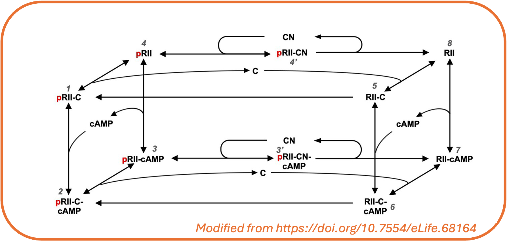
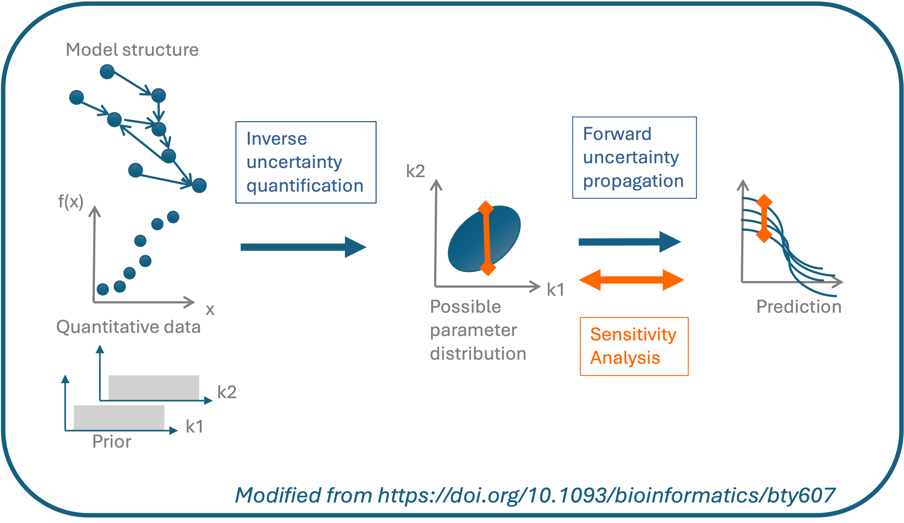

# Introduction

UQSA is an R-package for modelling and calibration of biochemical (and
other) reaction networks.

**Example of a Chemical Reaction Network**

  
An important part of modelling is to estimate parameters (calibration),
and to account for the uncertainty in the parameter estimates and
predictions. UQSA allows you to perform Bayesian *uncertainty
quantification* while calibrating your model. With UQSA you can also do
a global *sensitivity analysis* to guide further experiments.

For a quick hands-on introduction to UQSA, you can try our example on
[UQ and SA on the AKAR4
model](https://icpm-kth.github.io/uqsa/articles/uqsaAKAR4.md).

**UQSA workflow**

  

UQSA is specially constructed for systems biology models, as we use the
[SBtab](https://sbtab.net) format to define the model and calibration
data (see [intro to
SBtab](https://icpm-kth.github.io/uqsa/articles/SBtab.md)). SBtab files
can be translated to and from other formats like SBML.

Models (reaction networks) written in SBtab can automatically be
translated to ODE or stochastic models within UQSA. These mathematical
models can next be simulated and calibrated. Uncertainty quantification
is performed as part of the calibration. To do this, we use likelihood
based Bayesian approaches for the ODE models and Approximate Bayesian
Computation (ABC) for the stochastic models. Finally, a global
sensitivity analysis can be performed on an independent or
non-independent parameter space.

You can read more about UQSA in our
[article](https://doi.org/10.1093/bioinformatics/bty607) and explore
several
[examples](https://icpm-kth.github.io/uqsa/articles/examples_overview.md)
available in this documentation.
