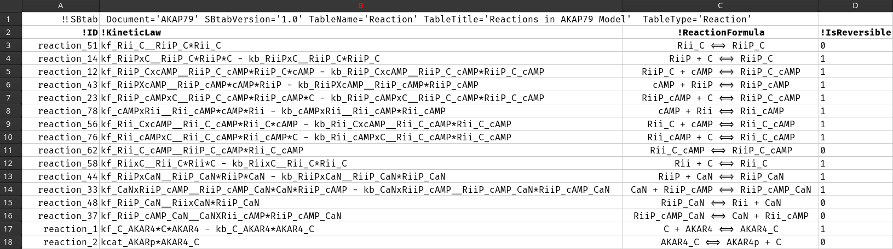

```{r, include = FALSE}
knitr::opts_chunk$set(cache = TRUE,
  collapse = TRUE,
  comment = "#>"
)
```

```{r setup}
library(SBtabVFGEN)
library(rgsl)
library(uqsa)
```

The R package `uqsa`, typically imports systems biology models and
corresponding data stored in [SBtab](https://www.sbtab.net)
files. SBtab is a table format for system biology. The use of SBtab is
optional, but very practical. SBML models currently cannot be imported
by this package, but can be converted to SBtab using the online tools
that [sbtab.net](https://www.sbtab.net) provides. The content of SBML
files is more strict than with SBtab files, so the files created by
conversion are not guaranteed to work here. They are user-friendly,
i.e. a human can open SBtab files with a text editor and edit them
manually.

An SBtab Document is a set of tables that represent reactions,
compounds, parameters, and measured data that correspond to
simulations of the model under certain input conditions and initial
values. Input conditions are often related to initial values and
values of the input parameters (parameters that are used within the
model of the input signal). The values of the input parameters are
always known, while the model' s internal parameters (e.g. reaction
rate coefficients) can be subject to optimization or sampling.

For the most part, in our case, an SBtab document is a collection of
[tsv](https://en.wikipedia.org/wiki/Tab-separated_values) files (has
to be one file per table). This can be written by hand, in a text
editor (one that doesn't auto convert tabs to *N* spaces).
Each table contains information about the model, data, and their
relationship to one another:

- Reactions
- Parameters
- Output Functions
- Compounds/Molecular Species

Each type of items (e.g. parameters) gets a TSV file
(e.g. `Parameter.tsv`), see our examples.

From these files you can automatically generate ODE code for R and C
solvers, and load the data from them.


# Advantages of SBtab

Data and models are tightly linked and we also include two tables on
the relationships between the data and model simulations in all our
examples:

1. *Experiments*, a table with a list of experiments together with appropriate model settings
2. *Output*, a list of output functions that correspond to measurable
   values for this model, named the same as the corresponding data
   columns

SBML level 2 lacks the ability to carry data with the model and also
lacks the vocabulary to define which parameters are *inputs* and which
are *model internal*. There is also no way to define an *observable*
in SBML (a function that models the measurement device, an
observation). For this reason, an SBML document cannot be converted
into an SBtab document that has these qualities (which we need).  But,
we may be wrong about what SBML can and cannot do. Future versions of
SBML may of course add new features. In general, SBML is hard.

# SBtab File Structure

Each file has a header, with attributes `key='value'` separated by spaces or tabs, e.g.:

```{sh, eval=FALSE}
!!SBtab SBtabVersion='1.0' TableName='Reaction' TableType='Reaction' Document='AKAP79'
```

This header doesn't have columns, it's a line of text, immediately
followed by the actual table. In the sections below, we specify the
header like above and then give an example table that can follow this
header. You can also include other columns in any order; only some
column names have special meanings, unknown columns will not be parsed
(they are harmless).

We don't parse the version attribute or any other attribute other than
`TableName` and `Document`.

```{r, eval=TRUE}
f <- uqsa_example("AKAP79")          # this is what the directory is called
sb <- SBtabVFGEN::sbtab_from_tsv(f)
print(comment(sb))                   # the value of the Document attribute of f[1]
print(names(sb))                     # the values of the TableName attributes
```

Document
: must be the same string for all tables. We don't check this.  We use
this attribute to assign a name to each model we read from
the files

TableType
: (does not matter) There are two generic table-types that can be used
if no specific one is applicable: `TableType='Quantity'` and
`TableType='QuantityMatrix'`. We don't use the `TableType` property at
all, but it is needed for the official ([sbtab.net](www.sbtab.net))
tool-set to work.

TableName
: Some Tables have a pre-determined name, e.g. `Reaction`, or
`Compound`. These are found by name, case sensitive spelling.  Other
tables have to be mentioned somewhere to matter. An SBtab document can
have any number of data tables, these can have any name as long as it
is unique. The name of these tables has to be used as the experiment
ID. The function `SBtabVFGEN::sbtab.data()` first reads the table
called `Experiments`, collects all IDs and then searches for tables
named like the experiment ID.
The same mechanism is used for Event Schedules.

SBtabVersion
: ignored

## Tabular Content

The second line/row contains the table column names, which often start
with an exclamation point, or another special character to signify a
special meaning. 

### Special Column Symbols (Prefixes)

- In `!abc`, ! means that this column has a special meaning, defined in the SBtab standard
- In `>xyz`, > means that this column specifies a value for variable `xyz`,
  it has an entry in some other table 
    + there must be a table where `xyz` appears in the `!ID` column,
- In `~xyz`, ~ means _standard error_ -- this is our extension.  
  We don't know how to express this in plain SBtab
    + this column specifies the standard error for `>xyz`
	+ ultimately, the meaning of the values of this column are up to
      the objective-function or likelihood-function. A _user supplied_
      function can interpret this value in any way the user wishes.
	+ If this value is NA or Inf, then the `>xyz` values are removed
      from the default likelihood functions as well. 
	+ An unknown standard error, `x ± NA`, or `x ± Inf` are the same
      as _value unknown_; we discount both cases.
- any column that doesn't start with one of `!>~` isn't special and
  isn't interpreted by us.

The first column can be called either `!ID` or `!Name` (it is harmless
to have both). If the first column is not called that, the scripts
will carry on regardless, assuming that it is some kind of name. So,
`!Id`, `!id`, or `ID?` will also work for us -- not for other
software. All other columns are found by name (case sensitive), they
can appear in any order. Variables in reaction rates and formulae are
all _first column IDs_ (regardless of column label).

### Examples

The set of columns are given as example tables in the following
Sections. An example of an SBtab file, in general, with header:

```{sh, label="Reaction.tsv", eval=FALSE}
!!SBtab	Document='AKAP79' SBtabVersion='1.0' TableName='Reaction' TableTitle='Reactions in AKAP79 Model' TableType='Reaction'
!ID          !KineticLaw                                                                                    !ReactionFormula                   !IsReversible
reaction_51  kf_Rii_C__RiiP_C*Rii_C                                                                         Rii_C <=> RiiP_C                   0
reaction_14  kf_RiiPxC__RiiP_C*RiiP*C - kb_RiiPxC__RiiP_C*RiiP_C                                            RiiP + C <=> RiiP_C                1
reaction_12  kf_RiiP_CxcAMP__RiiP_C_cAMP*RiiP_C*cAMP - kb_RiiP_CxcAMP__RiiP_C_cAMP*RiiP_C_cAMP              RiiP_C + cAMP <=> RiiP_C_cAMP      1
reaction_43  kf_RiiPXcAMP__RiiP_cAMP*cAMP*RiiP - kb_RiiPXcAMP__RiiP_cAMP*RiiP_cAMP                          cAMP + RiiP <=> RiiP_cAMP          1
reaction_23  kf_RiiP_cAMPxC__RiiP_C_cAMP*RiiP_cAMP*C - kb_RiiP_cAMPxC__RiiP_C_cAMP*RiiP_C_cAMP              RiiP_cAMP + C <=> RiiP_C_cAMP      1
reaction_78  kf_cAMPxRii__Rii_cAMP*cAMP*Rii - kb_cAMPxRii__Rii_cAMP*Rii_cAMP                                cAMP + Rii <=> Rii_cAMP            1
reaction_56  kf_Rii_CxcAMP__Rii_C_cAMP*Rii_C*cAMP - kb_Rii_CxcAMP__Rii_C_cAMP*Rii_C_cAMP                    Rii_C + cAMP <=> Rii_C_cAMP        1
reaction_76  kf_Rii_cAMPxC__Rii_C_cAMP*Rii_cAMP*C - kb_Rii_cAMPxC__Rii_C_cAMP*Rii_C_cAMP                    Rii_cAMP + C <=> Rii_C_cAMP        1
reaction_62  kf_Rii_C_cAMP__RiiP_C_cAMP*Rii_C_cAMP                                                          Rii_C_cAMP <=> RiiP_C_cAMP         0
reaction_58  kf_RiixC__Rii_C*Rii*C - kb_RiixC__Rii_C*Rii_C                                                  Rii + C <=> Rii_C                  1
reaction_44  kf_RiiPxCaN__RiiP_CaN*RiiP*CaN - kb_RiiPxCaN__RiiP_CaN*RiiP_CaN                                RiiP + CaN <=> RiiP_CaN            1
reaction_33  kf_CaNxRiiP_cAMP__RiiP_cAMP_CaN*CaN*RiiP_cAMP - kb_CaNxRiiP_cAMP__RiiP_cAMP_CaN*RiiP_cAMP_CaN  CaN + RiiP_cAMP <=> RiiP_cAMP_CaN  1
reaction_48  kf_RiiP_CaN__RiixCaN*RiiP_CaN                                                                  RiiP_CaN <=> Rii + CaN             0
reaction_37  kf_RiiP_cAMP_CaN__CaNXRii_cAMP*RiiP_cAMP_CaN                                                   RiiP_cAMP_CaN <=> CaN + Rii_cAMP   0
reaction_1   kf_C_AKAR4*C*AKAR4 - kb_C_AKAR4*AKAR4_C                                                        C + AKAR4 <=> AKAR4_C              1
reaction_2   kcat_AKARp*AKAR4_C                                                                             AKAR4_C <=> AKAR4p + C             0
```

The same file can look like this in spreadsheet software, e.g.[gnumeric](http://www.gnumeric.org/):


Each variable mentioned here, e.g. `cAMP` is an ID of some row in
another table, `cAMP` is a compound and can be found in
`Compound.tsv`, named like that in the first column.

Note 1
: our code ignores almost everything in the first line, except `TableName`

Note 2
: `FALSE` and `TRUE` (the Boolean values lots of spreadsheet software
  uses) mostly work in R correctly, they can also work (literally) in
  C (if they are defined as macros or enums).  Some spreadsheet
  software exports `TRUE`/`FALSE` as `1`/`0` into TSV (this is usually
  better). See the last Section on this page about this topic.

All of the following examples are tab separated (originally) but
printed using automatic vertical alignment, starting with the second
line. You cannot copy paste them into new files, there must be tabs.

Here is a code snippet that displays an SBtab on screen (in the
terminal) with column alignment (but losing the tabstops):

```{sh aligned-SBtab, eval=FALSE}
head -n 1 Reaction.tsv
tail -n +2 Reaction.tsv | column -t -s '	'
```

### Constant

A list of constants. These are values that never change for _this_ model, e.g. Avogadro's number:

```{sh, eval=FALSE}
 !!SBtab  TableName='Constant'  Document='myModel' 
     !ID  !Unit                 !Value
       L  1                     6.02214076E+23
```

The number of items in the first line is usually different from the
rest, as this is a header, so they don't always form a neat table.

This also breaks the smart display of these files as tables on github.

### Input

Known paramters of the model, can vary between experiments.

```{sh, eval=FALSE}
!!SBtab TableName='Input' Document='myModel'
 !ID  !DefaultValue  !Unit   !Comment
 CaB  2000.0         nM      Calcium-Base-Level
 ...  ...            ...     ...
```

Inputs are what distinguishes experiments alongside initial values,
and event schedules (interventions). These are default values. Other
values can be set in the line of each experiment in the experiment
table, e.g.:

```
!!SBtab TableName='Experiment' Document='myModel'
!ID !Type        !Time  >CaB    >...
E1  Time Series  100    1700.0  ...
```

### Parameter

Possibly unknown parameters of the model, these parameters typically
refer to internal properties of the model itself rather than something
we did to the model during an experiment.

```{sh, eval=FALSE}
!!SBtab TableName='Parameter' Document='myModel'
 !ID  !DefaultValue  !Std  !Unit     !Scale
 kf1            1.8   0.1  s^(1)     natural logarithm 
 ...            ...  ...   ...       ...
```

Here the `!Scale` column is optional, but often useful; several values
are possible: `log10`,`log`,`linear` (in various spellings). If
missing, `linear` is assumed.

### Expression

Mathematical sub-expressions that can be used in reaction fluxes. Can
be used to encode thermodynamic relationships between parameters,
model an input signal. This is used to assign a name to an algebraic
expression.

```{sh, eval=FALSE}
!!SBtab TableName='Expression' Document='myModel'
  !ID  !Unit  !Formula
 KD_1  nM     (KD_3*KD_4)/KD_2
  ...  ...    ...
```

### Compound

In SBML parlance, these are *species*.

```{sh, eval=FALSE}
!!SBtab TableName='Compound' TableType='Compound' Document='myModel'
      !ID  !Unit  !InitialValue 
 PP2B_CaM  μM     0.0
      ...  ...    ...
```


There are several optional columns, e.g. `!IsConstant` and
`!Type`. These variables are usually used as state variables in an ODE
framework.

### Reaction

The Table of Reactions can be seen as the main piece of information for the model. 

```{sh, eval=FALSE}
!!SBtab TableName='Reaction' TableType='Reaction' Document='myModel'
       !ID  !KineticLaw    !IsReversible   !ReactionFormula 
 Reaction1  kf*A*B - kb*C  TRUE            A + B <=> C
       ...  ...            ...             ...
```

Both `KineticLaw` and `Formula` are required, even though a kinetic
law could be determined from the formula in a pinch (mass action). We
don't infer kinetic laws in our code. The reversibility of reactions
is set via `!IsReversible` and can be expressed via `TRUE`/`FALSE` or
`1`/`0`; this has no effect on the arrow in the formula (as intended
in the official SBtab documentation), there is no one sided arrow.

### Output

Outputs are Observables. A function that can be related to measured data.

```{sh, eval=FALSE}
!!SBtab TableName='Output' Document='myModel'
      !ID  !Unit  !Formula
 CaPerCaM  1      totalCa/totalCaM
      ...  ...    ...
```

A unit of `1` means the same as `'dimensionless'` in SBML. 

A function can be an inequality. If the experimental data has an
_allowed range_ (min and max), rather than a standard error, then this
Output could be useful:

```{sh, eval=FALSE}
!!SBtab TableName='Output' Document='myModel'
  !ID  !Unit  !Formula
    A  1      Ca/CaB
Bound  1      (A<5000) && (A>1000)
```

And the data table could be:

```{sh, eval=FALSE}
!!SBtab [...]
!TimePoint !Time    >A  ~A  >Bound  ~Bound
        T1     0  1500  150   TRUE  0.1
```

Data can be Boolean/`logical` (it's alsways treated as `1` or
`0`). See also the last Section on this page.

### Transformation

A table of all possible transformations (maps) that are part of any
experiment's described procedure. An event can trigger any of these
transformation at specific event-times.

```{sh, eval=FALSE}
!!SBtab TableName='Transformation' Document='MyModel'
 !ID  >A     >B     >C
 TF1  A-B    B      C
 TF2  A      B/2    C
 TF3  A*0.1  B*0.1  C*0.1 
```

Here we see one transformation per line that affects the variables listed in the column names `>Var`, i.e.:

```{r, eval=FALSE}
A <- A-B  # TF1
...
B <- B/2  # TF2
...
A <- A*0.1 # TF3
B <- B*0.1 # TF3
C <- C*0.1 # TF3
...
```

This is what would conceptually happen in the generated code (not literally, as it actually happens in the C code).

### Event

Events will interrupt the ODE solver in the rgsl package (not other
solvers), change the values of input parameters, or state variables
according to the available named tranformations (see above). After the
transformation the solver is re-initialized to continue from there.

```{sh, eval=FALSE}
!!SBtab TableName='EventScheduleAlpha' Document='myModel' 
  !TimePoint  !Time  !Tranformation 
 Event0Time0  10.0   TF1
 Event0Time0  11.0   TF2
         ...  ...    ...
```

### Experiments

```{sh, eval=FALSE}
!!SBtab TableName='Experiments' Document='myModel'
               !ID  !Type          !Time  !T0    !Event              !Citation
    Smith2019Fig2E  Time Series    600.0  -100.0  EventScheduleAlpha  https//doi.org/10.[...] 
               ...  ...            ...    ...     ...                ...
```

_AuthorYear_ citation keys make good ID values for data sets.

`!Type` is one of: `Time Series`, or `Dose Response` for our purposes
(possibly more types in the future). All types are convenience
features, Time Series is the basic type thta can do anything.


The initial time for the ODE, $t_0$, corresponds to the beginning of
the experiment setup: `!T0` (the time value). The value of `!Time` is
the default time of measurements if none is given in the data table.
For dose response experiments, this is the only place to specify the
measurement time. `!Event` names the table that contains the event
schedule (a time sequence of named transformations). 

The `!Citation` column is entirely optional.

### Data

Data is stored in TSV files as well, but isn't used when building the ODE code. It is used in parameter estimation.

#### Time Series

```{sh, eval=FALSE}
!!SBtab Document='myModel' Version='1.0' TableName='Smith2019Fig2E' TableType='QuantityMatrix'			
!TimePoint  !Time  >AKAR4pOUT  ~AKAR4pOUT
E0301T001   -15    99.4136     0.711886579917949
E0301T002   -10    100.617     0.401234567901235
E0301T003   -5     101.944     0.927467851933129
E0301T004   0      NA          NA
E0301T005   5      101.204     0.28287504289851
E0301T006   10     102.037     0.565750085797018
E0301T007   15     102.346     0.432098765432101
E0301T008   20     103.765     0.40478015582111
E0301T009   25     105.463     1.14280917170207
E0301T010   30     106.204     1.07316905251319
E0301T011   35     110.648     0.509960235859822
E0301T012   40     110.988     1.31417708987925
E0301T013   45     112.438     1.60137305815714
```

`!TimePoint` is a kind of `!ID`, our scripts do not check what the first
column is called, the contents are always used as `rownames` in R
data-frames. These ID's are not used for anything, currently.

In this particular Table, we find a missing value (was not measured).

#### Dose Response

In dose response experiments, the system reacts to an input dose
repeatedly. Each row is simulated as a time series by itself.

The table works the same way, but rather than `Time` we have an input
column:

```{sh, eval=FALSE}
!!SBtab	SBtabVersion='1.0' Document='CaMKIIs' TableName='Shifman2006Fig1Bsq' TableType='QuantityMatrix' 
!ID    >Ca_set  >CaPerCaM  ~CaPerCaM
E1D0   364      0.011      0.3985
E1D1   2305     1.196      0.3985
E1D2   2548     1.464      0.3985
E1D3   2912     1.743      0.3985
E1D4   3640     1.956      0.3985
E1D5   4126     2.09       0.3985
E1D6   3762     2.291      0.3985
E1D7   4611     2.38       0.3985
E1D8   4247     2.559      0.3985
E1D9   5461     2.604      0.3985
E1D10  4611     2.85       0.3985
E1D11  6067     2.917      0.3985
E1D12  5339     3.04       0.3985
E1D13  6796     3.163      0.3985
E1D14  6067     3.23       0.3985
E1D15  7281     3.465      0.3985
E1D16  8495     3.61       0.3985
E1D17  9344     3.856      0.3985
E1D18  24393    3.994      0.3985
E1D19  34101    3.996      0.3985
```

Here `Ca_set` is an input value, and `CaPerCam` is an output
value. Which is Input or Output cannot be determined from the Table
itself, only from the rest of the Document. Each row can be considered
a mini time series, with one measurement time each. At which time the
measurement shall occur is written in the table of experiments, column
`!Time` (the default measurement time). A different time for each row
is not possible (currently).

# A Note on Units

Units should be defined for every entity. This unit can be written in
a human readable conventional form (we don't insist on it being
correct). It is mostly intended for human readers, but we do parse it
and use the information for SBML export.

You can test the unit parser like this:

```{r, units, eval=TRUE}
prettyPrint <- function(units){
	L <- paste0(rep("-",12),collapse="")
	for (u in units){
		cat(sprintf("%s[%12s]%s\n",L,u,L))
		print(SBtabVFGEN::unit.from.string(u))
		cat("\n")
	}
}
prettyPrint(c("cm","uM","MM","1","μM","nanomolarity","s^-1"))
```

**Units are not optional**

Dimensionless quantities are ok, e.g. Hill-exponents, the unit is just
`1` in such cases.

But, even though we do parse them, we currently don't auto-convert
units: If a flux is `kf*a - kb*b`, then the units of `kf`, `a`, `kb`,
and `b` have to be compatible, such that the unit of `kf*a` is the
same as `kb*b`. It is of course legal (in general) to calculate `1 m +
1 cm`, but we don't do this unit-conversion automatically (maybe never
will).

Although SBML has units as well the software support for units on the
SBML side is also not feature-complete in all cases. Other software
may have its own restrictions on possible units (or unit combinations).

COPASI wants all species to have the same unit of measurement. We
don't make such restrictions.

# Issues to be aware of with any File format

According to the specifications of the SBtab authors, MS Excel
spreadsheets are an acceptable storage format - but we don't use any
of their original code and therefore do not carry over any guarantees.

Our [SBtabVFGEN](icpm-kth/SBtabVFGEN) package uses either multiple TSV
files or one [ODS](https://en.wikipedia.org/wiki/OpenDocument)
file. The TSV reading is done using core R functions, while ODS is
read through
[readODS](https://cran.r-project.org/package=readODS). Both formats
can have issues that are general and not specific to this package:

- TSV
    - line endings can be `\n` or `\n\r`
    - fields could be automatically and unnecessarily quoted by a spreadsheet software
    - encoding (UTF-8, or something else)
    - some spreadsheets may want to write a unicode minus sign `−` rather than `-` into a tsv file: `U+2212` (vs ascii dash), be careful
    - lines can be blank, but not quite, if they contain just tabs or spaces
- ODS
    - comments inside fields could be imported as field content and confuse the model parser
    - same issue with unicode minus signs
    - `readODS` could theoretically be discontinued (deprecated), despite the format continuing to exist
    - all spreadsheet software comes with auto-correct and will
      correct SBtab to Sbtab and probably also all of the unusual
      protein names (PKA to Pka or similar)

Models can be automatically converted between the SBtab format and
other modelling formats (such as SBML). For more information about
SBtab please refer to [the official git repository](https://github.com/tlubitz/SBtab). 

Be aware that the conversion from SBML to SBtab has to be done with
the official SBtab tools, not ours (SBML is hard).

# Alternatives

A user can circumvent this entire format by just writing the C code or
R code for the model by hand or an entirely different tool, such as
[VFGEN](https://warrenweckesser.github.io/vfgen/) itself, or an SBML
related project like
[SBFC](https://www.ebi.ac.uk/biomodels/tools/converters/) that
generates code. Or, if the model is small enough, you can also write
these files using a text editor without any other tool.

The data we load from SBtab files is stored as a list in R, each item
is itself a list of `data.frames` or vectors (it's not a black-box
object). A user can just create such a list (e.g. in an R script), if
they want to avoid SBtab entirely. If the data is stored in a
different format, such as an hdf5 file, it could be read using
e.g. hdf5r and re-roganized into a list like this.

Ultimately, the code in uqsa expects a likelihood function or
objective-function that assigns a scalar value to a parameter vector,
what this function does to calculate it is up to every user.

# Note on Boolean Values

Special care has to be taken when the TSV files use TRUE and FALSE as
values. This is useful, because the data in the tables can refer to
inequality constraints.

Consider this:

```{sh, eval=FALSE}
!!SBtab TableName='Output'
!ID      !Formula
a_lt_b   a < b
```

with an Experiment that checks this condition:

```{sh, eval=FALSE}
!!SBtab TableName='Experiments'
              !ID  !T0  >A  >B  [...] % input settings, initial values
CheckInequalities  -1.0  12  13
```

and this data table:

```{sh, eval=FALSE}
!!SBtab TableName='CheckInequalities',
!TimePoint	!Time	>a_lt_b,
        T1	0.00	TRUE
        T2	0.01	TRUE
        T3	0.03	FALSE
```

This is perfectly fine.

Tests in R, to verify:

```{r, eval=TRUE}
# create a dummy file:
cat("!!SBtab TableName='CheckInequalities'",
"!TimePoint\t!Time\t>a_lt_b",
"T1\t0.00\tTRUE",
"T2\t0.01\tTRUE",
"T3\t0.03\tFALSE",
file="test.tsv",sep="\n")

# read this dummy file:
test <- read.delim("test.tsv",skip=1)
file.remove("test.tsv")
print(test)


# check the type of the Booleans:
print(test[[3]])
lapply(test,class)
```

This setup makes sense, and will work out of the box because R's
`read.delim` function infers the type of a column. It will probably
stop working if the values are inconsistent (some logical some numeric).

However, if the model's ODE content includes `TRUE` and `FALSE` values
in some way, e.g. as switches between several distinct behaviours,
then these Booleans should be written numerically as `0` and `1`. Consider this:

```{r, eval=TRUE}
# make a similar dummy file, but this time it's an input
cat("!!SBtab TableName='Input'",
"!ID\t!Value\t!Comment",
"B\tTRUE\ta Boolean value",
"M\t65.3\ta numeric value",
file="test.tsv",sep="\n")

# read the file:
test <- read.delim("test.tsv",skip=1)
file.remove("test.tsv")
print(test)

# check the type of the Booleans:
print(test[[2]])
lapply(test,class)

# similarly:
as.numeric(c("TRUE","1","FALSE","0"))
as.logical(c("TRUE","1","FALSE","0"))
```

So, since we mixed types in one column, it didn't work right.

To fix this use the integers `1` and `0` explicitly.


However, even in the C code it can be made to work, even if you have explicit TRUE/FALSE values in the actual reactions:

```{sh, label="a.c"}
(
cat<<EOF
#!/usr/bin/tcc -run
#include <stdlib.h>
#include <stdio.h>

enum logical {FALSE, TRUE};

enum logical as_logical(int value){
	return !!value;
}

int main(int argc, char *argv[]){
	printf("TRUE=%i , FALSE=%i (both as integer), as_logical(2)=%i\n",TRUE, FALSE, as_logical(2));
	return EXIT_SUCCESS;
}
EOF
) > a.c
chmod 744 a.c
./a.c
rm a.c
```

But, this is unlikely to be useful. But inequality statements are allowed in the ODE itself (for switches).
