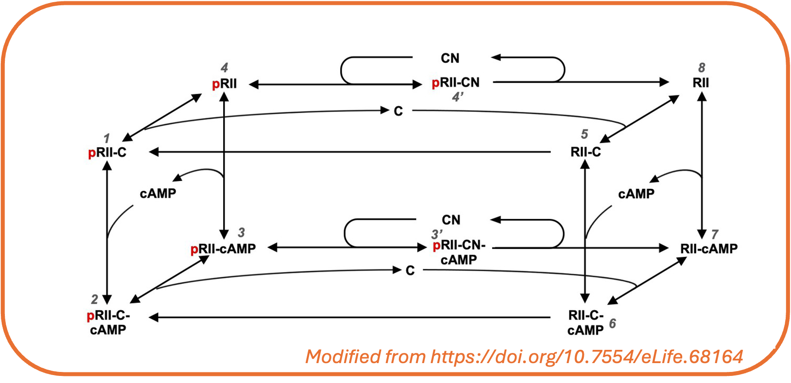
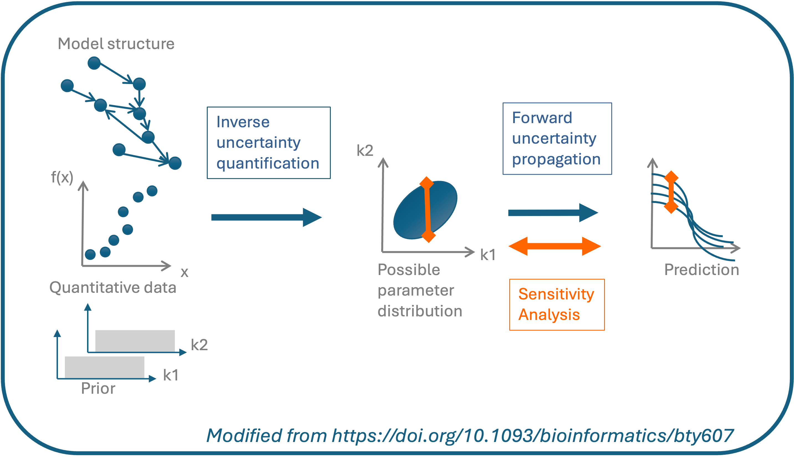

```{r, include = FALSE}
knitr::opts_chunk$set(cache = TRUE,
  collapse = TRUE,
  comment = "#>"
)
```
UQSA is an R-package for modelling and calibration of biochemical (and other) reaction networks. 

{width=100%}


<br>
An important part of modelling is to estimate parameters (calibration), and to account for the uncertainty in the parameter estimates and predictions. UQSA allows you to perform Bayesian *uncertainty quantification* while calibrating your model. With UQSA you can also do a global *sensitivity analysis* to guide further experiments.

For a quick hands-on introduction to UQSA, you can try our example on [UQ and SA on the AKAR4 model](uqsaAKAR4.html).

{width=100%}


<br>


UQSA is specially constructed for systems biology models, as we use the [SBtab](https://sbtab.net) format to define the model and calibration data (see [intro to SBtab](SBtab.html)). SBtab files can be translated to and from other formats like SBML.

Models (reaction networks) written in SBtab can automatically be translated to ODE or stochastic models within UQSA. These mathematical models can next be simulated and calibrated. Uncertainty quantification is performed as part of the calibration. To do this, we use likelihood based Bayesian approaches for the ODE models and Approximate Bayesian Computation (ABC) for the stochastic models. Finally, a global sensitivity analysis can be performed on an independent or non-independent parameter space.

You can read more about UQSA in our [article](https://doi.org/10.1093/bioinformatics/bty607) and explore several [examples](examples_overview.html) available in this documentation.

